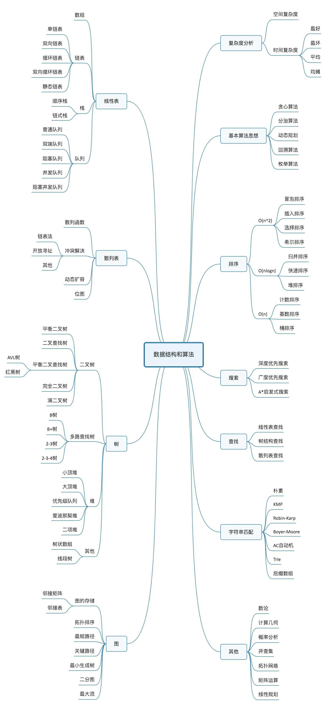

<h1 align="center">数据结构和算法</h1>

[TOC]

## 复杂度

- [时间复杂度和空间复杂度](https://www.jianshu.com/p/bbcda16b2e90)

## 排序算法

* [Java常用的八种排序算法与代码实现](https://www.cnblogs.com/10158wsj/p/6782124.html)
* [八大排序算法总结与java实现](https://github.com/iTimeTraveler/SortAlgorithms)

## 加密算法

* [Android数据加密之Rsa加密](https://www.cnblogs.com/whoislcj/p/5470095.html)
* [Android数据加密之Aes加密](http://www.cnblogs.com/whoislcj/p/5473030.html)
* [Android数据加密之Des加密](http://www.cnblogs.com/whoislcj/p/5580950.html)
* [Android数据加密之MD5加密](http://www.cnblogs.com/whoislcj/p/5885006.html)
* [Android数据加密之Base64编码算法](http://www.cnblogs.com/whoislcj/p/5887859.html)
* [Android数据加密之异或加密算法](https://www.cnblogs.com/whoislcj/p/5944917.html)

## 算法资料

### Algorithms

* [TheAlgorithms](https://github.com/TheAlgorithms)：包含Java、C，C++，Python等多种语言的算法实现
* [interviews](https://github.com/kdn251/interviews)：面试中常见的算法资料（包含：代码，视频等。）
* [algorithm-visualizer](https://github.com/algorithm-visualizer/algorithm-visualizer)：Interactive Online Platform that Visualizes Algorithms from Code
* [Algorithms-Online](http://jeffe.cs.illinois.edu/teaching/algorithms/#book)
* [List of data structures](https://en.wikipedia.org/wiki/List_of_data_structures) ：Wikipedia上的资料
* [数据结构与算法系列](https://www.cnblogs.com/skywang12345/p/3603935.html)

### LeetCode

* [LeetCodeAnimation](https://github.com/MisterBooo/LeetCodeAnimation)：Demonstrate all the questions on LeetCode in the form of animation.（用动画的形式呈现解LeetCode题目的思路）
* [leetcode](https://github.com/azl397985856/leetcode):Leetcode算法解析
* [leetcode](https://github.com/azl397985856/leetcode)：记录LeetCode上的算法题解
* [fucking-algorithm](https://github.com/labuladong/fucking-algorithm):labuladong的算法小抄，手把手撕LeetCode题目，扒各种算法套路的裤子。不仅how，还有why。

## 算法课程

* [algorithms-part1](https://www.coursera.org/learn/algorithms-part1)
* [algorithms-part2](https://www.coursera.org/learn/algorithms-part2)
* [Data Structure and Algorithms Tutorial0](http://www.tutorialspoint.com/data_structures_algorithms/)

## 开源算法

* [lz4/lz4: Extremely Fast Compression algorithm (github.com)](https://github.com/lz4/lz4)

## 数据结构和算法整理

原文：[数据结构与算法系列 目录](https://www.cnblogs.com/skywang12345/p/3603935.html)

<table>
   <tr>
      <td> </td>
      <td>C</td>
      <td>C++</td>
      <td>Java</td>
   </tr>
   <tr>
      <td rowspan="4">线性结构</td>
   </tr>
   <tr>
      <td>1. 数组、单链表和双链表 2. Linux内核中双向链表的经典实现</td>
      <td> 数组、单链表和双链表</td>
      <td> 数组、单链表和双链表</td>
   </tr>
   <tr>
      <td> 栈</td>
      <td> 栈</td>
      <td> 栈</td>
   </tr>
   <tr>
      <td> 队列</td>
      <td> 队列</td>
      <td> 队列</td>
   </tr>
   <tr>
      <td rowspan="5">树形结构</td>
      <td> 二叉查找树</td>
      <td> 二叉查找树</td>
      <td> 二叉查找树</td>
   </tr>
   <tr>
      <td> AVL树</td>
      <td> AVL树</td>
      <td> AVL树</td>
   </tr>
   <tr>
      <td> 伸展树</td>
      <td> 伸展树</td>
      <td> 伸展树</td>
   </tr>
   <tr>
      <td>1. 红黑树(一)之 原理和算法详细介绍 2. 红黑树(二)之 C语言的实现 3. 红黑树(三)之 Linux内核中红黑树的经典实现 4. 红黑树(六)之 参考资料</td>
      <td>1. 红黑树(一)之 原理和算法详细介绍 2. 红黑树(四)之 C++的实现 3. 红黑树(六)之 参考资料</td>
      <td>1. 红黑树(一)之 原理和算法详细介绍 2. 红黑树(五)之 Java的实现 3. 红黑树(六)之 参考资料</td>
   </tr>
   <tr>
      <td> 哈夫曼树</td>
      <td>哈夫曼树 </td>
      <td> 哈夫曼树</td>
   </tr>
   <tr>
     <td rowspan="5">堆</td>
      <td> 二叉堆</td>
      <td> 二叉堆</td>
      <td> 二叉堆</td>
   </tr>
   <tr>
      <td> 左倾堆</td>
      <td> 左倾堆</td>
      <td> 左倾堆</td>
   </tr>
   <tr>
      <td> 斜堆</td>
      <td> 斜堆</td>
      <td> 斜堆</td>
   </tr>
   <tr>
      <td> 二项堆</td>
      <td> 二项堆</td>
      <td> 二项堆</td>
   </tr>
   <tr>
      <td> 斐波那契堆</td>
      <td> 斐波那契堆</td>
      <td> 斐波那契堆</td>
   </tr>
   <tr>
      <td rowspan="7">图</td>
      <td>图的理论基础 </td>
      <td>图的理论基础 </td>
      <td>图的理论基础 </td>
   </tr>
   <tr>
      <td>1. 邻接矩阵无向图 2. 邻接表无向图 3. 邻接矩阵有向图 4. 邻接表有向图</td>
      <td>1. 邻接矩阵无向图 2. 邻接表无向图 3. 邻接矩阵有向图 4. 邻接表有向图</td>
      <td>1. 邻接矩阵无向图 2. 邻接表无向图 3. 邻接矩阵有向图 4. 邻接表有向图</td>
   </tr>
   <tr>
      <td>深度优先搜索和广度优先搜索</td>
      <td>深度优先搜索和广度优先搜索</td>
      <td>深度优先搜索和广度优先搜索</td>
   </tr>
   <tr>
      <td>拓扑排序</td>
      <td>拓扑排序</td>
      <td>拓扑排序</td>
   </tr>
   <tr>
      <td>Kruskal算法</td>
      <td>Kruskal算法</td>
      <td>Kruskal算法</td>
   </tr>
   <tr>
      <td>Prim算法</td>
      <td>Prim算法</td>
      <td>Prim算法</td>
   </tr>
   <tr>
      <td>Dijkstra算法</td>
      <td> </td>
      <td> </td>
   </tr>
   <tr>
      <td rowspan="9">排序算法</td>
      <td> 冒泡排序</td>
      <td> 冒泡排序</td>
      <td> 冒泡排序</td>
   </tr>
   <tr>
      <td> 快速排序</td>
      <td> 快速排序</td>
      <td> 快速排序</td>
   </tr>
   <tr>
      <td> 直接插入排序</td>
      <td> 直接插入排序</td>
      <td> 直接插入排序</td>
   </tr>
   <tr>
      <td> 希尔排序</td>
      <td> 希尔排序</td>
      <td> 希尔排序</td>
   </tr>
   <tr>
      <td> 选择排序</td>
      <td> 选择排序</td>
      <td> 选择排序</td>
   </tr>
   <tr>
      <td> 堆排序</td>
      <td> 堆排序</td>
      <td> 堆排序</td>
   </tr>
   <tr>
      <td> 归并排序</td>
      <td> 归并排序</td>
      <td> 归并排序</td>
   </tr>
   <tr>
      <td> 桶排序</td>
      <td> 桶排序</td>
      <td> 桶排序</td>
   </tr>
   <tr>
      <td> 基数排序</td>
      <td> 基数排序</td>
      <td> 基数排序</td>
   </tr>
</table>
## 数据结构和算法专栏

* [数据结构和算法（江神）](https://zhuanlan.zhihu.com/c_1197817616885035008)
* [数据结构、算法、JVM、java源码](https://www.cnblogs.com/ysocean/)

