<h1 align="center">今日头条 ANR 优化实践系列 - 设计原理及影响因素</h1>

[toc]

## 写在前面

ANR 问题，对于从事 Android 开发的同学来说并不陌生，日常开发中，经常会遇到应用乃至系统层面引起的各种问题，很多时候因为不了解其运行原理，在面对该类问题时可能会一头雾水。与此同时，因为现有监控能力不足或获取信息有限，使得这类问题如同镜中花水中月，让我们在追求真理的道路上举步维艰。如下图：

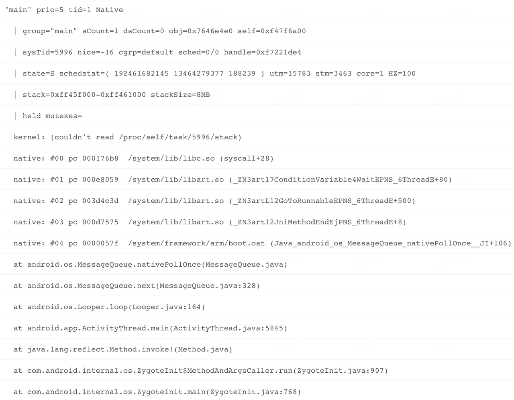

工作中在帮助大家分析问题时，发现有不少同学问到，在哪里可以更加系统的学习？于是本人抱着“授人以鱼，不如授人以渔”的态度，结合个人理解和工作实践，接下来将从**设计原理、影响要素、工具建设、分析思路，案例实战、优化探索等几个篇章，对 ANR 方向进行一次全面的总结**，希望帮助大家在今后的工作中更好地理解和应对以下问题：

1. **什么是 ANR？**
2. **系统是如何设计 ANR 的？**
3. **发生 ANR 时系统都会获取哪些信息以及工作流程？**
4. **导致 ANR 的原因有哪些？**
5. **遇到这类问题该如何分析？**
6. **如何能更加快速准确的定位问题？**
7. **面对这类问题我们能主动做些什么？**

## 简述

在正式分析 ANR 问题之前，先来看看下面这些问题：

- 系统是如何设计 ANR 的，都有哪些服务或者组件会发生 ANR？
- 发生 ANR 的时候，系统又是如何工作的，都会获取哪些信息？
- 影响 ANR 的场景有哪些？我们是如何对其进行归类的？

了解这些有助于我们在面对各种问题时，做到有的放矢，下面我们就来介绍并回答这些问题。

## ANR 设计原理

ANR 全称 Applicatipon No Response；Android 设计 ANR 的用意，是系统通过与之交互的组件(Activity，Service，Receiver，Provider)以及用户交互(InputEvent)进行超时监控，以判断应用进程(主线程)是否存在卡死或响应过慢的问题，通俗来说就是很多系统中看门狗(watchdog)的设计思想。

### 组件超时分类

系统在通过 Binder 通信向应用进程发送上述组件消息或 Input 事件时，在 AMS 或 Input 服务端同时设置一个异步超时监控。当然针对不同类型事件，设置的超时时长也存在差别，以下是 Android 系统对不同类型的超时阈值设置：

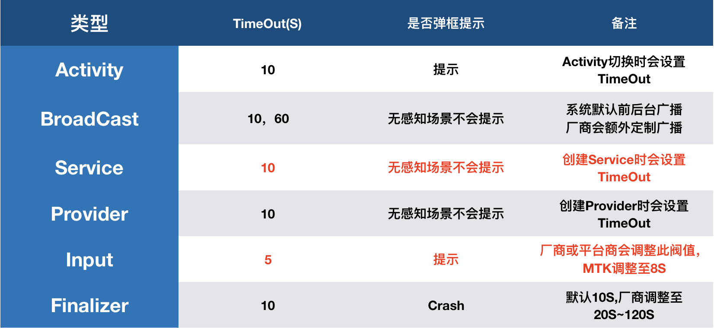

<center>(图片仅供参考，国内厂商可能会有调整，每个厂商的标准也存在差异)</center>

### Broadcast 超时原理举例

在了解不同类型消息的超时阈值之后，我们再来了解一下超时监控的设计原理。

以 BroadCastReceiver 广播接收超时为例，**广播分为有序广播和无序广播，同时又有前台广播和后台广播之分；只针对有序广播设置超时监控机制，并根据前台广播和后台广播的广播类型决定了超时时长；例如后台广播超时时长 60S，前台广播超时时长只有 10S；** 下面我们结合代码实现来看一下广播消息的发送过程。

- **无序广播：**

**对于无序广播，系统在搜集所有接收者之后一次性全部发送完毕**，如下图：


通过上图我们看到无序广播是没有设置超时监听机制的，一次性发送给所有接收者，对于应用侧何时接收和响应完全不关心(相当于 UDP 传输)。

- 有序广播：

再来看一下有序广播的发送和接收逻辑，同样在系统 AMS 服务中，BoradCastQueue 获取当前正在发送的广播消息，并取出下一个广播接收者，更新发送时间戳，以此时间计算并设置超时时间(但是系统在此进行了一些优化处理，以避免每次广播正常接收后，都需要取消超时监控然后又重新设置，而是采用一种对齐的方式进行复用)。最后将该广播发送给接收者，接收到客户端的完成通知之后，再发送下一个，整个过程如此反复。

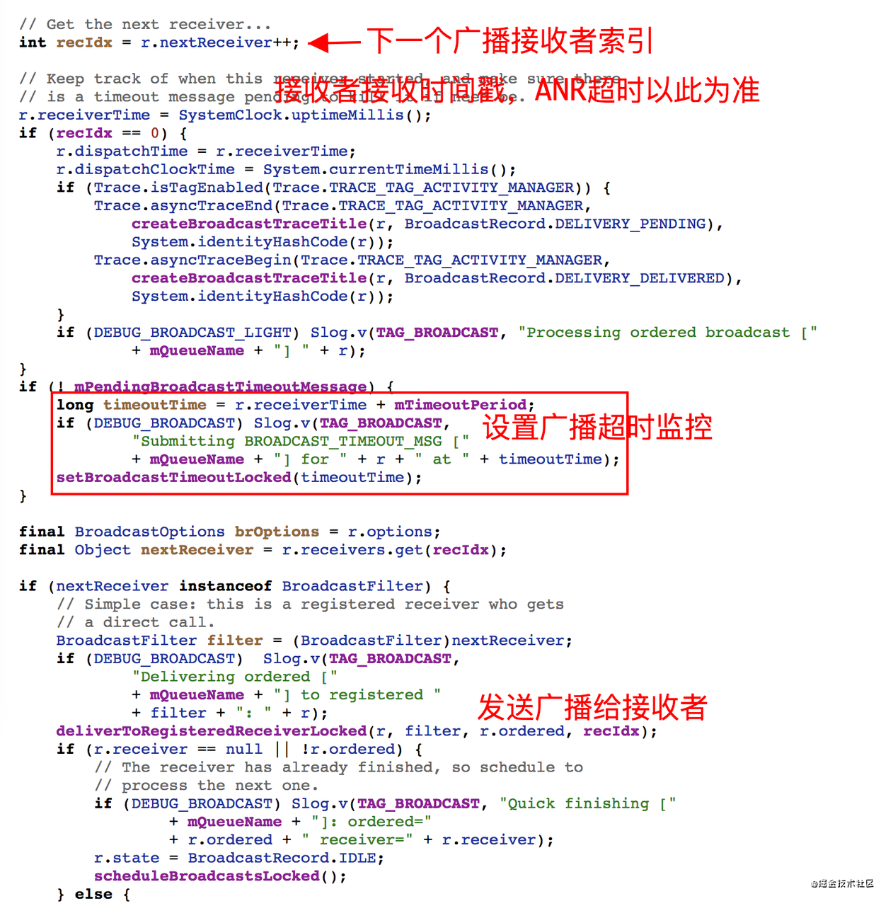

在客户端进程中，Binder 线程接收到 AMS 服务发送过来的广播消息之后，会将此消息进行封装成一个 Message，然后将 Message 发送到主线程消息队列(插入到消息队列当前时间节点的位置，也正是基于此类设计导致较多消息调度及时性的问题，后面我们将详细介绍)，消息接收逻辑如下：


正常情况下，很多广播请求都会在客户端及时响应，然后通知到系统 AMS 服务取消本次超时监控。但是在部分业务场景或系统场景异常的情况下，发送的广播未及时调度，没有及时通知到系统服务，便会在系统服务侧触发超时，判定应用进程响应超时。AMS 响应超时代码逻辑如下：

```Java
final void broadcastTimeoutLocked(boolean fromMsg) {
        ......
        long now = SystemClock.uptimeMillis();
        BroadcastRecord r = mOrderedBroadcasts.get(0);
        if (fromMsg) {
            //我们刚才提到的时间对齐方式，避免频繁取消和设置消息超时
            long timeoutTime = r.receiverTime + mTimeoutPeriod;
            if (timeoutTime > now) {
                setBroadcastTimeoutLocked(timeoutTime);
                return;
            }
        }
        ......
        ......
        Object curReceiver;
        if (r.nextReceiver > 0) {
            //获取当前超时广播接收者
            curReceiver = r.receivers.get(r.nextReceiver-1);
            r.delivery[r.nextReceiver-1] = BroadcastRecord.DELIVERY_TIMEOUT;
        } else {
            curReceiver = r.curReceiver;
        }
        Slog.w(TAG, "Receiver during timeout of " + r + " : " + curReceiver);
        ......
        ......
        if (app != null) {
            anrMessage = "Broadcast of " + r.intent.toString();
        }
        ......
        if (!debugging && anrMessage != null) {
             //开始通知AMS服务处理当前超时行为
            mHandler.post(new AppNotResponding(app, anrMessage));
        }
    }

复制代码
```

到这里，广播发送和超时监控逻辑的分析就基本结束了，通过介绍，我们基本知道了广播超时机制是如何设计和工作的，整体流程图示意图如下：


## ANR Trace Dump 流程

上面我们以广播接收为例，介绍了系统监控原理，下面再来介绍一下，发生 ANR 时系统工作流程。

### ANR 信息获取：

继续以广播接收为例，在上面介绍到当判定超时后，会调用系统服务 AMS 接口，搜集本次 ANR 相关信息并存档(data/anr/trace，data/system/dropbox)，入口如下：

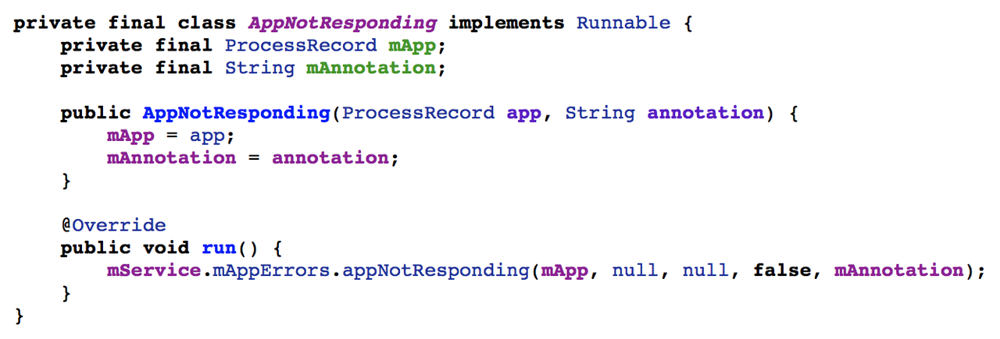

进入系统服务 AMS 之后，AppError 先进行场景判断，以过滤当前进程是不是已经发生并正在执行 Dump 流程，或者已经发生 Crash，或者已经被系统 Kill 之类的情况。并且还考虑了系统是否正在关机等场景，如果都不符合上述条件，则认为当前进程真的发生 ANR。

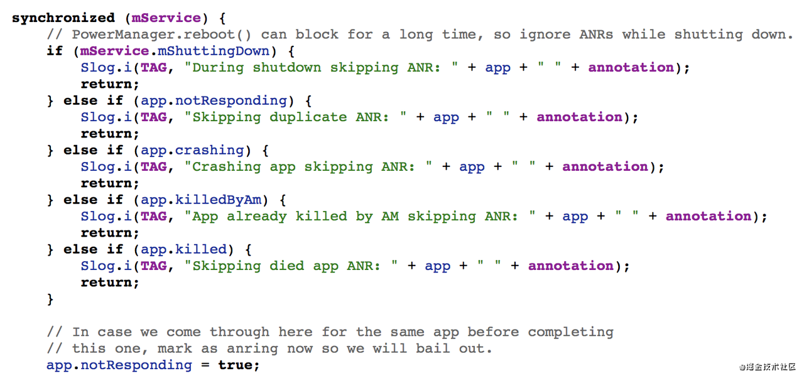

接下来系统再判断当前 ANR 进程对用户是否可感知，如后台低优先级进程(没有重要服务或者 Activity 界面)。

然后开始统计与该进程有关联的进程，或系统核心服务进程的信息；例如与应用进程经常交互的 SurfaceFligner，SystemServer 等系统进程，如果这些系统服务进程在响应时被阻塞，那么将导致应用进程 IPC 通信过程被卡死。

首先把自身进程(系统服务 SystemServer)加进来，逻辑如下：

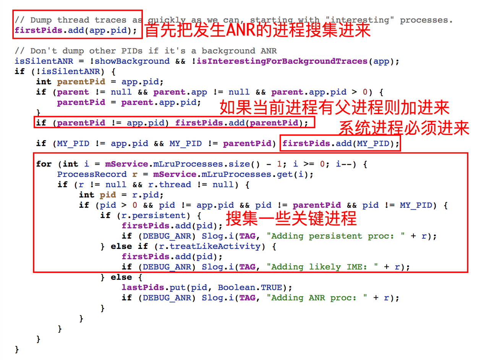

接着获取其它系统核心进程，因为这些服务进程是 Init 进程直接创建的，并不在 SystemServer 或 Zygote 进程管理范围。

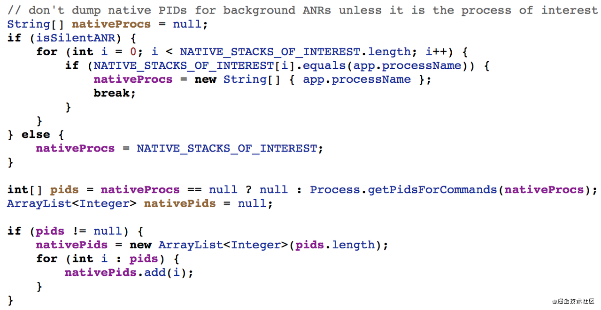


在搜集完第一步信息之后，接下来便开始统计各进程本地的更多信息，如虚拟机相关信息、Java 线程状态及堆栈。以便于知道此刻这些进程乃至系统都发生了什么情况。理想很丰满，现实很骨感，后面我们会重点讲述为何有此感受。

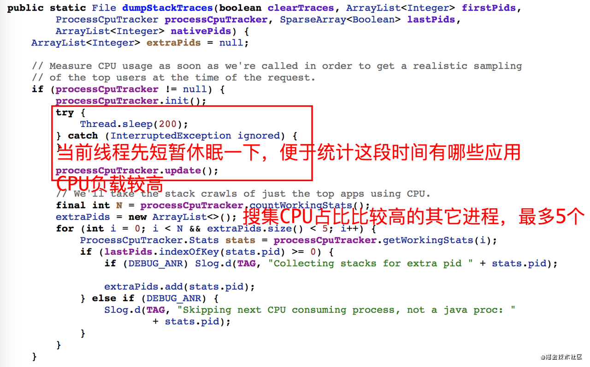

系统为何要收集其它进程信息呢？因为从性能角度来说，任何进程出现高 CPU 或高 IO 情况，都会抢占系统资源，进而影响其它进程调度不及时的现象。下面从代码角度看看系统 dump 流程：

```Java
private static void dumpStackTraces(String tracesFile, ArrayList<Integer> firstPids,            ArrayList<Integer> nativePids, ArrayList<Integer> extraPids,
            boolean useTombstonedForJavaTraces) {
        ......
        ......
        //考虑到性能影响，一次dump最多持续20S，否则放弃后续进程直接结束
        remainingTime = 20 * 1000;
        try {
                ......
                //按照优先级依次获取各个进程trace日志
                int num = firstPids.size();
                for (int i = 0; i < num; i++) {
                    final long timeTaken;
                    if (useTombstonedForJavaTraces) {
                        timeTaken = dumpJavaTracesTombstoned(firstPids.get(i), tracesFile, remainingTime);
                    } else {
                        timeTaken = observer.dumpWithTimeout(firstPids.get(i), remainingTime);
                    }

                    remainingTime -= timeTaken;
                    if (remainingTime <= 0) {
                        //已经超时，则不再进行后续进程的dump操作
                        return;
                    }
                    }
                }
            }
            //按照优先级依次获取各个进程trace日志
                for (int pid : nativePids) {
                    final long nativeDumpTimeoutMs = Math.min(NATIVE_DUMP_TIMEOUT_MS, remainingTime);

                    final long start = SystemClock.elapsedRealtime();
                    Debug.dumpNativeBacktraceToFileTimeout(
                            pid, tracesFile, (int) (nativeDumpTimeoutMs / 1000));
                    final long timeTaken = SystemClock.elapsedRealtime() - start;

                    remainingTime -= timeTaken;
                    if (remainingTime <= 0) {
                        //已经超时，则不再进行后续进程的dump操作
                        return;
                    }
                }
            }
            //按照优先级依次获取各个进程trace日志
                for (int pid : extraPids) {
                    final long timeTaken;
                    if (useTombstonedForJavaTraces) {
                        timeTaken = dumpJavaTracesTombstoned(pid, tracesFile, remainingTime);
                    } else {
                        timeTaken = observer.dumpWithTimeout(pid, remainingTime);
                    }

                    remainingTime -= timeTaken;
                    if (remainingTime <= 0) {
                        //已经超时，则不再进行后续进程的dump操作
                        return;
                    }
                }
            }
        }
        ......
    }
复制代码
```

#### Dump Trace 流程

出于安全考虑，进程之间是相互隔离的，即使是系统进程也无法直接获取其它进程相关信息。因此需要借助 IPC 通信的方式，将指令发送到目标进程，目标进程接收到信号后，协助完成自身进程 Dump 信息并发送给系统进程。以 AndroidP 系统为例，大致流程图如下：

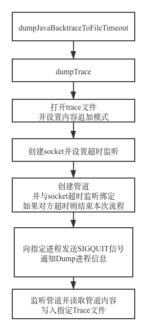

关于应用进程接收信号和响应能力，是在虚拟机内部实现的，在虚拟机启动过程中进行信号注册和监听(SIGQUIT)，初始化逻辑如下：

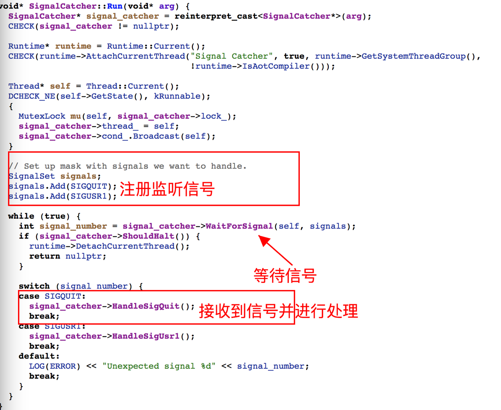

SignalCatcher 线程接收到信号后，首先 Dump 当前虚拟机有关信息，如内存状态，对象，加载 Class，GC 等等，接下来设置各线程标记位(check_point)，以请求线程起态(suspend)。其它线程运行过程进行上下文切换时，会检查该标记，如果发现有挂起请求，会主动将自己挂起。等到所有线程挂起后，SignalCatcher 线程开始遍历 Dump 各线程的堆栈和线程数据，结束之后再唤醒线程。期间如果某些线程一直无法挂起直到超时，那么本次 Dump 流程则失败，并主动抛出超时异常。

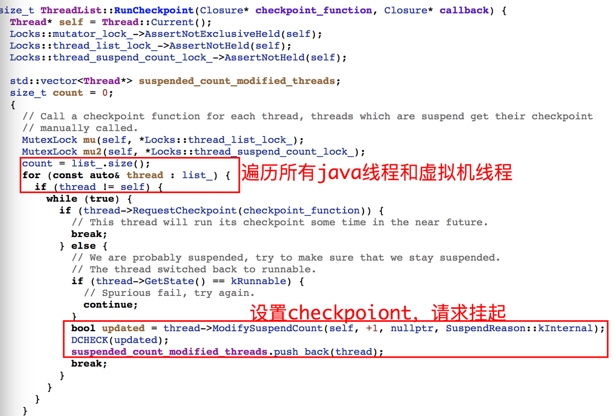

根据上面梳理的流程，SignalCatcher 获取各线程信息的工作过程，示意图如下：

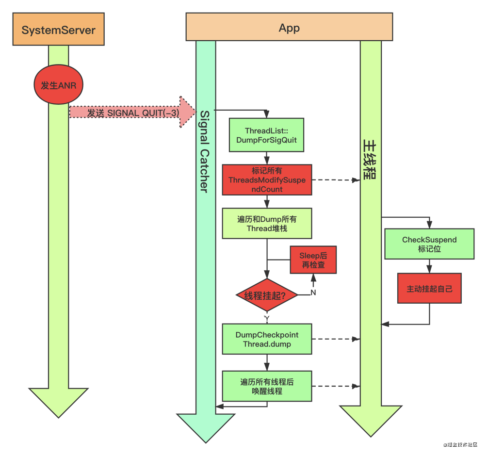

到这里，基本介绍完了系统设计原理，并以广播发送为例说明系统是如何判定 ANR 的，以及发生 ANR 后，系统是如何获取系统信息和进程信息，以及其他进程是如何协助系统进程完成日志收集的。

整体来看链路比较长，而且涉及到与很多进程交互，同时为了进一步降低对应用乃至系统的影响，系统在很多环节都设置大量超时检测。而且从上面流程可以看到发生 ANR 时，系统进程除了发送信号给其它进程之外，自身也 Dump Trace，并获取系统整体及各进程 CPU 使用情况，且将其它进程 Dump 发送的数据写到文件中。因此这些开销将会导致系统进程在 ANR 过程承担很大的负载，这是为什么我们经常在 ANR Trace 中看到 SystemServer 进程 CPU 占比普遍较高的主要原因。陈林

### 应用层如何判定 ANR

Android M(6.0)版本之后，应用侧无法直接通过监听 data/anr/trace 文件，监控是否发生 ANR，那么大家又有什么其它手段去判定 ANR 呢？下面我们简单介绍一下。

站在应用侧角度来看，因为系统没有提供太友好的机制，去主动通知应用是否发生 ANR，而且很多信息更是对应用屏蔽了访问权限，但是对于三方 App 来说，也需要关注基本的用户体验，因此很多公司也进行了大量的探索，并给出了不同的解决思路，目前了解到的方案(思路)主要有下面 2 种：

1. 主线程 watchdog 机制

   核心思想是在应用层定期向主线程设置探测消息，并在异步设置超时监测，如在规定的时间内没有收到发送的探测消息状态更新，则判定可能发生 ANR，为什么是可能发生 ANR？因为还需要进一步从系统服务获取相关数据(下面会讲到如何获取)，进一步判定是否真的发生 ANR。

2. 监听 SIGNALQUIT 信号

   该方案在很多公司有应用，网上也有相关介绍，这里主要介绍一下思路。我们在上面提到了虚拟机是通过注册和监听 SIGNALQUIT 信号的方式执行请求的，而对于信号机制有了解的同学马上就可以猜到，我们也可以在应用层参考此方式注册相同信号去监听。不过要注意的是注册之后虚拟机之前注册的就会被覆盖，需要在适当的时候进行恢复，否则小心系统(厂商)找上门。

当接收到该信号时，过滤场景，确定是发生用户可感知的 ANR 之后，从 Java 层获取各线程堆栈，或通过反射方式获取到虚拟机内部 Dump 线程堆栈的接口，在内存映射的函数地址，强制调用该接口，并将数据重定向输出到本地。

**该方案从思路上来说优于第一种方案，并且遵循系统信息获取方式，获取的线程信息及虚拟机信息更加全面，但缺点是对性能影响比较大，对于复杂的 App 来说，统计其耗时，部分场景一次 Dump 耗时可能要超过 10S。**

### 应用层如何获取 ANR Info

上面提到无论是 Watchdog 还是监听信号的方式，都需要结论进一步过滤，以确保收集我们想要的 ANR 场景，因此需要利用系统提供的接口，进一步判定当前应用是否发生问题(ANR，Crash)；

与此同时，除了需要获取进程中各线程状态之外，我们也需要知道系统乃至其他进程的一些状态，如系统 CPU，Mem，IO 负载，关键进程的 CPU 使用率等等，便于推测发生问题时系统环境是否正常；

获取信息相关接口类如下：

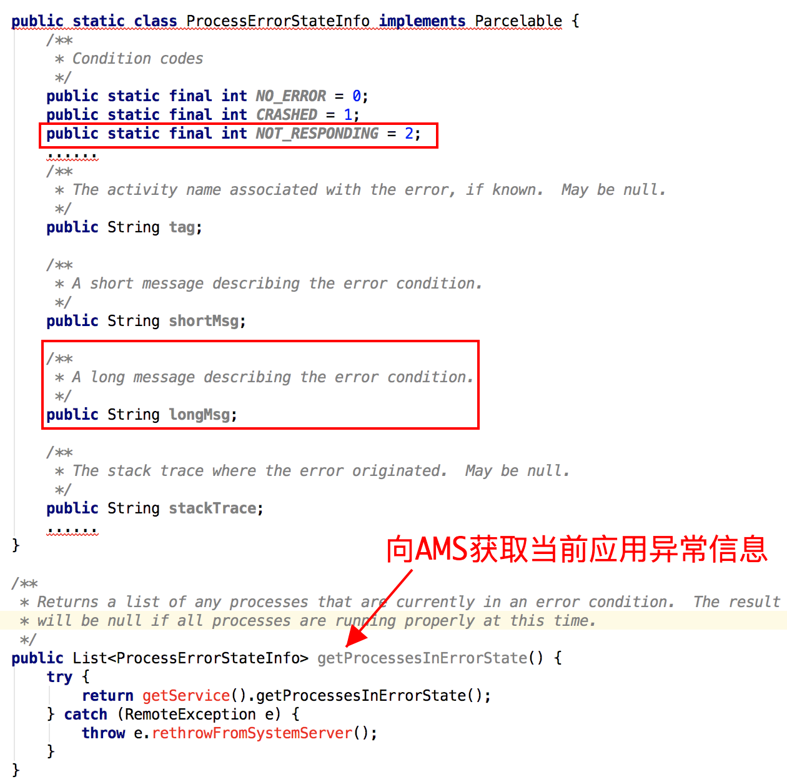

通过该接口获取的相关信息，示意如下，其中下图红框选中的关键字，我们在后续 ANR 分析思路一章，会对其进行详细释义：

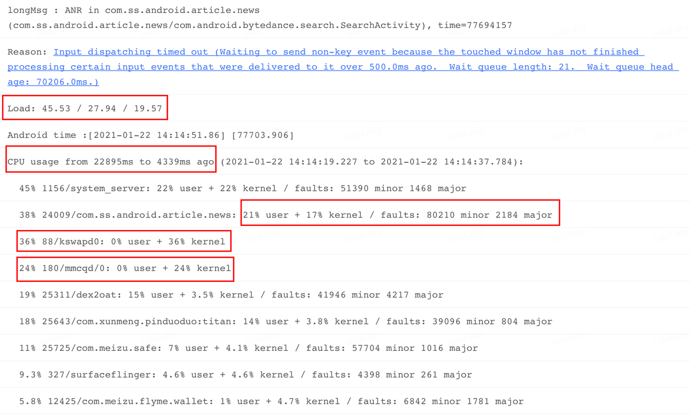

### 影响因素

上面主要介绍系统针对各种类型的消息是如何设置超时监控，以及监测到超时之后，系统侧和应用侧如何获取各类信息的工作流程。在对这些有所了解之后，接下来再看看 ANR 问题是如何产生的，以及我们对影响 ANR 因素的类型划分。

#### 举个例子：

在工作中，有同学问到“我的 Service”逻辑很简单，为何会 ANR 呢？其实通过堆栈和监控工具可以发现，他所说的业务 Service，其实都还没来得及被调度。原来该同学是从我们的内部监控平台上看到是该 Service 发生导致的 ANR，如下图：


下面我们就来回答一下为何会出现上面的这类现象？

#### 问题答疑

通过前面的讲解，我们可以发现，系统服务(AMS，InputService)在将具有超时属性的消息，如创建 Service，Receiver，Input 事件等，通过 Binder 或者其它 IPC 的方式发送到目标进程之后，便启动异步超时监测。而这种性质的监测完全是一种黑盒监测，并不是真的监控发送的消息在真实执行过程中是否超时，也就是说系统不管发送的这个消息有没有被执行，或者真实执行过程耗时有多久，只要在监控超时到来之前，服务端没有接收到通知，那么就判定为超时。

同时在前面我们讲到，当系统侧将消息发送给目标进程之后，其客户端进程的 Binder 线程接收到该消息后，会按时间顺序插入到消息队列；在后续等待执行过程中，会有下面几种情况发生：

- 启动进程启动场景，大量业务或基础库需要初始化，在消息入队之前，已经有很多消息待调度；
- 有些场景有可能只是少量消息，但是其中有一个或多个消息耗时很长；
- 有些场景其他进程或者系统负载特别高，整个系统都变得有些卡顿。

上述这些场景都会导致发送的消息还没来得及执行，就可能已经被系统判定成为超时问题，然而此时进程接收信号后，主线程 Dump 的是当前某个消息执行过程的业务堆栈(逻辑)。

所以**总结来说，发生 ANR 问题时，Trace 堆栈很多情况下都不是 RootCase。而系统 ANR Info 中提示某个 Service 或 Receiver 导致的 ANR 在很大程度上，并不是这些组件自身问题。**

那么影响 ANR 的场景具体可以分为哪几类呢，下面我们就来聊一聊；

## 影响因素分类

结合我们在系统侧和应用侧的工作经历，以及对该类问题的理解，我们将可能导致 ANR 的影响要素分为下面几个方面，影响环境分为**应用内部环境和系统环境**；即 **系统负载正常，但是应用内部主线程消息过多或耗时严重**；另外一类则是**系统或应用内部其它线程或资源负载过高，主线程调度被严重抢占**；系统负载正常，主线程调度问题，总体来说包括以下几种：

- 当前 Trace 堆栈所在业务耗时严重；
- 当前 Trace 堆栈所在业务耗时并不严重，但是**历史调度有一个严重耗时**；
- 当前 Trace 堆栈所在业务耗时并不严重，但是**历史调度有多个消息耗时**；
- 当前 Trace 堆栈所在业务耗时并不严重，但是**历史调度存在巨量重复消息**(业务频繁发送消息)；
- 当前 Trace 堆栈业务逻辑并不耗时，但是**其他线程存在严重资源抢占，如 IO，Mem，CPU**；
- 当前 Trace 堆栈业务逻辑并不耗时，但是**其他进程存在严重资源抢占，如 IO，Mem，CPU**；

下面我们就来分别介绍一下这几种场景以及表现情况：

### 当前主线程正在调度的消息耗时严重

理论上某个消息耗时越严重，那么这个消息造成的卡顿或者 ANR 的概率就越大，这种场景在线上经常发生，相对来说比较容易排查，也是业务开发同学分析该类问题的常规思路。

发生 ANR 时主线程消息调度示意图如下：


### 已调度的消息发生单点耗时严重

如果之前某个历史消息严重耗时，但是直到该消息执行完毕，系统服务仍然没有达到触发超时的临界点，后续主线程继续调度其它消息时，系统判定响应超时，那么正在执行的业务场景很不幸被命中，而当前正在执行的业务逻辑可能很简单。

这种场景在线上大量存在，因为比较隐蔽，所以会给很多同学带来困惑，后面会在 ANR 实例分析中对其进行重点介绍。发生 ANR 时主线程消息调度示意图如下：


### 连续多个消息耗时严重

除了上述两种场景，还有一种情况就是**存在多个消息耗时严重的情况，直到后面主线程调度其它消息时，系统判定响应超时，那么正在执行的业务场景很不幸被命中；这种场景在实际环境中也是普遍存在的，这类问题更加隐蔽，并且在分析和问题归因上，也很难清晰的划清界限**，问题治理上需要推动多个业务场景进行优化。(后面会在 ANR 实例分析中对其进行重点介绍)

发生 ANR 时主线程消息调度示意图如下：


### 相同消息高频执行(业务逻辑异常)

上面我们讲到的是有一个或多个消息耗时较长，还有另外一种情况就是**业务逻辑发生异常或者业务线程与主线程频繁交互，大量消息堆积在消息队列，这时对于后续追加到消息队列的消息来说，尽管不存在单个耗时严重的消息，但是消息太密集导致一段时间内同样很难被及时调度，因此这种场景也会造成消息调度不及时，进而导致响应超时问题**。(后面会在 ANR 实例分析中对其进行介绍)

发生 ANR 时主线程消息调度示意图如下：


### 应用进程或系统(包括其它进程)负载过重

除了上面列举了一些主线程消息耗时严重或者消息过多，导致的消息调度不及时的可能引起的问题之外，**还有一种我们在线上经常遇到的场景，那就是进程或系统本身负载很重，如高 CPU，高 IO，低内存(应用内内存抖动频繁 GC，系统内存回收)等等。这种情况出现之后，也很导致应用或整体系统性能变差，最终导致一系列超时问题**。

针对这种情况，具体到主线程消息调度上表现来看，就是**很多消息耗时都比较严重，而且每次消息调度统计的 Wall Duration(绝对时间：包括正常调度和等待，休眠时间)和 CPU Duration(绝对时间：只包括 CPU 执行时间)相差很大**，如果出现这种情况我们则认为系统负载可能发生了异常，需要借助系统信息进一步对比分析。这种情况不仅影响当前应用，也会影响其他应用乃至系统自身。

发生 ANR 时主线程消息调度示意图如下：


## 总结

通过上面的介绍，我们介绍了 ANR 的设计原理及工作过程，对影响 ANR 的因素和分类也有了进一步认识。从归类上我们可以发现，影响 ANR 的场景会有很多种，甚至很多时候都是层层叠加导致，所以可以借用一句话来形容：**「当 ANR 发生时，没有一个消息是无辜的」**

## 后续

依靠系统现有的监控能力，并不能直观的体现上面列举的众多场景，更无法直观告诉我们 ANR 发生前主线程调度情况。仅仅依靠 ANR 时获取系统及 Top 进程的相关信息和一些 Log 日志，很多数时候只能帮我们完成第一阶段的定位，如系统负载过重，主线程过于繁忙等结论。却无法更进一步深入分析和解决问题，尤其是一些线下难以复现的问题。

对于我们每个人来说，工作的目标不仅仅是定位方向，更重要的是解决问题。那么怎么才能更好的解决上述系统监控能力不完善以及应用侧信息盲区的问题呢？这就是我们下一期要重点介绍的“监控工具”，一个优秀的工具，不仅可以帮助我们在解决常规问题时达到一锤定音的效果，在面对更加复杂隐蔽的问题时，也能为我们打开视野，提供更多方向，下周的文章我们就去看看它是如何设计及运用的。


## 来源

* https://juejin.cn/post/6940061649348853796