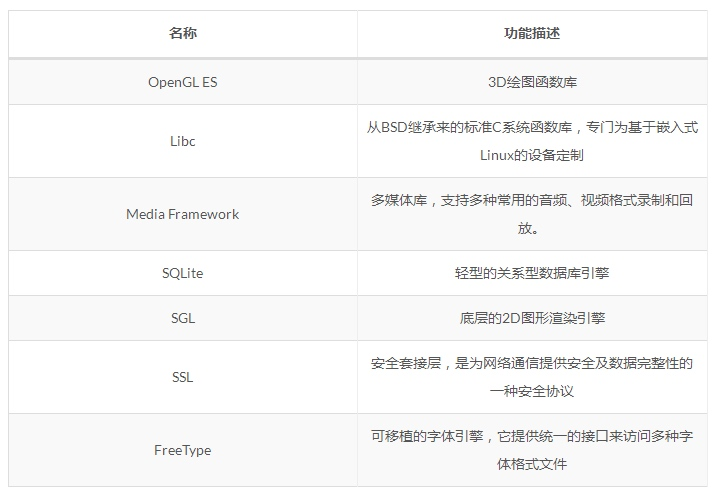

<h1 align="center">Android 系统架构</h1>

[toc]

## Android系统架构

Android本质就是在标准的Linux系统上增加了Java虚拟机Dalvik/ART，并在Dalvik/ART虚拟机上搭建了一个JAVA的application framework，所有的应用程序都是基于JAVA的application framework之上。

android分为四个层，从高层到低层分别是应用程序层、应用程序框架层、系统运行库层和Linux内核层。

### 应用程序层

该层提供一些核心应用程序包，例如电子邮件、短信、日历、地图、浏览器和联系人管理等。同时，开发者可以利用Java语言设计和编写属于自己的应用程序，而这些程序与那些核心应用程序彼此平等、友好共处。

### 应用程序框架层

应用框架层为开发人员提供了可以开发应用程序所需要的API，我们平常开发应用程序都是调用的这一层所提供的API，当然也包括系统的应用。这一层的是由Java代码编写的，可以称为Java Framework。

应用程序框架层包括活动管理器、位置管理器、包管理器、通知管理器、资源管理器、 电话管理器、窗口管理器、内容提供者、视图系统和XMPP服务十个部分。


### 系统运行库层

系统运行库层分为两部分，分别是C/C++程序库和Android运行时库。

（1）C/C++程序库

C/C++程序库能被Android系统中的不同组件所使用，并通过应用程序框架为开发者提供服务。C/C++程序库包括九个子系统，分别是图层管理、媒体库、SQLite、OpenGLEState、FreeType、WebKit、SGL、SSL和libc。




（2）Android运行时库

运行时库又分为核心库和ART(5.0系统之后，Dalvik虚拟机被ART取代)。核心库提供了Java语言核心库的大多数功能，这样开发者可以使用Java语言来编写Android应用。相较于JVM，Dalvik虚拟机是专门为移动设备定制的，允许在有限的内存中同时运行多个虚拟机的实例，并且每一个Dalvik 应用作为一个独立的Linux 进程执行。独立的进程可以防止在虚拟机崩溃的时候所有程序都被关闭。而替代Dalvik虚拟机的ART的机制与Dalvik不同。在Dalvik下，应用每次运行的时候，字节码都需要通过即时编译器转换为机器码，这会拖慢应用的运行效率，而在ART 环境中，应用在第一次安装的时候，字节码就会预先编译成机器码，使其成为真正的本地应用。

### Linux内核层

Android 的核心系统服务基于Linux 内核，在此基础上添加了部分Android专用的驱动。系统的安全性、内存管理、进程管理、网络协议栈和驱动模型等都依赖于该内核。Linux内核也是作为硬件与软件栈的抽象层。

## Android系统源码

对国内的开发者来说最痛苦的是无法去访问android开发网站。为了更好的认识世界，对程序员来说，会翻墙也是的一门技术，带你去领略墙外的世界, 国内开发者访问(androiddevtools) 上面已经有了所有你要的资源，同时可以下载到我们的主角framework。

如果你只是想查看源码，androidxref也是一个不错的资源。

## 系统架构


* Activity Manager：用来管理应用程序生命周期并提供常用的导航回退功能。
* Window Manager：提供一些我们访问手机屏幕的方法。屏幕的透明度、亮度、背景。
* Content Providers：使得应用程序可以访问另一个应用程序的数据（如联系人数据库)， 或者共享它们自己的数据。
* View System：可以用来构建应用程序， 它包括列表（Lists)，网格（Grids)，文本框（Text boxes)，按钮（Buttons)， 甚至可嵌入的web浏览器。
* Notification Manager：使得应用程序可以在状态栏中显示自定义的提示信息。
* Package Manager：提供对系统的安装包的访问。包括安装、卸载应用，查询permission相关信息，查询Application相关信息等。
* Telephony Manager：主要提供了一系列用于访问与手机通讯相关的状态和信息的方法，查询电信网络状态信息，sim卡的信息等。
* Resource Manager：提供非代码资源的访问，如本地字符串，图形，和布局文件（Layout files )。
* Location Manager：提供设备的地址位置的获取方式。很显然，GPS导航肯定能用到位置服务。
* XMPP：可扩展通讯和表示协议。前身为Jabber，提供即时通信服务。例如推送功能,Google Talk

### 整体结构

Android7.0的根目录结构说明如下表所示：

```
|– Makefile （全局Makefile文件，用来定义编译规则）
|– abi （应用程序二进制接口）
|– art （ART运行环境）
|– bionic （bionic C库）
|– bootable （启动引导相关代码）
|– build （存放系统编译规则及generic等基础开发包配置）
|– cts （Android兼容性测试套件标准）
|– dalvik （dalvik JAVA虚拟机）
|– developers （开发者目录）
|– development （应用程序开发相关）
|– device （设备相关配置）
|– docs （参考文档目录）
|– external （android使用的一些开源的模组）
|– frameworks （核心框架——java及C++语言）
|– hardware （部分厂家开源的硬解适配层HAL代码）
|– kernel
|– libcore （核心库相关文件）
|– libnativehelper （动态库，实现JNI库的基础）
|– ndk （NDK相关代码，帮助开发人员在应用程序中嵌入C/C++代码）
|– out （编译完成后的代码输出与此目录）
|– packages （应用程序包）
|– pdk （Plug Development Kit 的缩写，本地开发套件）
|– prebuilts （x86和arm架构下预编译的一些资源）
|– sdk （sdk及模拟器）
|– system （底层文件系统库、应用及组件——C语言）
|– tools （工具文件）
|– toolchain（工具链文件）
|– vendor （厂商定制代码）
```


#### 应用层部分

应用层位于整个Android系统的最上层，开发者开发的应用程序以及系统内置的应用程序都位于应用层。源码根目录中的packages目录对应着系统应用层。

```
|– apps （核心应用程序）
|– experimental （第三方应用程序）
|– inputmethods （输入法目录）
|– providers （内容提供者目录）
|– screensavers （屏幕保护）
|– services （通信服务）
|– wallpapers （墙纸）
```


从目录结构可以发现，packages目录存放着系统核心应用程序、第三方的应用程序和输入法等等，这些应用都是运行在系统应用层的，因此packages目录对应着系统的应用层。

#### 应用框架层部分
应用框架层是系统的核心部分，一方面向上提供接口给应用层调用，另一方面向下与C/C++程序库以及硬件抽象层等进行衔接。 应用框架层的主要实现代码在/frameworks/base和/frameworks/av目录下，其中/frameworks/base目录结构如下：

```
|– api （定义API）
|– core （核心库）
|– docs （文档）
|– include （头文件）
|– libs （库）
|– media （多媒体相关库）
|– nfc-extras （NFC相关）
|– opengl 2D/3D （图形API）
|– sax （XML解析器）
|– telephony （电话通讯管理）
|– tests （测试相关）
|– test-runner （测试工具相关）
|– tools （工具）
|– wifi （wifi无线网络）
|– cmds （重要命令：am、app_proce等）
|– data （字体和声音等数据文件）
|– graphics （图形图像相关）
|– keystore （和数据签名证书相关）
|– location （地理位置相关库）
|– native （本地库）
|– obex （蓝牙传输）
|– packages （设置、TTS、VPN程序）
|– services （系统服务）
```


## 参考

https://www.cnblogs.com/jiangzhaowei/p/7794588.html

https://blog.csdn.net/huaxun66/java/article/details/78135556

https://blog.csdn.net/love_xsq/article/details/50992515

https://blog.csdn.net/nwpushuai/article/details/79255993

https://blog.csdn.net/itachi85/article/details/54695046