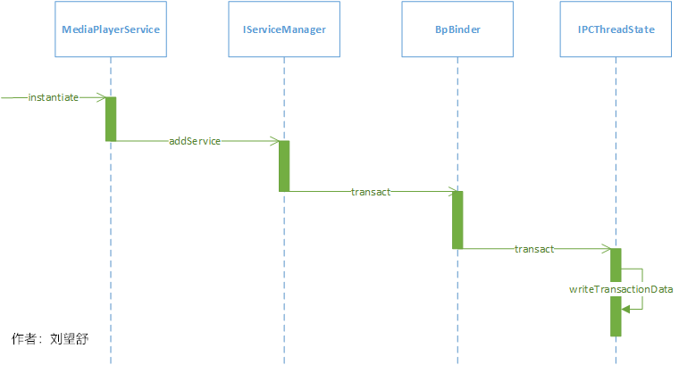
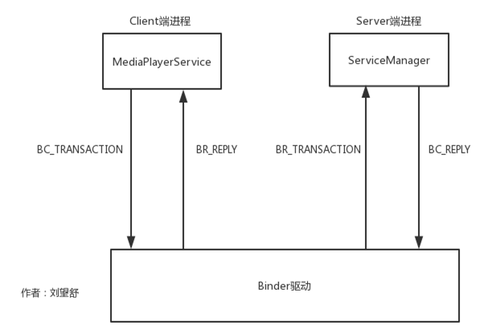

<h1 align="center">Android Binder原理（二）ServiceManager中的Binder机制</h1>

### **前言**

在上一篇文章中，我们学习了ServiceManager中的Binder机制，有一个问题由于篇幅问题没有讲完，那就是MediaPlayerService是如何注册的。通过了解MediaPlayerService是如何注册的，可以得知系统服务的注册过程。

### **1.从调用链角度说明MediaPlayerService是如何注册的**

我们先来看MediaServer的入口函数，代码如下所示。 **frameworks/av/media/mediaserver/main_mediaserver.cpp**

```
int main(int argc __unused, char **argv __unused)
{
    signal(SIGPIPE, SIG_IGN);
    //获取ProcessState实例
    sp<ProcessState> proc(ProcessState::self());
    sp<IServiceManager> sm(defaultServiceManager());
    ALOGI("ServiceManager: %p", sm.get());
    InitializeIcuOrDie();
    //注册MediaPlayerService
    MediaPlayerService::instantiate();//1
    ResourceManagerService::instantiate();
    registerExtensions();
    //启动Binder线程池
    ProcessState::self()->startThreadPool();
    //当前线程加入到线程池
    IPCThreadState::self()->joinThreadPool();
}
```

这段代码中的很多内容都在上一篇文章介绍过了，接着分析注释1处的代码。

**frameworks/av/media/libmediaplayerservice/MediaPlayerService.cpp**

```
void MediaPlayerService::instantiate() {
    defaultServiceManager()->addService(
            String16("media.player"), new MediaPlayerService，());
}
```

defaultServiceManager返回的是BpServiceManager，不清楚的看[Android Binder原理（二）ServiceManager中的Binder机制][1]这篇文章。参数是一个字符串和MediaPlayerService，看起来像是Key/Value的形式来完成注册，接着看addService函数。

**frameworks/native/libs/binder/IServiceManager.cpp**

```
 virtual status_t addService(const String16& name, const sp<IBinder>& service,
                                bool allowIsolated, int dumpsysPriority) {
        Parcel data, reply;//数据包
        data.writeInterfaceToken(IServiceManager::getInterfaceDescriptor());
        data.writeString16(name); //name值为"media.player"
        data.writeStrongBinder(service); //service值为MediaPlayerService
        data.writeInt32(allowIsolated ? 1 : 0);
        data.writeInt32(dumpsysPriority);
        status_t err = remote()->transact(ADD_SERVICE_TRANSACTION, data, &reply);//1
        return err == NO_ERROR ? reply.readExceptionCode() : err;
    }
```

data是一个数据包，后面会不断的将数据写入到data中， 注释1处的remote()指的是mRemote，也就是BpBinder。addService函数的作用就是将请求数据打包成data，然后传给BpBinder的transact函数，代码如下所示。 **frameworks/native/libs/binder/BpBinder.cpp**

```
status_t BpBinder::transact(
    uint32_t code, const Parcel& data, Parcel* reply, uint32_t flags)
{
    if (mAlive) {
        status_t status = IPCThreadState::self()->transact(
            mHandle, code, data, reply, flags);
        if (status == DEAD_OBJECT) mAlive = 0;
        return status;
    }

    return DEAD_OBJECT;
}
```

BpBinder将逻辑处理交给IPCThreadState，先来看IPCThreadState::self()干了什么？ **frameworks/native/libs/binder/IPCThreadState.cpp**

```
IPCThreadState* IPCThreadState::self()
{   
    //首次进来gHaveTLS的值为false
    if (gHaveTLS) {
restart:
        const pthread_key_t k = gTLS;//1
        IPCThreadState* st = (IPCThreadState*)pthread_getspecific(k);//2
        if (st) return st;
        return new IPCThreadState;//3
    }
    ...
    pthread_mutex_unlock(&gTLSMutex);
    goto restart;
}
```

注释1处的TLS的全称为Thread local storage，指的是线程本地存储空间，在每个线程中都有TLS，并且线程间不共享。注释2处用于获取TLS中的内容并赋值给IPCThreadState*指针。注释3处会新建一个IPCThreadState，这里可以得知IPCThreadState::self()实际上是为了创建IPCThreadState，它的构造函数如下所示。 **frameworks/native/libs/binder/IPCThreadState.cpp**

```
IPCThreadState::IPCThreadState()
    : mProcess(ProcessState::self()),
      mStrictModePolicy(0),
      mLastTransactionBinderFlags(0)
{
    pthread_setspecific(gTLS, this);//1
    clearCaller();
    mIn.setDataCapacity(256);
    mOut.setDataCapacity(256);
}
```

注释1处的pthread_setspecific函数用于设置TLS，将IPCThreadState::self()获得的TLS和自身传进去。IPCThreadState中还包含mIn、一个mOut，其中mIn用来接收来自Binder驱动的数据，mOut用来存储发往Binder驱动的数据，它们默认大小都为256字节。 知道了IPCThreadState的构造函数，再回来查看IPCThreadState的transact函数。 **frameworks/native/libs/binder/IPCThreadState.cpp**

```
status_t IPCThreadState::transact(int32_t handle,
                                  uint32_t code, const Parcel& data,
                                  Parcel* reply, uint32_t flags)
{
    status_t err;

    flags |= TF_ACCEPT_FDS;
    ...
    err = writeTransactionData(BC_TRANSACTION, flags, handle, code, data, NULL);//1

    if (err != NO_ERROR) {
        if (reply) reply->setError(err);
        return (mLastError = err);
    }

    if ((flags & TF_ONE_WAY) == 0) {
       ...
        if (reply) {
            err = waitForResponse(reply);//2
        } else {
            Parcel fakeReply;
            err = waitForResponse(&fakeReply);
        }
       ...
    } else {
       //不需要等待reply的分支
        err = waitForResponse(NULL, NULL);
    }

    return err;
}
```

调用BpBinder的transact函数实际上就是调用IPCThreadState的transact函数。注释1处的writeTransactionData函数用于传输数据，其中第一个参数BC_TRANSACTION代表向Binder驱动发送命令协议，向Binder设备发送的命令协议都以BC_开头，而Binder驱动返回的命令协议以BR_开头。这个命令协议我们先记住，后面会再次提到他。

现在分别来分析注释1的writeTransactionData函数和注释2处的waitForResponse函数。

#### **1.1 writeTransactionData函数分析**

**frameworks/native/libs/binder/IPCThreadState.cpp**

```
status_t IPCThreadState::writeTransactionData(int32_t cmd, uint32_t binderFlags,
    int32_t handle, uint32_t code, const Parcel& data, status_t* statusBuffer)
{
    binder_transaction_data tr;//1

    tr.target.ptr = 0; 
    tr.target.handle = handle;//2 
    tr.code = code;  //code=ADD_SERVICE_TRANSACTION
    tr.flags = binderFlags;
    tr.cookie = 0;
    tr.sender_pid = 0;
    tr.sender_euid = 0;

    const status_t err = data.errorCheck();//3
    if (err == NO_ERROR) {
        tr.data_size = data.ipcDataSize();
        tr.data.ptr.buffer = data.ipcData();
        tr.offsets_size = data.ipcObjectsCount()*sizeof(binder_size_t);
        tr.data.ptr.offsets = data.ipcObjects();
    } else if (statusBuffer) {
        tr.flags |= TF_STATUS_CODE;
        *statusBuffer = err;
        tr.data_size = sizeof(status_t);
        tr.data.ptr.buffer = reinterpret_cast<uintptr_t>(statusBuffer);
        tr.offsets_size = 0;
        tr.data.ptr.offsets = 0;
    } else {
        return (mLastError = err);
    }

    mOut.writeInt32(cmd);  //cmd=BC_TRANSACTION
    mOut.write(&tr, sizeof(tr));

    return NO_ERROR;
}
```

注释1处的binder_transaction_data结构体(tr结构体）是向Binder驱动通信的数据结构，注释2处将handle传递给target的handle，用于标识目标，这里的handle的值为0，代表了ServiceManager。 注释3处对数据data进行错误检查，如果没有错误就将数据赋值给对应的tr结构体。最后会将BC_TRANSACTION和tr结构体写入到mOut中。 上面代码调用链的时序图如下所示。



#### **1.2 waitForResponse函数分析**

接着回过头来查看waitForResponse函数做了什么，waitForResponse函数中的case语句很多，这里截取部分代码。
 **frameworks/native/libs/binder/IPCThreadState.cpp**

```
status_t IPCThreadState::waitForResponse(Parcel *reply, status_t *acquireResult)
{
    uint32_t cmd;
    int32_t err;
    while (1) {
        if ((err=talkWithDriver()) < NO_ERROR) break;//1
        err = mIn.errorCheck();
        if (err < NO_ERROR) break;
        if (mIn.dataAvail() == 0) continue;
        cmd = (uint32_t)mIn.readInt32();
        IF_LOG_COMMANDS() {
            alog << "Processing waitForResponse Command: "
                << getReturnString(cmd) << endl;
        }
        switch (cmd) {
        case BR_TRANSACTION_COMPLETE:
            if (!reply && !acquireResult) goto finish;
            break;

        case BR_DEAD_REPLY:
            err = DEAD_OBJECT;
            goto finish;
       ...
        default:
            //处理各种命令协议
            err = executeCommand(cmd);
            if (err != NO_ERROR) goto finish;
            break;
        }
}
finish:
    ...
    return err;
}
```

注释1处的talkWithDriver函数的内部通过ioctl与Binder驱动进行通信，代码如下所示。 **frameworks/native/libs/binder/IPCThreadState.cpp**

```
status_t IPCThreadState::talkWithDriver(bool doReceive)
{
    if (mProcess->mDriverFD <= 0) {
        return -EBADF;
    }
    //和Binder驱动通信的结构体
    binder_write_read bwr; //1
    //mIn是否有可读的数据，接收的数据存储在mIn
    const bool needRead = mIn.dataPosition() >= mIn.dataSize();
    const size_t outAvail = (!doReceive || needRead) ? mOut.dataSize() : 0;
    bwr.write_size = outAvail;
    bwr.write_buffer = (uintptr_t)mOut.data();//2
    //这时doReceive的值为true
    if (doReceive && needRead) {
        bwr.read_size = mIn.dataCapacity();
        bwr.read_buffer = (uintptr_t)mIn.data();//3
    } else {
        bwr.read_size = 0;
        bwr.read_buffer = 0;
    }
   ...
    if ((bwr.write_size == 0) && (bwr.read_size == 0)) return NO_ERROR;
    bwr.write_consumed = 0;
    bwr.read_consumed = 0;
    status_t err;
    do {
        IF_LOG_COMMANDS() {
            alog << "About to read/write, write size = " << mOut.dataSize() << endl;
        }
#if defined(__ANDROID__)
        if (ioctl(mProcess->mDriverFD, BINDER_WRITE_READ, &bwr) >= 0)//4
            err = NO_ERROR;
        else
            err = -errno;
#else
        err = INVALID_OPERATION;
#endif
     ...
    } while (err == -EINTR);
    ...
    return err;
}
```

注释1处的 binder_write_read是和Binder驱动通信的结构体，在注释2和3处将mOut、mIn赋值给binder_write_read的相应字段，最终通过注释4处的ioctl函数和Binder驱动进行通信，这一部分涉及到Kernel Binder的内容 了，就不再详细介绍了，只需要知道在Kernel Binder中会记录服务名和handle，用于后续的服务查询。

#### **1.3 小节**

从调用链的角度来看，MediaPlayerService是如何注册的貌似并不复杂，因为这里只是简单的介绍了一个调用链分支，可以简单的总结为以下几个步骤：

1. addService函数将数据打包发送给BpBinder来进行处理。
2. BpBinder新建一个IPCThreadState对象，并将通信的任务交给IPCThreadState。
3. IPCThreadState的writeTransactionData函数用于将命令协议和数据写入到mOut中。
4. IPCThreadState的waitForResponse函数主要做了两件事，一件事是通过ioctl函数操作mOut和mIn来与Binder驱动进行数据交互，另一件事是处理各种命令协议。

### **2.从进程角度说明MediaPlayerService是如何注册的**

实际上MediaPlayerService的注册还涉及到了进程，如下图所示。



从图中看出是以C/S架构为基础，addService是在MediaPlayerService进行的，它是Client端，用于请求添加系统服务。而Server端则是指的是ServiceManager，用于完成系统服务的添加。 Client端和Server端分别运行在两个进程中，通过向Binder来进行通信。更详细点描述，就是两端通过向Binder驱动发送命令协议来完成系统服务的添加。这其中命令协议非常多，过程也比较复杂，这里对命令协议进行了简化，只涉及到了四个命令协议，其中 BC_TRANSACTION和BR_TRANSACTION过程是一个完整的事务，BC_REPLY和BR_REPLY是一个完整的事务。 Client端和Server端向Binder驱动发送命令协议以BC开头，而Binder驱动向Client端和Server端返回的命令协议以BR_开头。

步骤如下所示： 1.Client端向Binder驱动发送BC_TRANSACTION命令。 2.Binder驱动接收到请求后生成BR_TRANSACTION命令，唤醒Server端的线程后将BR_TRANSACTION命令发送给ServiceManager。 3.Server端中的服务注册完成后，生成BC_REPLY命令发送给Binder驱动。 4.Binder驱动生成BR_REPLY命令，唤醒Client端的线程后将BR_REPLY命令发送个Client端。

通过这些协议命令来驱动并完成系统服务的注册。

### **3.总结**

本文分别从调用链角度和进程角度来讲解MediaPlayerService是如何注册的，间接的得出了服务是如何注册的 。这两个角度都比较复杂，因此这里分别对这两个角度做了简化，作为应用开发，我们不需要注重太多的过程和细节，只需要了解大概的步骤即可。


链接：https://juejin.cn/post/6844904000047824909