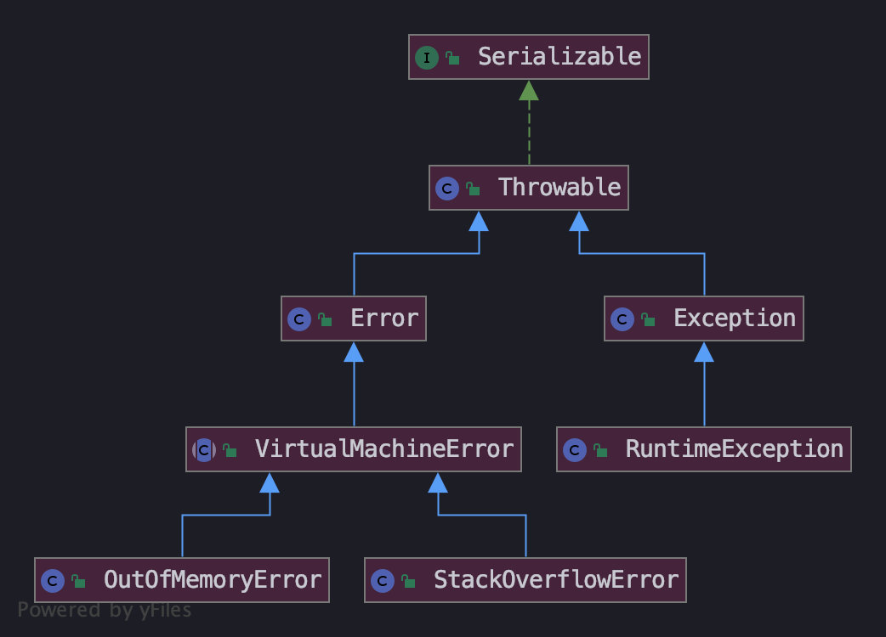
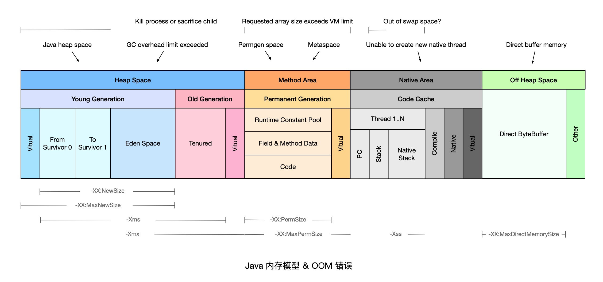

<h1 align="center">OutOfMemoryError</h1>

[toc]

## 一. FC(Force Close)什么时候会出现？

Error、OOM，StackOverFlowError、Runtime,比如说空指针异常

解决的办法：

- 注意内存的使用和管理
- 使用Thread.UncaughtExceptionHandler接口

## 二. try-catch

### try-catch能否捕获子线程异常？

不能捕获子线程异常。

### Oom 是否可以try catch ？

只有在一种情况下，这样做是可行的：

在try语句中声明了很大的对象，导致OOM，并且可以确认OOM是由try语句中的对象声明导致的，那么在catch语句中，可以释放掉这些对象，解决OOM的问题，继续执行剩余语句。

但是这通常不是合适的做法。

Java中管理内存除了显式地catch OOM之外还有更多有效的方法：比如SoftReference, WeakReference, 硬盘缓存等。 在JVM用光内存之前，会多次触发GC，这些GC会降低程序运行的效率。 如果OOM的原因不是try语句中的对象（比如内存泄漏），那么在catch语句中会继续抛出OOM。

## 三. OutOfMemoryError


在《Java虚拟机规范》的规定里，除了程序计数器外，虚拟机内存的其他几个运行时区域都有发生 OutOfMemoryError 异常的可能。

本篇主要包括如下 OOM 的介绍和示例：

- java.lang.StackOverflowError
- java.lang.OutOfMemoryError: Java heap space
- java.lang.OutOfMemoryError: GC overhead limit exceeded
- java.lang.OutOfMemoryError-->Metaspace
- java.lang.OutOfMemoryError: Direct buffer memory
- java.lang.OutOfMemoryError: unable to create new native thread
- java.lang.OutOfMemoryError：Metaspace
- java.lang.OutOfMemoryError: Requested array size exceeds VM limit
- java.lang.OutOfMemoryError: Out of swap space
- java.lang.OutOfMemoryError：Kill process or sacrifice child

> 我们常说的 OOM 异常，其实是 Error



### 3.1. StackOverflowError

#### 3.1.1 写个 bug

```java
public class StackOverflowErrorDemo {

    public static void main(String[] args) {
        javaKeeper();
    }

    private static void javaKeeper() {
        javaKeeper();
    }
}
```

上一篇详细的介绍过[JVM 运行时数据区](https://mp.weixin.qq.com/s/jPIHNsQwiYNCRUQt1qXR6Q)，JVM 虚拟机栈是有深度的，在执行方法的时候会伴随着入栈和出栈，上边的方法可以看到，main 方法执行后不停的递归，迟早把栈撑爆了

```java
Exception in thread "main" java.lang.StackOverflowError at oom.StackOverflowErrorDemo.javaKeeper(StackOverflowErrorDemo.java:15)
```

#### 3.1.2 原因分析

- 无限递归循环调用（最常见原因），要时刻注意代码中是否有了循环调用方法而无法退出的情况
- 执行了大量方法，导致线程栈空间耗尽
- 方法内声明了海量的局部变量
- native 代码有栈上分配的逻辑，并且要求的内存还不小，比如 java.net.SocketInputStream.read0 会在栈上要求分配一个 64KB 的缓存（64位 Linux）

#### 3.1.3 解决方案

- 修复引发无限递归调用的异常代码，通过程序抛出的异常堆栈，找出不断重复的代码行，按图索骥，修复无限递归 Bug
- 排查是否存在类之间的循环依赖（当两个对象相互引用，在调用toString方法时也会产生这个异常）
- 通过 JVM 启动参数 `-Xss` 增加线程栈内存空间，某些正常使用场景需要执行大量方法或包含大量局部变量，这时可以适当地提高线程栈空间限制

### 3.2 Java heap space

Java 堆用于存储对象实例，我们只要不断的创建对象，并且保证 GC Roots 到对象之间有可达路径来避免 GC 清除这些对象，那随着对象数量的增加，总容量触及堆的最大容量限制后就会产生内存溢出异常。

Java 堆内存的 OOM 异常是实际应用中最常见的内存溢出异常。

#### 3.2.1 写个 bug

```java
/**
 * JVM参数：-Xmx12m
 */
public class JavaHeapSpaceDemo {

    static final int SIZE = 2 * 1024 * 1024;

    public static void main(String[] a) {
        int[] i = new int[SIZE];
    }
}
```

代码试图分配容量为 2M 的 int 数组，如果指定启动参数 `-Xmx12m`，分配内存就不够用，就类似于将 XXXL 号的对象，往 S 号的 Java heap space 里面塞。

```java
Exception in thread "main" java.lang.OutOfMemoryError: Java heap space at oom.JavaHeapSpaceDemo.main(JavaHeapSpaceDemo.java:13)
```

#### 3.2.2 原因分析

- 请求创建一个超大对象，通常是一个大数组
- 超出预期的访问量/数据量，通常是上游系统请求流量飙升，常见于各类促销/秒杀活动，可以结合业务流量指标排查是否有尖状峰值
- 过度使用终结器（Finalizer），该对象没有立即被 GC
- 内存泄漏（Memory Leak），大量对象引用没有释放，JVM 无法对其自动回收，常见于使用了 File 等资源没有回收

#### 3.2.3 解决方案

针对大部分情况，通常只需要通过 `-Xmx` 参数调高 JVM 堆内存空间即可。如果仍然没有解决，可以参考以下情况做进一步处理：

- 如果是超大对象，可以检查其合理性，比如是否一次性查询了数据库全部结果，而没有做结果数限制
- 如果是业务峰值压力，可以考虑添加机器资源，或者做限流降级。
- 如果是内存泄漏，需要找到持有的对象，修改代码设计，比如关闭没有释放的连接

> 面试官：说说内存泄露和内存溢出

加送个知识点，三连的终将成为大神~~

#### 内存泄露和内存溢出

内存溢出(out of memory)，是指程序在申请内存时，没有足够的内存空间供其使用，出现out of memory；比如申请了一个 Integer，但给它存了 Long 才能存下的数，那就是内存溢出。

内存泄露( memory leak)，是指程序在申请内存后，无法释放已申请的内存空间，一次内存泄露危害可以忽略，但内存泄露堆积后果很严重，无论多少内存，迟早会被占光。

**memory leak 最终会导致 out of memory！**

### 3.3 GC overhead limit exceeded

JVM 内置了垃圾回收机制GC，所以作为 Javaer 的我们不需要手工编写代码来进行内存分配和释放，但是当 Java 进程花费 98% 以上的时间执行 GC，但只恢复了不到 2% 的内存，且该动作连续重复了 5 次，就会抛出 `java.lang.OutOfMemoryError:GC overhead limit exceeded` 错误（**俗称：垃圾回收上头**）。简单地说，就是应用程序已经基本耗尽了所有可用内存， GC 也无法回收。

假如不抛出 `GC overhead limit exceeded` 错误，那 GC 清理的那么一丢丢内存很快就会被再次填满，迫使 GC 再次执行，这样恶性循环，CPU 使用率 100%，而 GC 没什么效果。

#### 3.3.1 写个 bug

出现这个错误的实例，其实我们写个无限循环，往 List 或 Map 加数据就会一直 Full GC，直到扛不住，这里用一个不容易发现的例子。我们往 map 中添加 1000 个元素。

```java
/**
 * JVM 参数： -Xmx14m -XX:+PrintGCDetails
 */
public class KeylessEntry {

    static class Key {
        Integer id;

        Key(Integer id) {
            this.id = id;
        }

        @Override
        public int hashCode() {
            return id.hashCode();
        }
    }

    public static void main(String[] args) {
        Map m = new HashMap();
        while (true){
            for (int i = 0; i < 1000; i++){
                if (!m.containsKey(new Key(i))){
                    m.put(new Key(i), "Number:" + i);
                }
            }
            System.out.println("m.size()=" + m.size());
        }
    }
}
...
m.size()=54000
m.size()=55000
m.size()=56000
Exception in thread "main" java.lang.OutOfMemoryError: GC overhead limit exceeded
```

从输出结果可以看到，我们的限制 1000 条数据没有起作用，map 容量远超过了 1000，而且最后也出现了我们想要的错误，这是因为类 Key 只重写了 `hashCode()` 方法，却没有重写 `equals()` 方法，我们在使用 `containsKey()` 方法其实就出现了问题，于是就会一直往 HashMap 中添加 Key，直至 GC 都清理不掉。

> 🧑🏻‍💻 面试官又来了：说一下 HashMap 原理以及为什么需要同时实现 equals 和 hashcode

> 执行这个程序的最终错误，和 JVM 配置也会有关系，如果设置的堆内存特别小，会直接报 `Java heap space`。算是被这个错误截胡了，所以有时，在资源受限的情况下，无法准确预测程序会死于哪种具体的原因。

#### 3.3.2 解决方案

- 添加 JVM 参数 `-XX:-UseGCOverheadLimit` 不推荐这么干，没有真正解决问题，只是将异常推迟
- 检查项目中是否有大量的死循环或有使用大内存的代码，优化代码
- dump内存分析，检查是否存在内存泄露，如果没有，加大内存

### 3.4、Direct buffer memory

我们使用 NIO 的时候经常需要使用 ByteBuffer 来读取或写入数据，这是一种基于 Channel(通道) 和 Buffer(缓冲区)的 I/O 方式，它可以使用 Native 函数库直接分配堆外内存，然后通过一个存储在 Java 堆里面的 DirectByteBuffer 对象作为这块内存的引用进行操作。这样在一些场景就避免了 Java 堆和 Native 中来回复制数据，所以性能会有所提高。

> Java 允许应用程序通过 Direct ByteBuffer 直接访问堆外内存，许多高性能程序通过 Direct ByteBuffer 结合内存映射文件（Memory Mapped File）实现高速 IO。

#### 3.4.1 写个 bug

- `ByteBuffer.allocate(capability)` 是分配 JVM 堆内存，属于 GC 管辖范围，需要内存拷贝所以速度相对较慢；
- `ByteBuffer.allocateDirect(capability)`是分配 OS 本地内存，不属于 GC 管辖范围，由于不需要内存拷贝所以速度相对较快；

如果不断分配本地内存，堆内存很少使用，那么 JVM 就不需要执行 GC，DirectByteBuffer 对象就不会被回收，这时虽然堆内存充足，但本地内存可能已经不够用了，就会出现 OOM，**本地直接内存溢出**。

```java
/**
 *  VM Options：-Xms10m,-Xmx10m,-XX:+PrintGCDetails -XX:MaxDirectMemorySize=5m
 */
public class DirectBufferMemoryDemo {

    public static void main(String[] args) {
        System.out.println("maxDirectMemory is:"+sun.misc.VM.maxDirectMemory() / 1024 / 1024 + "MB");

        //ByteBuffer buffer = ByteBuffer.allocate(6*1024*1024);
        ByteBuffer buffer = ByteBuffer.allocateDirect(6*1024*1024);

    }
}
```

最大直接内存，默认是电脑内存的 1/4，所以我们设小点，然后使用直接内存超过这个值，就会出现 OOM。

```
maxDirectMemory is:5MB
Exception in thread "main" java.lang.OutOfMemoryError: Direct buffer memory
```

#### 3.4.2 解决方案

1. Java 只能通过 `ByteBuffer.allocateDirect` 方法使用 Direct ByteBuffer，因此，可以通过 Arthas 等在线诊断工具拦截该方法进行排查
2. 检查是否直接或间接使用了 NIO，如 netty，jetty 等
3. 通过启动参数 `-XX:MaxDirectMemorySize` 调整 Direct ByteBuffer 的上限值
4. 检查 JVM 参数是否有 `-XX:+DisableExplicitGC` 选项，如果有就去掉，因为该参数会使 `System.gc()` 失效
5. 检查堆外内存使用代码，确认是否存在内存泄漏；或者通过反射调用 `sun.misc.Cleaner` 的 `clean()` 方法来主动释放被 Direct ByteBuffer 持有的内存空间
6. 内存容量确实不足，升级配置

### 3.5、Unable to create new native thread

每个 Java 线程都需要占用一定的内存空间，当 JVM 向底层操作系统请求创建一个新的 native 线程时，如果没有足够的资源分配就会报此类错误。

#### 3.5.1 写个 bug

```java
public static void main(String[] args) {
  while(true){
    new Thread(() -> {
      try {
        Thread.sleep(Integer.MAX_VALUE);
      } catch(InterruptedException e) { }
    }).start();
  }
}
Error occurred during initialization of VM java.lang.OutOfMemoryError: unable to create new native thread
```

#### 3.5.2 原因分析


JVM 向 OS 请求创建 native 线程失败，就会抛出 `Unableto createnewnativethread`，常见的原因包括以下几类：

- 线程数超过操作系统最大线程数限制（和平台有关）
- 线程数超过 kernel.pid_max（只能重启）
- native 内存不足；该问题发生的常见过程主要包括以下几步：
   1. JVM 内部的应用程序请求创建一个新的 Java 线程；
   2. JVM native 方法代理了该次请求，并向操作系统请求创建一个 native 线程；
   3. 操作系统尝试创建一个新的 native 线程，并为其分配内存；
   4. 如果操作系统的虚拟内存已耗尽，或是受到 32 位进程的地址空间限制，操作系统就会拒绝本次 native 内存分配；
   5. JVM 将抛出 `java.lang.OutOfMemoryError:Unableto createnewnativethread` 错误。

#### 3.5.3 解决方案

1. 想办法降低程序中创建线程的数量，分析应用是否真的需要创建这么多线程
2. 如果确实需要创建很多线程，调高 OS 层面的线程最大数：执行 `ulimia-a` 查看最大线程数限制，使用 `ulimit-u xxx` 调整最大线程数限制

### 3.6 Metaspace

JDK 1.8 之前会出现 Permgen space，该错误表示永久代（Permanent Generation）已用满，通常是因为加载的 class 数目太多或体积太大。随着 1.8 中永久代的取消，就不会出现这种异常了。

Metaspace 是方法区在 HotSpot 中的实现，它与永久代最大的区别在于，元空间并不在虚拟机内存中而是使用本地内存，但是本地内存也有打满的时候，所以也会有异常。

#### 3.6.1 写个 bug

```java
/**
 * JVM Options: -XX:MetaspaceSize=10m -XX:MaxMetaspaceSize=10m
 */
public class MetaspaceOOMDemo {

    public static void main(String[] args) {

        while (true) {
            Enhancer enhancer = new Enhancer();
            enhancer.setSuperclass(MetaspaceOOMDemo.class);
            enhancer.setUseCache(false);
            enhancer.setCallback((MethodInterceptor) (o, method, objects, methodProxy) -> {
                //动态代理创建对象
                return methodProxy.invokeSuper(o, objects);
            });
            enhancer.create();
        }
    }
}
```

借助 Spring 的 GCLib 实现动态创建对象

```
Exception in thread "main" org.springframework.cglib.core.CodeGenerationException: java.lang.OutOfMemoryError-->Metaspace
```

#### 3.6.2 解决方案

方法区溢出也是一种常见的内存溢出异常，在经常运行时生成大量动态类的应用场景中，就应该特别关注这些类的回收情况。这类场景除了上边的 GCLib 字节码增强和动态语言外，常见的还有，大量 JSP 或动态产生 JSP 文件的应用（远古时代的传统软件行业可能会有）、基于 OSGi 的应用（即使同一个类文件，被不同的加载器加载也会视为不同的类）等。

方法区在 JDK8 中一般不太容易产生，HotSpot 提供了一些参数来设置元空间，可以起到预防作用

- `-XX:MaxMetaspaceSize` 设置元空间最大值，默认是 -1，表示不限制（还是要受本地内存大小限制的）
- `-XX:MetaspaceSize` 指定元空间的初始空间大小，以字节为单位，达到该值就会触发 GC 进行类型卸载，同时收集器会对该值进行调整
- `-XX:MinMetaspaceFreeRatio` 在 GC 之后控制最小的元空间剩余容量的百分比，可减少因元空间不足导致的垃圾收集频率，类似的还有 `MaxMetaspaceFreeRatio`

### 3.7 Requested array size exceeds VM limit

#### 3.7.1 写个 bug

```java
public static void main(String[] args) {
	int[] arr = new int[Integer.MAX_VALUE];
}
```

这个比较简单，建个超级大数组就会出现 OOM，不多说了

```
Exception in thread "main" java.lang.OutOfMemoryError: Requested array size exceeds VM limit
```

JVM 限制了数组的最大长度，该错误表示程序请求创建的数组超过最大长度限制。

JVM 在为数组分配内存前，会检查要分配的数据结构在系统中是否可寻址，通常为 `Integer.MAX_VALUE-2`。

此类问题比较罕见，通常需要检查代码，确认业务是否需要创建如此大的数组，是否可以拆分为多个块，分批执行。

### 3.8 Out of swap space

启动 Java 应用程序会分配有限的内存。此限制是通过-Xmx和其他类似的启动参数指定的。

在 JVM 请求的总内存大于可用物理内存的情况下，操作系统开始将内容从内存换出到硬盘驱动器。


该错误表示所有可用的虚拟内存已被耗尽。虚拟内存（Virtual Memory）由物理内存（Physical Memory）和交换空间（Swap Space）两部分组成。

这种错误没见过~~

### 3.9 Kill process or sacrifice child

操作系统是建立在流程概念之上的。这些进程由几个内核作业负责，其中一个名为“ Out of memory Killer”，它会在可用内存极低的情况下“杀死”（kill）某些进程。OOM Killer 会对所有进程进行打分，然后将评分较低的进程“杀死”，具体的评分规则可以参考 Surviving the Linux OOM Killer。

不同于其他的 OOM 错误， `Killprocessorsacrifice child` 错误不是由 JVM 层面触发的，而是由操作系统层面触发的。

#### 3.9.1 原因分析

默认情况下，Linux 内核允许进程申请的内存总量大于系统可用内存，通过这种“错峰复用”的方式可以更有效的利用系统资源。

然而，这种方式也会无可避免地带来一定的“超卖”风险。例如某些进程持续占用系统内存，然后导致其他进程没有可用内存。此时，系统将自动激活 OOM Killer，寻找评分低的进程，并将其“杀死”，释放内存资源。

#### 3.9.2 解决方案

- 升级服务器配置/隔离部署，避免争用
- OOM Killer 调优。

最后附上一张“涯海”大神的图



## 参考

* [10种常见OOM分析——手把手教你写bug](https://www.cnblogs.com/lazyegg/p/13353474.html)
* 《深入理解 Java 虚拟机 第 3 版》
* https://plumbr.io/outofmemoryerror
* https://yq.aliyun.com/articles/711191
* https://github.com/StabilityMan/StabilityGuide/blob/master/docs/diagnosis/jvm/exception

