<h1 align="center">MAT从入门到精通</h1>

[toc]

尽管JVM提供了自动内存管理的机制，试图降低程序员的开发门槛，确实也实现了这一目标，在日常开发中，我们一般都不需要关心对象的内存释放。JVM大部分都是使用trace算法来判断一个对象是否该被回收，那么JVM只能回收那些从gc roots不可达的对象。

如果我们在使用某些大的对象、集合对象或者一些三方包里的资源，忘记及时释放资源的话，还是会造成JVM的内存泄漏或内存浪费的问题。因此，如果想成为更高阶的Java开发工程师，我们需要了解常见的问题排查的办法和工具，这个系列的文章，准备介绍一个用来做JVM堆内存分析的工具——MAT（Memory Aanlysis Tool）。

MAT的官网在：[https://www.eclipse.org/mat/](https://link.zhihu.com/?target=https%3A//www.eclipse.org/mat/)，可以看下它的介绍——MAT是一款高性能、具备丰富功能的Java堆内存分析工具，可以用来排查内存泄漏和内存浪费的问题。

## **一、安装和装设置**

### **1.1 mac安装**

MAT 支持两种安装方式，一种是"单机版“的，也就是说用户不必安装 Eclipse IDE 环境，MAT 作为一个独立的 Eclipse RCP 应用运行；另一种是”集成版“的，也就是说 MAT 也可以作为 Eclipse IDE 的一部分，和现有的开发平台集成。

这里我们考虑独立安装，在观望的下载页面，选择mac os版本的安装文件下载即可。

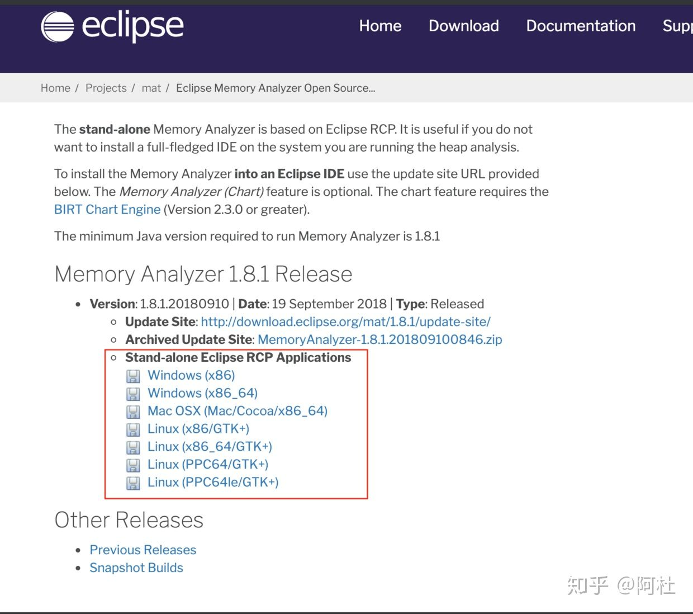

#### **安装遇到的坑**

1. 启动直接报错，系统默认的workspace是只读的，更换掉即可。怎么更换呢，在文件`/Applications/mat.app/Contents/Eclipse/MemoryAnalyzer.ini`中进行修改。

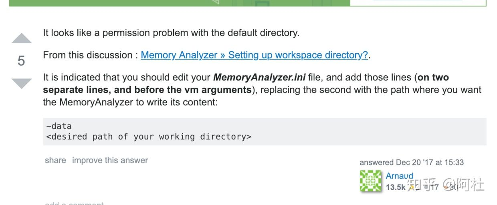

2. 启动后，UI界面没反应，参考：[https://www.eclipse.org/forums/index.php/t/1090889/](https://link.zhihu.com/?target=https%3A//www.eclipse.org/forums/index.php/t/1090889/)，换个包即可。这个问题我遇到过很多次。


### **1.2 mat的设置**

#### **配置mat的堆内存大小**

我的电脑是8C16G的，那理论上分析10G的堆文件没问题，但是MAT默认的配置没有这么大，需要在`/Applications/mat.app/Contents/Eclipse/MemoryAnalyzer.ini`文件中进行修改。如下图所示，我将我的MAT自己的运行时堆内存配置成了6G。


#### **配置MAT的使用**

MAT的配置页面可以从Window——>Preferences找到，如下图所示。


MAT的一般配置有几个选项

1. Keep unreachable objects：如果勾选这个，则在分析的时候会包含dump文件中的不可达对象；
2. Hide the getting started wizard：隐藏分析完成后的首页，控制是否要展示一个对话框，用来展示内存泄漏分析、消耗最多内存的对象排序。
3. Hide popup query help：隐藏弹出查询帮助，除非用户通过F1或Help按钮查询帮助。
4. Hide Welcome screen on launch：隐藏启动时候的欢迎界面
5. Bytes Display：设置分析结果中内存大小的展示单位

可以看出，MAT不仅支持HPROF文件的分析，还支持DTFJ文件的分析。一般sun公司系列的JVM生成的dump文件都是HPROF格式的，IBM的JVM生成的dump文件时DTFJ格式的。

## **二、基本概念**

### **Heap Dump**

Heap Dump是Java进程在某个时刻的内存快照，不同JVM的实现的Heap Dump的文件格式可能不同，进而存储的数据也可能不同，但是一般来说。

Heap Dump中主要包含当生成快照时堆中的java对象和类的信息，主要分为如下几类：

- 对象信息：类名、属性、基础类型和引用类型
- 类信息：类加载器、类名称、超类、静态属性
- gc roots：JVM中的一个定义，进行垃圾收集时，要遍历可达对象的起点节点的集合
- 线程栈和局部变量：快照生成时候的线程调用栈，和每个栈上的局部变量

Heap Dump中没有包含对象的分配信息，因此它不能用来分析这种问题：一个对象什么时候被创建、一个对象时被谁创建的。

### **Shallow vs. Retained Heap**

**Shallow heap**是一个对象本身占用的堆内存大小。一个对象中，每个引用占用8或64位，Integer占用4字节，Long占用8字节等等。

**Retained set**，对于某个对象X来说，它的Retained set指的是——如果X被垃圾收集器回收了，那么这个集合中的对象都会被回收，同理，如果X没有被垃圾收集器回收，那么这个集合中的对象都不会被回收。

**Retained heap**，对象X的Retained heap指的时候它的Retained set中的所有对象的Shallow si的和，换句话说，Retained heap指的是对象X的保留内存大小，即由于它的存活导致多大的内存也没有被回收。

**leading set**，对象X可能不止有一个，这些对象统一构成了leading set。如果leading set中的对象都不可达，那么这个leading set对应的retained set中的对象就会被回收。一般有以下几种情况：

1. 某个类的所有实例对象，这个类对象就是leading object
2. 某个类记载器加载的所有类，以及这些类的实例对象，这个类加载器对象就是leading object
3. 一组对象，要达到其他对象的必经路径上的对象，就是leading object

在下面这张图中，A和B是gc roots中的节点（方法参数、局部变量，或者调用了wait()、notify()或synchronized()的对象）等等。可以看出，E的存在，会导致G无法被回收，因此E的Retained set是E和G；C的存在，会导致E、D、F、G、H都无法被回收，因此C的Retined set是C、E、D、F、G、H；A和B的存在，会导致C、E、D、F、G、H都无法被回收，因此A和B的Retained set是A、B、C、E、D、F、G、H。

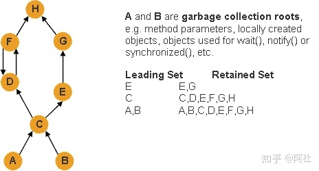


### **Dominator Tree**

MAT根据堆上的对象引用关系构建了支配树（Dominator Tree），通过支配树可以很方便得识别出哪些对象占用了大量的内存，并可以看到它们之间的依赖关系。

如果在对象图中，从gc root或者x上游的一个节点开始遍历，x是y的必经节点，那么就可以说x支配了y（**dominate**）。

如果在对象图中，x支配的所有对象中，y的距离最近，那么就可以说x直接支配（**immediate dominate**）y。

支配树是基于对象的引用关系图建立的，在支配树中每个节点都是它的子节点的直接支配节点。基于支配树可以很清楚得看到对象之间的依赖关系。

现在看个例子，在下面这张图中

1. x节点的子树就是所有被x支配的节点集合，也正式x的retained set；
2. 如果x是y的直接支配节点，那么x的支配节点也可以支配y
3. 支配树中的边跟对象引用图中的引用关系并不是一一对应的。


### **Garbage Collection Roots**

在MAT中，gc roots的概念跟研究垃圾收集算法时候的概念稍微有点不同。gc roots中的对象，是指那些可以从堆外访问到的对象的集合。如果一个对象符合下面这些场景中的一个，就可以被认为是gc roots中的节点：

1. System Class：由bootstrap classloader加载的类，例如rt.jar，里面的类的包名都是`java.util.*`开头的。
2. JNI Local：native代码中的局部变量，例如用户编写的JNI代码或JVM内部代码。
3. JNI Global：native代码中的全局变量，例如用户编写的JNI代码或JVM内部代码。
4. Thread Block：被当前活跃的线程锁引用的对象。
5. Thread：正在存活的线程
6. Busy Monitor：调用了wait()、notify()或synchronized关键字修饰的代码——例如`synchronized(object)`或`synchronized`方法。
7. Java Local：局部变量。例如函数的输入参数、正在运行的线程栈里创建的对象。
8. Native Stack：native代码的输入或输出参数，例如用户定义的JNI代码或JVM的内部代码。在文件/网络IO方法或反射方法的参数。
9. Finalizable：在finalize队列中等待它的finalizer对象运行的对象。
10. Unfinalized：重载了finalize方法，但是还没有进入finalize队列中的对象。
11. Unreachable：从任何gc roots节点都不可达的对象，在MAT中将这些对象视为root节点，如果不这么做，就不能对这些对象进行分析。
12. Java Stack Frame：Java栈帧，用于存放局部变量。只在dump文件被解析的时候会将java stack frame视为对象。
13. Unknown：没有root类型的对象。有些dump文件（例如IBM的Portable Heap Dump）没有root信息。

## **三、获取Dump文件**

1. 通过MAT生成dump文件 通过这个路径找到生成dump文件的对话框


选择一个进程，点击finish即可

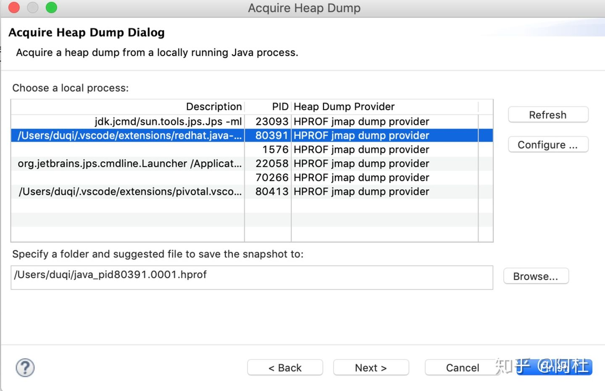


1. 通过jmap命令生成dump文件
   * 命令格式：`jmap -dump:live,format=b,file=heap.bin <pid>`
   * 注意：如果要保留heapdump中的不可达对象，则需要把”:live“去掉，即使用命令`jmap -dump,format=b,file=heap.bin <pid>`

2. 通过设置JVM参数自动生成 使用`-XX:+HeapDumpOnOutOfMemoryError`这个JVM参数，在Java进程运行过程中发生OOM的时候就会生成一个heapdump文件，并写入到指定目录，一般用`-XX:HeapDumpPath=${HOME}/logs/test`来设置。

## **四、欢迎页**

使用MAT打开一个heap dump文件，解析完成后，默认会进入欢迎页，欢迎页里包含了一些常见的分析：最大内存占用分析、常见的分析动作、常用的分析报告、MAT使用教程等等。

我们看下下面这张图，可以看出MAT的主要结构和功能：


1. inspector：透视图，用于展示一个对象的详细信息，例如内存地址、加载器名称、包名、对象名称、对象所属的类的父类、对象所属的类的加载器对象、该对象的堆内存大小和保留大小，gc root信息。
2. inspector窗口的下半部分是展示类的静态属性和值、对象的实例属性和值、对象所属的类的继承结构。
3. Heap Dump History：用于列举最近分析过的文件
4. 常用功能栏，从左到右依次是：概览、类直方图、支配树、OQL查询、线程视图、报告相关、详细功能。其中概览就是在刚解析完后展示的这个页面，详细功能按钮则是提供了一些更细致的分析能力。
5. 概览中的饼图：该饼图用于展示retained size最大的对象
6. 常用的分析动作：类直方图、支配树、按照类和包路径获取消耗资源最多的对象、重名类。
7. 报告相关：Leak Suspects用于查找内存泄漏问题，以及系统概览
8. Components Report：这个功能是一组功能的集合，用于分析某一类性的类的实例的问题，例如分析`java.util.*`开头的类的实例对象的一些使用情况，例如：重复字符串、空集合、集合的使用率、软引用的统计、finalizer的统计、Map集合的碰撞率等等。

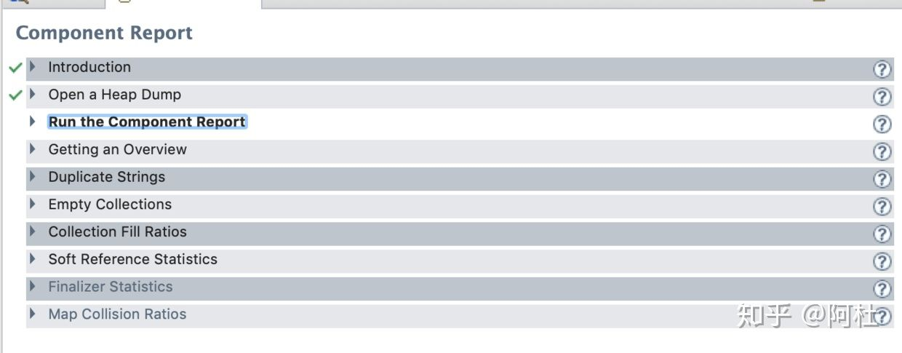


## **五、基本功能**

关于概览页面，我们再上一节已经进行过分析，这里不再赘述。我们在这一小节，将重点放在功能栏那一栏，即类直方图、支配树、OQL查询、线程视图等功能。

### **5.1 类直方图**

堆直方图是从类的角度看哪些类及该类的实例对象占用着内存情况，默认是按照某个类的shallow heap大小从大到小排序。

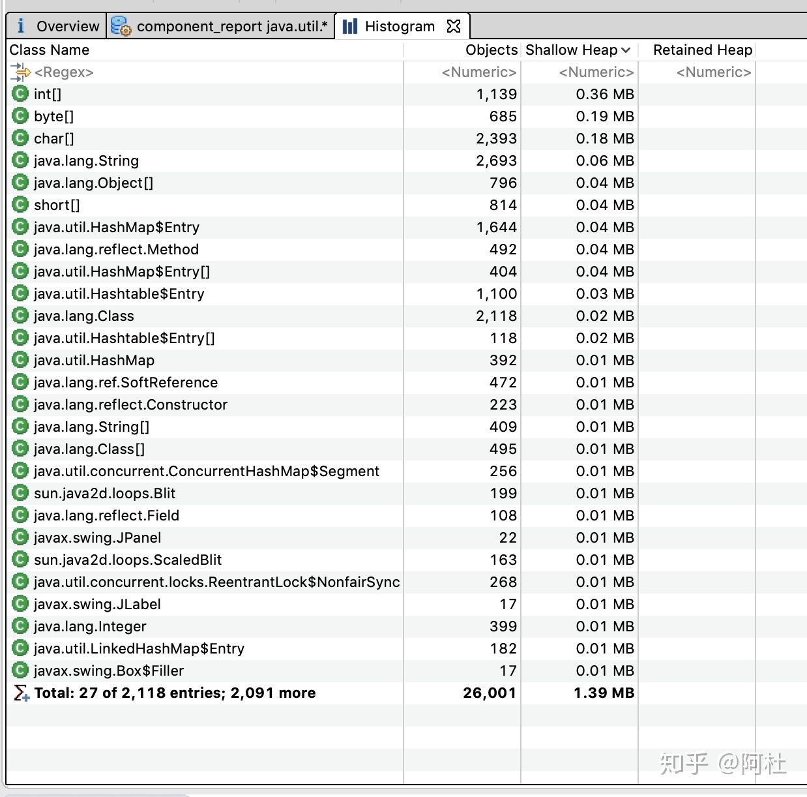

Retained Heap这一列的值是空的，因为对于某个类的所有实例计算总的retained heap非常慢，因此使用者需要按需计算。

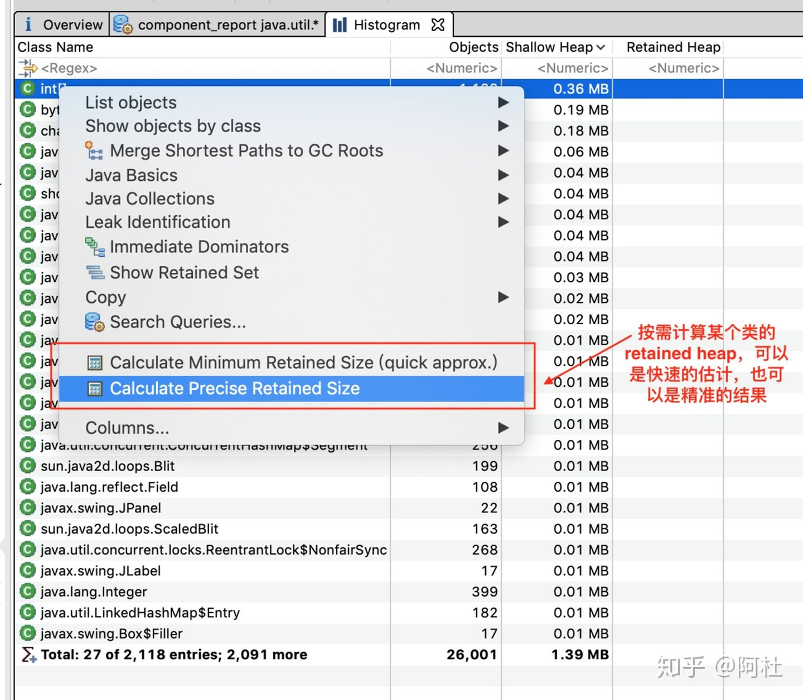

在直方图页面，可以选择某个条目右键进行分析，例如对所有类的对象做一些分析动作。


在直方图页面，还有一个重要的特性——可以选择一些其他维度进行分类分析，例如superclass、class loader、package。

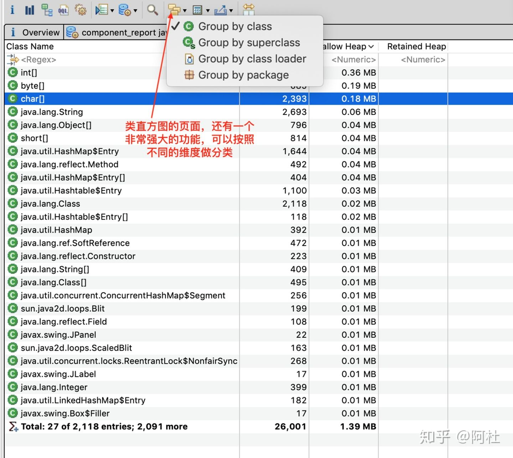

如果选择按照package来分类，则可以看到下面这种视图

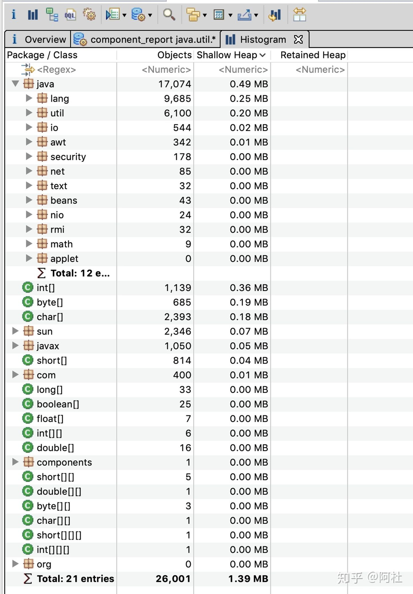


### **5.2 支配树**

支配树可以用于查看heap dump中占用内存最大的对象。在支配树中，对于某一层的节点来说，如果它们的parent节点没有被其他对象引用了，那么这写节点都会被垃圾收集器回收。

支配树可以用来排查是哪些对象导致了其他对象无法被垃圾收集器回收，跟类直方图类似，支配树也从类加载器、package等角度来看。


### **5.3 OQL查询**

MAT提供另一种类似SQL的对象查询语言——OQL，可以用类似SQL语句的方式查询heap dump中的对象。OQL和关系型数据库具备类似的数据模型：将某个类看作是一张表，将该类的实例对象看作是该表中的行，每个对象中的属性看作是构成行的列。

OQL语言的语法结构如下：

```text
SELECT *
FROM [ INSTANCEOF ] <class name="name">
[ WHERE <filter-expression> ]
</filter-expression></class>
```

OQL编辑器分为两个区域：

- 上半部分的区域用于输入查询语句
- 下半部分的区域用于展示查询语句执行的结果

下图是查询当前堆里所有的String对象的语句和结果：


### **5.4 线程视图**


通过上图中的那个按钮，可以查看线程视图，线程视图首先给出了在生成快照那个时刻，JVM中的Java线程对象列表。这个按钮的功能，等同于下图中的这个操作：

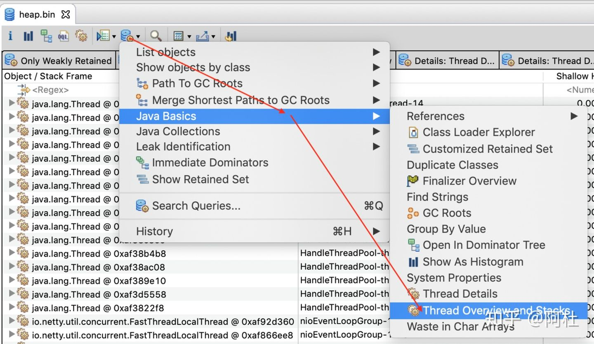

在线程视图这个表中，可以看到以下几个信息：线程对象的名字、线程名、线程对象占用的堆内存大小、线程对象的保留堆内存大小、线程的上下文加载器、是否为守护线程。

选中某个线程对象展开，可以看到线程的调用栈和每个栈的局部变量，通过查看线程的调用栈和局部变量的内存大小，可以找到在哪个调用栈里分配了大量的内存。

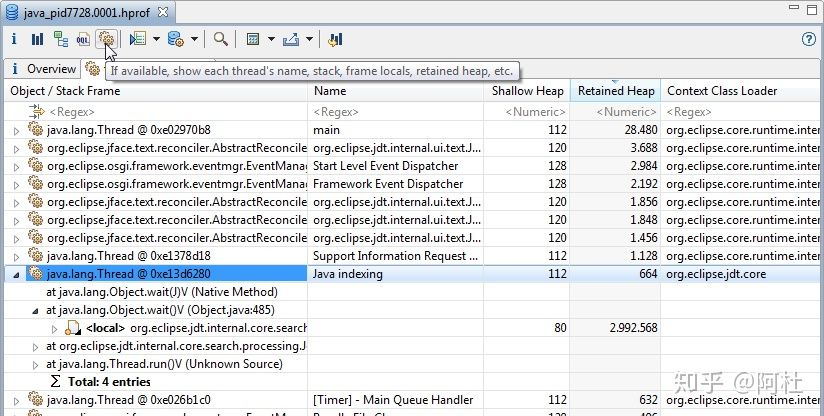

因此，heap dump和MAT不仅仅用于排查内存相关的问题，也有助于排查线程相关的问题。

### **5.5 问题分析**


上图中的这个按钮，是MAT提供的一些常见的问题分析能力。因为这些问题特别常见，所以MAT就提供了对应的组合功能，帮用户快速定位常见问题。

1. Heap Dump Overview Heap Dump Overview就是整个堆的概括情况，例如：堆内存大小、对象个数、类的个数、类加载器的个数、GC root的个数、堆内存文件的格式、文件的创建时间、位置等信息。这个页面还开一个看一些系统属性、线程概览、Top内存耗费组件、类直方图等信息。

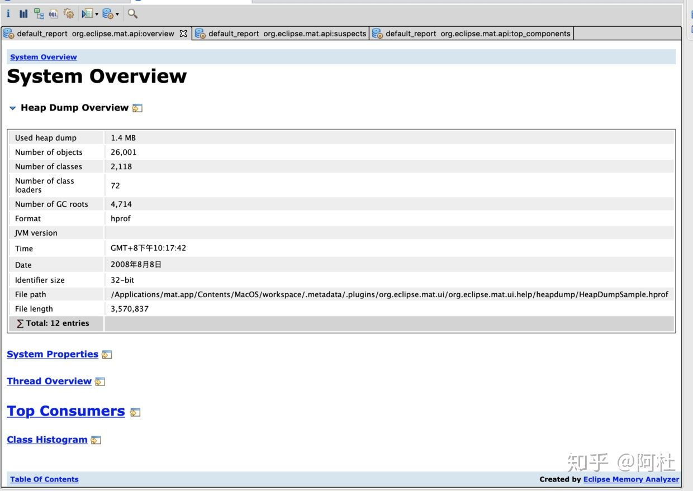

2. Leak Suspects 如下图所示，这个功能用于排查潜在的内存泄漏问题。

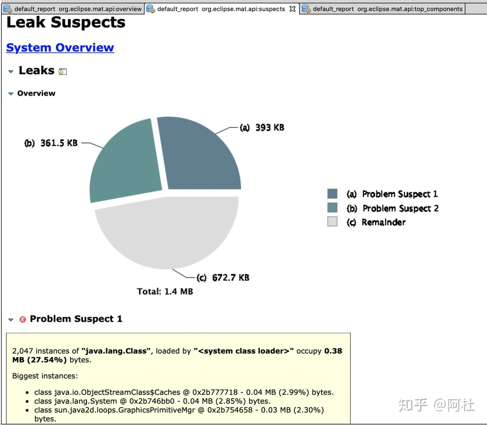

3. Top Components 针对那些占用堆内存超过整个堆内存1%大小的组件做一系列的分析，例如：Top Consumers、保留集合、潜在的内存浪费问题等其他问题。


这一系列的分析，有很多层次，可以用下面这张思维导图理解：

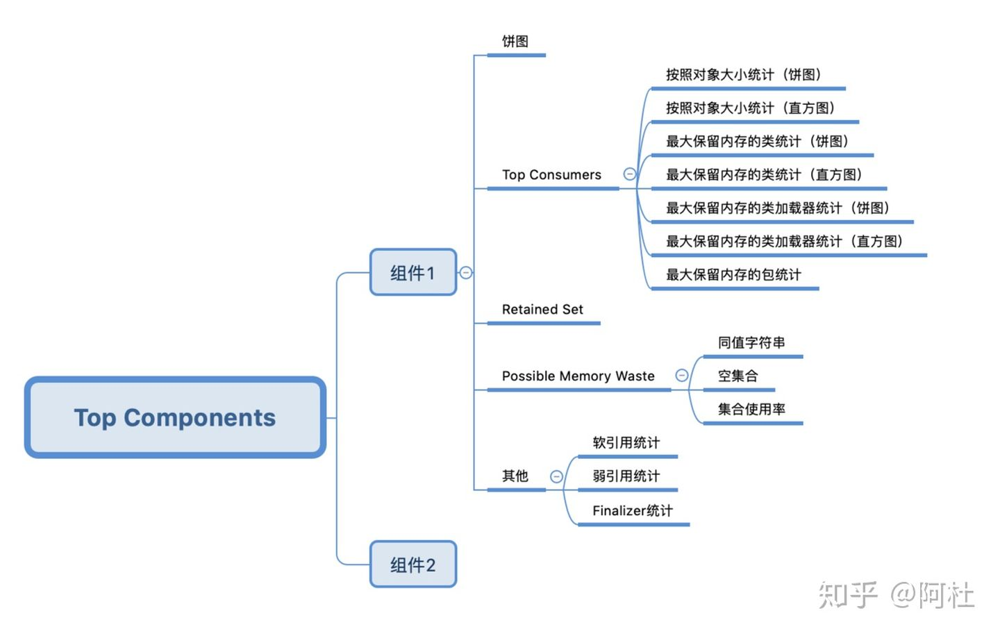


### **5.6 对象查找**

MAT支持根据对象的十六进制地址查找对象的outbound引用视图，如下图所示：

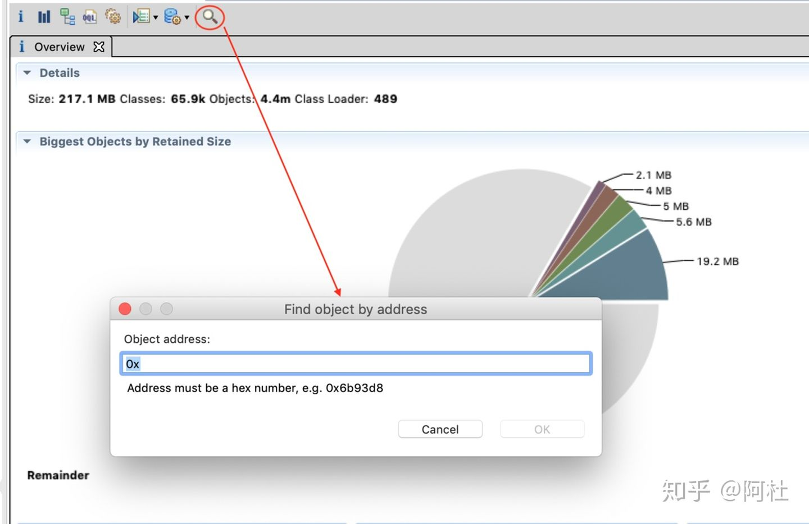

这个功能等同于在直方图中选中某个对象，然后右键列举该对象的outbound引用视图：


## 参考

* https://zhuanlan.zhihu.com/p/56110317
* https://zhuanlan.zhihu.com/p/57347496