<h1 align="center">Gradle 篇 -- Gradle 的基本使用</h1>

[TOC]

[【Android 修炼手册】Gradle 篇 -- Gradle 的基本使用](https://zhuanlan.zhihu.com/p/65249493)

[【Android 修炼手册】Gradle 篇 -- Android Gradle Plugin 插件主要流程](https://zhuanlan.zhihu.com/p/66052867)

[【Android 修炼手册】Gradle 篇 -- Android Gradle Plugin 主要 Task 分析](https://zhuanlan.zhihu.com/p/67049158)

[【Android 修炼手册】Gradle 篇 -- Gradle 源码分析](https://zhuanlan.zhihu.com/p/67842670)

[动画讲解 Gradle 原理](https://link.zhihu.com/?target=https%3A//link.juejin.im/%3Ftarget%3Dhttps%3A%2F%2Fwww.bilibili.com%2Fvideo%2Fav55941638%2F)

## 预备知识

1. 基本的 android 开发知识
2. 了解 Android Studio 基本使用

## 看完本文可以达到什么程度

1. 掌握 gradle 的基本使用
2. 了解 gradle 及 android gradle plugin
3. 了解 gradle 构建阶段及生命周期回调
4. 掌握 Task，Transform 等概念
5. 学会自定义 task，自定义 gradle 插件

如果您已经达到上面的程度，那么可以不用再看下文了，直接看最后的总结即可

本文将从下面几个部分进行讲解：


## 一、gradle 是什么


官方解释是: Gradle is an open-source build automation tool focused on flexibility and performance. Gradle build scripts are written using a Groovy or Kotlin DSL.

可以从三个角度来理解

**1. gradle 是一个自动化构建工具**

gradle 是通过组织一系列 task 来最终完成自动化构建的，所以 task 是 gradle 里最重要的概念

我们以生成一个可用的 apk 为例，整个过程要经过 资源的处理，javac 编译，dex 打包，apk 打包，签名等等步骤，每个步骤就对应到 gradle 里的一个 task

gradle 可以类比做一条流水线，task 可以比作流水线上的机器人，每个机器人负责不同的事情，最终生成完整的构建产物

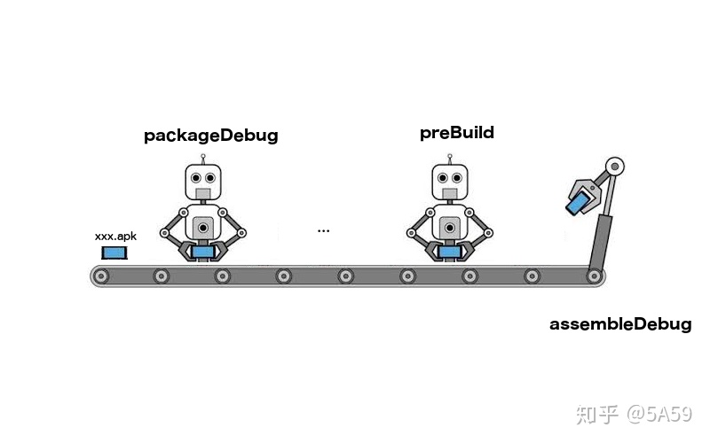

**2. gradle 脚本使用了 groovy 或者 kotlin DSL**

gradle 使用 groovy 或者 kotlin 编写，不过目前还是 groovy 居多

那什么是 DSL 呢？DSL 也就是 Domain Specific Language 的简称，是为了解决某一类任务专门设计的计算机语言

DSL 相对应的是 GPL (General-Purpose Language)，比如 java

与 GPL 相比起来，DSL 使用简单，定义比较简洁，比起配置文件，DSL 又可以实现语言逻辑

对 gradle 脚本来说，他实现了简洁的定义，又有充分的语言逻辑，以 android {} 为例，这本身是一个函数调用，参数是一个闭包，但是这种定义方式明显要简洁很多

**3. gradle 基于 groovy 编写，而 groovy 是基于 jvm 语言**

gradle 使用 groovy 编写，groovy 是基于 jvm 的语言，所以本质上是面向对象的语言，面向对象语言的特点就是一切皆对象，所以，在 gradle 里，.gradle 脚本的本质就是类的定义，一些配置项的本质都是方法调用，参数是后面的 {} 闭包

比如 build.gradle 对应 Project 类，buildScript 对应 Project.buildScript 方法

## 二、gradle 项目分析


关于 gradle 的项目层次，我们新建一个项目看一下，项目地址在[EasyGradle](https://link.zhihu.com/?target=https%3A//github.com/5A59/android-training/blob/master/gradle/EasyGradle)

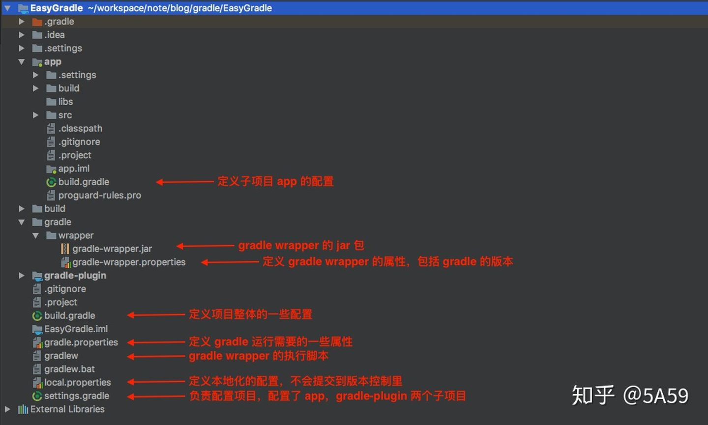

### 2.1 settings.gradle

settings.gradle 是负责配置项目的脚本
对应 [Settings](https://link.zhihu.com/?target=https%3A//github.com/gradle/gradle/blob/v4.1.0/subprojects/core/src/main/java/org/gradle/api/initialization/Settings.java) 类，gradle 构建过程中，会根据 settings.gradle 生成 Settings 的对象
对应的可调用的方法在[文档](https://link.zhihu.com/?target=https%3A//docs.gradle.org/current/dsl/org.gradle.api.initialization.Settings.html)里可以查找
其中几个主要的方法有:

- include(projectPaths)
- includeFlat(projectNames)
- project(projectDir)

一般在项目里见到的引用子模块的方法，就是使用 include，这样引用，子模块位于根项目的下一级

```text
include ':app'
```

如果想指定子模块的位置，可以使用 project 方法获取 Project 对象，设置其 projectDir 参数

```text
include ':app'
project(':app').projectDir = new File('./app')
```

### 2.2 rootproject/build.gradle

build.gradle 负责整体项目的一些配置，对应的是 [Project](https://link.zhihu.com/?target=https%3A//github.com/gradle/gradle/blob/v4.1.0/subprojects/core/src/main/java/org/gradle/api/Project.java) 类
gradle 构建的时候，会根据 build.gradle 生成 Project 对象，所以在 build.gradle 里写的 dsl，其实都是 Project 接口的一些方法，Project 其实是一个接口，真正的实现类是 [DefaultProject](https://link.zhihu.com/?target=https%3A//github.com/gradle/gradle/blob/v4.1.0/subprojects/core/src/main/java/org/gradle/api/internal/project/DefaultProject.java)
build.gradle 里可以调用的方法在 [Project](https://link.zhihu.com/?target=https%3A//docs.gradle.org/current/dsl/org.gradle.api.Project.html) 可以查到
其中几个主要方法有：

- buildscript // 配置脚本的 classpath
- allprojects // 配置项目及其子项目
- respositories // 配置仓库地址，后面的依赖都会去这里配置的地址查找
- dependencies // 配置项目的依赖

以 EasyGradle 项目来看

```groovy
buildscript { // 配置项目的 classpath
    repositories {  // 项目的仓库地址，会按顺序依次查找
        google()
        jcenter()
        mavenLocal()
    }
    dependencies { // 项目的依赖
        classpath 'com.android.tools.build:gradle:3.0.1'
        classpath 'com.zy.plugin:myplugin:0.0.1'
    }
}

allprojects { // 子项目的配置
    repositories {
        google()
        jcenter()
        mavenLocal()
    }
}
```

### 2.3 module/build.gradle

build.gradle 是子项目的配置，对应的也是 Project 类
子项目和根项目的配置是差不多的，不过在子项目里可以看到有一个明显的区别，就是引用了一个插件 apply plugin "com.android.application"，后面的 android dsl 就是 application 插件的 extension，关于 android plugin dsl 可以看 [android-gradle-dsl](https://link.zhihu.com/?target=http%3A//google.github.io/android-gradle-dsl/current/)
其中几个主要方法有：

- compileSdkVersion // 指定编译需要的 sdk 版本
- defaultConfig // 指定默认的属性，会运用到所有的 variants 上
- buildTypes // 一些编译属性可以在这里配置，可配置的所有属性在 [这里](https://link.zhihu.com/?target=http%3A//google.github.io/android-gradle-dsl/current/com.android.build.gradle.internal.dsl.BuildType.html)
- productFlavor // 配置项目的 flavor

以 app 模块的 build.gradle 来看

```groovy
apply plugin: 'com.android.application' // 引入 android gradle 插件

android { // 配置 android gradle plugin 需要的内容
    compileSdkVersion 26
    defaultConfig { // 版本，applicationId 等配置
        applicationId "com.zy.easygradle"
        minSdkVersion 19
        targetSdkVersion 26
        versionCode 1
        versionName "1.0"
    }
    buildTypes { 
        release {
            minifyEnabled false
            proguardFiles getDefaultProguardFile('proguard-android.txt'), 'proguard-rules.pro'
        }
    }
    compileOptions { // 指定 java 版本
        sourceCompatibility 1.8
        targetCompatibility 1.8
    }

    // flavor 相关配置
    flavorDimensions "size", "color"
    productFlavors {
        big {
            dimension "size"
        }
        small {
            dimension "size"
        }
        blue {
            dimension "color"
        }
        red {
            dimension "color"
        }
    }
}

// 项目需要的依赖
dependencies {
    implementation fileTree(dir: 'libs', include: ['*.jar']) // jar 包依赖
    implementation 'com.android.support:appcompat-v7:26.1.0' // 远程仓库依赖
    implementation 'com.android.support.constraint:constraint-layout:1.1.3'
    implementation project(':module1') // 项目依赖
}
```

### 2.4 依赖

在 gradle 3.4 里引入了新的依赖配置，如下：


还是以 EasyGradle 为例，看一下各个依赖的不同： 项目里有三个模块：app，module1， module2

模块 app 中有一个类 ModuleApi

模块 module1 中有一个类 Module1Api

模块 module2 中有一个类 Module2Api

其依赖关系如下：

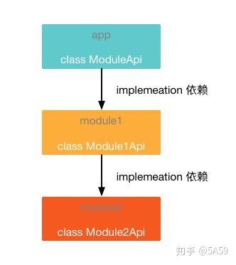

**implementation 依赖**

当 module1 使用 implementation 依赖 module2 时，在 app 模块中无法引用到 Module2Api 类

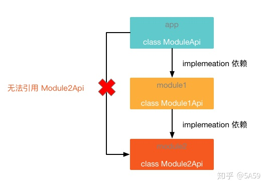

**api 依赖**

当 module1 使用 api 依赖 module2 时，在 app 模块中可以正常引用到 Module2Api 类，如下图

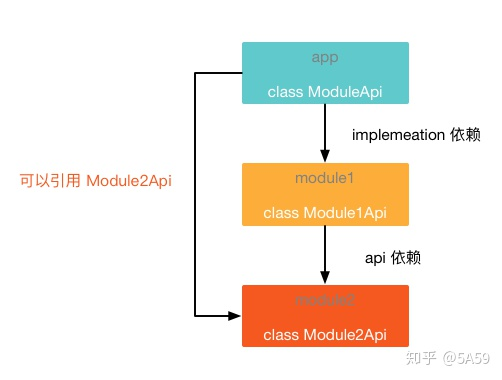

**compileOnly 依赖**

当 module1 使用 compileOnly 依赖 module2 时，在编译阶段 app 模块无法引用到 Module2Api 类，module1 中正常引用，但是在运行时会报错

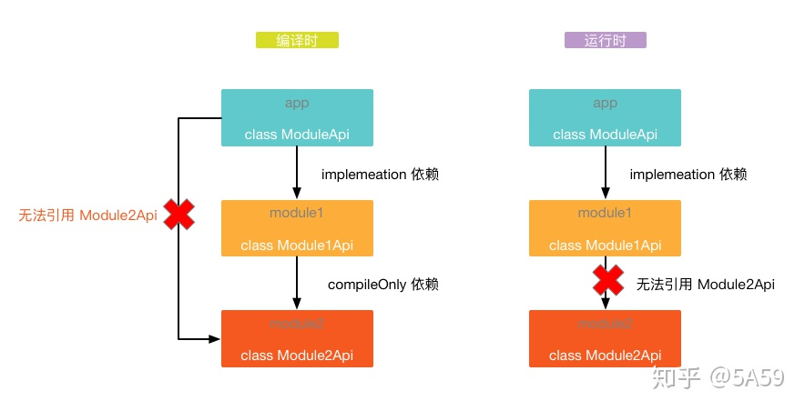

反编译打包好的 apk，可以看到 Module2Api 是没有被打包到 apk 里的

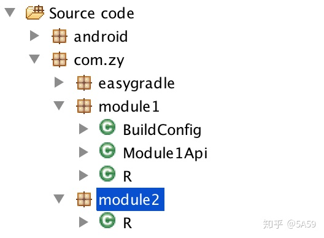

**runtimeOnly 依赖**

当 module1 使用 runtimeOnly 依赖 module2 时，在编译阶段，module1 也无法引用到 Module2Api

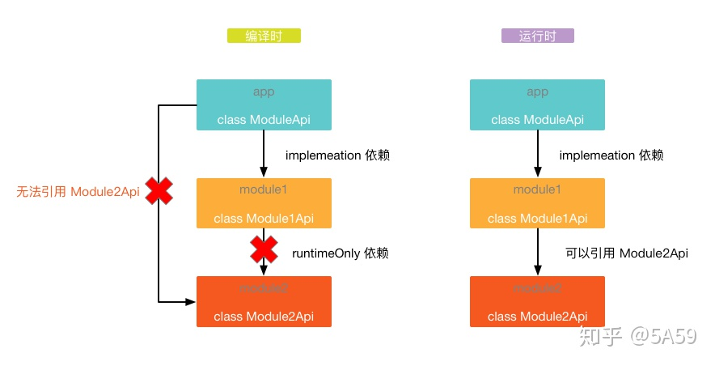

### 2.5 flavor

在介绍下面的流程之前，先明确几个概念，flavor，dimension，variant
在 android gradle plugin 3.x 之后，每个 flavor 必须对应一个 dimension，可以理解为 flavor 的分组，然后不同 dimension 里的 flavor 两两组合形成一个 variant
举个例子 如下配置:

```groovy
flavorDimensions "size", "color"

productFlavors {
    big {
        dimension "size"
    }
    small {
        dimension "size"
    }
    blue {
        dimension "color"
    }
    red {
        dimension "color"
    }
}
```

那么生成的 variant 对应的就是 bigBlue，bigRed，smallBlue，smallRed

每个 variant 可以对应的使用 variantImplementation 来引入特定的依赖，比如：bigBlueImplementation，只有在 编译 bigBlue variant的时候才会引入

## 三、gradle wrapper


**gradlew / gradlew.bat** 这个文件用来下载特定版本的 gradle 然后执行的，就不需要开发者在本地再安装 gradle 了。这样做有什么好处呢？开发者在本地安装 gradle，会碰到的问题是不同项目使用不同版本的 gradle 怎么处理，用 wrapper 就很好的解决了这个问题，可以在不同项目里使用不同的 gradle 版本。gradle wrapper 一般下载在 GRADLE_CACHE/wrapper/dists 目录下

**gradle/wrapper/gradle-wrapper.properties** 是一些 gradlewrapper 的配置，其中用的比较多的就是 distributionUrl，可以执行 gradle 的下载地址和版本

**gradle/wrapper/gradle-wrapper.jar** 是 gradlewrapper 运行需要的依赖包

## 四、gradle init.gradle


在 gradle 里，有一种 init.gradle 比较特殊，这种脚本会在每个项目 build 之前先被调用，可以在其中做一些整体的初始化操作，比如配置 log 输出等等
使用 init.gradle 的方法：

1. 通过 --init-script 指定 init.gradle 位置 eg: gradlew --init-script initdir/init.gradle
2. init.gradle 文件放在 USER_HOME/.gradle/ 目录下
3. .gradle 脚本放在 USER_HOME/.gradle/init.d/ 目录下
4. .gradle 脚本放在 GRDALE_HOME/init.d/ 目录下

## 五、gradle 生命周期及回调


gradle 构建分为三个阶段

**初始化阶段**
初始化阶段主要做的事情是有哪些项目需要被构建，然后为对应的项目创建 Project 对象

**配置阶段**
配置阶段主要做的事情是对上一步创建的项目进行配置，这时候会执行 build.gradle 脚本，并且会生成要执行的 task

**执行阶段**
执行阶段主要做的事情就是执行 task，进行主要的构建工作

gradle 在构建过程中，会提供一些列回调接口，方便在不同的阶段做一些事情，主要的接口有下面几个

```groovy
gradle.addBuildListener(new BuildListener() {
    @Override
    void buildStarted(Gradle gradle) {
        println('构建开始')
        // 这个回调一般不会调用，因为我们注册的时机太晚，注册的时候构建已经开始了，是 gradle 内部使用的
    }

    @Override
    void settingsEvaluated(Settings settings) {
        println('settings 文件解析完成')
    }

    @Override
    void projectsLoaded(Gradle gradle) {
        println('项目加载完成')
        gradle.rootProject.subprojects.each { pro ->
            pro.beforeEvaluate {
                println("${pro.name} 项目配置之前调用")
            }
            pro.afterEvaluate{
                println("${pro.name} 项目配置之后调用")
            }
        }
    }

    @Override
    void projectsEvaluated(Gradle gradle) {
        println('项目解析完成')
    }

    @Override
    void buildFinished(BuildResult result) {
        println('构建完成')
    }
})

gradle.taskGraph.whenReady {
    println("task 图构建完成")
}
gradle.taskGraph.beforeTask {
    println("每个 task 执行前会调这个接口")
}
gradle.taskGraph.afterTask {
    println("每个 task 执行完成会调这个接口")
}
```

## 六、自定义 task


默认创建的 task 继承自 DefaultTask 如何声明一个 task

```groovy
task myTask {
    println 'myTask in configuration'
    doLast {
        println 'myTask in run'
    }
}

class MyTask extends DefaultTask {
    @Input Boolean myInputs
    @Output 
    @TaskAction
    void start() {
    }
}

tasks.create("mytask").doLast {
}
```

Task 的一些重要方法分类如下：

- Task 行为
  Task.doFirst
  Task.doLast
- Task 依赖顺序
  Task.dependsOn
  Task.mustRunAfter
  Task.shouldRunAfter
  Task.finalizedBy
- Task 的分组描述
  Task.group
  Task.description
- Task 是否可用
  Task.enabled
- Task 输入输出
  gradle 会比较 task 的 inputs 和 outputs 来决定 task 是否是最新的，如果 inputs 和 outputs 没有变化，则认为 task 是最新的，task 就会跳过不执行
  Task.inputs
  Task.outputs
- Task 是否执行
  可以通过指定 Task.upToDateWhen = false 来强制 task 执行 Task.upToDateWhen

比如要指定 Task 之间的依赖顺序，写法如下：

```groovy
task task1 {
    doLast {
        println('task2')
    }
}
task task2 {
    doLast {
        println('task2')
    }
}
task1.finalizedBy(task2)
task1.dependsOn(task2)
task1.mustRunAfter(task2)
task1.shouldRunAfter(task2)
task1.finalizedBy(task2)
```

## 七、Android transform


android gradle plugin 提供了 transform api 用来在 .class to dex 过程中对 class 进行处理，可以理解为一种特殊的 Task，因为 transform 最终也会转化为 Task 去执行

要实现 transform 需要继承 com.android.build.api.transform.Transform 并实现其方法，实现了 Transform 以后，要想应用，就调用 project.android.registerTransform()

```groovy
public class MyTransform extends Transform {
    @Override
    public String getName() {
        // 返回 transform 的名称，最终的名称会是 transformClassesWithMyTransformForDebug 这种形式   
        return "MyTransform";
    }

    @Override
    public Set<QualifiedContent.ContentType> getInputTypes() {
        /**
        返回需要处理的数据类型 有 下面几种类型可选
        public static final Set<ContentType> CONTENT_CLASS = ImmutableSet.of(CLASSES);
        public static final Set<ContentType> CONTENT_JARS = ImmutableSet.of(CLASSES, RESOURCES);
        public static final Set<ContentType> CONTENT_RESOURCES = ImmutableSet.of(RESOURCES);
        public static final Set<ContentType> CONTENT_NATIVE_LIBS = ImmutableSet.of(NATIVE_LIBS);
        public static final Set<ContentType> CONTENT_DEX = ImmutableSet.of(ExtendedContentType.DEX);
        public static final Set<ContentType> DATA_BINDING_ARTIFACT = ImmutableSet.of(ExtendedContentType.DATA_BINDING);
        */
        return TransformManager.CONTENT_CLASS;
    }

    @Override
    public Set<? super QualifiedContent.Scope> getScopes() {
        /**
        返回需要处理内容的范围，有下面几种类型
        PROJECT(1), 只处理项目的内容
        SUB_PROJECTS(4), 只处理子项目
        EXTERNAL_LIBRARIES(16), 只处理外部库
        TESTED_CODE(32), 只处理当前 variant 对应的测试代码
        PROVIDED_ONLY(64), 处理依赖
        @Deprecated
        PROJECT_LOCAL_DEPS(2),
        @Deprecated
        SUB_PROJECTS_LOCAL_DEPS(8);
        */
        return Sets.immutableEnumSet(QualifiedContent.Scope.PROJECT);
    }

    @Override
    public boolean isIncremental() {
        // 是否增量，如果返回 true，TransformInput 会包括一份修改的文件列表，返回 false，会进行全量编译，删除上一次的输出内容
        return false;
    }

    @Override
    void transform(TransformInvocation transformInvocation) throws TransformException, InterruptedException, IOException {
        // 在这里处理 class
        super.transform(transformInvocation)
        // 在 transform 里，如果没有任何修改，也要把 input 的内容输出到 output，否则会报错
        for (TransformInput input : transformInvocation.inputs) {
            input.directoryInputs.each { dir ->
                // 获取对应的输出目录
                File output = transformInvocation.outputProvider.getContentLocation(dir.name, dir.contentTypes, dir.scopes, Format.DIRECTORY)
                dir.changedFiles // 增量模式下修改的文件
                dir.file // 获取输入的目录
                FileUtils.copyDirectory(dir.file, output) // input 内容输出到 output
            }
            input.jarInputs.each { jar ->
                // 获取对应的输出 jar
                File output = transformInvocation.outputProvider.getContentLocation(jar.name, jar.contentTypes, jar.scopes, Format.JAR)
                jar.file // 获取输入的 jar 文件
                FileUtils.copyFile(jar.file, output) // input 内容输出到 output
            }
        }
    }
}

// 注册 transform
android.registerTransform(new MyTransform())
```

在 transform 中的处理，一般会涉及到 class 文件的修改，操纵字节码的工具一般是 javasist 和 asm 居多，这两个工具在这里先不介绍了。后面有机会会展开说一下

## 八、自己写 plugin


gradle 的插件可以看作是一系列 task 的集合
在 android 工程的 build.gradle 脚本里，第一行就是 apply plugin: 'com.android.application'，这个就是引入 android gradle 插件，插件里有 android 打包相关的 task
关于 android gradle plugin 的源码分析，在后面会讲到，现在先看看如何实现一个自己的 plugin

### 8.1 初始化工程

1. 在 android studio 中创建一个 java module

\2. 在 src/main 目录下创建 groovy 目录，然后创建自己的包名和插件类

\3. 在 src/main 目录下创建 resources/META-INFO/gradle-plugins 目录，创建 ,myplugin.properties 文件，文件里内容是

```groovy
implementation-class=com.zy.plugin.MyPlugin // 这里是自己的插件类
```

\4. 修改 build.gradle 文件

```groovy
// 引入 groovy 和 java 插件
apply plugin: 'groovy'
apply plugin: 'java'

buildscript {
    repositories {
        mavenLocal()
        maven { url 'http://depot.sankuai.com/nexus/content/groups/public/' }
        maven { url 'https://maven.google.com' }
        jcenter()
    }
}

repositories {
    mavenLocal()
    maven {
        url "http://mvn.dianpingoa.com/android-nova"
    }
    maven {
        url 'http://depot.sankuai.com/nexus/content/groups/public/'
    }
    maven { url 'https://maven.google.com' }
}

dependencies {
    compile gradleApi()
    compile localGroovy()
    compile 'com.android.tools.build:gradle:3.0.1'
}
```

现在为止，项目结构是这个样子的

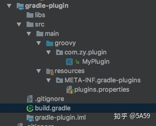

### 8.2 创建 Plugin

在刚才创建的插件类里，就可以写插件的代码了。插件类继承 Plugin，并实现 apply 接口，apply 就是在 build.gradle 里 apply plugin 'xxx' 的时候要调用的接口了
插件开发可以使用 groovy 和 java，使用 groovy 的话可以有更多的语法糖，开发起来更方便一些

```groovy
package com.zy.plugin

import org.gradle.api.Plugin
import org.gradle.api.Project

class MyPlugin implements Plugin<Project> {

    @Override
    void apply(Project project) {
        println("apply my plugin")
    }
}
```

### 8.3 创建插件的 task

我们再定义一个 task 类 MyTask，继承自 DefaultTask，简单的输出一些信息

```groovy
package com.zy.plugin

import org.gradle.api.DefaultTask
import org.gradle.api.tasks.TaskAction

class MyTask extends DefaultTask {

    @TaskAction
    void action() {
        println('my task run')
    }
}
```

然后在 plugin 中注册这个 task

```groovy
class MyPlugin implements Plugin<Project> {

    @Override
    void apply(Project project) {
        println("apply my plugin")
        project.tasks.create("mytask", MyTask.class)
    }
}
```

### 8.4 本地安装插件

这样一个简单的插件就开发好了，如何使用呢
我们首先需要在 build.gradle 中引入 maven 插件，并且配置 install 相关的属性

```groovy
apply plugin: 'maven'

install {
    repositories.mavenInstaller {
        pom.version = '0.0.1' // 配置插件版本号
        pom.artifactId = 'myplugin' // 配置插件标识
        pom.groupId = 'com.zy.plugin' // 配置插件组织
    }
}
```

之后执行 ./gradlew install 便会把插件安装在本地 maven 仓库

之后在使用的地方引入我们插件的 classpath

```groovy
classpath 'com.zy.plugin:myplugin:0.0.1'
```

之后加载插件

```groovy
apply plugin; 'myplugin' // 这里的 myplugin 是前面说的 myplugin.properties 的名字
```

然后运行 ./gradlew tasks --all | grep mytask，就可以看到我们在 plugin 里新增的 task 了
./gradlew mytasks 就可以执行 task 了

### 8.5 打包发布

在插件 build.gradle 里新增上传的配置如下

```groovy
uploadArchives {
    repositories {
        mavenDeployer {
            repository(url: "mavenUrl")
            pom.version = '0.0.1'
            pom.artifactId = 'myplugin'
        }
    }
}
```

运行 ./gradlew uploadArchives 就可以了

### 8.6 调试插件

那么开发插件的时候如何调试呢？
1.首先在 as 中新增一个 remote 配置


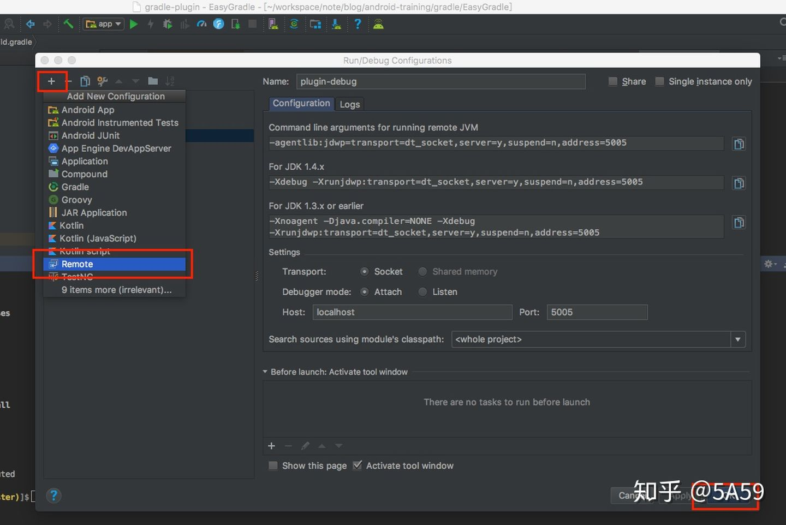

2.之后在执行 task 的时候增加下面的参数

```text
./gradlew app:mytask -Dorg.gradle.debug=true
```

此时可以看到 gradle 在等待 debug 进程连接


3.之后在插件代码中打好断点，在 as 中点击 debug 按钮，就可以调试插件代码了

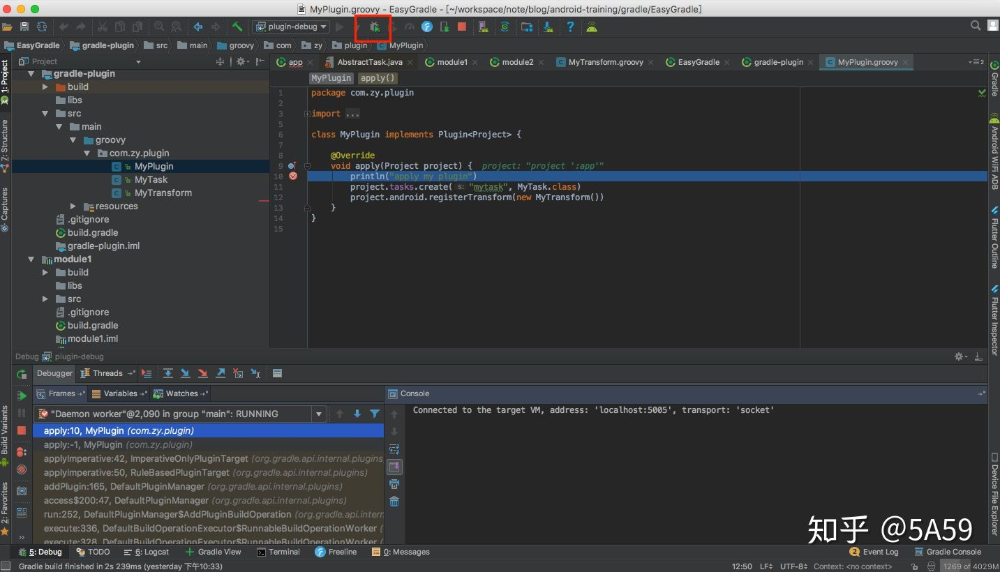

## 九、重点总结


其中一定要掌握的如下：

1. gradle dsl 查询地址 [https://docs.gradle.org/current/dsl/index.html](https://link.zhihu.com/?target=https%3A//docs.gradle.org/current/dsl/index.html)
2. android gradle plugin dsl 查询地址 [http://google.github.io/android-gradle-dsl/current/](https://link.zhihu.com/?target=http%3A//google.github.io/android-gradle-dsl/current/)
3. gradle 构建生命周期和回调
4. implementation / api
5. flavor
6. 自定义 Task
7. 自定义 Transform 和 自定义插件可以作为扩展内容

## 来源

[Gradle 篇 -- Gradle 的基本使用](https://zhuanlan.zhihu.com/p/65249493)