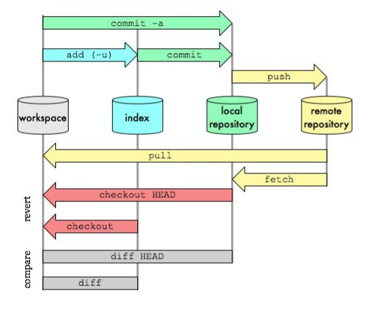

# Gerrit常用命令

参考：[代码检视工具Gerrit的日常使用](https://www.jianshu.com/p/b77fd16894b6)

## 命令
Push一个Commit到Gerrit指定分支：
```
$ git commit
$ git push origin HEAD:refs/for/developer
```

直接Push一个commit到Git仓库:(我们默认配置成不允许)
```
$ git commit
$ git push origin HEAD:master
```

## 一些概念

* Change 
    
    一个Change包含一个Change-Id，这个Id就是通过我们拉取代码库的时候所拷贝的hooks（hooks/commit-msg）自动生成的。
    包含一个或多个Patch Set，以及诸如Owner，Project，Target branch,Comments等信息。

* Change-Id
 
    Change-Id是一串SHA-1字符串。有hooks自动生成在我们的commit message下面：
    ```
    Feature:Music play.
    BugId:/
    Description:Music play.
    
    Change-Id: I3d087f04d9d94bfaa93b8609b988b300af537497
    ```

    在一个project的每个branch中Change Id是唯一的。

* Patch Set
 
    一个Patch Set就是一次commit，Gerrit会将其生成一个Branch暂存。Change中的每提交一个Patch Set表示这个Change的一个新的版本，自动覆盖前一个Patch Set， 默认情况下，仅最后一个Patch Set是有意义的。Code Review通过时，也仅仅是最后一个Patch Set会合并到指定的branch中


## 开发代码提交

A． 需要进行代码提交时，git status查看代码修改情况是否正确

B． git add –A将所有修改文件加入缓存区

C． git commit生成一条提交，在弹出的窗口中写入 i，然后写注释

D． 退出编辑注释步骤：Esc > : > wq

E． 消息git log 查看是否提交成功，提交是否产生changes-ID

F． git fetch --all 将远程代码同步到本地

G． git rebase 将远程代码对应分支与当前分支代码合并

H． 出现合入冲突，需要手动解决冲突后，执行

    git add –A 和 git rebase –continue

I． git log 查看提交是否合入成功

J． git push origin HEAD:refs/for/分支名称 将本地提交上传服务器，等待审核

注意：每次上传代码前，必须执行同步远程代码的步骤，否则会导致无法合入代码。

 

提交命令补充：

    git reset <单号>   取消提交单

    git push origin HEAD:refs/for/<分支名称> 快捷输入方式：

    Ctrl+R 然后输入git p   然后按Tab

 

追加代码到未审核的代码块里(合并到上一次提交的change-id
中),如果之前提交的代码已被审核则无法追加：

1、 git commit –amend

2、 git push origin HEAD:refs/for/分支名

 

## 更新本地后台代码

A、 查看状态是否被更改 git status

B、 若被更改则 git add -A

C、 然后重置（撤销）本地代码更改 git reset --hard

D、 更新分支 git fetch --all

E、 合并到本地代码 git rebase


## git工作流

