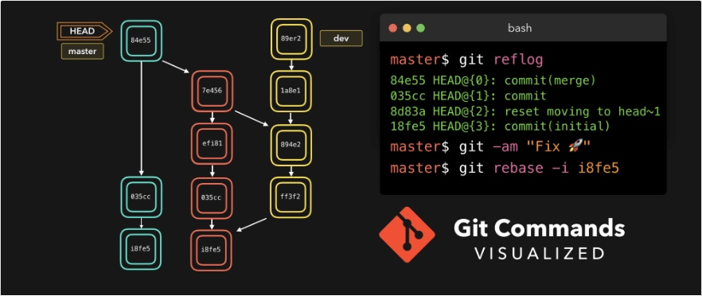
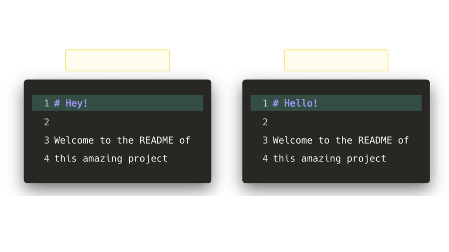
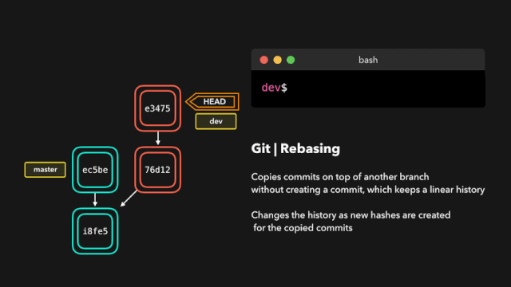
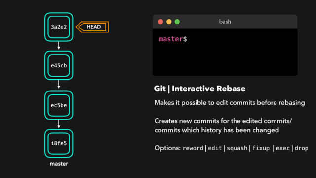
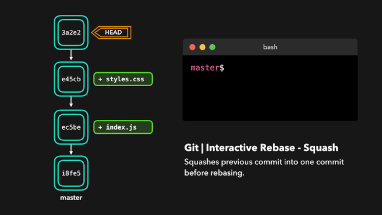
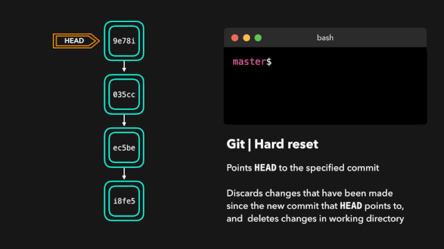
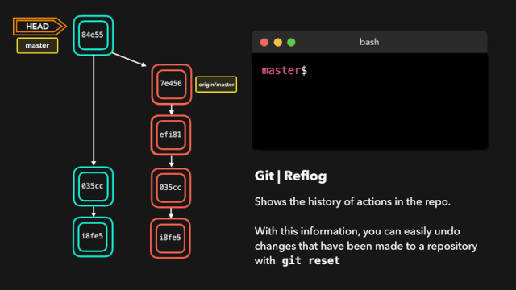

<h1 align="center">Git十大常用命令图示</h1>

[toc]

## Git十大常用命令图示

>git merge、git rebase、git reset、git revert、git fetch、git pull、git reflog……你知道这些 git 命令执行的究竟是什么任务吗？如果你还有些分不清楚，那千万不能错过这篇文章。在本文中，熟知 JavaScript、TypeScript、GraphQL、Serverless、AWS、Docker 和 Golang 的 21 岁年轻软件顾问 Lydia Hallie 通过动图形式直观地介绍了这些常用 git 命令的工作过程，包你过目不忘。

尽管 Git 是一款非常强大的工具，但如果我说 Git 用起来简直是噩梦，大多数人也会认同我的说法。我发现在使用 Git 时，在头脑里可视化地想象它会非常有用：当我执行一个特定命令时，这些分支会如何交互，又会怎样影响历史记录？为什么当我在 master 上执行硬重启，force push 到原分支以及 rimraf 我们的 .git 文件夹时，我的同事哭了？

我觉得创建一些最常用且最有用的 Git 命令的可视化示例会是一个完美的用例！下面我将介绍的很多命令都有可选参数——你可以使用这些参数来改变对应命令的行为。而我的示例只会涵盖命令的默认行为，而不会添加（或添加太多）可选配置！

本文作者Lydia Hallie。

### 合并

拥有多个分支是很方便的，这样可以将不同的新修改互相隔离开，而且还能确保你不会意外地向生产代码推送未经许可或破损的代码修改。但一旦这些修改得到了批准许可，我们就需要将其部署到我们的生产分支中！

可将一个分支的修改融入到另一个分支的一种方式是执行 git merge。Git 可执行两种类型的合并：fast-forward 和 no-fast-forward。现在你可能分不清，但我们马上就来看看它们的差异所在。

**Fast-forward (—ff)**

在当前分支相比于我们要合并的分支没有额外的提交（commit）时，可以执行 fast-forward 合并。Git 很懒，首先会尝试执行最简单的选项：fast-forward！这类合并不会创建新的提交，而是会将我们正在合并的分支上的提交直接合并到当前分支。

完美！现在，我们在 dev 分支上所做的所有改变都合并到了 master 分支上。那么 no-fast-forward 又是什么意思呢？

**No-fast-foward (—no-ff)**

如果你的当前分支相比于你想要合并的分支没有任何提交，那当然很好，但很遗憾现实情况很少如此！如果我们在当前分支上提交我们想要合并的分支不具备的改变，那么 git 将会执行 no-fast-forward 合并。

使用 no-fast-forward 合并时，Git 会在当前活动分支上创建新的 merging commit。这个提交的父提交（parent commit）即指向这个活动分支，也指向我们想要合并的分支！

没什么大不了的，完美的合并！现在，我们在 dev 分支上所做的所有改变都合并到了 master 分支上。

### 合并冲突

尽管 Git 能够很好地决定如何合并分支以及如何向文件添加修改，但它并不总是能完全自己做决定。当我们想要合并的两个分支的同一文件中的同一行代码上有不同的修改，或者一个分支删除了一个文件而另一个分支修改了这个文件时，Git 就不知道如何取舍了。

在这样的情况下，Git 会询问你想要保留哪种选择？假设在这两个分支中，我们都编辑了 README.md 的第一行。

如果我们想把 dev 合并到 master，就会出现一个合并冲突：你想要标题是 Hello! 还是 Hey!？

当尝试合并这些分支时，Git 会向你展示冲突出现的位置。我们可以手动移除我们不想保留的修改，保存这些修改，再次添加这个已修改的文件，然后提交这些修改。

完成！尽管合并冲突往往很让人厌烦，但这是合理的：Git 不应该瞎猜我们想要保留哪些修改。

### 变基（Rebasing）

我们刚看到可通过执行 git merge 将一个分支的修改应用到另一个分支。另一种可将一个分支的修改融入到另一个分支的方式是执行 git rebase。

git rebase 会将当前分支的提交复制到指定的分支之上。

完美，现在我们在 dev 分支上获取了 master 分支上的所有修改。

变基与合并有一个重大的区别：Git 不会尝试确定要保留或不保留哪些文件。我们执行 rebase 的分支总是含有我们想要保留的最新近的修改！这样我们不会遇到任何合并冲突，而且可以保留一个漂亮的、线性的 Git 历史记录。

上面这个例子展示了在 master 分支上的变基。但是，在更大型的项目中，你通常不需要这样的操作。git rebase 在为复制的提交创建新的 hash 时会修改项目的历史记录。

如果你在开发一个 feature 分支并且 master 分支已经更新过，那么变基就很好用。你可以在你的分支上获取所有更新，这能防止未来出现合并冲突。

### 交互式变基（Interactive Rebase）

在为提交执行变基之前，我们可以修改它们！我们可以使用交互式变基来完成这一任务。交互式变基在你当前开发的分支上以及想要修改某些提交时会很有用。

在我们正在 rebase 的提交上，我们可以执行以下 6 个动作：

* reword：修改提交信息；
* edit：修改此提交；
* squash：将提交融合到前一个提交中；
* fixup：将提交融合到前一个提交中，不保留该提交的日志消息；
* exec：在每个提交上运行我们想要 rebase 的命令；
* drop：移除该提交。

很棒！这样我们就能完全控制我们的提交了。如果你想要移除一个提交，只需 drop 即可。

如果你想把多个提交融合到一起以便得到清晰的提交历史，那也没有问题！

交互式变基能为你在 rebase 时提供大量控制，甚至可以控制当前的活动分支。

### 重置（Resetting）

当我们不想要之前提交的修改时，就会用到这个命令。也许这是一个 WIP 提交或者可能是引入了 bug 的提交，这时候就要执行 git reset。

git reset 能让我们不再使用当前台面上的文件，让我们可以控制 HEAD 应该指向的位置。

**软重置**

软重置会将 HEAD 移至指定的提交（或与 HEAD 相比的提交的索引），而不会移除该提交之后加入的修改！

假设我们不想保留添加了一个 style.css 文件的提交 9e78i，而且我们也不想保留添加了一个 index.js 文件的提交 035cc。但是，我们确实又想要保留新添加的 style.css 和 index.js 文件！这是软重置的一个完美用例。

输入 git status 后，你会看到我们仍然可以访问在之前的提交上做过的所有修改。这很好，这意味着我们可以修复这些文件的内容，之后再重新提交它们！

**硬重置**

有时候我们并不想保留特定提交引入的修改。不同于软重置，我们应该再也无需访问它们。Git 应该直接将整体状态直接重置到特定提交之前的状态：这甚至包括你在工作目录中和暂存文件上的修改。

Git 丢弃了 9e78i 和 035cc 引入的修改，并将状态重置到了 ec5be 的状态。

### 还原（Reverting）

另一种撤销修改的方法是执行 git revert。通过对特定的提交执行还原操作，我们会创建一个包含已还原修改的新提交。

假设 ec5be 添加了一个 index.js 文件。但之后我们发现其实我们再也不需要由这个提交引入的修改了。那就还原 ec5be 提交吧！

完美！提交 9e78i 还原了由提交 ec5be 引入的修改。在撤销特定的提交时，git revert 非常有用，同时也不会修改分支的历史。

### 拣选（Cherry-picking）

当一个特定分支包含我们的活动分支需要的某个提交时，我们对那个提交执行 cherry-pick！对一个提交执行 cherry-pick 时，我们会在活动分支上创建一个新的提交，其中包含由拣选出来的提交所引入的修改。

假设 dev 分支上的提交 76d12 为 index.js 文件添加了一项修改，而我们希望将其整合到 master 分支中。我们并不想要整个 dev 分支，而只需要这个提交！

现在 master 分支包含 76d12 引入的修改了。

### 取回（Fetching）

如果你有一个远程 Git 分支，比如在 GitHub 上的分支，当远程分支上包含当前分支没有的提交时，可以使用取回。比如当合并了另一个分支或你的同事推送了一个快速修复时。

通过在这个远程分支上执行 git fetch，我们就可在本地获取这些修改。这不会以任何方式影响你的本地分支：fetch 只是单纯地下载新的数据而已。

现在我们可以看到自上次推送以来的所有修改了。这些新数据也已经在本地了，我们可以决定用这些新数据做什么了。

### 拉取（Pulling）

尽管 git fetch 可用于获取某个分支的远程信息，但我们也可以执行 git pull。git pull 实际上是两个命令合成了一个：git fetch 和 git merge。当我们从来源拉取修改时，我们首先是像 git fetch 那样取回所有数据，然后最新的修改会自动合并到本地分支中。

很好，我们现在与远程分支完美同步了，并且也有了所有最新的修改！

### Reflog

每个人都会犯错，但犯错其实没啥！有时候你可能感觉你把 git repo 完全搞坏了，让你想完全删了了事。

git reflog 是一个非常有用的命令，可以展示已经执行过的所有动作的日志。包括合并、重置、还原，基本上包含你对你的分支所做的任何修改。

如果你犯了错，你可以根据 reflog 提供的信息通过重置 HEAD 来轻松地重做！

假设我们实际上并不需要合并原有分支。当我们执行 git reflog 命令时，我们可以看到这个 repo 的状态在合并前位于 HEAD@{1}。那我们就执行一次 git reset，将 HEAD 重新指向在 HEAD@{1} 的位置。

我们可以看到最新的动作已被推送给 reflog。

本文来源：https://mp.weixin.qq.com/s/NG-imjXe0kdLzoqG_VB1nQ
原文链接：https://dev.to/lydiahallie/cs-visualized-useful-git-commands-37p1