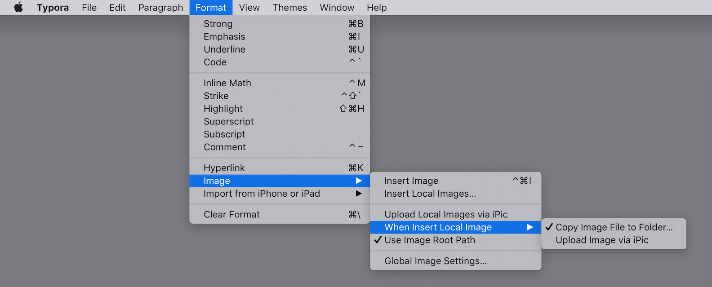
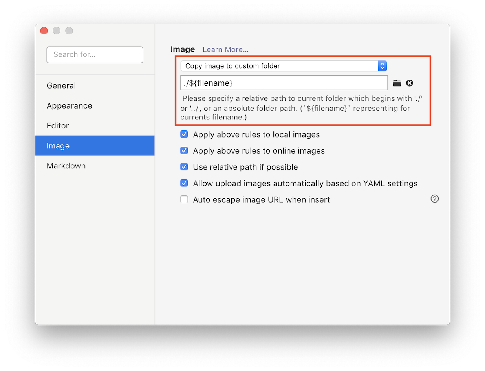
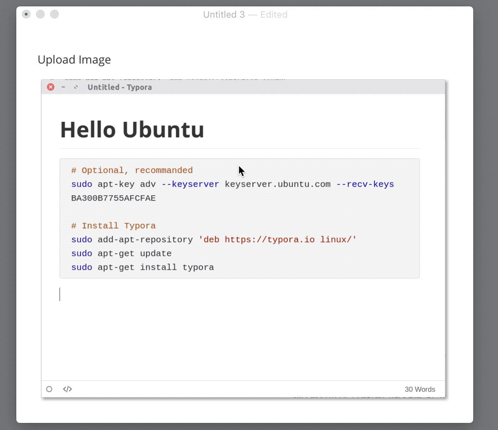

<h1 align="center">Images in Typora</h1>

[toc]

## Images in Markdown

Since a Markdown file is a plain text file, you cannot insert image data into Markdown file directly, but instead insert *references* to image files.

In Markdown, images are written like ``. The `src` here can either be a URL like `https://octodex.github.com/images/yaktocat.png`, or an absolute/relative file path, like `../images/test.png`.

## How to insert images in Typora

Typora supports a number of different ways of doing this.

### Write the Markdown

You can simply write the markdown syntax to insert the image. Or click “image” from the menu bar, or press the shortcut key. If there is an image URL in clipboard, then the URL will be inserted into the `src` part directly.

### Drag & Drop

There’s also an easier way — drag and drop, like the screencast below.


You can also drag and drop multiple image files in one go.

### Select from local files

If you select the menu item `Format` → `Image` → `Insert Local Images…` from menu bar to open a dialog to select and insert local image(s).

If you use this menu item frequently, we suggest you re-assign the shortcut key for this “insert image” command following [Custom Key Binding](http://support.typora.io/Custom-Key-Binding/).

### Paste images from clipboard

Typora supports paste image data from clipboard, **after telling typora where to put those images**. Typora would put image data into given folder or server, then insert images referring to that stored file or URL. Please refer to section **[When insert local image…](http://support.typora.io/Images/#when-insert-local-image…)** for more detail.

> **Tips**: on macOS, users can copy image file from finder and then paste into typora. It has same behavior with drag and drop.
>
> **Tips**: on macOS, you can also copy images from iPhone and then paste into Typora after setup the location to put image files.

## When insert images…

Typora supports using [iPic](https://itunes.apple.com/app/id1101244278?ls=1&mt=12) to copy image files into a given folder or web server when inserting local images using drag and drop, or from the menu. The instructions for how to set it up follows.

### Default behaviors

By default, when you insert or drag and drop an image file into Typora, we will use the path of image file for attribute `src`.

### Use Relative Path

If you enable `Editor` → `Image Insert` → `Use relative path if possible` in the preferences panel, and your work has been saved into a file, then when you drag and drop a local image, the `src` attribute will be set as a relative path to current file (folder).

### Copy image files to target folder when inserting local image

To use this feature, you need to opt-in the option `Allow copy images to given folder` in the preferences panel.

One common scenario is to use Typora to edit `*.md` posts for static websites (like Jekyll). For example, if the `.*md` file is put under `_posts` folder while the image files goes into `_media` folder, you may want to copy images files into the folder `_media` when you drag and drop or paste images into Markdown file automatically. Here’s how:

1. Save your file into a given folder.

2. Enable `Editor` → `Image Insert` → `Allow copy images to given folder` in preferences panel.

   

3. Select `Format` → `Image` → `When Insert Local Images` → `Copy Image File to Folder` from the menu bar, and pick the target folder.

   

In step 3, a new item `typora-copy-images-to: {relative path}` will be inserted into the [YAML Front Matter](http://yaml.org/) block of the current document. So you can also manually add **typora-copy-images-to** property in YAML Front Matter to enable this behavior.

After that, if you drag and drop **local** images or paste images into Typora, the image file will be copied into the target file and update the related `src`.

### Upload image file to web server.

Please refer [Upload Automatically When Insert Images](http://support.typora.io/Upload-Image/#upload-automatically-when-insert-images).

### Use global setting for image insert operations

You can tell Typora where to copy images or upload images when inserting images for all documents (global setting). You can find the images under “image” section in preferences panel.



## Display images in relative path

### Relative path to current file/folder (default behavior)

By default, users can refer to local image by relative path to the current `*.md` file. For example, if the `*.md` file is at `/User/typora/desktop/test.md`, then the `` will display image from `/User/typora/desktop/image.png` just like the `` tag in HTML. Also, for `../download/image.png`, image from `/User/typora/download/image.png` will be fetched.

### Relative path to certain folder

If you’re using markdown for building websites, you may specify a URL prefix for image preview on the local computer with property `typora-root-url` in the YAML Front Matter.

For example, write `typora-root-url:/User/Abner/Website/typora.io/` in YAML Front Matters, and then `` will be treated as `` in typora.

In more recent versions of Typora, instead of manually typing `typora-root-url` property, you can just click item from the menu bar `Format` → `Image` → `Use Image Root Path` to tell Typora to generate `typora-root-url` property automatically.

## Upload images to cloud server

Typora supports to upload image to a cloud image server.



Please refer [Upload Image](http://support.typora.io/Upload-Image).

> Note: If a crash happens when uploading images via iPic, please **re-download typora from typora.io**.

### Upload all local images to cloud server

Please refer [Upload All Local Images](http://support.typora.io/Upload-Image/#upload-all-local-images)

### Upload when inserting images

How-tos for this part can be found in section [When insert local image…](http://support.typora.io/Images/#when-insert-local-image…) → Upload image file to web server.

## Align images

Currently Typora does not support image alignment. But you can use HTML code like `<center></center>` to align images in exported HTML or PDF.

Also, by default, if a paragraph only contains one image, it will be center aligned. It is controlled by CSS, and can be changed by [add custom CSS](http://support.typora.io/Add-Custom-CSS/):

```
p .md-image:only-child{
    width: auto;
    text-align: inherit;
}
```

## Resize images

For details, please see [this link](http://support.typora.io/Resize-Image/).