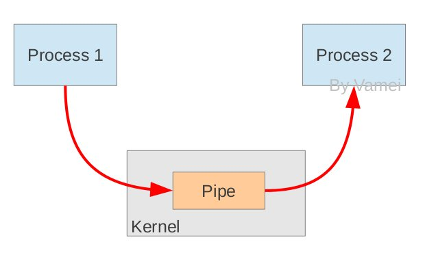

## 腾讯---Linux自带多种进程通信方式，为什么Android都没采用二偏偏使用Binder通信

本专栏专注分享大型Bat面试知识，后续会持续更新，喜欢的话麻烦点击一个star

> **面试官:  Linux自带多种进程通信方式，为什么Android都没采用而偏偏使用Binder通信**

> **心理分析**：面试官绝对不会现场让你分析binder的源码，源码又深又广，没有面试官会傻到让你分析binder所有的机制。他会问你为什么不采用linux。 从这个地方会看出你对binder有多深。这道题往往是面试Android高级的必考题。所以小伙伴们需要格外的注意

> **求职者:**应该从 linux自带的进程通信说起。然后各个击破 指出在Android这种特殊系统上的不足。最后引入binder的优势

**Linux现有的所有进程间IPC方式：**

1. **管道：**

   什么是管道：

   管道可用于具有亲缘关系进程间的通信，管道是由内核管理的一个缓冲区，

   相当于我们放入内存中的一个纸条。管道的一端连接一个进程的输出。这个进程会向管道中放入信息。

   管道的另一端连接一个进程的输入，这个进程取出被放入管道的信息。一个缓冲区不需要很大，它**被设计成为环形的数据结构**，

   

   以便管道可以被循环利用。当管道中没有信息的话，从管道中读取的进程会等待，直到另一端的进程放入信息。当管道被放满信息的时候，尝试放入信息的进程会等待，直到另一端的进程取出信息。当两个进程都终结的时候，管道也自动消失。

   **缺点:**  在创建时分配一个管道时，缓存区大小比较有限；并不适合Android大量的进程通信

2. **消息队列**：

   ​	消息队列提供了一种从**一个进程向另一个进程**发送一个数据块的方法。  每个数据块都被认为含有一个类型，接收进程可以独立地接收含有不同类型的数据结构。我们可以通过发送消息来避免命名管道的同步和阻塞问题。但是消息队列与命名管道一样，每个数据块都有一个最大长度的限制。

   **缺点:** 信息复制两次，额外的CPU消耗；不合适频繁或信息量大的通信；

3. 共享内存：

   ​	什么是共享内存:

   ​	顾名思义，共享内存就是允许两个不相关的进程访问同一个逻辑内存。共享内存是在两个正在运行的进程之间共享和传递数据的一种非常有效的方式。不同进程之间共享的内存通常安排为同一段物理内存。进程可以将同一段共享内存连接到它们自己的地址空间中，所有进程都可以访问共享内存中的地址

   **无须复制，共享缓冲区直接付附加到进程虚拟地址空间，速度快**；

   **缺点:**  	通信需要设计复杂的机制保证各个进程通讯有效性。进程间的同步问题操作系统无法实现，必须各进程利用同步工具解决；  **安全问题比较突出**，如果Android采用Binder 无异于将每个App放在一个内存中，这样是非常不安全的

4. **套接字：**作为更通用的接口，传输效率低，主要用于不通机器或跨网络的通信；

5. **信号量：**常作为一种锁机制，防止某进程正在访问共享资源时，其他进程也访问该资源。因此，主要作为进程间以及同一进程内不同线程之间的同步手段。

6. **信号:** 不适用于信息交换，更适用于进程中断控制，比如非法内存访问，杀死某个进程等；

接下来正面回答这个问题，从5个角度来展开对Binder的分析：

**(1) 从性能的角度**
 数据拷贝次数：Binder数据拷贝只需要一次，而管道、消息队列、Socket都需要2次，但共享内存方式一次内存拷贝都不需要；从性能角度看，Binder性能仅次于共享内存。

**(2) 从稳定性的角度**
 Binder是基于C/S架构的，简单解释下C/S架构，是指客户端(Client)和服务端(Server)组成的架构，Client端有什么需求，直接发送给Server端去完成，架构清晰明朗，Server端与Client端相对独立，稳定性较好；而共享内存实现方式复杂，没有客户与服务端之别， 需要充分考虑到访问临界资源的并发同步问题，否则可能会出现死锁等问题；从这稳定性角度看，Binder架构优越于共享内存。

仅仅从以上两点，各有优劣，还不足以支撑google去采用binder的IPC机制，那么更重要的原因是：

**(3) 从安全的角度**
 传统Linux IPC的接收方无法获得对方进程可靠的UID/PID，从而无法鉴别对方身份；而Android作为一个开放的开源体系，拥有非常多的开发平台，App来源甚广，因此手机的安全显得额外重要；对于普通用户，绝不希望从App商店下载偷窥隐射数据、后台造成手机耗电等等问题，传统Linux IPC无任何保护措施，完全由上层协议来确保。

Android为每个安装好的应用程序分配了自己的UID，故进程的UID是鉴别进程身份的重要标志，前面提到C/S架构，**Android系统中对外只暴露Client端，Client端将任务发送给Server端，Server端会根据权限控制策略，判断UID/PID是否满足访问权限，目前权限控制很多时候是通过弹出权限询问对话框，让用户选择是否运行**。Android 6.0，也称为Android M，在6.0之前的系统是在App第一次安装时，会将整个App所涉及的所有权限一次询问，只要留意看会发现很多App根本用不上通信录和短信，但在这一次性权限权限时会包含进去，让用户拒绝不得，因为拒绝后App无法正常使用，而一旦授权后，应用便可以胡作非为。

针对这个问题，google在Android M做了调整，不再是安装时一并询问所有权限，而是在App运行过程中，需要哪个权限再弹框询问用户是否给相应的权限，对权限做了更细地控制，让用户有了更多的可控性，但**同时也带来了另一个用户诟病的地方，那也就是权限询问的弹框的次数大幅度增多。**对于Android M平台上，有些App开发者可能会写出让手机异常频繁弹框的App，企图直到用户授权为止，这对用户来说是不能忍的，用户最后吐槽的可不光是App，还有Android系统以及手机厂商，有些用户可能就跳果粉了，这还需要广大Android开发者以及手机厂商共同努力，共同打造安全与体验俱佳的Android手机。

**传统IPC**只能由用户在数据包里填入UID/PID；另外，可靠的身份标记只有由IPC机制本身在内核中添加。其次传统IPC访问接入点是开放的，无法建立私有通道。从安全角度，Binder的安全性更高。

**说到这，可能有人要反驳**，Android就算用了Binder架构，而现如今Android手机的各种流氓软件，不就是干着这种偷窥隐射，后台偷偷跑流量的事吗？没错，确实存在，但这不能说Binder的安全性不好，因为Android系统仍然是掌握主控权，可以控制这类App的流氓行为，只是对于该采用何种策略来控制，在这方面android的确存在很多有待进步的空间，这也是google以及各大手机厂商一直努力改善的地方之一。在Android 6.0，google对于app的权限问题作为较多的努力，大大收紧的应用权限；另外，在**Google举办的Android Bootcamp 2016**大会中，google也表示在Android 7.0 （也叫Android N）的权限隐私方面会进一步加强加固，比如SELinux，Memory safe language(还在research中)等等，在今年的5月18日至5月20日，google将推出Android N。

话题扯远了，继续说Binder。

**(4）从语言层面的角度**
 大家多知道Linux是基于C语言(面向过程的语言)，而Android是基于Java语言(面向对象的语句)，而对于Binder恰恰也符合面向对象的思想，将进程间通信转化为通过对某个Binder对象的引用调用该对象的方法，而其独特之处在于Binder对象是一个可以跨进程引用的对象，它的实体位于一个进程中，而它的引用却遍布于系统的各个进程之中。可以从一个进程传给其它进程，让大家都能访问同一Server，就像将一个对象或引用赋值给另一个引用一样。Binder模糊了进程边界，淡化了进程间通信过程，整个系统仿佛运行于同一个面向对象的程序之中。从语言层面，Binder更适合基于面向对象语言的Android系统，对于Linux系统可能会有点“水土不服”。

**另外，Binder是为Android这类系统而生，而并非Linux社区没有想到Binder IPC机制的存在，对于Linux社区的广大开发人员，我还是表示深深佩服，让世界有了如此精湛而美妙的开源系统。**也并非Linux现有的IPC机制不够好，相反地，经过这么多优秀工程师的不断打磨，依然非常优秀，每种Linux的IPC机制都有存在的价值，同时在Android系统中也依然采用了大量Linux现有的IPC机制，根据每类IPC的原理特性，因时制宜，不同场景特性往往会采用其下最适宜的。比如在**Android OS中的Zygote进程的IPC采用的是Socket（套接字）机制**，Android中的**Kill Process采用的signal（信号）机制**等等。而**Binder更多则用在system_server进程与上层App层的IPC交互**。

**(5) 从公司战略的角度**

总所周知，Linux内核是开源的系统，所开放源代码许可协议GPL保护，该协议具有“病毒式感染”的能力，怎么理解这句话呢？受GPL保护的Linux Kernel是运行在内核空间，对于上层的任何类库、服务、应用等运行在用户空间，一旦进行SysCall（系统调用），调用到底层Kernel，那么也必须遵循GPL协议。

而Android 之父 Andy Rubin对于GPL显然是不能接受的，为此，Google巧妙地将GPL协议控制在内核空间，将用户空间的协议采用Apache-2.0协议（允许基于Android的开发商不向社区反馈源码），同时在GPL协议与Apache-2.0之间的Lib库中采用BSD证授权方法，有效隔断了GPL的传染性，仍有较大争议，但至少目前缓解Android，让GPL止步于内核空间，这是Google在GPL Linux下 开源与商业化共存的一个成功典范。

**有了这些铺垫，我们再说说Binder的今世前缘**

Binder是基于开源的 [OpenBinder](https://link.jianshu.com?t=https%3A%2F%2Flink.zhihu.com%2F%3Ftarget%3Dhttp%253A%2F%2Fwww.angryredplanet.com%2F%257Ehackbod%2Fopenbinder%2Fdocs%2Fhtml%2FBinderIPCMechanism.html)实现的，OpenBinder是一个开源的系统IPC机制,最初是由 [Be Inc.](https://link.jianshu.com?t=https%3A%2F%2Flink.zhihu.com%2F%3Ftarget%3Dhttps%253A%2F%2Fen.wikipedia.org%2Fwiki%2FBe_Inc.)开发，接着由[Palm, Inc.](https://link.jianshu.com?t=https%3A%2F%2Flink.zhihu.com%2F%3Ftarget%3Dhttps%253A%2F%2Fen.wikipedia.org%2Fwiki%2FPalm%252C_Inc.)公司负责开发，现在OpenBinder的作者在Google工作，既然作者在Google公司，在用户空间采用Binder 作为核心的IPC机制，再用Apache-2.0协议保护，自然而然是没什么问题，减少法律风险，以及对开发成本也大有裨益的，那么从公司战略角度，Binder也是不错的选择。

另外，再说一点关于OpenBinder，在2015年OpenBinder以及合入到Linux Kernel主线 3.19版本，这也算是Google对Linux的一点回馈吧。

**综合上述5点，可知Binder是Android系统上层进程间通信的不二选择。**

 