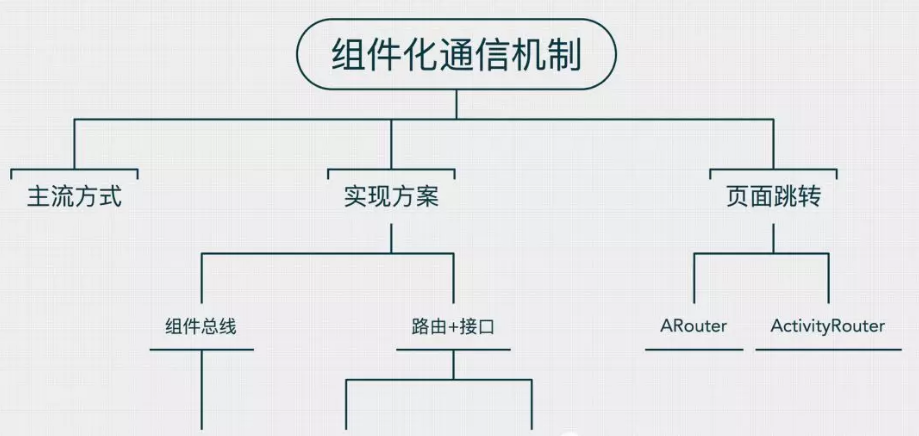

## 腾讯--说下组件之间的跳转和组件通信原理机制

本专栏专注分享大型Bat面试知识，后续会持续更新，喜欢的话麻烦点击一个star

> **面试官:  说下组件之间的跳转和组件通信原理机制**

> **心理分析**：面试官从架构层次 了解求职者是否对组件化有深入研究。是否使用过组件化，使用有多深。通过该问题一目了然。如果能说出项目的演进  组件通信选型 绝对是一个加分项

> **求职者:**应该从为什么会用到组件化  和组件定义，组件通信的演进说起


  我们公司的一个单体项目进行组件化架构改造，我们最开始从以下7个方面入手：

1. 代码解耦。如何将一个庞大的工程分成有机的整体？  
2. 组件单独运行。因为每个组件都是高度内聚的，是一个完整的整体，如何让其单独运行和调试？
3. 组件间通信。由于每个组件具体实现细节都互相不了解，但每个组件都需要给其他调用方提供服务，那么主项目与组件、组件与组件之间如何通信就变成关键？
4. UI 跳转。UI 跳转指的是特殊的数据传递，跟组件间通信区别有什么不同？
5. 组件生命周期。这里的生命周期指的是组件在应用中存在的时间，组件是否可以做到按需、动态使用、因此就会涉及到组件加载、卸载等管理问题。
6. 集成调试。在开发阶段如何做到按需编译组件？一次调试中可能有一两个组件参与集成，这样编译时间就会大大降低，提高开发效率。
7. 代码隔离。组件之间的交互如果还是直接引用的话，那么组件之间根本没有做到解耦，如何从根本上避免组件之间的直接引用，也就是如何从根本上杜绝耦合的产生？

今天则会从更小细粒度入手，主要讲讲在组件化架构下组件与组件之间通信机制是如何、包括所谓的UI跳转，其实也是组件化通信，只不过它稍微特殊点，单独抽取出来而已。学习知识的过程很常见的一个思路就是从整体概况入手，首先对整体有个粗略的印象，然后再深入细节，抽丝剥茧般去挖掘其中的内在原理，一个点一个不断去突破，这样就能建立起自己整个知识树，所以今天我们就从通信机制这个点入手，看看其中内在玄机有哪些。

思维导图

同样，在每写一篇文章之前，放个思维导图，这样做的好处对于想写的内容有很好的梳理，逻辑和结构上显得清晰点。



思维导图主流方式

总所周知，Android提供了很多不同的信息的传递方式，比如在四大组件中本地广播、进程间的AIDL、匿名间的内存共享、Intent Bundle传递等等，那么在这么多传递方式，哪种类型是比较适合组件与组件直接的传递呢。

 ●  本地广播，也就是LoacalBroadcastRecevier。更多是用在同一个应用内的不同系统规定的组件进行通信，好处在于：发送的广播只会在自己的APP内传播，不会泄漏给其他的APP，其他APP无法向自己的APP发送广播，不用被其他APP干扰。本地广播好比对讲通信，成本低，效率高，但有个缺点就是两者通信机制全部委托与系统负责，我们无法干预传输途中的任何步骤，不可控制，一般在组件化通信过程中采用比例不高。

 ●  进程间的AIDL。这个粒度在于进程，而我们组件化通信过程往往是在线程中，况且AIDL通信也是属于系统级通信，底层以Binder机制，虽说Android提供模板供我们实现，但往往使用者不好理解，交互比较复杂，往往也不适用应用于组件化通信过程中。

 ●  匿名的内存共享。比如用Sharedpreferences，在处于多线程场景下，往往会线程不安全，这种更多是存储一一些变化很少的信息，比如说组件里的配置信息等等。

 ●  Intent Bundle传递。包括显性和隐性传递，显性传递需要明确包名路径，组件与组件往往是需要互相依赖，这背离组件化中SOP（关注点分离原则），如果走隐性的话，不仅包名路径不能重复，需要定义一套规则，只有一个包名路径出错，排查起来也稍显麻烦，这个方式往往在组件间内部传递会比较合适，组件外与其他组件打交道则使用场景不多。

说了这么多，那组件化通信什么机制比较适合呢？既然组件层中的模块是相互独立的，它们之间并不存在任何依赖。没有依赖就无法产生关系，没有关系，就无法传递消息，那要如何才能完成这种交流？

目前主流做法之一就是引入第三者，比如图中的Base Module。


基础组件化架构

组件层的模块都依赖于基础层，从而产生第三者联系，这种第三者联系最终会编译在APP Module中，那时将不会有这种隔阂，那么其中的Base Module就是跨越组件化层级的关键，也是模块间信息交流的基础。比较有代表性的组件化开源框架有得到DDComponentForAndroid、阿里Arouter、聚美Router 等等。

除了这种以通过引入第三者方式，还有一种解决方式是以事件总线方式，但这种方式目前开源的框架中使用比例不高，如图：


事件总线

事件总线通过记录对象，使用监听者模式来通知对象各种事件，比如在现实生活中，我们要去找房子，一般都去看小区的公告栏，因为那边会经常发布一些出租信息，我们去查看的过程中就形成了订阅的关系，只不过这种是被动去订阅，因为只有自己需要找房子了才去看，平时一般不会去看。小区中的公告栏可以想象成一个事件总线发布点，监听者则是哪些想要找房子的人，当有房东在公告栏上贴上出租房信息时，如果公告栏有订阅信息功能，比如引入门卫保安，已经把之前来这个公告栏要查看的找房子人一一进行电话登记，那么一旦有新出租消息产生，则门卫会把这条消息一一进行短信群发，那么找房子人则会收到这条消息进行后续的操作，是马上过来看，还是延迟过来，则根据自己的实际情况进行处理。在目前开源库中，有EventBus、RxBus就是采用这种发布/订阅模式，优点是简化了Android组件之间的通信方式，实现解耦，让业务代码更加简洁，可以动态设置事件处理线程和优先级，缺点则是每个事件需要维护一个事件类，造成事件类太多，无形中加大了维护成本。那么在组件化开源框架中有ModuleBus、CC 等等。

这两者模式更详细的对比，可以查看这篇文章多个维度对比一些有代表性的开源android组件化开发方案

实现方案

事件总线，又可以叫做组件总线，路由+接口，则相对好理解点，今天从阅读它们框架源码，我们来对比这两种实现方案的不同之处。

**组件总线**

这边选取的是ModuleBus框架，这个方案特别之处在于其借鉴了EventBus的思想，组件的注册/注销和组件调用的事件发送都跟EventBus类似，能够传递一些基础类型的数据，而并不需要在Base Moudel中添加额外的类。所以不会影响Base模块的架构，但是无法动态移除信息接收端的代码，而自定义的事件信息类型还是需要添加到Base Module中才能让其他功能模块索引。

其中的核心代码是在与 **ModuleBus** 类，其内部维护了两个ArrayMap键对值列表，如下：

```java
private static ArrayMap<Object,ArrayMap<String,MethodInfo>> moduleEventMethods = new ArrayMap<>();
private static ArrayMap<Class<?>,ArrayMap<String,ArrayList<Object>>> moduleMethodClient = new ArrayMap<>();
```

在使用方法上，在onCreate()和onDestroy()中需要注册和解绑，比如

```java
ModuleBus.getInstance().register(this);
ModuleBus.getInstance().unregister(this);
```

最终使用类似EventBus 中 post 方法一样，进行两个组件间的通信。这个框架的封装的post 方法如下

```java
public void post(Class<?> clientClass,String methodName,Object...args){
		if(clientClass == null || methodName == null ||methodName.length() == 0) return;
		ArrayList<Object> clientList = getClient(clientClass,methodName)
    for(Object c: clientList){
    		ArrayMap<String,MethodInfo> methods = moduleEventMethods.get(c);
    		Method method = methods.get(methodName).m;
   	 		method.invoke(c,args);
    }
}
```


可以看到，它是通过遍历之前内部的ArrayMap，把注册在里面的方法找出，根据传入的参数进行匹配，使用反射调用。

**接口+路由**

接口+路由实现方式则相对容易理解点，我之前实践的一个项目就是通过这种方式实现的。具体地址如下：DemoComponent实现思路是专门抽取一个LibModule作为路由服务，每个组件声明自己提供的服务 Service API，这些 Service 都是一些接口，组件负责将这些 Service 实现并注册到一个统一的路由 Router 中去，如果要使用某个组件的功能，只需要向Router 请求这个 Service 的实现，具体的实现细节我们全然不关心，只要能返回我们需要的结果就可以了。

比如定义两个路由地址，一个登陆组件，一个设置组件，核心代码：

```java
public class RouterPath {
	public static final String ROUTER_PATH_TO_LOGIN_SERVICE = "/login/service";
	public static final String ROUTER_PATH_TO_SETTING_SERVICE = "/setting/service";
}
```

那么就相应着就有两个接口API，如下：

```java
public interface ILoginProvider extends IProvider {
    void goToLogin(Activity activity);
}
public interface ISettingProvider extends IProvider {
	void goToSetting(Activity activity);
}
```

这两个接口API对应着是向外暴露这两个组件的能提供的通信能力，然后每个组件对接口进行实现，如下：

```java
@Route(path = RouterPath.ROUTER_PATH_TO_LOGIN_SERVICE, name = "登陆页面")
public class LoginService implements ILoginProvider {

	@Override
	public void init(Context context) {
       
	}
  @Override
  public void goToLogin(Activity activity) {
  	 Intent loginIntent = new Intent(activity, LoginActivity.class);
  	 activity.startActivity(loginIntent);
  }
}
```

这其中使用的到了阿里的ARouter页面跳转方式，内部本质也是接口+实现方式进行组件间通信。

调用则很简单了，如下：

```java

ILoginProvider loginService = (ILoginProvider) ARouter.getInstance().build(RouterPath.ROUTER_PATH_TO_LOGIN_SERVICE).navigation();

if(loginService != null){
		loginService.goToLogin(MainActivity.this);
}
```

还有一个组件化框架，就是ModularizationArchitecture ，它本质实现方式也是接口+实现，但是封装形式稍微不一样点，它是每个功能模块中需要使用注解建立Action事件，每个Action完成一个事件动作。invoke只是方法名为反射，并未用到反射，而是使用接口方式调用，参数是通过HashMap传递的，无法传递对象。具体详解可以看这篇文章 Android架构思考(模块化、多进程)。,string>

页面跳转

页面跳转也算是一种组件间的通信，只不过它相对粒度更细化点，之前我们描述的组件间通信粒度会更抽象点，页面跳转则是定位到某个组件的某个页面，可能是某个Activity，或者某个Fragment，要跳转到另外一个组件的Activity或Fragment，是这两者之间的通信。甚至在一般没有进行组件化架构的工程项目中，往往也会封装页面之间的跳转代码类，往往也会有路由中心的概念。不过一般 UI 跳转基本都会单独处理，一般通过短链的方式来跳转到具体的 Activity。每个组件可以注册自己所能处理的短链的 Scheme 和 Host，并定义传输数据的格式，然后注册到统一的 UIRouter 中，UIRouter 通过 Scheme 和 Host 的匹配关系负责分发路由。但目前比较主流的做法是通过在每个 Activity 上添加注解，然后通过 APT 形成具体的逻辑代码。

下面简单介绍目前比较主流的两个框架核心实现思路：

**ARouter**

ARouter 核心实现思路是，我们在代码里加入的@Route注解，会在编译时期通过apt生成一些存储path和activityClass映射关系的类文件，然后app进程启动的时候会拿到这些类文件，把保存这些映射关系的数据读到内存里(保存在map里)，然后在进行路由跳转的时候，通过build()方法传入要到达页面的路由地址，ARouter会通过它自己存储的路由表找到路由地址对应的Activity.class(activity.class = map.get(path))，然后new Intent()，当调用ARouter的withString()方法它的内部会调用intent.putExtra(String name, String value)，调用navigation()方法，它的内部会调用startActivity(intent)进行跳转，这样便可以实现两个相互没有依赖的module顺利的启动对方的Activity了。

**ActivityRouter**

ActivityRouter 核心实现思路是，它是通过路由 + 静态方法来实现，在静态方法上加注解来暴露服务，但不支持返回值，且参数固定位(context, bundle)，基于apt技术，通过注解方式来实现URL打开Activity功能，并支持在WebView和外部浏览器使用，支持多级Activity跳转，支持Bundle、Uri参数注入并转换参数类型。它实现相对简单点，也是比较早期比较流行的做法，不过学习它也是很有参考意义的。

**小结**

**总的来说**，组件间的通信机制在组件化编程和组件化架构中是很重要的一个环节，可能在每个组件独自开发阶段，不需要与其他组件进行通信，只需要在内部通信即可，当处于组件集成阶段，那就需要大量组件进行互相通信，体现在每个业务互相协作，如果组件间设计的不好，打开一个页面或调用一个方法，想当耗时或响应慢，那么体现的则是这个APP使用比较卡顿，仅仅打开一个页面就是需要好几秒才能打开，则严重影响使用者的体验了，甚至一些大型APP，可能组件分化更小，种类更多，那么组件间的通信则至关重要了。所以，要打造一个良好的组件化框架，如何设计一个更适合自己本身的业务类型的通信机制，就需要多多进行思考了。