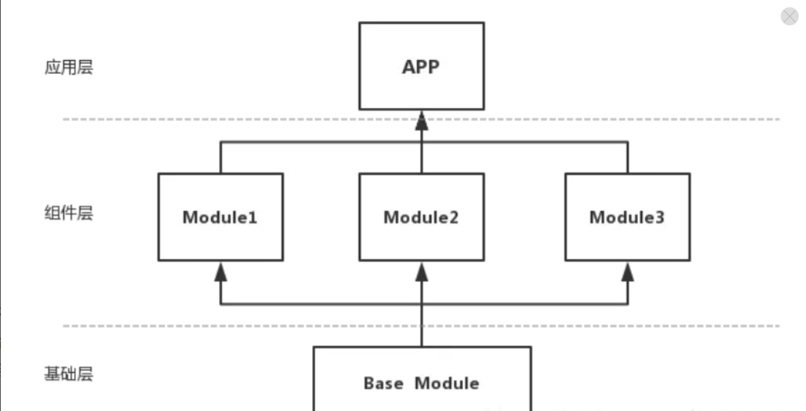

## 腾讯--有没有使用过组件化，组件化通信如何做到的，ARouter有用过吗

本专栏专注分享大型Bat面试知识，后续会持续更新，喜欢的话麻烦点击一个star

> **面试官**: 有没有使用过组件化，组件化通信如何做到的，ARouter有用过吗


> **心理分析**：组件化一般在架构经常被考到，组件化的内容比较多，跟我们平时的开发mvc的单体应用不一样，组件化是团队作战，需要设计复杂的组件通信与交互

> **求职者:** 从组件化的由来，优势 弊端开始，最后引出组件化的劣势，组件通信


### 1  组件化

##### 1.1 组件化初衷

- APP版本不断的迭代，新功能的不断增加，业务也会变的越来越复杂，维护成本高。
- 业务耦合度高，代码越来越臃肿，团队内部多人协作开发困难。
- Android项目在编译代码的时候电脑会非常卡，又因为单一工程下代码耦合严重，每修改一处代码后都要重新编译打包测试，导致非常耗时。
- 方便单元测试，改动单独一个业务模块，不需要着重于关注其他模块被影响。


##### 1.2 什么是组件化

组件化就是将一个app分成多个Module，如下图，每个Module都是一个组件(也可以是一个基础库供组件依赖)，开发的过程中我们可以单独调试部分组件，组件间不需要互相依赖，但可以相互调用，最终发布的时候所有组件以lib的形式被主app工程依赖并打包成一个apk。

##### 1.3 组件化优势

- 组件化就是将通用模块独立出来，统一管理，以提高复用，将页面拆分为粒度更小的组件，组件内部除了包含UI实现，还包含数据层和逻辑层。
- 每个工程都可以独立编译、加快编译速度，独立打包。
- 每个工程内部的修改，不会影响其他工程。
- 业务库工程可以快速拆分出来，集成到其他App中。
- 迭代频繁的业务模块采用组件方式，业务线研发可以互不干扰、提升协作效率，并控制产品质量，加强稳定性。
- 并行开发，团队成员只关注自己的开发的小模块，降低耦合性，后期维护方便等。


### 2 组件化通信


##### 2.1  组件化通信

​		组件化互相不直接依赖，如果组件A想调用组件B的方法是不行的。很多开发者因为组件化之间通信比较复杂 则放弃了组件化的使用


组件通信有以下几种方式:

1. 本地广播

   > ​	本地广播，也就是LoacalBroadcastRecevier。更多是用在同一个应用内的不同系统规定的组件进行通信，好处在于：发送的广播只会在自己的APP内传播，不会泄漏给其他的APP，其他APP无法向自己的APP发送广播，不用被其他APP干扰。本地广播好比对讲通信，成本低，效率高，但有个缺点就是两者通信机制全部委托与系统负责，我们无法干预传输途中的任何步骤，不可控制，一般在组件化通信过程中采用比例不高。

2. 进程间的AIDL

   > ​	 进程间的AIDL。这个粒度在于进程，而我们组件化通信过程往往是在线程中，况且AIDL通信也是属于系统级通信，底层以Binder机制，虽说Android提供模板供我们实现，但往往使用者不好理解，交互比较复杂，往往也不适用应用于组件化通信过程中。

3.   匿名的内存共享

   >  匿名的内存共享。比如用Sharedpreferences，在处于多线程场景下，往往会线程不安全，这种更多是存储一一些变化很少的信息，比如说组件里的配置信息等等

4.   Intent Bundle传递

   >  Intent Bundle传递。包括显性和隐性传递，显性传递需要明确包名路径，组件与组件往往是需要互相依赖，这背离组件化中SOP（关注点分离原则），如果走隐性的话，不仅包名路径不能重复，需要定义一套规则，只有一个包名路径出错，排查起来也稍显麻烦，这个方式往往在组件间内部传递会比较合适，组件外与其他组件打交道则使用场景不多。


**2.2 目前主流做法之一就是引入第三者，比如图中的Base Module。**





### 3 ARouter组件通信框架


##### 3.1  ARouter 简介是ARouter是阿里巴巴开源的Android平台中对页面、服务提供路由功能的中间件，提倡的是简单且够用。主要用作组件化通信

GitHub：https://github.com/alibaba/ARouter


## 前言


```
 		Intent intent = new Intent(mContext, XxxActivity.class);
        intent.putExtra("key","value");
        startActivity(intent);
        
        Intent intent = new Intent(mContext, XxxActivity.class);
        intent.putExtra("key","value");
        startActivityForResult(intent, 666);
```

上面一段代码，在Android开发中，最常见也是最常用的功能就是页面的跳转，我们经常需要面对从浏览器或者其他App跳转到自己App中页面的需求，不过就算是简简单单的页面跳转，随着时间的推移，也会遇到一些问题：

1. 集中式的URL管理：谈到集中式的管理，总是比较蛋疼，多人协同开发的时候，大家都去`AndroidManifest.xml`中定义各种`IntentFilter`，使用隐式Intent,最终发现`AndroidManifest.xml`中充斥着各种Schame，各种Path，**需要经常解决Path重叠覆盖、过多的Activity被导出，引发安全风险等问题** 
2. 可配置性较差：Manifest限制于xml格式，**书写麻烦，配置复杂**，可以自定义的东西也较少
3. 跳转过程中无法插手：直接通过Intent的方式跳转，跳转过程开发者无法干预，一些面向切面的事情难以实施，比方说**登录、埋点这种非常通用的逻辑**，在每个子页面中判断又很不合理，毕竟activity已经实例化了
4. 跨模块无法显式依赖：在App小有规模的时候，我们会对App做水平拆分，按照业务拆分成多个子模块，之间**完全解耦**，通过打包流程控制App功能，这样方便应对大团队多人协作，**互相逻辑不干扰，这时候只能依赖隐式Intent跳转，书写麻烦，成功与否难以控制。**

为了解决以上问题，我们需要一款能够解耦、简单、功能多、定制性较强、支持拦截逻辑的路由组件：我们选择了Alibaba的ARouter，偷个懒，直接贴ARouter的中文介绍文档：

##### 3.2  ARouter 优势

从 ARouter Github 了解到它的优势：

支持直接解析标准URL进行跳转，并自动注入参数到目标页面中
支持多模块工程使用
支持添加多个拦截器，自定义拦截顺序
支持依赖注入，可单独作为依赖注入框架使用
支持InstantRun
支持MultiDex(Google方案)
映射关系按组分类、多级管理，按需初始化
支持用户指定全局降级与局部降级策略
页面、拦截器、服务等组件均自动注册到框架
支持多种方式配置转场动画
支持获取Fragment
完全支持Kotlin以及混编
典型的应用：

从外部URL映射到内部页面，以及参数传递与解析
跨模块页面跳转，模块间解耦
拦截跳转过程，处理登陆、埋点等逻辑

##### 跨模块API调用，通过控制反转来做组件解耦


#### 三、典型应用场景

1. 从外部URL映射到内部页面，以及参数传递与解析
2. 跨模块页面跳转，模块间解耦
3. 拦截跳转过程，处理登陆、埋点等逻辑
4. 跨模块API调用，模块间解耦(注册ARouter服务的形式，通过接口互相调用)

#### 四、基础功能

1. 添加依赖和配置

   apply plugin: 'com.neenbedankt.android-apt'

   ```
    buildscript {
        repositories {
            jcenter()
        }
        dependencies {
            classpath 'com.neenbedankt.gradle.plugins:android-apt:1.4'
        }
    }
   
    apt {
        arguments {
            moduleName project.getName();
        }
    }
   
    dependencies {
        apt 'com.alibaba:arouter-compiler:x.x.x'
        compile 'com.alibaba:arouter-api:x.x.x'
        ...
    }
   ```

2. 添加注解

   ```
    // 在支持路由的页面、服务上添加注解(必选)
    // 这是最小化配置，后面有详细配置
    @Route(path = "/test/1")
    public class YourActivity extend Activity {
        ...
    }
   ```

3. 初始化SDK

   ```
    ARouter.init(mApplication); // 尽可能早，推荐在Application中初始化
   ```

4. 发起路由操作
    // 1. 应用内简单的跳转(通过URL跳转在'中阶使用'中)
    ARouter.getInstance().build("/test/1").navigation();

   ```
    // 2. 跳转并携带参数
    ARouter.getInstance().build("/test/1")
                .withLong("key1", 666L)
                .withString("key3", "888")
                .navigation();
   ```

5. 添加混淆规则(如果使用了Proguard)

   ```
    -keep public class com.alibaba.android.arouter.routes.**{*;}
   ```

#### 五、进阶用法

1. 通过URL跳转

   ```
    // 新建一个Activity用于监听Schame事件
    // 监听到Schame事件之后直接传递给ARouter即可
    // 也可以做一些自定义玩法，比方说改改URL之类的
    // http://www.example.com/test/1
    public class SchameFilterActivity extends Activity {
        @Override
        protected void onCreate(Bundle savedInstanceState) {
            super.onCreate(savedInstanceState);
   
            // 外面用户点击的URL
            Uri uri = getIntent().getData();
            // 直接传递给ARouter即可
            ARouter.getInstance().build(uri).navigation();
            finish();
        }
    }
   
    // AndroidManifest.xml 中 的参考配置
    <activity android:name=".activity.SchameFilterActivity">
            <!-- Schame -->
            <intent-filter>
                <data
                    android:host="m.aliyun.com"
                    android:scheme="arouter"/>
   
                <action android:name="android.intent.action.VIEW"/>
   
                <category android:name="android.intent.category.DEFAULT"/>
                <category android:name="android.intent.category.BROWSABLE"/>
            </intent-filter>
   
            <!-- App Links -->
            <intent-filter android:autoVerify="true">
                <action android:name="android.intent.action.VIEW"/>
   
                <category android:name="android.intent.category.DEFAULT"/>
                <category android:name="android.intent.category.BROWSABLE"/>
   
                <data
                    android:host="m.aliyun.com"
                    android:scheme="http"/>
                <data
                    android:host="m.aliyun.com"
                    android:scheme="https"/>
            </intent-filter>
    </activity>
   ```

2. 使用ARouter协助解析参数类型

   ```
    // URL中的参数会默认以String的形式保存在Bundle中
    // 如果希望ARouter协助解析参数(按照不同类型保存进Bundle中)
    // 只需要在需要解析的参数上添加 @Param 注解
    @Route(path = "/test/1")
    public class Test1Activity extends Activity {
        @Param                   // 声明之后，ARouter会从URL中解析对应名字的参数，并按照类型存入Bundle
        public String name;
        @Param
        private int age;
        @Param(name = "girl")   // 可以通过name来映射URL中的不同参数
        private boolean boy;
   
        @Override
        protected void onCreate(Bundle savedInstanceState) {
            super.onCreate(savedInstanceState);
   
            name = getIntent().getStringExtra("name");
            age = getIntent().getIntExtra("age", -1);
            boy = getIntent().getBooleanExtra("girl", false);   // 注意：使用映射之后，要从Girl中获取，而不是boy
        }
    }
   ```

3. 开启ARouter参数自动注入(实验性功能，不建议使用，正在开发保护策略)

   ```
    // 首先在Application中重写 attachBaseContext方法，并加入ARouter.attachBaseContext();
    @Override
    protected void attachBaseContext(Context base) {
       super.attachBaseContext(base);
   
       ARouter.attachBaseContext();
    }
   
    // 设置ARouter的时候，开启自动注入
    ARouter.enableAutoInject();
   
    // 至此，Activity中的属性，将会由ARouter自动注入，无需 getIntent().getStringExtra("xxx")等等
   ```

4. 声明拦截器(拦截跳转过程，面向切面搞事情)

   ```
    // 比较经典的应用就是在跳转过程中处理登陆事件，这样就不需要在目标页重复做登陆检查
   
    // 拦截器会在跳转之间执行，多个拦截器会按优先级顺序依次执行
    @Interceptor(priority = 666, name = "测试用拦截器")
    public class TestInterceptor implements IInterceptor {
        /**
         * The operation of this interceptor.
         *
         * @param postcard meta
         * @param callback cb
         */
        @Override
        public void process(Postcard postcard, InterceptorCallback callback) {
            ...
   
            callback.onContinue(postcard);  // 处理完成，交还控制权
            // callback.onInterrupt(new RuntimeException("我觉得有点异常"));      // 觉得有问题，中断路由流程
   
            // 以上两种至少需要调用其中一种，否则会超时跳过
        }
   
        /**
         * Do your init work in this method, it well be call when processor has been load.
         *
         * @param context ctx
         */
        @Override
        public void init(Context context) {
   
        }
    }
   ```

5. 处理跳转结果

   ```
    // 通过两个参数的navigation方法，可以获取单次跳转的结果
    ARouter.getInstance().build("/test/1").navigation(this, new NavigationCallback() {
        @Override
        public void onFound(Postcard postcard) {
              ...
        }
   
        @Override
        public void onLost(Postcard postcard) {
            ...
        }
    });
   ```

6. 自定义全局降级策略

   ```
        // 实现DegradeService接口，并加上一个Path内容任意的注解即可
       @Route(path = "/xxx/xxx") // 必须标明注解
        public class DegradeServiceImpl implements DegradeService {
          /**
           * Router has lost.
           *
           * @param postcard meta
           */
          @Override
          public void onLost(Context context, Postcard postcard) {
                // do something.
          }
   
          /**
           * Do your init work in this method, it well be call when processor has been load.
           *
           * @param context ctx
           */
          @Override
          public void init(Context context) {
   
          }
        }
   ```

7. 为目标页面声明更多信息

   ```
    // 我们经常需要在目标页面中配置一些属性，比方说"是否需要登陆"之类的
    // 可以通过 Route 注解中的 extras 属性进行扩展，这个属性是一个 int值，换句话说，单个int有4字节，也就是32位，可以配置32个开关
    // 剩下的可以自行发挥，通过字节操作可以标识32个开关
    @Route(path = "/test/1", extras = Consts.XXXX)
   ```

8. 使用ARouter管理服务(一) 暴露服务

   ```
    /**
     * 声明接口
     */
    public interface IService extends IProvider {
        String hello(String name);
    }
   
    /**
     * 实现接口
     */
    @Route(path = "/service/1", name = "测试服务")
    public class ServiceImpl implements IService {
   
        @Override
        public String hello(String name) {
            return "hello, " + name;
        }
   
        /**
         * Do your init work in this method, it well be call when processor has been load.
         *
         * @param context ctx
         */
        @Override
        public void init(Context context) {
   
        }
    }
   ```

9. 使用ARouter管理服务(二) 发现服务

   ```
    1. 可以通过两种API来获取Service，分别是ByName、ByType
    IService service = ARouter.getInstance().navigation(IService.class);    //  ByType
    IService service = (IService) ARouter.getInstance().build("/service/1").navigation(); //  ByName
   
    service.hello("zz");
   
    2. 注意：推荐使用ByName方式获取Service，ByType这种方式写起来比较方便，但如果存在多实现的情况时，SDK不保证能获取到你想要的实现
   ```

10. 使用ARouter管理服务(三) 管理依赖

    ```
        可以通过ARouter service包装您的业务逻辑或者sdk，在service的init方法中初始化您的sdk，不同的sdk使用ARouter的service进行调用，
    每一个service在第一次使用的时候会被初始化，即调用init方法。
        这样就可以告别各种乱七八糟的依赖关系的梳理，只要能调用到这个service，那么这个service中所包含的sdk等就已经被初始化过了，完全不需要
    关心各个sdk的初始化顺序。
    ```

#### 六、更多功能

1. 初始化中的其他设置

   ```
    ARouter.openLog();  // 开启日志
    ARouter.printStackTrace(); // 打印日志的时候打印线程堆栈
   ```

2. 详细的API说明

   ```
    // 构建标准的路由请求
    ARouter.getInstance().build("/home/main").navigation();
   
    // 构建标准的路由请求，并指定分组
    ARouter.getInstance().build("/home/main", "ap").navigation();
   
    // 构建标准的路由请求，通过Uri直接解析
    Uri uri;
    ARouter.getInstance().build(uri).navigation();
   
    // 构建标准的路由请求，startActivityForResult
    // navigation的第一个参数必须是Activity，第二个参数则是RequestCode
    ARouter.getInstance().build("/home/main", "ap").navigation(this, 5);
   
    // 直接传递Bundle
    Bundle params = new Bundle();
    ARouter.getInstance()
                .build("/home/main")
                .with(params)
                .navigation();
   
    // 指定Flag
    ARouter.getInstance()
                .build("/home/main")
                .withFlags();
                .navigation();
   
    // 觉得接口不够多，可以直接拿出Bundle赋值
    ARouter.getInstance()
                .build("/home/main")
                .getExtra();
   
    // 使用绿色通道(跳过所有的拦截器)
    ARouter.getInstance().build("/home/main").greenChannal().navigation();
   ```

------

## 附录


 [Demo apk](http://public.cdn.zhilong.me/app-debug.apk)

- 最新版本
   arouter-annotation : 1.0.0
   arouter-compiler : 1.0.1
   arouter-api : 1.0.2
- Gradle依赖

```
dependencies {
    apt 'com.alibaba:arouter-compiler:1.0.1'
    compile 'com.alibaba:arouter-api:1.0.2'
}
```

