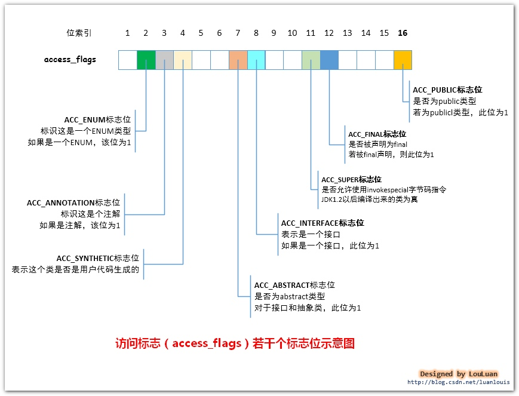
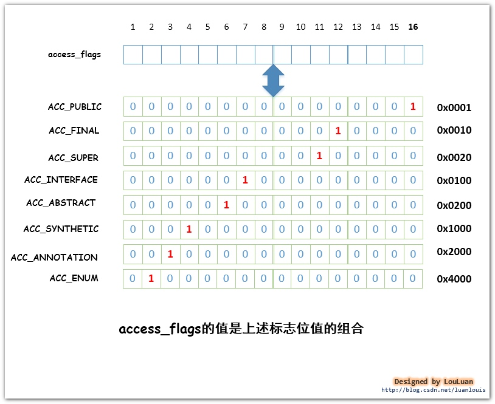
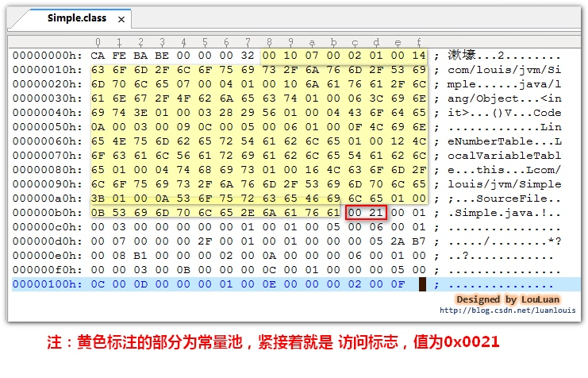
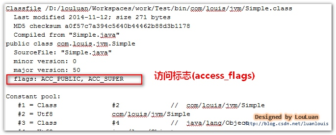
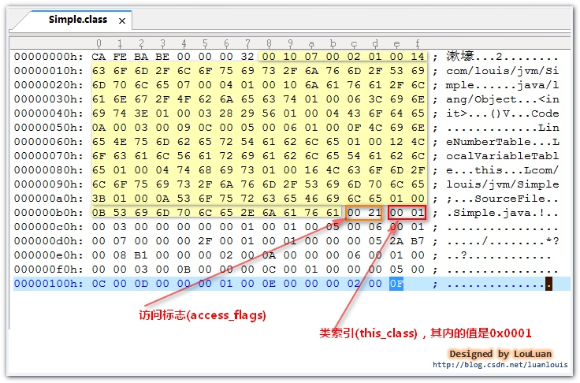
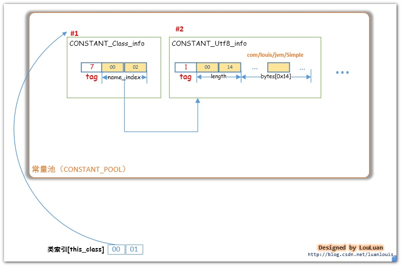
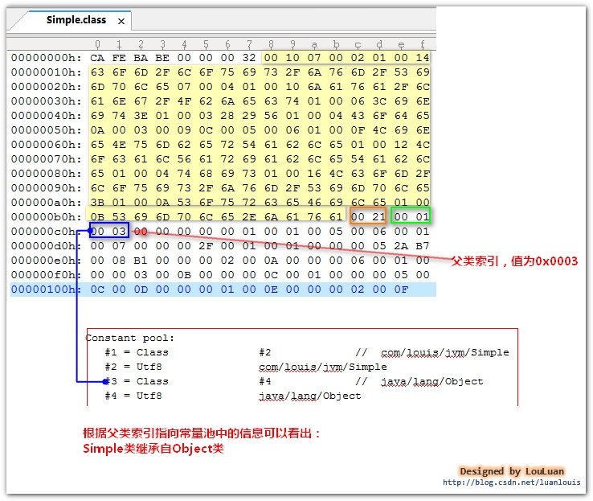
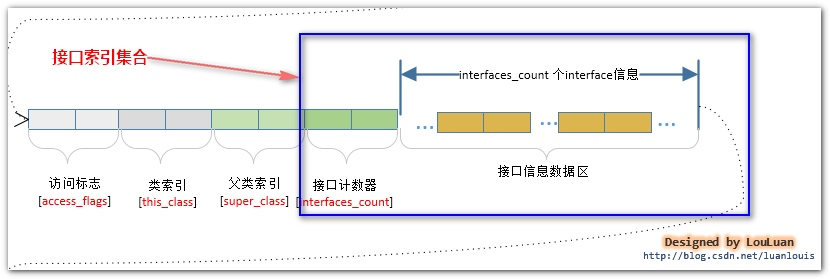

# 1.3、class文件中的访问标志、类索引、父类索引、接口索引集合

   讲完了class文件中的常量池，我们就相当于克服了class文件中最麻烦的模块了。现在，我们来看一下class文件中紧接着常量池后面的几个东西：**访问标志、类索引、父类索引、接口索引集合。**

**1. 访问标志、类索引、父类索引、接口索引集合 在class文件中的位置**


​     好，让我们来一一击破它们，看看它们到底是什么东西。

**2. 访问标志(access_flags)能够表示什么？**

  **访问标志（****access_flags****）**紧接着**常量池**后，占有两个字节，总共16位，如下图所示：




当**JVM**在编译某个类或者接口的源代码时，**JVM**会解析出这个类或者接口的访问标志信息，然后，将这些标志设置到**访问标志（****access_flags****）**这16个位上。**JVM**会考虑如下设置如下访问表示信息：

**a**. 我们知道，每个定义的类或者接口都会生成**class**文件（这里也包括内部类，在某个类中定义的静态内部类也会单独生成一个class文件）。

   对于定义的类，**JVM**在将其编译成**class**文件时，会将**class**文件的**访问标志**的第**11**位设置为**1** 。第**11**位叫做**ACC_SUPER标志位**；

   对于定义的接口，**JVM**在将其编译成**class**文件时，会将**class**文件的**访问标志**的第**8**位 设置为 **1** 。第**8**位叫做**ACC_INTERFACE标志位**；

 **b**. **class**文件表示的类或者接口的访问权限有**public**类型的和包**package**类型的。

   如果类或者接口被声明为**public**类型的，那么，**JVM**将其编译成**class**文件时，会将**class**文件的访问标志的第**16**位设置为**1** 。第**16**位叫做**ACC_PUBLIC标志符；**

 **c**. 类是否为抽象类型的，即我们定义的类有没有被**abstract**关键字修饰，即我们定义的类是否为抽象类。

   如果我们形如：

public  abstract  class MyClass{......} 

定义某个类时，**JVM**将它编译成**class**文件的时候，会将**class**文件的**访问标志**的第**7**位设置为**1** 。第**7**位叫做**ACC_ABSTRACT标志位**。 另外值得注意的是，对于定义的接口，**JVM**在编译接口的时候也会对**class**文件的**访问标志**上的**ACC_ABSTRACT标志位**设置为 **1**；

**d.** 该类是否被声明了**final**类型,即表示该类不能被继承。

   此时**JVM**会在编译**class**文件的过程中，会将**class**文件的访问标志的第**12**位设置为 **1** 。第**12**位叫做**ACC_FINAL标志位**；

**e**.如果我们这个**class**文件不是**JVM**通过java源代码文件编译而成的，而是用户自己通过**class**文件的组织规则生成的，那么，一般会对**class**文件的**访问标志**第**4**位设置为 **1** 。通过**JVM**编译源代码产生的**class**文件此标志位为 **0**，第4位叫做**ACC_SYNTHETIC标志位**；

**f.** 枚举类，对于定义的枚举类如：public enum EnumTest{....}，**JVM**也会对此枚举类编译成**class**文件，这时，对于这样的**class**文件，**JVM**会对**访问标志**第**2**位设置为 **1** ，以表示它是枚举类。第**2**位叫做**ACC_ENUM标志位**；

**g.** 注解类，对于定义的注解类如：public @interface{.....},**JVM**会对此注解类编译成**class**文件，对于这样的**class**文件，**JVM**会将**访问标志**第**3**位设置为1，以表示这是个注解类，第**3**位叫做**ACC_ANNOTATION标志位**。

当**JVM**确定了上述标志位的值后，就可以确定**访问标志（****access_flags****）**的值了。实际上**JVM**上述标志会根据上述确定的标志位的值，对这些标志位的值取或，便得到了**访问标志（****access_flags****）**。如下图所示:




  **举例：定义一个最简单的类Simple.java，使用编译器编译成class文件，然后观察class文件中的访问标志的值，以及使用javap -v Simple 查看访问标志。**

```java
package com.louis.jvm;

public class Simple {
 
}
```

使用UltraEdit查看编译成的class文件，如下图所示：




上述的图中黄色部分表示的是常量池部分，具体为什么是常量池部分不是本文的重点，有兴趣的读者可以参考我的**《Java虚拟机原理图解》系列关于常量池**的博客，你就可以很轻松地识别常量它们了。

常量池后面紧跟着就是访问标志，它的十六进制值为**0x0021**,二进制的值为：**00000000 00100001**，由二进制的**1**的位数可以得出**第11、16位**为1，分别对应**ACC_SUPER标志位**和**ACC_PUBLIC标志位**。

也可以通过一下运算：

​     **0x0021 = 0x0001 | 0x0020,** 即：  访问标志表示的标志是**ACC_PUBLIC + ACC_SUPER**

为了验证我们的运算，使用**javap -v Simple**查看反编译信息如下：（小技巧：使用**javap -v Simple**指令的结果展示在命令提示符下显示不友好，一般我是使用**javap -v Simple > temp.txt**，将结果重定向到文件中，然后查看文件）




 

**3. 类索引(this_class)是什么？**

​      我们知道一般情况下一个Java类源文件经过JVM编译会生成一个class文件，也有可能一个Java类源文件中定义了其他类或者内部类，这样编译出来的class文件就不止一个，但每一个class文件表示某一个类，至于这个class表示哪一个类，便可以通过 类索引 这个数据项来确定。JVM通过类的完全限定名确定是某一个类。

​    **类索引的作用，就是为了指出class文件所描述的这个类叫什么名字。**

​    类索引紧接着访问标志的后面，占有两个字节，在这两个字节中存储的值是一个指向常量池的一个索引，该索引指向的是CONSTANT_Class_info常量池项，

​     


​     以上面定义的Simple.class 为例，如下图所示，查看他的类索引在什么位置和取什么值。

​     



​      由上可知，它的类索引值为0x0001,那么，它指向了常量池中的第一个常量池项，那我们再看一下常量池中的信息。使用javap -v Simple,常量池中有以下信息：

​ 


​      可以看到常量池中的第一项是CONSTANT_Class_info项，它表示一个"com/louis/jvm/Simple"的类名。即类索引是告诉我们这个class文件所表示的是哪一个类。




**3. 父类索引(super_class)是什么？**

  Java支持单继承模式，除了java.lang.Object 类除外，每一个类都会有且只有一个父类。class文件中紧接着类索引(this_class)之后的两个字节区域表示父类索引，跟类索引一样，父类索引这两个字节中的值指向了常量池中的某个常量池项CONSTANT_Class_info，表示该class表示的类是继承自哪一个类。




**4. 接口索引集合(interfaces)是什么？**

   一个类可以不实现任何接口，也可以实现很多个接口，为了表示当前类实现的接口信息，class文件使用了如下结构体描述某个类的接口实现信息:




  由于类实现的接口数目不确定，所以**接口索引集合**的描述的前部分叫做**接口计数器（interfaces_count）**，**接口计数器占用两个字节**，其中的值表示着这个类实现了多少个接口，紧跟着接口计数器的部分就是接口索引部分了，**每一个接口索引占有两个字节**，接口计数器的值代表着后面跟着的接口索引的个数。接口索引和类索引和父类索引一样，其内的值存储的是指向了常量池中的常量池项的索引，表示着这个接口的完全限定名。

举例：

   定义一个**Worker**接口，然后类**Programmer**实现这个**Worker**接口，然后我们观察**Programmer**的接口索引集合是怎样表示的。

​    
```java
*/***
** Worker 接口类*
*** *@author* *luan louis*
**/*
public interface Worker{
​	
	public void work();
 
}

package com.louis.jvm;
 
public class Programmer implements Worker {
 
​	@Override
	public void work() {
		System.out.println("I'm Programmer,Just coding....");
	}
}
```


