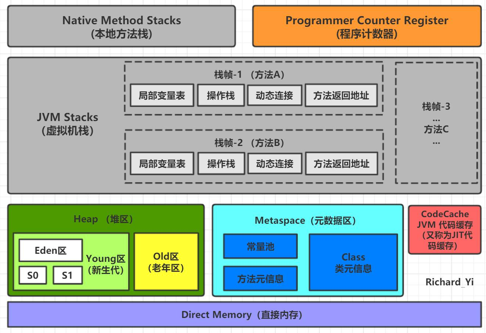
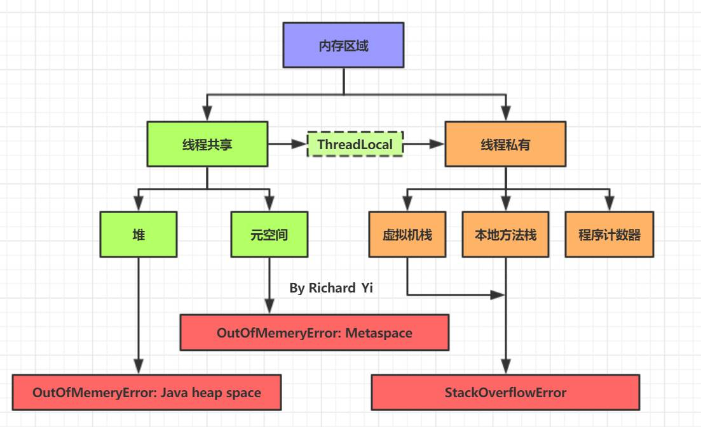
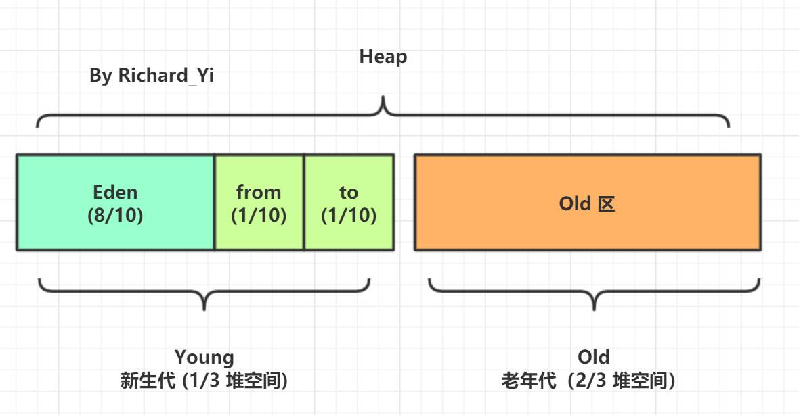
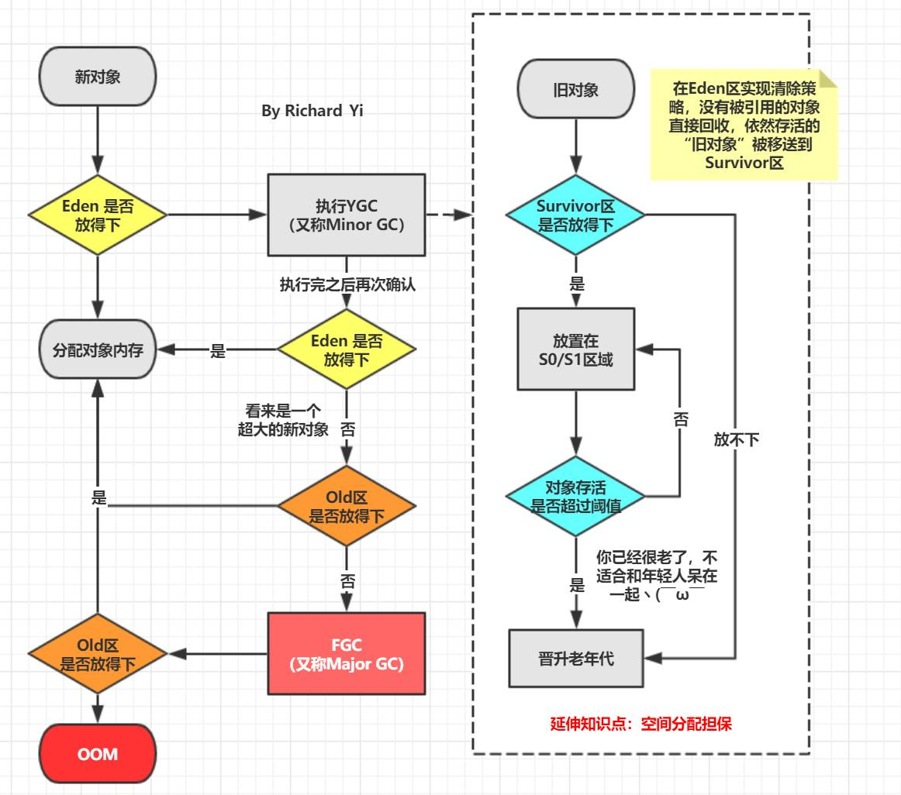

<h1 align="center">精美图文带你掌握 JVM 内存布局</h1>

## 前言

本JVM系列属于本人学习过程当中总结的一些知识点，目的是想让读者更快地掌握JVM相关的知识要点，难免会有所侧重，若想要更加系统更加详细的学习JVM知识，还是需要去阅读专业的书籍和文档。

本文主题内容：

- JVM 内存区域概览
- **堆区的空间分配是怎么样？堆溢出的演示**
- **创建一个新对象内存是怎么分配的？**
- **方法区 到 Metaspace 元空间**
- **栈帧是什么？栈帧里有什么？怎么理解？**
- 本地方法栈
- 程序计数器
- **Code Cache 是什么？**

> **注：请 区分 JVM内存结构（内存布局） 和 JMM（Java内存模型）这两个不同的概念！**

## 概览

内存是非常重要的系统资源，是硬盘和CPU的中间仓库及桥梁，承载着操作系统和应用程序的实时运行。JVM 内存布局规定了 Java 在运行过程中内存申请、分配、管理的策略 ，保证了 JVM 的高效稳定运行。



上图描述了当前比较经典的Java内存布局。（堆区画小了2333，按理来说应该是最大的区域）

如果按照线程是否共享来分类的话，如下图所示：



> PS：线程是否共享这点，实际上理解了每块区域的实际用处之后，就很自然而然的就记住了。不需要死记硬背。

下面让我们来了解下各个区域。

## 一、Heap (堆区）

### 1.1 堆区的介绍

我们先来说堆。堆是 OOM故障最主要的发生区域。它是内存区域中最大的一块区域，被所有**线程共享**，存储着**几乎所有**的实例对象、数组。**所有的对象实例以及数组都要在堆上分配**，但是随着JIT编译器的发展与**逃逸分析技术**逐渐成熟，栈上分配、标量替换优化技术将会导致一些微妙的变化发生，**所有的对象都分配在堆上也渐渐变得不是那么“绝对”了**。

> 延伸知识点：JIT编译优化中的一部分内容 - **逃逸分析**。
>
> 推荐阅读：[深入理解Java中的逃逸分析](https://www.hollischuang.com/archives/2583)

Java堆是垃圾收集器管理的主要区域，因此**很多时候也被称做“GC堆”**。从内存回收的角度来看，由于现在收集器基本都采用分代收集算法，所以Java堆中还可以细分为：**新生代和老年代**。再细致一点的有**Eden空间、From Survivor空间、To Survivor空间**等。从内存分配的角度来看，线程共享的Java堆中可能划分出多个线程私有的分配缓冲区（Thread Local Allocation Buffer,TLAB）。不过无论如何划分，都与存放内容无关，无论哪个区域，存储的都仍然是对象实例，进一步划分的目的是为了更好地回收内存，或者更快地分配内存。

### 1.2 堆区的调整

根据Java虚拟机规范的规定，**Java堆可以处于物理上不连续的内存空间中**，只要逻辑上是连续的即可，就像我们的磁盘空间一样。在实现时，既可以实现成固定大小的，也可以在运行时动态地调整。

**如何调整呢？**

通过设置如下参数，可以设定堆区的初始值和最大值，比如 `-Xms256M -Xmx 1024M`，其中 `-X`这个字母代表它是JVM运行时参数，`ms`是`memory start`的简称，中文意思就是内存初始值，`mx` 是 `memory max`的简称，意思就是最大内存。

**值得注意的是，在通常情况下，服务器在运行过程中，堆空间不断地扩容与回缩，会形成不必要的系统压力 所以在线上生产环境中 JVM的`Xms`和 `Xmx`会设置成同样大小，避免在GC 后调整堆大小时带来的额外压力。**

### 1.3 堆的默认空间分配

另外，再强调一下堆空间内存分配的大体情况。



这里可能就会有人来问了，你从哪里知道的呢？如果我想配置这个比例，要怎么修改呢？

我先来告诉你怎么看虚拟机的默认配置。命令行上执行如下命令，就可以查看当前JDK版本所有默认的JVM参数。

```
java -XX:+PrintFlagsFinal -version
复制代码
```

#### 输出

对应的输出应该有几百行，我们这里去看和堆内存分配相关的两个参数

```
>java -XX:+PrintFlagsFinal -version
[Global flags]
	...
    uintx InitialSurvivorRatio                      = 8
    uintx NewRatio                                  = 2
    ...
java version "1.8.0_131"
Java(TM) SE Runtime Environment (build 1.8.0_131-b11)
Java HotSpot(TM) 64-Bit Server VM (build 25.131-b11, mixed mode)
复制代码
```

#### 参数解释

| 参数                     | 作用                              |
| ------------------------ | --------------------------------- |
| -XX:InitialSurvivorRatio | 新生代Eden/Survivor空间的初始比例 |
| -XX:NewRatio             | Old区/Young区的内存比例           |

因为新生代是由Eden + S0 + S1组成的，所以按照上述默认比例，如果eden区内存大小是40M，那么两个survivor区就是5M，整个young区就是50M，然后可以算出Old区内存大小是100M，堆区总大小就是150M。

### 1.4 堆溢出 演示

```
/**
 * VM Args：-Xms10m -Xmx10m -XX:+HeapDumpOnOutOfMemoryError
 * @author Richard_Yi
 */
public class HeapOOMTest {

    public static final int _1MB = 1024 * 1024;

    public static void main(String[] args) {
        List<byte[]> byteList = new ArrayList<>(10);
        for (int i = 0; i < 10; i++) {
            byte[] bytes = new byte[2 * _1MB];
            byteList.add(bytes);
        }
    }
}
复制代码
```

#### 输出

```
java.lang.OutOfMemoryError: Java heap space
Dumping heap to java_pid32372.hprof ...
Heap dump file created [7774077 bytes in 0.009 secs]
Exception in thread "main" java.lang.OutOfMemoryError: Java heap space
	at jvm.HeapOOMTest.main(HeapOOMTest.java:18)
复制代码
```

`-XX:+HeapDumpOnOutOfMemoryError` 可以让JVM在遇到OOM异常时，输出堆内信息，特别是对相隔数月才出现的OOM异常尤为重要。

## 创建一个新对象 内存分配流程

看完上面对堆的介绍，我们趁热打铁再学习一下JVM创建一个新对象的内存分配流程。



绝大部分对象在Eden区生成，当Eden区装填满的时候，会触发`Young Garbage Collection`，即`YGC`。垃圾回收的时候，在Eden区实现清除策略，没有被引用的对象则直接回收。依然存活的对象会被移送到Survivor区。Survivor区分为so和s1两块内存空间。每次`YGC`的时候，它们将存活的对象复制到未使用的那块空间，然后将当前正在使用的空间完全清除，交换两块空间的使用状态。如果`YGC`要移送的对象大于Survivor区容量的上限，则直接移交给老年代。一个对象也不可能永远呆在新生代，就像人到了18岁就会成年一样，在JVM中`－XX:MaxTenuringThreshold`参数就是来配置一个对象从新生代晋升到老年代的阈值。默认值是**15**， 可以在Survivor区交换14次之后，晋升至老年代。

> 上述涉及到一部分垃圾回收的名词，不熟悉的读者可以查阅资料或者看下本系列的垃圾回收章节。

## 二、Metaspace 元空间

在 HotSpot JVM 中，**永久代（ ≈ 方法区）\**中用于\**存放类和方法的元数据以及常量池**，比如`Class`和`Method`。每当一个类初次被加载的时候，它的元数据都会放到永久代中。

永久代是有大小限制的，因此如果加载的类太多，很有可能导致永久代内存溢出，即万恶的 `java.lang.OutOfMemoryError: PermGen`，为此我们不得不对虚拟机做调优。

那么，Java 8 中 PermGen 为什么被移出 HotSpot JVM 了？（详见：[JEP 122: Remove the Permanent Generation](http://openjdk.java.net/jeps/122)）：

1. 由于 PermGen 内存经常会溢出，引发恼人的 `java.lang.OutOfMemoryError: PermGen`，因此 JVM 的开发者希望这一块内存可以更灵活地被管理，不要再经常出现这样的 OOM
2. 移除 PermGen 可以促进 HotSpot JVM 与 JRockit VM 的融合，因为 JRockit 没有永久代。

根据上面的各种原因，PermGen 最终被移除，**方法区移至 Metaspace，字符串常量池移至堆区**。

准确来说，Perm 区中的**字符串常量池被移到了堆内存**中是在Java7 之后，Java 8 时，PermGen 被元空间代替，**其他内容比如类元信息、字段、静态属性、方法、常量等都移动到元空间区**。比如`java/lang/Object`类元信息、静态属性`System.out`、整形常量 `100000`等。

元空间的本质和永久代类似，都是对JVM规范中方法区的实现。不过元空间与永久代之间最大的区别在于：**元空间并不在虚拟机中，而是使用本地内存**。因此，默认情况下，元空间的大小仅受本地内存限制。（和后面提到的直接内存一样，都是使用本地内存）

> In JDK 8, classes metadata is now stored in the **native heap** and this space is called **Metaspace**.

**对应的JVM调参：**

| 参数                      | 作用                                                         |
| ------------------------- | ------------------------------------------------------------ |
| -XX:MetaspaceSize         | 分配给Metaspace（以字节计）的初始大小                        |
| -XX:MaxMetaspaceSize      | 分配给Metaspace 的最大值，超过此值就会触发Full GC，此值默认没有限制，但应取决于系统内存的大小。JVM会动态地改变此值。 |
| -XX:MinMetaspaceFreeRatio | 在GC之后，最小的Metaspace剩余空间容量的百分比，减少为分配空间所导致的垃圾收集 |
| -XX:MaxMetaspaceFreeRatio | 在GC之后，最大的Metaspace剩余空间容量的百分比，减少为释放空间所导致的垃圾收集 |

> 延伸阅读：关于Metaspace比较好的两篇文章。
>
> > 1. [Metaspace in Java 8](http://java-latte.blogspot.com/2014/03/metaspace-in-java-8.html)
> > 2. [lovestblog.cn/blog/2016/1…](http://lovestblog.cn/blog/2016/10/29/metaspace/)

## 三、 Java 虚拟机栈

对于每一个线程，JVM 都会在线程被创建的时候，创建一个单独的栈。也就是说虚拟机栈的生命周期和线程是一致，并且是线程私有的。除了Native方法以外，Java方法都是通过Java 虚拟机栈来实现调用和执行过程的（需要程序技术器、堆、元空间内数据的配合）。所以Java虚拟机栈是虚拟机执行引擎的核心之一。而Java虚拟机栈中出栈入栈的元素就称为「栈帧」。

**栈帧(Stack Frame)是用于支持虚拟机进行方法调用和方法执行的数据结构。栈帧存储了方法的局部变量表、操作数栈、动态连接和方法返回地址等信息。每一个方法从调用至执行完成的过程，都对应着一个栈帧在虚拟机栈里从入栈到出栈的过程。**

> 栈对应线程，栈帧对应方法

在活动线程中， 只有位于栈顶的帧才是有效的， 称为**当前栈帧**。正在执行的方法称为**当前方法**。在执行引擎运行时， 所有指令都只能针对当前栈帧进行操作。而`StackOverflowError` 表示请求的**栈溢出**， 导致内存耗尽， 通常出现在递归方法中。

虚拟机栈通过pop和push的方式，对每个方法对应的活动栈帧进行运算处理，方法正常执行结束，肯定会跳转到另一个栈帧上。在执行的过程中，如果出现了异常，会进行异常回溯，返回地址通过异常处理表确定。

可以看出栈帧在整个JVM 体系中的地位颇高。下面也具体介绍一下栈帧中的存储信息。


### 1. 局部变量表

> 局部变量表就是**存放方法参数和方法内部定义的局部变量的区域**。

**局部变量表所需的内存空间在编译期间完成分配，当进入一个方法时，这个方法需要在帧中分配多大的局部变量空间是完全确定的，在方法运行期间不会改变局部变量表的大小**。

这里直接上代码，更好理解。

```
public int test(int a, int b) {
    Object obj = new Object();
    return a + b;
}
复制代码
```

如果局部变量是Java的8种基本基本数

据类型，则存在局部变量表中，如果是引用类型。如new出来的String，局部变量表中存的是引用，而实例在堆中。


### 2. 操作栈

**操作数栈（Operand Stack）\**看名字可以知道是一个栈结构。Java虚拟机的解释执行引擎称为“基于栈的执行引擎”，其中所指的“栈”就是操作数栈。当JVM为方法创建栈帧的时候，在\**栈帧**中为方法创建一个**操作数栈**，保证方法内指令可以完成工作。

还是用实操理解一下。

```
/**
 * @author Richard_yyf
 */
public class OperandStackTest {

    public int sum(int a, int b) {
        return a + b;
    }
}

复制代码
```

编译生成`.class`文件之后，再反汇编查看汇编指令

```
> javac OperandStackTest.java
> javap -v OperandStackTest.class > 1.txt
复制代码
  public int sum(int, int);
    descriptor: (II)I
    flags: ACC_PUBLIC
    Code:
      stack=2, locals=3, args_size=3 // 最大栈深度为2 局部变量个数为3
         0: iload_1 // 局部变量1 压栈
         1: iload_2 // 局部变量2 压栈
         2: iadd    // 栈顶两个元素相加，计算结果压栈
         3: ireturn
      LineNumberTable:
        line 10: 0
复制代码
```

### 3. 动态连接

每个栈帧中包含一个在常量池中**对当前方法的引用**， 目的是**支持方法调用过程的动态连接**。

### 4. 方法返回地址

方法执行时有两种退出情况：

- 正常退出，即正常执行到任何方法的返回字节码指令，如 `RETURN`、`IRETURN`、`ARETURN`等
- 异常退出

无论何种退出情况，都将返回至方法当前**被**调用的位置。方法退出的过程相当于弹出当前栈帧，退出可能有三种方式：

- 返回值压入上层调用栈帧
- 异常信息抛给**能够处理**的栈帧
- PC 计数器指向方法调用后的下一条指令

> 延伸阅读：[JVM机器指令集图解](https://louluan.blog.csdn.net/article/details/50412126)

## 四、本地方法栈

本地方法栈（Native Method Stack）与虚拟机栈所发挥的作用是非常相似的，**它们之间的区别不过是虚拟机栈为虚拟机执行Java方法（也就是字节码）服务，而本地方法栈则为虚拟机使用到的Native方法服务**。在虚拟机规范中对本地方法栈中方法使用的语言、使用方式与数据结构并没有强制规定，因此具体的虚拟机可以自由实现它。甚至有的虚拟机（譬如Sun HotSpot虚拟机）直接就把本地方法栈和虚拟机栈合二为一。与虚拟机栈一样，**本地方法栈区域也会抛出StackOverflowError和OutOfMemoryError异常**。

## 五、程序计数器

程序计数器（Program Counter Register）是一块较小的内存空间。是线程私有的。**它可以看作是当前线程所执行的字节码的行号指示器**。什么意思呢？

> **白话版本：因为代码是在线程中运行的，线程有可能被挂起。即CPU一会执行线程A，线程A还没有执行完被挂起了，接着执行线程B，最后又来执行线程A了，CPU得知道执行线程A的哪一部分指令，线程计数器会告诉CPU。**

由于Java虚拟机的多线程是通过**线程轮流切换并分配处理器执行时间的方式来实现**的，CPU 只有把数据装载到寄存器才能够运行。寄存器存储指令相关的现场信息，由于CPU 时间片轮限制，众多线程在并发执行过程中，**任何一个确定的时刻，一个处理器或者多核处理器中的一个内核，只会执行某个线程中的一条指令**。

因此，为了线程切换后能恢复到正确的执行位置，每条线程都需要有一个独立的程序计数器，各条线程之间计数器互不影响，独立存储。每个线程在创建后，都会产生自己的程序计数器和栈帧，程序计数器用来存放执行指令的偏移量和行号指示器等，线程执行或恢复都要依赖程序计数器。此区域也不会发生内存溢出异常。

## 六、直接内存

直接内存（Direct Memory）并不是虚拟机运行时数据区的一部分，也不是Java虚拟机规范中定义的内存区域。但是这部分内存也被频繁地使用，而且也可能导致OutOfMemoryError异常出现，所以我们放到这里一起讲解。

在JDK 1.4中新加入了NIO（New Input/Output）类，引入了一种基于通道（Channel）与缓冲区（Buffer）的I/O方式，它可以**使用Native函数库直接分配堆外内存**，然后通过一个**存储在Java堆中的DirectByteBuffer对象作为这块内存的引用进行操作**。这样能在一些场景中显著提高性能，因为**避免了在Java堆和Native堆中来回复制数据**。

显然，本机直接内存的分配不会受到Java堆大小的限制，但是，既然是内存，肯定还是会受到本机总内存（包括RAM以及SWAP区或者分页文件）大小以及处理器寻址空间的限制。如果内存区域总和大于物理内存的限制，也会出现OOM。

## Code Cache

简而言之， **JVM代码缓存是JVM将其字节码存储为本机代码的区域** 。我们将可执行本机代码的每个块称为 `nmethod` 。该  `nmethod`可能是一个完整的或内联Java方法。

实时（JIT）编译器是代码缓存区域的最大消费者。这就是为什么一些开发人员将此内存称为JIT代码缓存的原因。

这部分代码所占用的内存空间成为CodeCache区域。一般情况下我们是不会关心这部分区域的且大部分开发人员对这块区域也不熟悉。如果这块区域OOM了，在日志里面就会看到 `java.lang.OutOfMemoryError code cache`。

### 诊断选项

|            选项             | 默认值 |                         描述                         |
| :-------------------------: | :----: | :--------------------------------------------------: |
|       PrintCodeCache        | false  |        是否在JVM退出前打印CodeCache的使用情况        |
| PrintCodeCacheOnCompilation | false  | 是否在每个方法被JIT编译后打印CodeCache区域的使用情况 |

> 延伸阅读 [Introduction to JVM Code Cache](https://www.baeldung.com/jvm-code-cache)

## 参考

1. 《深入理解Java虚拟机》 - 周志明
2. 《码出高效》
3. [Metaspace in Java 8](http://java-latte.blogspot.com/2014/03/metaspace-in-java-8.html)
4. [JVM机器指令集图解](https://louluan.blog.csdn.net/article/details/50412126)
5. [Introduction to JVM Code Cache](https://www.baeldung.com/jvm-code-cache)


作者：Richard_Yi
链接：https://juejin.im/post/6844904033396719624
来源：掘金
著作权归作者所有。商业转载请联系作者获得授权，非商业转载请注明出处。