<h1 align="center">HashMap面试31问</h1>

[TOC]

## 1、说说HashMap 底层数据结构是怎样的？

HashMap 底层是 **hash 数组** 和 **单向链表** 实现，jdk8后采用 **数组+链表+红黑树** 的数据结构。

## 2、说说HashMap 的工作原理

> 如果第一题没问，直接问原理，那就必须把HashMap的数据结构说清楚。

HashMap 底层是 hash 数组和单向链表实现，JDK8后采用数组+链表+红黑树的数据结构。

我们通过put和get存储和获取对象。当我们给put()方法传递键和值时，先对键做一个hashCode()的计算来得到它在bucket数组中的位置来存储Entry对象。当获取对象时，通过get获取到bucket的位置，再通过键对象的equals()方法找到正确的键值对，然后在返回值对象。

## 3、使用HashMap时，当两个对象的 hashCode 相同怎么办？

因为HashCode 相同，不一定就是相等的（equals方法比较），所以两个对象所在数组的下标相同，"碰撞"就此发生。又因为 HashMap 使用链表存储对象，这个 Node 会存储到链表中。

## 4、HashMap 的哈希函数怎么设计的吗？

hash 函数是先拿到通过 key 的 hashCode ，是 32 位的 int 值，然后让 hashCode 的高 16 位和低 16 位进行异或操作。两个好处：

1. 一定要尽可能降低 hash 碰撞，越分散越好；
2. 算法一定要尽可能高效，因为这是高频操作, 因此采用位运算；

## 5、HashMap遍历方法有几种？

- Iterator 迭代器，最常见的使用方式，可同时得到 key、value 值
- 使用 foreach 方式（JDK1.8 才有）
- 通过 key 的 set 集合遍历

## 6、为什么采用 hashcode 的高 16 位和低 16 位异或能降低 hash 碰撞？

因为 key.hashCode()函数调用的是 key 键值类型自带的哈希函数，返回 int 型散列值。int 值范围为**-2147483648~2147483647**，前后加起来大概 40 亿的映射空间。只要哈希函数映射得比较均匀松散，一般应用是很难出现碰撞的。但问题是一个 40 亿长度的数组，内存是放不下的。

设想，如果 HashMap 数组的初始大小才 16，用之前需要对数组的长度取模运算，得到的余数才能用来访问数组下标。

## 7、解决hash冲突的有几种方法？

1、**再哈希法**：如果hash出的index已经有值，就再hash，不行继续hash，直至找到空的index位置，要相信瞎猫总能碰上死耗子。这个办法最容易想到。但有2个缺点：

- 比较浪费空间，消耗效率。根本原因还是数组的长度是固定不变的，不断hash找出空的index，可能越界，这时就要创建新数组，而老数组的数据也需要迁移。随着数组越来越大，消耗不可小觑。
- get不到，或者说get算法复杂。进是进去了，想出来就没那么容易了。

2、**开放地址方法**：如果hash出的index已经有值，通过算法在它前面或后面的若干位置寻找空位，这个和再hash算法差别不大。

3、**建立公共溢出区：** 把冲突的hash值放到另外一块溢出区。

4、**链式地址法：** 把产生hash冲突的hash值以链表形式存储在index位置上。HashMap用的就是该方法。优点是不需要另外开辟新空间，也不会丢失数据，寻址也比较简单。但是随着hash链越来越长，寻址也是更加耗时。好的hash算法就是要让链尽量短，最好一个index上只有一个值。也就是尽可能地保证散列地址分布均匀，同时要计算简单。

## 8、为什么要用异或运算符？

保证了对象的 hashCode 的 32 位值只要有一位发生改变，整个 hash() 返回值就会改变。尽可能的减少碰撞。

## 9、HashMap 的 table 的容量如何确定？HashMap 的默认初始数组长度是多少？为什么是这么多？

①、table 数组大小是由 capacity 这个参数确定的，默认是16，也可以构造时传入，最大限制是1<<30；

②、loadFactor 是装载因子，主要目的是用来确认table 数组是否需要动态扩展，默认值是0.75，比如table 数组大小为 16，装载因子为 0.75 时，threshold 就是12，当 table 的实际大小超过 12 时，table就需要动态扩容；

③、扩容时，调用 resize() 方法，将 table 长度变为原来的两倍（注意是 table 长度，而不是 threshold）；

④、如果数据很大的情况下，扩展时将会带来性能的损失，在性能要求很高的地方，这种损失很可能很致命。

---

默认数组长度是 16，其实只要是 2 的次幂都行，至于为啥是 16 呢，我觉得应该是个经验值问题，Java 作者是觉得 16 这个长度最为常用。

那为什么数组长度得是 2 的次幂呢？

首先，一般来说，我们常用的 Hash 函数是这样的：index = HashCode(key) % Length，但是因为位运算的效率比较高嘛，所以 HashMap 就相应地改成了这样：index = HashCode(key) & (Length - 1)。

那么**为了保证根据上述公式计算出来的 index 值是分布均匀的，我们就必须保证 Length 是 2 的次幂**。

解释一下：2 的次幂，也就是 2 的 n 次方，它的二进制表示就是 1 后面跟着 n 个 0，那么 2 的 n 次方 - 1 的二进制表示就是 n 个 1。而对于 & 操作来说，任何数与 1 做 & 操作的结果都是这个数本身。也就是说，index 的结果等同于 HashCode(key) 后 n 位的值，只要 HashCode 本身是分布均匀的，那么我们这个 Hash 算法的结果就是均匀的。

## 10、请解释一下HashMap的参数loadFactor，它的作用是什么

loadFactor表示HashMap的拥挤程度，影响hash操作到同一个数组位置的概率。

默认loadFactor等于0.75，当HashMap里面容纳的元素已经达到HashMap数组长度的75%时，表示HashMap太挤了，需要扩容，在HashMap的构造器中可以定制loadFactor。

## 11、说说HashMap中put方法的过程

由于JDK版本中HashMap设计上存在差异，这里说说JDK7和JDK8中的区别：


具体put流程，请参照下图进行回答：


## 12、当链表长度 >= 8时，为什么要将链表转换成红黑树？

因为红黑树的平均查找长度是log(n)，长度为8的时候，平均查找长度为3，如果继续使用链表，平均查找长度为8/2=4，所以，当链表长度 >= 8时 ，有必要将链表转换成红黑树。

## 13、new HashMap(18);此时HashMap初始容量为多少？

容量为32。

在HashMap中有个静态方法tableSizeFor ，tableSizeFor方法保证函数返回值是大于等于给定参数initialCapacity最小的2的幂次方的数值 。

```
static final int tableSizeFor(int cap) {
  int n = cap - 1;
  n |= n >>> 1;
  n |= n >>> 2;
  n |= n >>> 4;
  n |= n >>> 8;
  n |= n >>> 16;
  return (n = MAXIMUM_CAPACITY) ? MAXIMUM_CAPACITY : n + 1;
  }
```

## 14、说说resize扩容的过程

创建一个新的数组，其容量为旧数组的两倍，并重新计算旧数组中结点的存储位置。结点在新数组中的位置只有两种，原下标位置或原下标+旧数组的大小。


## 15、说说hashMap中get是如何实现的？

对key的hashCode进行hash值计算，与运算计算下标获取bucket位置，如果在桶的首位上就可以找到就直接返回，否则在树中找或者链表中遍历找，如果有hash冲突，则利用equals方法去遍历链表查找节点。

## 16、拉链法导致的链表过深问题为什么不用二叉查找树代替，而选择红黑树？为什么不一直使用红黑树？

之所以选择红黑树是为了解决二叉查找树的缺陷，二叉查找树在特殊情况下会变成一条线性结构（这就跟原来使用链表结构一样了，造成很深的问题），遍历查找会非常慢。而红黑树在插入新数据后可能需要通过左旋，右旋、变色这些操作来保持平衡，引入红黑树就是为了查找数据快，解决链表查询深度的问题，我们知道红黑树属于平衡二叉树，但是为了保持“平衡”是需要付出代价的，但是该代价所损耗的资源要比遍历线性链表要少，所以当长度大于8的时候，会使用红黑树，如果链表长度很短的话，根本不需要引入红黑树，引入反而会慢。

## 17、说说你对红黑树的了解

红黑树是一种自平衡的二叉查找树，是一种高效的查找树。

红黑树通过如下的性质定义实现自平衡：

- 节点是红色或黑色。
- 根是黑色。
- 所有叶子都是黑色（叶子是NIL节点）。
- 每个红色节点必须有两个黑色的子节点。（从每个叶子到根的所有路径上不能有两个连续的红色节点。）
- 从任一节点到其每个叶子的所有简单路径都包含相同数目的黑色节点（简称黑高）。

## 18、JDK8中对HashMap做了哪些改变？

1.在java 1.8中，如果链表的长度超过了8，那么链表将转换为红黑树。（桶的数量必须大于64，小于64的时候只会扩容）

2.发生hash碰撞时，java 1.7 会在链表的头部插入，而java 1.8会在链表的尾部插入

3.在java 1.8中，Entry被Node替代(换了一个马甲)。

## 19、HashMap 中的 key 我们可以使用任何类作为 key 吗？

平时可能大家使用的最多的就是使用 String 作为 HashMap 的 key，但是现在我们想使用某个自定 义类作为 HashMap 的 key，那就需要注意以下几点：

- 如果类重写了 equals 方法，它也应该重写 hashCode 方法。
- 类的所有实例需要遵循与 equals 和 hashCode 相关的规则。
- 如果一个类没有使用 equals，你不应该在 hashCode 中使用它。
- 咱们自定义 key 类的最佳实践是使之为不可变的，这样，hashCode 值可以被缓存起来，拥有更好的性能。不可变的类也可以确保 hashCode 和 equals 在未来不会改变，这样就会解决与可变相关的问题了。

## 20、HashMap 的长度为什么是 2 的 N 次方呢？

为了能让 HashMap 存数据和取数据的效率高，尽可能地减少 hash 值的碰撞，也就是说尽量把数 据能均匀的分配，每个链表或者红黑树长度尽量相等。我们首先可能会想到 % 取模的操作来实现。下面是回答的重点哟：

> 取余（%）操作中如果除数是 2 的幂次，则等价于与其除数减一的与（&）操作（也就是说 hash % length == hash &(length - 1) 的前提是 length 是 2 的 n 次方）。并且，采用二进 制位操作 & ，相对于 % 能够提高运算效率。

这就是为什么 HashMap 的长度需要 2 的 N 次方了。

## 21、HashMap，LinkedHashMap，TreeMap 有什么区别？

- LinkedHashMap是继承于HashMap，是基于HashMap和双向链表来实现的。
- HashMap无序；LinkedHashMap有序，可分为插入顺序和访问顺序两种。如果是访问顺序，那put和get操作已存在的Entry时，都会把Entry移动到双向链表的表尾(其实是先删除再插入)。
- LinkedHashMap存取数据，还是跟HashMap一样使用的Entry[]的方式，双向链表只是为了保证顺序。
- LinkedHashMap是线程不安全的。

## 22、说说什么是 fail-fast？

fail-fast 机制是 Java 集合（Collection）中的一种错误机制。当多个线程对同一个集合的内容进行 操作时，就可能会产生 fail-fast 事件。

例如：当某一个线程 A 通过 iterator 去遍历某集合的过程中，若该集合的内容被其他线程所改变 了，那么线程 A 访问集合时，就会抛出 ConcurrentModificationException 异常，产生 fail-fast 事 件。这里的操作主要是指 add、remove 和 clear，对集合元素个数进行修改。

解决办法

建议使用“java.util.concurrent 包下的类”去取代“java.util 包下的类”。可以这么理解：在遍历之前，把 modCount 记下来 expectModCount，后面 expectModCount 去 和 modCount 进行比较，如果不相等了，证明已并发了，被修改了，于是抛出 ConcurrentModificationException 异常。

## 23、HashMap 和 HashTable 有什么区别？

①、HashMap 是线程不安全的，HashTable 是线程安全的；

②、由于线程安全，所以 HashTable 的效率比不上 HashMap；

③、HashMap最多只允许一条记录的键为null，允许多条记录的值为null，而 HashTable不允许；

④、HashMap 默认初始化数组的大小为16，HashTable 为 11，前者扩容时，扩大两倍，后者扩大两倍+1；

⑤、HashMap 需要重新计算 hash 值，而 HashTable 直接使用对象的 hashCode；

## 24、HashMap 是线程安全的吗？有哪些不安全的表现？

不是，在多线程环境下，1.7 会产生死循环、数据丢失、数据覆盖的问题，1.8 中会有数据覆盖的问题，以 1.8 为例，当 A 线程判断 index 位置为空后正好挂起，B 线程开始往 index 位置的写入节点数据，这时 A 线程恢复现场，执行赋值操作，就把 A 线程的数据给覆盖了；还有++size 这个地方也会造成多线程同时扩容等问题。

关于 JDK 1.7 中 HashMap 的线程不安全，上面已经说过了，就是会出现环形链表。虽然 JDK 1.8 采用尾插法避免了环形链表的问题，但是它仍然是线程不安全的，我们来看看 JDK 1.8 中 HashMap 的 put 方法：

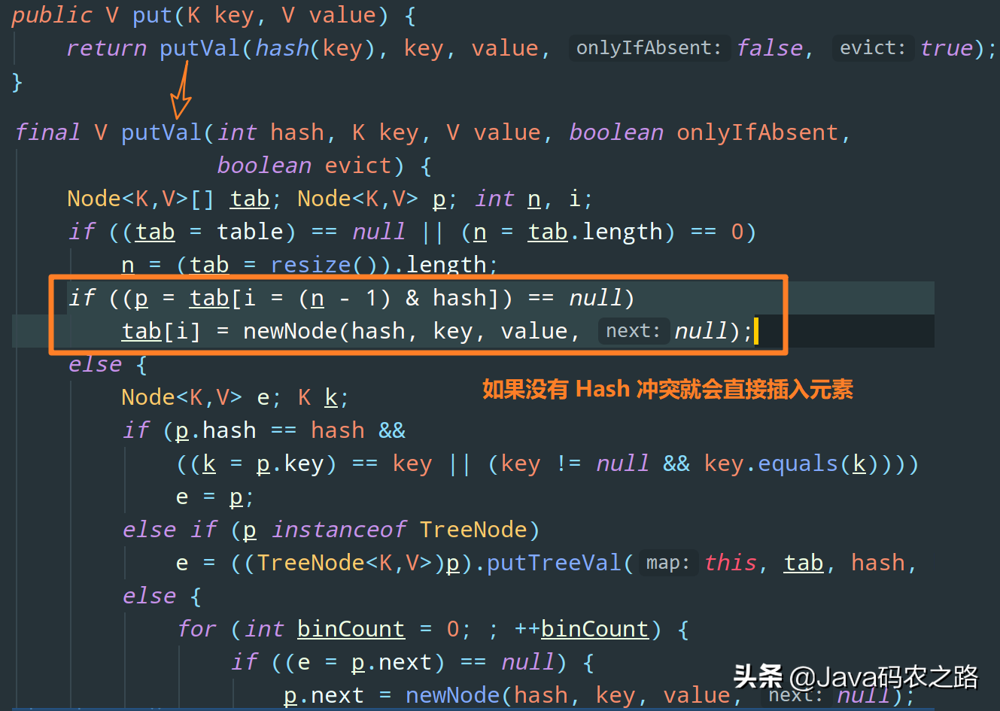


注意上图我圈出来的代码，如果没有发生 Hash 冲突就会直接插入元素。

假设线程 1 和线程 2 同时进行 put 操作，恰好这两条不同的数据的 hash 值是一样的，并且该位置数据为null，这样，线程 1 和线程 2 都会进入这段代码进行插入元素。假设线程 1 进入后还没有开始进行元素插入就被挂起，而线程 2 正常执行，并且正常插入数据，随后线程 1 得到 CPU 调度进行元素插入，这样，线程 2 插入的数据就被覆盖了。

总结一下 HashMap 在 JDK 1.7 和 JDK 1.8 中为什么不安全：

- JDK 1.7：由于采用头插法改变了链表上元素的的顺序，并发环境下扩容可能导致循环链表的问题
- JDK 1.8：由于 put 操作并没有上锁，并发环境下可能发生某个线程插入的数据被覆盖的问题

## 25、如何规避 HashMap 的线程不安全？

单线程条件下，为避免出现ConcurrentModificationException，需要保证只通过HashMap本身或者只通过Iterator去修改数据，不能在Iterator使用结束之前使用HashMap本身的方法修改数据。因为通过Iterator删除数据时，HashMap的modCount和Iterator的expectedModCount都会自增，不影响二者的相等性。如果是增加数据，只能通过HashMap本身的方法完成，此时如果要继续遍历数据，需要重新调用iterator()方法从而重新构造出一个新的Iterator，使得新Iterator的expectedModCount与更新后的HashMap的modCount相等。

多线程条件下，可使用两种方式：

- Collections.synchronizedMap方法构造出一个同步Map

- 使用 java.util.Collections 类的 synchronizedMap 方法包装一下 HashMap，得到线程安全的 HashMap，其原理就是对所有的修改操作都加上 synchronized。方法如下：

  ```
  public static <K,V> Map<K,V> synchronizedMap(Map<K,V> m) 
  ```

- 使用线程安全的 HashTable 类代替，该类在对数据操作的时候都会上锁，也就是加上 synchronized

- 使用线程安全的 ConcurrentHashMap 类代替，该类在 JDK 1.7 和 JDK 1.8 的底层原理有所不同，JDK 1.7 采用数组 + 链表存储数据，使用分段锁 Segment 保证线程安全；JDK 1.8 采用数组 + 链表/红黑树存储数据，使用 CAS + synchronized 保证线程安全。

## 26、HashMap 和 ConcurrentHashMap 的区别？

1. 都是 key-value 形式的存储数据；
2. HashMap 是线程不安全的，ConcurrentHashMap 是 JUC 下的线程安全的；
3. HashMap 底层数据结构是数组 + 链表（JDK 1.8 之前）。JDK 1.8 之后是数组 + 链表 + 红黑 树。当链表中元素个数达到 8 的时候，链表的查询速度不如红黑树快，链表会转为红黑树，红 黑树查询速度快；
4. HashMap 初始数组大小为 16（默认），当出现扩容的时候，以 0.75 * 数组大小的方式进行扩 容；
5. ConcurrentHashMap 在 JDK 1.8 之前是采用分段锁来现实的 Segment + HashEntry， Segment 数组大小默认是 16，2 的 n 次方；JDK 1.8 之后，采用 Node + CAS + Synchronized 来保证并发安全进行实现。

## 27、为什么 ConcurrentHashMap 比 HashTable 效率要高？

HashTable：使用一把锁（锁住整个链表结构）处理并发问题，多个线程竞争一把锁，容易阻塞；

ConcurrentHashMap：

- JDK 1.7 中使用分段锁（ReentrantLock + Segment + HashEntry），相当于把一个 HashMap 分成多个段，每段分配一把锁，这样支持多线程访问。锁粒度：基于 Segment，包含多个 HashEntry。
- JDK 1.8 中使用CAS + synchronized + Node + 红黑树。锁粒度：Node（首结点）（实现 Map.Entry<K,V>）。锁粒度降低了。

## 28、说说 ConcurrentHashMap中 锁机制

JDK 1.7 中，采用分段锁的机制，实现并发的更新操作，底层采用数组+链表的存储结构，包括两个核心静态内部类 Segment 和 HashEntry。

①、Segment 继承 ReentrantLock（重入锁） 用来充当锁的角色，每个 Segment 对象守护每个散列映射表的若干个桶；

②、HashEntry 用来封装映射表的键-值对；

③、每个桶是由若干个 HashEntry 对象链接起来的链表


JDK 1.8 中，采用Node + CAS + Synchronized来保证并发安全。取消类 Segment，直接用 table 数组存储键值对；当 HashEntry 对象组成的链表长度超过 TREEIFY_THRESHOLD 时，链表转换为红黑树，提升性能。底层变更为数组 + 链表 + 红黑树。


## 29、在 JDK 1.8 中，ConcurrentHashMap 为什么要使用内置锁 synchronized 来代替重入锁 ReentrantLock？

①、粒度降低了；

②、JVM 开发团队没有放弃 synchronized，而且基于 JVM 的 synchronized 优化空间更大，更加自然。

③、在大量的数据操作下，对于 JVM 的内存压力，基于 API 的 ReentrantLock 会开销更多的内存。

## 30、能对ConcurrentHashMap 做个简单介绍吗？

①、重要的常量：　　

private transient volatile int sizeCtl; 　　

当为负数时，-1 表示正在初始化，-N 表示 N - 1 个线程正在进行扩容；　　

当为 0 时，表示 table 还没有初始化；　　

当为其他正数时，表示初始化或者下一次进行扩容的大小。

②、数据结构：　　

Node 是存储结构的基本单元，继承 HashMap 中的 Entry，用于存储数据；

TreeNode 继承 Node，但是数据结构换成了二叉树结构，是红黑树的存储结构，用于红黑树中存储数据；　　

TreeBin 是封装 TreeNode 的容器，提供转换红黑树的一些条件和锁的控制。

③、存储对象时（put() 方法）：　　

1. 如果没有初始化，就调用 initTable() 方法来进行初始化；　　
2. 如果没有 hash 冲突就直接 CAS 无锁插入；　　
3. 如果需要扩容，就先进行扩容；　　
4. 如果存在 hash 冲突，就加锁来保证线程安全，两种情况：一种是链表形式就直接遍历到尾端插入，一种是红黑树就按照红黑树结构插入；　　
5. 如果该链表的数量大于阀值 8，就要先转换成红黑树的结构，break 再一次进入循环 　　
6. 如果添加成功就调用 addCount() 方法统计 size，并且检查是否需要扩容。

④、扩容方法 transfer()：默认容量为 16，扩容时，容量变为原来的两倍。　　helpTransfer()：调用多个工作线程一起帮助进行扩容，这样的效率就会更高。

⑤、获取对象时（get()方法）：　　

1. 计算 hash 值，定位到该 table 索引位置，如果是首结点符合就返回；　　
2. 如果遇到扩容时，会调用标记正在扩容结点 ForwardingNode.find()方法，查找该结点，匹配就返回；　　
3. 以上都不符合的话，就往下遍历结点，匹配就返回，否则最后就返回 null。

## 31、熟悉ConcurrentHashMap 的并发度吗？

程序运行时能够同时更新 ConccurentHashMap 且不产生锁竞争的最大线程数。默认为 16，且可以在构造函数中设置。当用户设置并发度时，ConcurrentHashMap 会使用大于等于该值的最小2幂指数作为实际并发度（假如用户设置并发度为17，实际并发度则为32）。

## 32、以 HashMap 为例，解释一下为什么重写 equals 方法的时候还需要重写 hashCode 方法呢？

既然讲到 equals 了，那就先顺便回顾下运算符 == 的吧，它存在两种使用情况：

- 对于基本数据类型来说， == 比较的是值是否相同；
- 对于引用数据类型来说， == 比较的是内存地址是否相同。

equals()也存在两种使用情况：

- 情况 1：没有重写 equals() 方法。则通过 equals() 比较该类的两个对象时，等价于通过 == 比较这两个对象（比较的是地址）。
- 情况 2：重写 equals() 方法。一般来说，我们都会重写 equals() 方法来判断两个对象的内容是否相等，比如 String 类就是这样做的。当然，你也可以不这样做。

另外，我们还需要明白，**如果我们不重写 hashCode()，那么任何对象的 hashCode() 值都不会相等**。

OK，回到问题，为什么重写 equals 方法的时候还需要重写 hashCode 方法呢？

以 HashMap 为例，HashMap 是通过 hashCode(key) 去计算寻找 index 的，如果多个 key 哈希得到的 index 一样就会形成链表，那么如何在这个具有相同 hashCode 的对象链表上找到某个对象呢？

那就是通过重写的 equals 比较两个对象的值。

总体来说，HashMap 中get(key) 一个元素的过程是这样的，先比较 key 的 hashcode() 是否相等，若相等再通过 equals() 比较其值，若 equals() 相等则认为他们是相等的。若 equals() 不相等则认为他们不相等。

如果只重写 equals 没有重写 hashCode()，就会导致相同的对象却拥有不同的 hashCode，也就是说在判断的第一步 HashMap 就会认为这两个对象是不相等的，那显然这是错误的。

## 33、讲讲 HashMap 的底层结构和原理

HashMap 就是以 Key-Value 的方式进行数据存储的一种数据结构嘛，在我们平常开发中非常常用，它在 JDK 1.7 和 JDK 1.8 中底层数据结构是有些不一样的。总体来说，JDK 1.7 中 HashMap 的底层数据结构是数组 + 链表，使用 Entry 类存储 Key 和 Value；JDK 1.8 中 HashMap 的底层数据结构是数组 + 链表/红黑树，使用 Node 类存储 Key 和 Value。当然，这里的 Entry 和 Node 并没有什么不同，我们来看看 Node 类的源码：

```
// HashMap 1.8 内部使用这个数组存储所有键值对
transient Node<K,V>[] table;
```

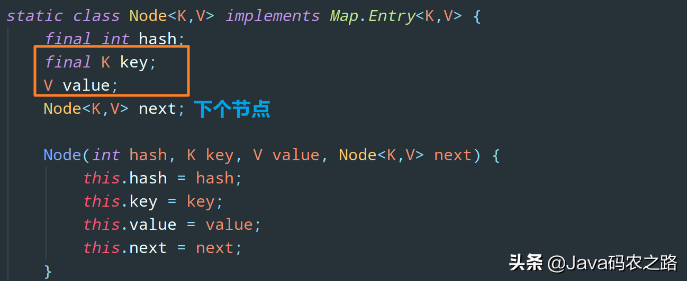


每一个节点都会保存自身的 hash、key 和 value、以及下个节点。咱先画个简略的 HashMap 示意图：

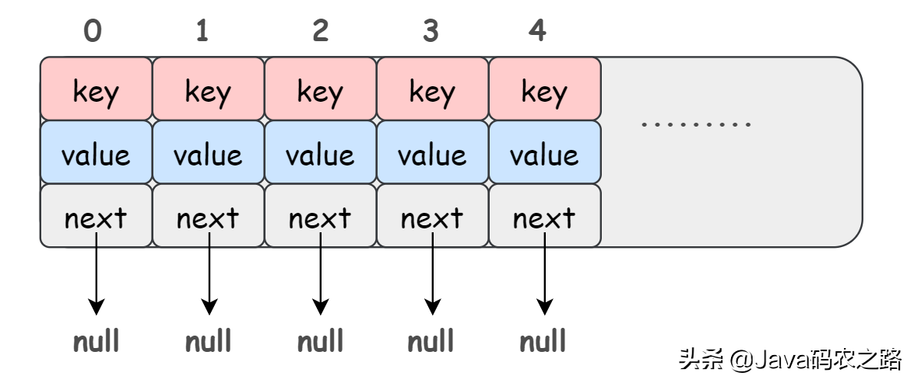


因为 HashMap 本身所有的位置都为 null 嘛，所以在插入元素的时候即 put 操作时，会根据 key 的 hash 去计算出一个 index 值，也就是这个元素将要插入的位置。

举个例子：比如 put("小牛肉"，20)，我插入了一个 key 为 "小牛肉" value 为 20 的元素，这个时候我们会通过哈希函数计算出这个元素将要插入的位置，假设计算出来的结果是 2：


我们刚刚还提到了链表，Node 类里面也确实定义了一个 next 属性，那么为啥需要链表呢？

首先，数组的长度是有限的对吧，在有限的数组上使用哈希，那么哈希冲突是不可避免的，很有可能两个元素计算得出的 index 是相同的，那么如何解决哈希冲突呢？**拉链法**。也就是把 hash 后值相同的元素放在同一条链表上。比如说：

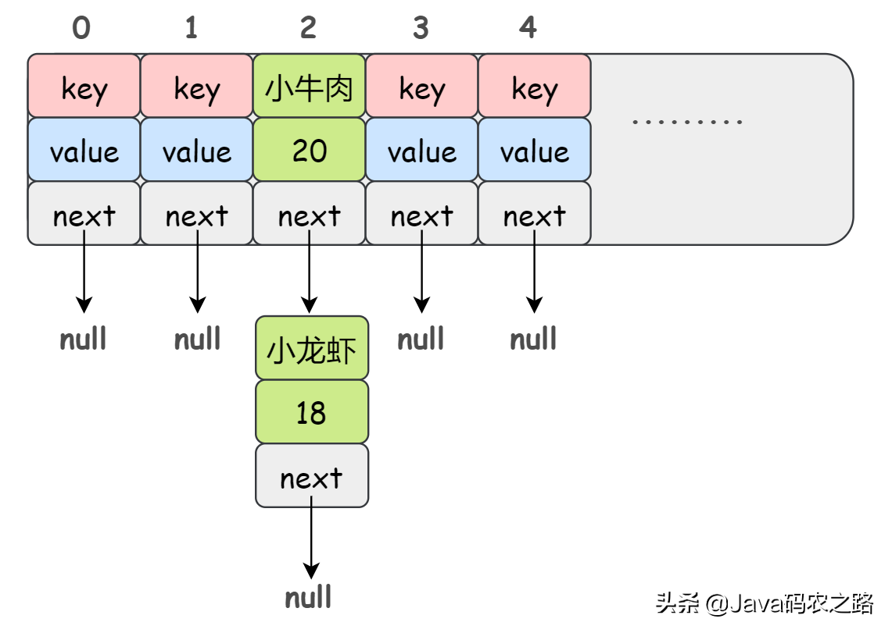


当然这里还有一个问题，那就是当 Hash 冲突严重时，在数组上形成的链表会变得越来越长，由于链表不支持索引，要想在链表中找一个元素就需要遍历一遍链表，那显然效率是比较低的。为此，JDK 1.8 引入了红黑树，**当链表的长度大于 8 的时候就会转换为红黑树，不过，在转换之前，会先去查看 table 数组的长度是否大于 64，如果数组的长度小于 64，那么 HashMap 会优先选择对数组进行扩容 resize，而不是把链表转换成红黑树**。


看下 JDK 1.8 下 HashMap 的完整示意图，应该画得比较清晰了：

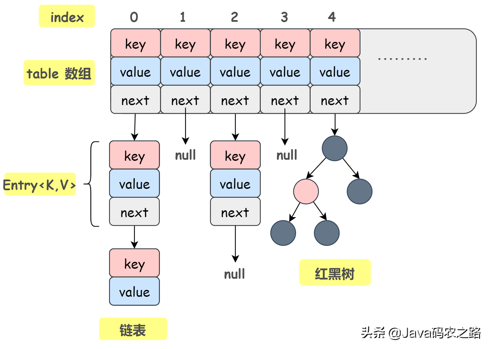


## 34、新的 Entry/Node 节点在插入链表的时候，是怎么插入的？

在 JDK 1.7 的时候，采用的是头插法，看下图：

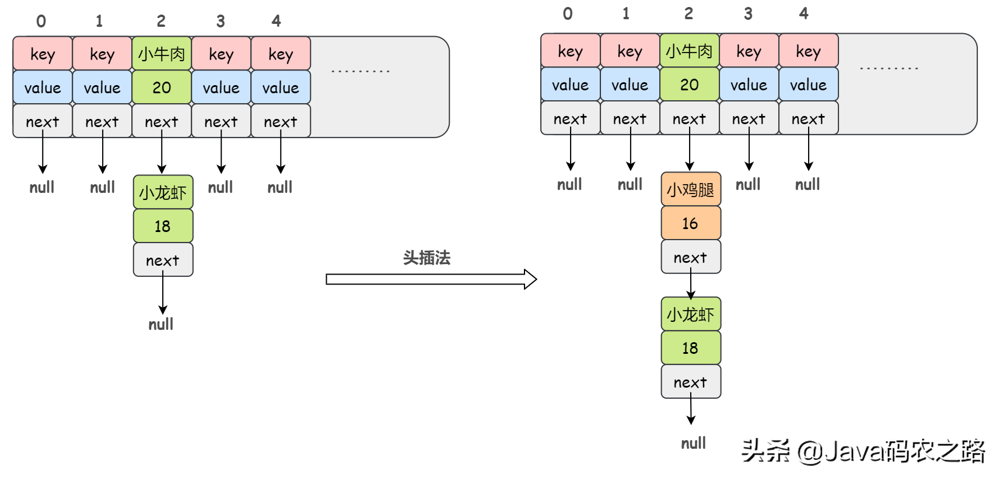


不过 JDK 1.8 改成了尾插法，这是为什么呢？因为 **JDK 1.7 中采用的头插法在多线程环境下可能会造成循环链表问题**。

首先，我们之前提到，数组容量是有限的，如果数据多次插入并到达一定的数量就会进行数组扩容，也就是resize 方法。什么时候会进行 resize 呢？与两个因素有关：

1）Capacity：HashMap 当前最大容量/长度

2）LoadFactor：负载因子，默认值0.75f


如果当前存入的数据数量大于 Capacity * LoadFactor 的时候，就会进行数组扩容 resize。就比如当前的 HashMap 的最大容量大小为 100，当你存进第 76 个的时候，判断发现需要进行 resize了，那就进行扩容。当然，HashMap 的扩容不是简单的扩大点容量这么简单的。

**扩容 resize 分为两步**：

1）扩容：创建一个新的 Entry/Node 空数组，长度是原数组的 **2 倍**

2）ReHash：遍历原 Entry/Node 数组，把所有的 Entry/Node 节点重新 Hash 到新数组

为什么要 ReHash 呢？直接复制到新数组不行吗？

显然是不行的，因为数组的长度改变以后，Hash 的规则也随之改变。index 的计算公式是这样的：

- index = HashCode(key) & (Length - 1)

比如说数组原来的长度（Length）是 4，Hash 出来的值是 2 ，然后数组长度翻倍了变成 16，显然 Hash 出来的值也就会变了。画个图解释下：

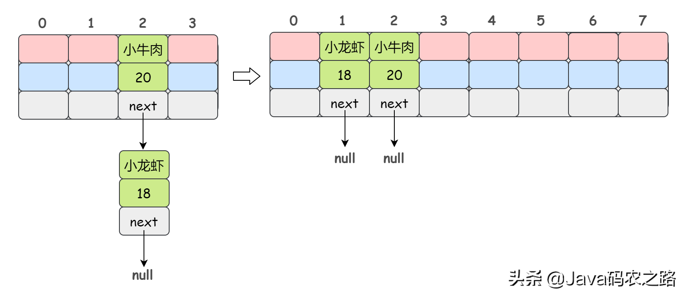


OK，说完扩容机制我们言归正传，为啥 JDK 1.7 使用头插法，JDK 1.8 之后改成尾插法了呢？

我们来看 1.7 的 resize 方法：


newTable 就是扩容后的新数组，transfer 方法是 resize 的核心，它的的功能就是 ReHash，然后将原数组中的数据迁移到新数据。我们先来把 transfer 代码简化一下，方便下文的理解：

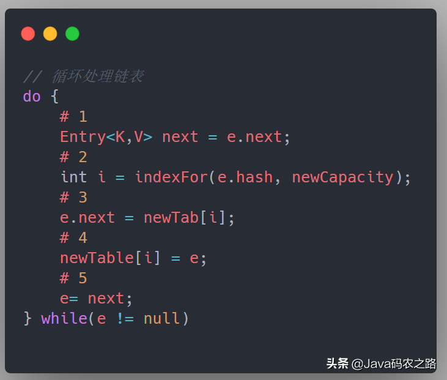


先来看看单线程情况下，正常的 resize 的过程。假设我们原来的数组容量为 2，记录数为 3，分别为：[3,A]、[7,B]、[5,C]，并且这三个 Entry 节点都落到了第二个桶里面，新数组容量会被扩容到 4。

> 下面的图画的可能会有点不严谨，不过能够方便大家理解其中意思就好

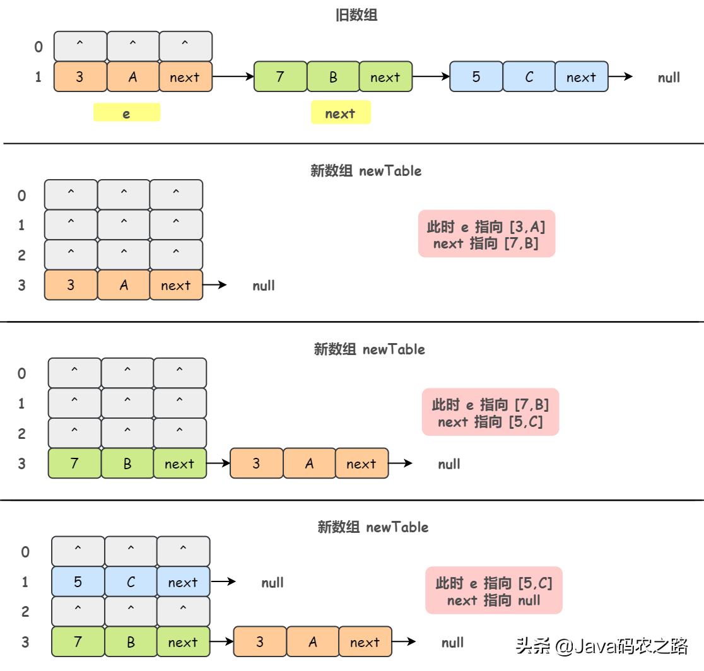


OK，那现在如果我们有两个线程 Thread1 和 Thread2，假设线程 Thread1 执行到了 transfer 方法的 Entry next = e.next 这一句，然后时间片用完了被挂起了。随后线程 Thread2 顺利执行并完成 resize 方法。于是我们有下面这个样子：

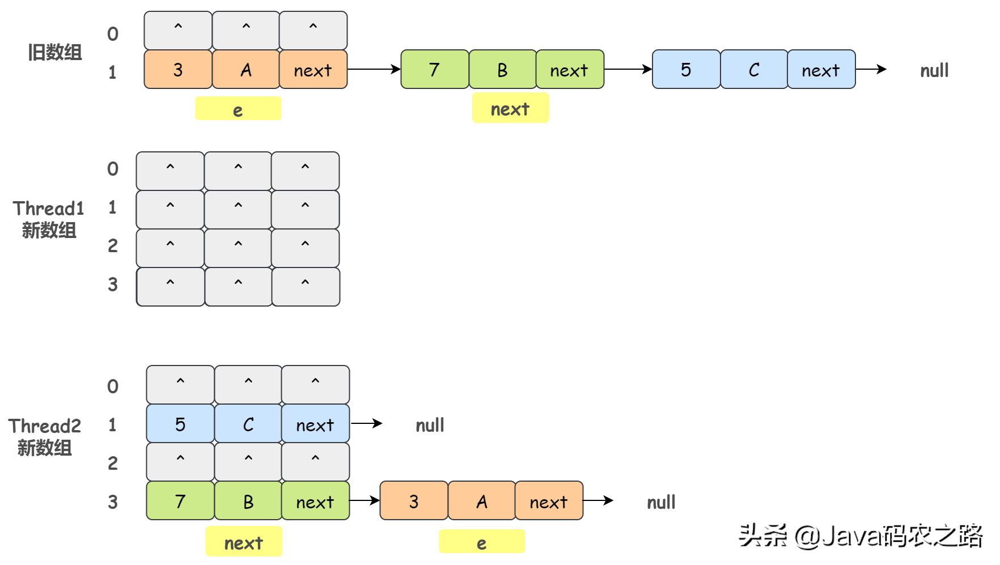


注意，Thread1 的 e 指向了 [3,A]，next 指向了 [7,B]，**而在线程 Thread2 进行 ReHash后，e 和 next 指向了线程 Thread2 重组后的链表**。我们可以看到链表的顺序被反转了。

OK，这个时候线程 Thread1 被重新调度执行，先是执行 newTalbe[i] = e，i 就是 ReHash 后的 index 值：

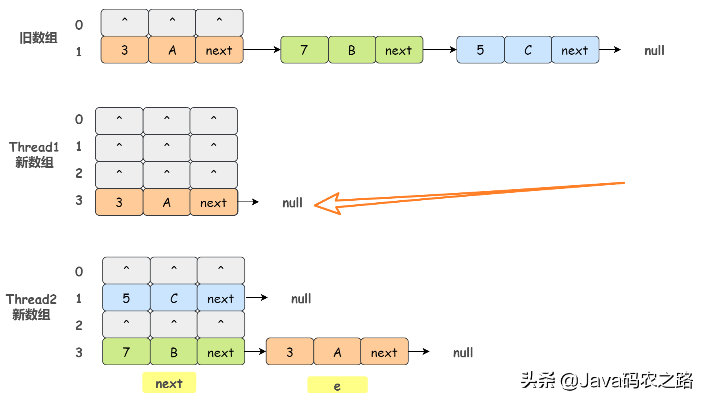


然后执行 e = next，导致了 e 指向了 [7,B]，而下一次循环执行到 next = e.next 时导致了 next 指向了 [3,A]

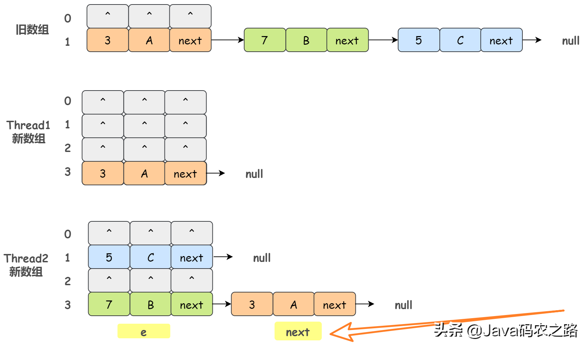


然后，线程 Thread1 继续执行。把旧数组的 [7,B] 摘下来，放到 newTable[i] 的第一个，然后把 e 和 next 往下顺移：

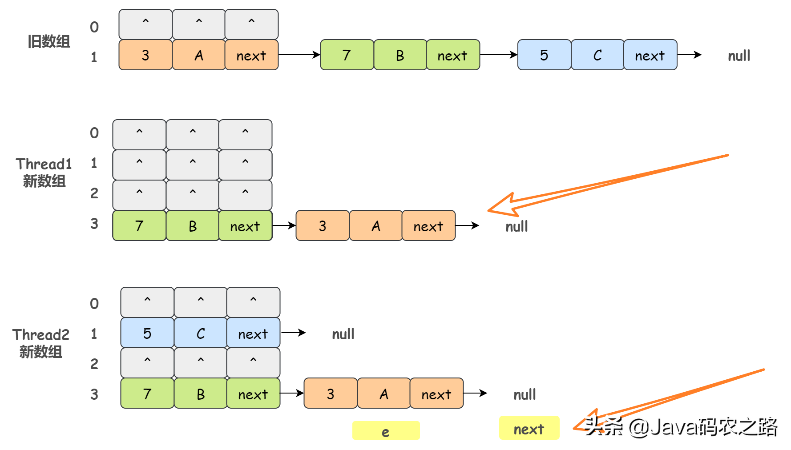


OK，Thread1 再进入下一步循环，执行到 e.next = newTable[i]，导致 [3,A].next 指向了 [7,B]，循环链表出现！！！

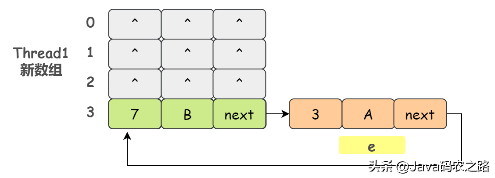


**由于 JDK 1.7 中 HashMap 使用头插会改变链表上元素的的顺序，在旧数组向新数组转移元素的过程中修改了链表中节点的引用关系，因此 JDK 1.8 改成了尾插法，在扩容时会保持链表元素原本的顺序，避免了链表成环的问题**。

## 来源

[HashMap的31连环炮，我倒在第5个上](https://www.toutiao.com/i6950580109808026125/?tt_from=weixin&utm_campaign=client_share&wxshare_count=1&timestamp=1618461557&app=news_article&utm_source=weixin&utm_medium=toutiao_android&use_new_style=1&req_id=2021041512391701015118023114022EEB&share_token=93975982-92ba-4f6f-85be-c23dd7e35ce0&group_id=6950580109808026125)

