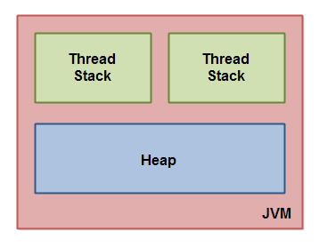
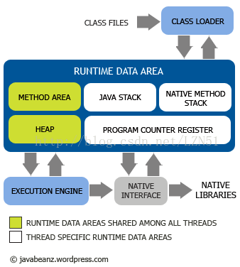

<h1 align="center">Java内存模型（JMM）那些事</h1>

[TOC]

## 一、现代计算机内存模型

随着技术的发展，CPU也在按照摩尔定律快速发展，而内存即主存（Main Memory）发展却十分缓慢，所以CPU与主存间产生了一种因发展速度带来的矛盾，CPU发展太快导致主存跟不上CPU的发展速度，所以出现了三级缓存（不一定都是三级，明白就行），一种比主存读写速度更高的存储，三级缓存的出现暂缓了这种矛盾。ok，再远古的架构我们就先不聊了，从三级缓存的CPU架构看看现代计算机的内存模型。


 

 

CPU的流行架构如上图所示，当CPU要load一个数据时，首先从一级缓存中查找，如果没有找到再从二级缓存中查找，如果还是没有就从三级缓存或内存中查找。
在三级缓存架构中我们不难发现，L3 cache和主存是共享的，所以就存在数据一致性的保障，MESI缓存一致性协议就作用在这里。MESI协议规定了CPU从主存（或者三级缓存）加载或者写入数据的规则，保证了数据的强一致性。关于MESI协议和三级缓存详情请查阅另一篇博客。

## 二、Java内存模型—JMM

Java内存模型（Java Memory Model）即JMM是一个抽象的概念，JMM是一个抽象的概念，JMM是一个抽象的概念，并不是物理上的内存划分，重要事情说三遍。
Java内存模型（JMM）定义了Java虚拟机（JVM）在计算机内存（RAM）中的工作规范。在硬件内存模型中，各种CPU架构的实现是不尽相同的，Java作为跨平台的语言，为了屏蔽底层硬件差异，定义了Java内存模型（JMM）。JMM作用于JVM和底层硬件之间，屏蔽了下游不同硬件模型带来的差异，为上游开发者提供了统一的使用接口。说了这么多其实就是想说明白JMM——JVM——硬件的关系。总之一句话，JMM是JVM的内存使用规范，是一个抽象的概念。


如上图在JMM中，内存划分为两个区域，线程本地内存，主内存。
本地内存：每个线程均有自己的本地内存（Local Memory，也称之为线程的工作内存），本地内存是线程独占的。
主内存：存储所有的变量。如果一个变量被多个线程使用（被多个线程load到线程的本地内存中），则该变量被称之为共享变量。

## 三、JVM对JMM的实现

依据JMM规范，Java内存模型将JVM分为两个部分线程栈（Thread Stack）和堆（Heap）。



线程栈：线程独占，对其他线程不可见。线程间通信或者共享变量需要通过Heap。但另外的线程拿到的也只是该变量的私有拷贝，线程之间不能共享变量本身。
堆：线程创建的对象都在堆区，不管该对象是哪个线程创建的，也不管该对象是成员变量还局部变量。（很好理解，栈是运算速度比较快的区域，对象一般相对较大，栈中只需要一个变量指向堆即可。）
一个误区



具体各种类型的变量或者对象在JVM中的内存划分不是本文重点，本文我们主要讨论JMM。
看上图，是不是有点疑惑，在JVM中内存不是被划分为Java栈，堆，方法区，本地方法栈程序计数器等区域吗？为什么两个图对应不上呢？原因很简单，原则上来说这两个图是没有关系的。
JMM和JVM不是一个层次的东西，勉强对应起来，主内存、工作内存从定义上来看，主内存主要对应于java堆中的示例数据部分，而工作内存则对应于虚拟机栈的部分区域，从更低层次来说，主内存就直接对应物理硬件的内存，而为了获取更好的运行速度，虚拟机（甚至是硬件系统本身的优化措施）可能会让工作内存优先存储于寄存器和高速缓存器中，因为程序运行过程中主要读写访问的是工作内存。感觉知乎上有一个不错的[解释](https://www.zhihu.com/question/45903673/answer/156666045)。

## 四、JMM主内存和本地内存交互操作


计算机硬件内存模型有缓存和主内存的交互协议MESI，同样JMM也规范了主内存和线程工作内存进行数据交换操作。一共包括如上图所示的8中操作，并且每个操作都是原子性的。

1. **lock(锁定)：**作用于主内存的变量，一个变量在同一时间只能一个线程锁定。该操作表示该线程独占锁定的变量。
2. **unlock(解锁)：**作用于主内存的变量，表示这个变量的状态由处于锁定状态被释放，这样其他线程才能对该变量进行锁定。
3. **read(读取)：**作用于主内存变量，表示把一个主内存变量的值传输到线程的工作内存，以便随后的load操作使用。
4. **load(载入)：**作用于线程的工作内存的变量，表示把read操作从主内存中读取的变量的值放到工作内存的变量副本中(副本是相对于主内存的变量而言的)。
5. **use(使用)：**作用于线程的工作内存中的变量，表示把工作内存中的一个变量的值传递给执行引擎，每当虚拟机遇到一个需要使用变量的值的字节码指令时就会执行该操作。
6. **assign(赋值)：**作用于线程的工作内存的变量，表示把执行引擎返回的结果赋值给工作内存中的变量，每当虚拟机遇到一个给变量赋值的字节码指令时就会执行该操作。
7. **store(存储)：**作用于线程的工作内存中的变量，把工作内存中的一个变量的值传递给主内存，以便随后的write操作使用。
8. **write(写入)：**作用于主内存的变量，把store操作从工作内存中得到的变量的值放入主内存的变量中。

JMM规定了以上8中操作需要按照如下规则进行

- 不允许read和load、store和write操作之一单独出现，即不允许一个变量从主内存读取了但工作内存不接受，或者从工作内存发起回写了但主内存不接受的情况出现。
- 不允许一个线程丢弃它的最近的assign操作，即变量在工作内存中改变了之后必须把该变化同步回主内存。
- 不允许一个线程无原因地（没有发生过任何assign操作）把数据从线程的工作内存同步回主内存中。
- 一个新的变量只能在主内存中“诞生”，不允许在工作内存中直接使用一个未被初始化（load或assign）的变量，换句话说就是对一个变量实施use和store操作之前，必须先执行过了assign和load操作。
- 一个变量在同一个时刻只允许一条线程对其进行lock操作，但lock操作可以被同一条线程重复执行多次，多次执行lock后，只有执行相同次数的unlock操作，变量才会被解锁。
- 如果对一个变量执行lock操作，将会清空工作内存中此变量的值，在执行引擎使用这个变量前，需要重新执行load或assign操作初始化变量的值。
- 如果一个变量事先没有被lock操作锁定，则不允许对它执行unlock操作，也不允许去unlock一个被其他线程锁定住的变量。

以上8中规则看着也是比较生涩的，其实如果你没看明白也没关系，其实这些规则就是保障数据同步的一些规则。不是很重要，重要的在后面的happens-before原则。

## 五、并发环境下JMM存在的问题

并发编程的三个特征：原子性，有序性，可见性

1 原子性(Atomicity)：一个操作是不可中断的，要么全部执行成功要么全部执行失败。

2 可见性（Visibility）：所有线程都能看到共享内存的最新状态。（一个线程修改了一个共享变量，其他线程能够立即看到该变量的最新值）

3 有序性（Ordering）：即程序执行的顺序按照代码的先后顺序执行。

以上三个概念应该很容易理解，在此不做过多解释。


### 1，原子性

JMM保证了四章节中的8个操作是原子性的，Java语言本身对基本数据类型的变量的读取和赋值操作是原子性操作。（JVM不对double和long类型的变量做原子性保障，可能的原因是缓存行的大小导致的）
比如

```
x = 1;//1
x ++;//2
y = x;//3
```


以上三行代码其实只有x = 1是原子性的，这行代码只是对x进行赋值。
x ++；不是原子操作，因为这行代码包含三个操作：加载x的值，执行 ++，然后写入新值。单个操作是原子性的，多个操作组合起来就不是原子性的了。尤其是在并发环境下，如果x变量是多个线程共享的，会导致线程安全性问题。
y = x;同理也不是原型操作，因为需要首先加载x变量，再赋值给y。
在并发环境下，为了保证原子性通常采用synchronized或者Lock对代码块加锁保证原子性。


### 2，可见性

在Java中提供了一个volatile关键字来保证可见性。当一个主内存中的共享变量被volatile关键字修饰时，一个线程对该变量的修改会被立即刷新（store）到主内存，保证其他线程看到的值一定是最新的。可以[参考](https://www.cnblogs.com/hello-shf/p/12091591.html)
JMM层面上volatile是通过load/store操作实现的可见性，当然我们也可以通过synchronized和Lock通过加锁将多线程进行同步也就是串行执行来保证共享变量的可见性。很好理解，当两个线程都需要操作一个共享变量，后到的线程需要等到先到的线程执行完才能继续执行，变相的保证了数据的可见性。
当然在可见性层面，加锁相对于volatile是比较重量级的一个操作。

### 3，有序性

**happens-before原则**

1 程序次序规则：一个线程内，按照代码顺序，书写在前面的操作先行发生于后面的操作。

2 锁定规则：一个unlock操作先行发生于后面对同一个锁的lock操作。（先释放锁，才能加锁）

3 volatile变量规则：对同一个变量的写操作先行发生于后面对这个变量的读操作。

4 传递规则：如果操作A先行发生于操作B，而操作B又先行发生于C，则A先行发生于操作C。

5 线程启动规则：Thread对象的start()方法先行发生于此线程的每一个动作。

6 线程终结规则：对线程interrupt()方法的调用先行发生于被中断线程的代码检测到中断事件的发生。

7 线程终结规则：线程中所有的操作都先行发生于线程的终结检测，我们可以通过Thread.join()方法结束、Thread.isAlive()的返回值手段检测到线程已经终止执行。

8 对象终结规则：一个对象的初始化完成先行发生于他的finalize()方法的开始。

happens-before是干嘛的呢？我理解的happens-before原则就是一个对人来说显而易见的东西。但是程序并不能理解这么些东西。

**happens-before与可见性**

happens-before通过以上8中规则保证可见性，如果一个操作A happens-before 另一个操作B，那么操作A的结果是对操作B可见的。不难理解。

**happens-before与重排序**

两个操作如果存在happens-before关系，并不意味着一定是有序进行的，因为JVM存在指令重排优化，如果JVM认为两个操作重排序有利于性能提升并且重排序后的操作和未重排结果一致，将进行指令重排序。当然JVM层面的重排序发生于编译期，运行时的指令重排是处理器决定的。

Java语言通过volatile关键字通过向主内存加入内存屏障实现禁止指令重排。

## 参考

[Java内存模型（JMM）那些事](https://www.cnblogs.com/hello-shf/p/12100799.html)