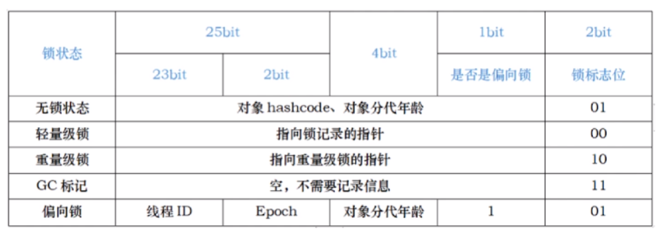
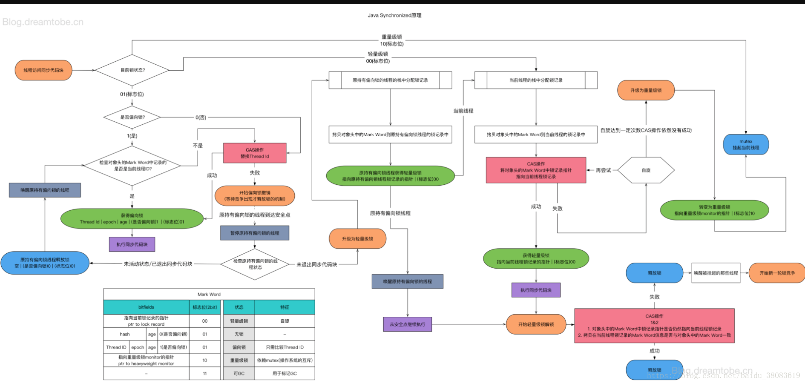

<h1 align="center">Java程序员必精通之—synchronized</h1>

[TOC]

## 一、简介

相信每一个java程序员对synchronized都不会太陌生，尤其是在大家关心的面试环节，不了解synchronize？不好意思，拜拜了您嘞。synchronized作为java一个重要的同步机制，在远古时代是被人嗤之以鼻的存在，因为在早期，synchronized属于重量级锁，即底层采用的是操作系统提供的Mutex lock实现的，为什么说他是重量级的锁呢，主要是线程间的切换需要操作系统从用户态切换到核心态，开销极其大。所以synchronized被人嗤之以鼻也就理所当然了，当然在java1.5之后呢，synchronized引入了偏向锁，轻量级锁，以减少对重量级锁的依赖（减少对重量级锁的使用是synchronized优化的终极目标），在此之后synchronized重新焕发心机，迎来了第一个春天。

## 二、预备知识

### 1，CAS

在学习synchronized之前，我们需要明白CAS（Compare and Swap）是什么鬼，CAS呢在不同的角度有很多我们常听到的名词：乐观锁，自旋锁。其实这个CAS在当前的各种中间件或者语言或者数据库中具有相当重要的地位。synchronized锁获取和撤销中正式使用的CAS自旋操作。

### 2，重入锁

什么叫重入锁呢？很简单，从互斥锁的设计上来说，当一个线程试图操作一个由其他线程持有的对象锁的临界资源时，将会处于阻塞状态，但当一个线程再次请求自己的对象锁锁定的临界资源时，是可重入的即不需要再去获取锁。

## 三、对象头 - Mark Word

**Mark World**

Java中每一个对象都可作为锁。原因是每个对象的对象头都存在一个32bit的空间记录着对象的基础信息。默认记录对象的hashCode，分带年龄（GC的知识），所类型，锁标志位（谁在拿着这把锁）。。。
记录这些信息的区域叫做：Mark Word



线程ID即当前持有锁的线程信息。
锁标志位：01（默认），00（轻量级锁）,10（重量级锁）

**Monitor**

monitor：监视器
你想想JVM怎么知道哪个对象的Mark Word状态？答案就是这个monitor，monitor是synchronized实现的另一个基础，任何一个Java对象都有一个monitor与之关联，当一个monitor被一个线程持有后，他将处于被锁定状态。值得注意的一点monitor只作用于重量级锁中。

## 四、synchronize锁升级过程

synchronized锁有四个状态：无锁，偏向锁，轻量级锁，重量级锁
synchronized锁升级的方向：无锁 >> 偏向锁 >> 轻量级锁 >> 重量级锁
性能开销从左到右依次增加。
锁只会升级不会降级。

### 1，偏向锁

大多数情况下，锁不存在多线程竞争，总是由同一个线程多次获得。
偏向锁的使用旨在于减少对轻量级锁的依赖，偏向锁的加锁和解锁需要使用CAS自旋。
偏向锁加锁过程：如果一个线程进入同步代码块（synchronized）获得了锁，那么锁就进入了偏向模式，此时Mark Word的结构也就变为偏向结构，当该线程再次进入同步块（请求锁时）将不再需要话费CAS操作来加锁或者获取锁，即获取锁的过程只需要检查Mark Word的锁标记为是否为偏向锁以及当前线程ID是否等于Mark Word中的threadID即可，这样就省去了大量有关锁申请的操作。如果当前线程从Mark Word获取的锁标志位为01（偏向锁）并且ThreadId=当前线程ID，则加锁成果。
偏向锁撤销过程：
偏向锁是用来一种竞争才释放锁的机制，所以当其他线程尝试竞争（CAS自旋）偏向锁时，持有偏向锁的线程才有可能会释放锁。偏向锁的撤销，需要等待全局安全点（在这个时间点上没有字节码再执行），他会首先暂停拥有偏向锁的线程，然后检查持有偏向锁的线程是否活着，如果线程不处于活动状态，则将对象头设置成无锁状态，该锁会重新偏向竞争者，即Mark Word中ThreadID重新指向竞争者。如果当前线程依然存活，即竞争者会获取失败，则偏向锁会膨胀为轻量级锁。
关闭偏向锁：偏向锁在 Java 6 和 Java 7 里是默认启用的，但是它在应用程序启动几秒钟之后才激活，如有必要可以使用 JVM 参数来关闭延迟 -XX：BiasedLockingStartupDelay = 0。如果你确定自己应用程序里所有的锁通常情况下处于竞争状态，可以通过 JVM 参数关闭偏向锁 -XX:-UseBiasedLocking=false，那么默认会进入轻量级锁状态。
当前这种偏向模式不适合锁竞争比较激烈的多线程场合。

### 2，轻量级锁

轻量级锁加锁过程：前面说到偏向锁由轻量级锁升级而来，偏向锁运行在一个线程进入同步块的情况下，当第二个线程加入锁挣用的时候，尝试通过CAS自旋修改Mark Word中的ThreadID，如果替换失败，如果在一定次数内（自适应自旋机制）还是失败，偏向锁就会升级为轻量级锁，当前如前面所说，偏向锁要经历偏向锁撤销 -- 到达安全点 -- 膨胀为轻量级锁。安全点是重点。
轻量级锁膨胀过程：当持有轻量级锁的线程正在执行同步代码块（持有锁），此时又有线程来竞争锁，首先该线程依然会通过CAS自旋替换Mark Word中的ThreadID为本线程的ID，在一定次数内修改失败（当前锁被其他线程持有），轻量级锁会膨胀为重量级锁。成功则继续执行知道当前线程执行完成，释放轻量级锁。
轻量级锁比较适合线程交替执行的场景。

### 3，重量级锁

轻量级锁因为竞争激烈，会膨胀为重量级锁，一旦锁膨胀为重量级锁，线程切换将不是通过CAS自旋竞争来切换线程，而是未持有锁的竞争者将进入阻塞态。线程的状态切换都是操作系统底层的mutex lock来实现，而这个操作将意味着实现线程之间的切换需要从用户态转为核心态，这个成本是非常高的。
详细的锁升级过程如下图所示：



模拟一下以上过程，假设有两个线程，线程A和线程B

**1，当线程A首先进入同步代码块**

1）检查锁状态：判断锁标志位是否为01，如果是即偏向锁状态

2）检查偏向状态：Mark Word中的ThreadID是否为当前线程

是：当前线程即线程A进入偏向锁，执行同步代码块。

否：进入偏向锁竞争

**2，模拟偏向锁竞争**

假设线程A当前持有偏向锁，此时，线程B进入同步代码块

1）线程B同样经过1中的1）

2）但是Mark Word中的ThreadID == 线程A的ThreadID，即线程B获取失败

3）CAS自旋：线程B进入CAS自旋，尝试去替换ThreadID（CAS自旋采用的是自适应自旋）

成功：获取到偏向锁，执行同步代码块。

失败：在一定次数内还是失败，偏向锁膨胀为轻量级锁

**3，偏向锁升级为轻量级锁**

接着以上过程

1）线程B自旋替换ThreadID失败，当前持有偏向锁的线程A开始执行偏向锁撤销（等待竞争才释放的机制）

2）线程A到达安全点 ，虚拟机暂停原持有偏向锁的线程即线程A

3）虚拟机检查Mark Word中ThreadID指向的线程（线程A）状态

不活动状态：已退出同步代码块，表示线程A已退出竞争，线程B获取到偏向锁

活动状态：未退出同步代码块，锁膨胀为轻量级锁。

**4，轻量级锁竞争及膨胀过程**

接着以上过程线程A膨胀为轻量级锁

1）拷贝Mark Word到线程A的线程栈中，修改锁标志位为00，修改ThreadID指向当前线程即线程A。线程A被唤醒，从安全点继续执行。

2）线程B开始进入同步代码块，线程B发现锁标志位为00，拷贝对象头中的Mark Word到自己的线程栈。

3）线程B自旋修改Mark Word中的ThreadID

成功：执行同步代码块

失败：轻量级锁膨胀为重量级锁，标志位被修改为 10，指针指向monitor。

**5，重量级锁竞争**

synchronized膨胀为重量级锁之后，线程调度将依赖于操作系统底层的monitor

竞争不到锁的线程将进入阻塞状态，线程切换将会导致操作系统内核由用户态到核心态的转变（关于这个知识可以参考操作系统进程和线程调度的知识）。

## 五、synchronized优化

关于synchronized的使用，度娘一下一大把，在此就不在赘述。

### 1，锁粒度优化 —— 应用层优化

synchronized作用域：
修饰静态方法：锁是当前对象的 Class 对象，即类锁。
修饰非静态方法：锁是当前实例对象，即对象锁。
修饰代码块：锁是 Synchonized 括号里配置的对象（不要用Test.class这样等同于类锁）。
从上至下，锁粒度是递减的，其实最推荐使用的还是修饰同步代码块，这样尽量减少线程持有锁的时间。如果你用的是类锁，一旦锁膨胀为重量级锁，而类本身生命周期可以简单地理解为=进程，锁又不会被及时的GC掉，1.6之后对synchronize所做的偏向锁，轻量级锁优化等于没做。
锁粗化：
原则上我们需要将锁的粒度尽量的减小，以减少锁持有的时间。任何事情过度的追求等于浪费，如果对一个对象反复的加锁解锁，也是很浪费时间的，所以当出现这种场景，尽量的需要合并同步代码块，减少频繁加锁和解锁的资源浪费。

### 2，自适应自旋锁 —— 实现层优化

常规的自旋我们一般会这么写
while(true){...}
无限制的自旋是对CPU资源的极度浪费，JVM为了节省资源的浪费即更加的智能化，采用了自旋自适应锁，即自旋的次数不再是无限制或者固定次数，将由前一次在同一个锁上的自旋时间及锁的拥有者的状态来确定。

### 3，锁消除 —— JVM编译层优化

锁消除即删除不必要的加锁操作。JIT编译期，根据代码逃逸技术，如果判断到一段代码中，堆上的数据不会逃逸出当前线程，那么可以认为这段代码是线程安全的，不必加锁。
比如如下代码：

```java
public void add(String str1,String str2){
    StringBuffer sb = new StringBuffer();
    sb.append(str1).append(str2);
}
```

JVM会傻到用stringBuffer吗？不会的，在编译器就给你把stringBuffer方法上的synchronized给优化掉了。

## 参考

[Java程序员必精通之—synchronized](https://www.cnblogs.com/hello-shf/p/12093868.html)