<h1 align="center">比AtomicLong更优秀的LongAdder确定不来了解一下吗？</h1>

[toc]

### 前言

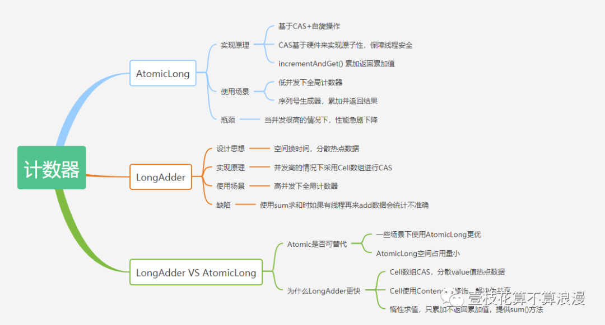思维导图.png

文章中所有`高清无码图片`在**公众号号回复:** `图片666` 即可查阅。

最近阿里巴巴发布了`Java开发手册(泰山版)` (**公众号回复：** `开发手册` 可收到`阿里巴巴开发手册(泰山版 2020.4.22发布).pdf`)，其中第`17条`写到：

阿里巴巴开发手册.png

对于`Java项目中`计数统计的一些需求，**如果是 JDK8，推荐使用 LongAdder 对象，比 AtomicLong 性能更好（减少乐观锁的重试次数）**

在大多数项目及开源组件中，计数统计使用最多的仍然还是`AtomicLong`，虽然是阿里巴巴这样说，但是我们仍然要根据使用场景来决定是否使用`LongAdder`。

今天主要是来讲讲`LongAdder`的**实现原理**，还是老方式，通过**图文**一步步解开`LongAdder`神秘的面纱，通过此篇文章你会了解到：

- **为什么AtomicLong在高并发场景下性能急剧下降？**
- **LongAdder为什么快？**
- **LongAdder实现原理（图文分析）**
- **AtomicLong是否可以被遗弃或替换？**

**本文代码全部基于JDK 1.8，建议边看文章边看源码更加利于消化**

### AtomicLong

当我们在进行计数统计的时，通常会使用`AtomicLong`来实现。`AtomicLong`能保证并发情况下计数的准确性，其内部通过`CAS`来解决并发安全性的问题。

#### AtomicLong实现原理

说到线程安全的计数统计工具类，肯定少不了`Atomic`下的几个原子类。`AtomicLong`就是**juc包**下重要的**原子类**，在并发情况下可以对长整形类型数据进行原子操作，**保证并发情况下数据的安全性。**

```java
public class AtomicLong extends Number implements java.io.Serializable {
    public final long incrementAndGet() {
        return unsafe.getAndAddLong(this, valueOffset, 1L) + 1L;
    }

    public final long decrementAndGet() {
        return unsafe.getAndAddLong(this, valueOffset, -1L) - 1L;
    }
}
```

我们在计数的过程中，一般使用`incrementAndGet()`和`decrementAndGet()`进行加一和减一操作，这里调用了`Unsafe`类中的`getAndAddLong()`方法进行操作。

接着看看`unsafe.getAndAddLong()`方法：

```java
 public final class Unsafe {
     public final long getAndAddLong(Object var1, long var2, long var4) {
         long var6;
         do {
             var6 = this.getLongVolatile(var1, var2);
         } while(!this.compareAndSwapLong(var1, var2, var6, var6 + var4));
 
         return var6;
     }

    public final native boolean compareAndSwapLong(Object var1, long var2, long var4, long var6);
}
```

这里直接进行**CAS+自旋**操作更新`AtomicLong`中的`valu`e值，进而保证`value`值的**原子性更新**。

#### AtomicLong瓶颈分析

如上代码所示，我们在使用**CAS + 自旋**的过程中，在高并发环境下，N个线程同时进行自旋操作，会出现大量失败并不断自旋的情况，此时`AtomicLong`的自旋会成为瓶颈。

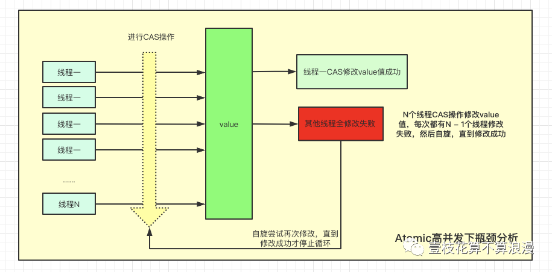AtomicLong瓶颈分析.png

如上图所示，高并发场景下`AtomicLong`性能会急剧下降，我们后面也会举例说明。

那么高并发下计数的需求有没有更好的替代方案呢？在`JDK8` 中 `Doug Lea`大神 新写了一个`LongAdder`来解决此问题，我们后面来看`LongAdder`是如何优化的。

### LongAdder

#### LongAdder和AtomicLong性能测试

我们说了很多`LongAdder`上性能优于`AtomicLong`，到底是不是呢？一切还是以代码说话：

```java
 /**
  * Atomic和LongAdder耗时测试
  *
  * @author：一枝花算不算浪漫
  * @date：2020-05-12 7:06
  */
 public class AtomicLongAdderTest {
     public static void main(String[] args) throws Exception{
         testAtomicLongAdder(1, 10000000);
        testAtomicLongAdder(10, 10000000);
        testAtomicLongAdder(100, 10000000);
    }

    static void testAtomicLongAdder(int threadCount, int times) throws Exception{
        System.out.println("threadCount: " + threadCount + ", times: " + times);
        long start = System.currentTimeMillis();
        testLongAdder(threadCount, times);
        System.out.println("LongAdder 耗时：" + (System.currentTimeMillis() - start) + "ms");
        System.out.println("threadCount: " + threadCount + ", times: " + times);
        long atomicStart = System.currentTimeMillis();
        testAtomicLong(threadCount, times);
        System.out.println("AtomicLong 耗时：" + (System.currentTimeMillis() - atomicStart) + "ms");
        System.out.println("----------------------------------------");
    }

    static void testAtomicLong(int threadCount, int times) throws Exception{
        AtomicLong atomicLong = new AtomicLong();
        List<Thread> list = Lists.newArrayList();
        for (int i = 0; i < threadCount; i++) {
            list.add(new Thread(() -> {
                for (int j = 0; j < times; j++) {
                    atomicLong.incrementAndGet();
                }
            }));
        }

        for (Thread thread : list) {
            thread.start();
        }

        for (Thread thread : list) {
            thread.join();
        }

        System.out.println("AtomicLong value is : " + atomicLong.get());
    }

    static void testLongAdder(int threadCount, int times) throws Exception{
        LongAdder longAdder = new LongAdder();
        List<Thread> list = Lists.newArrayList();
        for (int i = 0; i < threadCount; i++) {
            list.add(new Thread(() -> {
                for (int j = 0; j < times; j++) {
                    longAdder.increment();
                }
            }));
        }

        for (Thread thread : list) {
            thread.start();
        }

		for (Thread thread : list) {
            thread.join();
        }

        System.out.println("LongAdder value is : " + longAdder.longValue());
    }
}
```

执行结果：

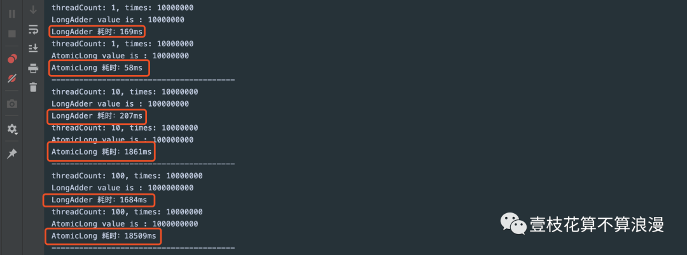CAS原理图.png

这里可以看到随着并发的增加，`AtomicLong`性能是急剧下降的，耗时是`LongAdder`的数倍。至于原因我们还是接着往后看。

#### LongAdder为什么这么快

先看下`LongAdder`的操作原理图：

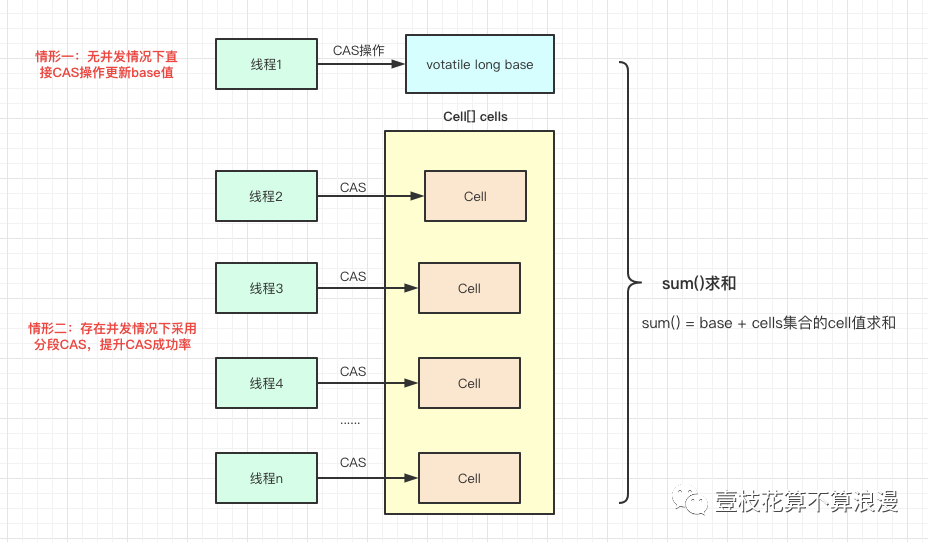YUnlDO.png

既然说到`LongAdder`可以显著提升高并发环境下的性能，那么它是如何做到的？

**1、 设计思想上，`LongAdder`采用"分段"的方式降低`CAS`失败的频次**

这里先简单的说下`LongAdder`的思路，后面还会详述`LongAdder`的原理。

我们知道，`AtomicLong`中有个内部变量`value`保存着实际的`long`值，所有的操作都是针对该变量进行。也就是说，高并发环境下，`value`变量其实是一个**热点数据**，也就是**N个线程竞争一个热点。**

`LongAdder`的基本思路就是**分散热点**，将`value`值的新增操作分散到一个数组中，不同线程会命中到数组的不同槽中，各个线程只对自己槽中的那个`value`值进行`CAS`操作，这样热点就被分散了，冲突的概率就小很多。

`LongAdder`有一个全局变量`volatile long base`值，当并发不高的情况下都是通过`CAS`来直接操作`base`值，如果`CAS`失败，则针对`LongAdder`中的`Cell[]`数组中的`Cell`进行`CA`S操作，减少失败的概率。

例如当前类中`base = 10`，有三个线程进行`CAS`原子性的**+1操作**，**线程一执行成功，此时base=11**，**线程二、线程三执行失败后**开始针对于`Cell[]`数组中的`Cell`元素进行**+1操作**，同样也是`CAS`操作，此时数组`index=1`和`index=2`中`Cell`的`value`都被设置为了1.

执行完成后，统计累加数据：`sum = 11 + 1 + 1 = 13`，利用`LongAdder`进行累加的操作就执行完了，流程图如下：

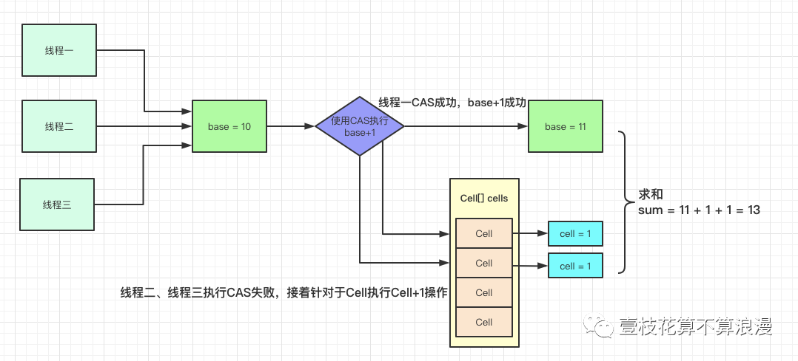分段加锁思路.png

如果要获取真正的`long`值，只要将各个槽中的变量值累加返回。这种分段的做法类似于`JDK7`中`ConcurrentHashMap`的分段锁。

**2、使用Contended注解来消除伪共享**

在 `LongAdder` 的父类 `Striped64` 中存在一个 `volatile Cell[] cells;`数组，其长度是**2 的幂次方**，每个`Cell`都使用 `@Contended` 注解进行修饰，而`@Contended`注解可以进行**缓存行填充**，从而解决**伪共享问题**。伪共享会导致缓存行失效，缓存一致性开销变大。

```java
@sun.misc.Contended static final class Cell {

}
```

**伪共享**指的是多个线程同时读写同一个缓存行的不同变量时导致的 `CPU缓存失效`。尽管这些变量之间没有任何关系，但由于在主内存中邻近，存在于同一个缓存行之中，它们的相互覆盖会导致频繁的缓存未命中，引发性能下降。这里对于伪共享我只是提一下概念，并不会深入去讲解，大家可以自行查阅一些资料。

解决伪共享的方法一般都是使用**直接填充**，我们只需要保证不同线程的变量存在于不同的 `CacheLine` 即可，使用多余的字节来填充可以做点这一点，这样就不会出现伪共享问题。例如在`Disruptor队列`的设计中就有类似设计(可参考我之前的博客文章：**Disruptor学习笔记**)：

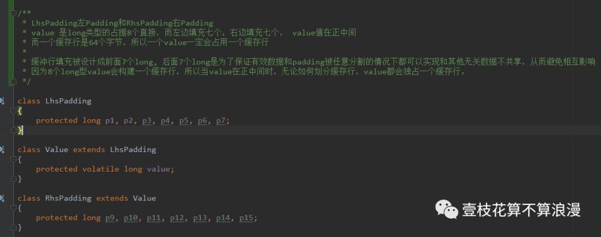缓存行填充代码.png

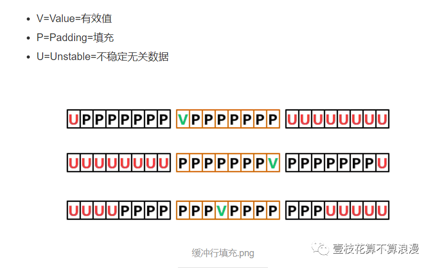缓存行填充.png

在`Striped64`类中我们可以看看`Doug Lea`在`Cell`上加的注释也有说明这一点：

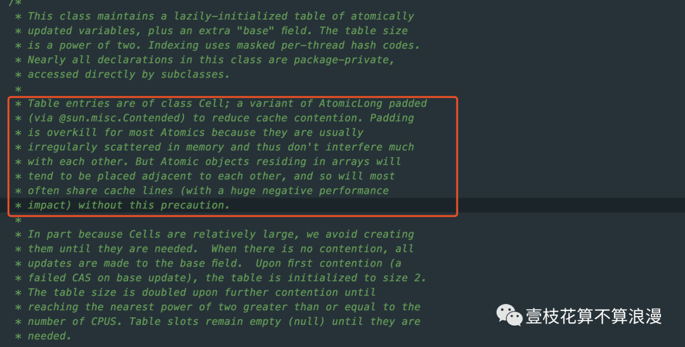Cell注释.png

红框中的翻译如下：

`Cell`类是`AtomicLong`添加了`padded（via@sun.misc.compended)`来消除**伪共享**的变种版本。缓存行填充对于大多数原子来说是繁琐的，因为它们通常不规则地分散在内存中，因此彼此之间不会有太大的干扰。但是，驻留在数组中的原子对象往往彼此相邻，因此在没有这种预防措施的情况下，通常会共享缓存行数据（对性能有巨大的负面影响）。

**3、惰性求值**

`LongAdder`只有在使用`longValue()`获取当前累加值时才会真正的去结算计数的数据，`longValue()`方法底层就是调用`sum()`方法，对`base`和`Cell数组`的数据累加然后返回，做到数据写入和读取分离。

而`AtomicLong`使用`incrementAndGet()`每次都会返回`long`类型的计数值，每次递增后还会伴随着数据返回，增加了额外的开销。

#### LongAdder实现原理

之前说了，`AtomicLong`是多个线程针对单个**热点值value进行原子操作**。而`LongAdder`是每个线程拥有自己的槽，各个线程一般只对自己槽中的那个值进行`CAS操作`。

比如有三个线程同时对value增加1，那么value = 1 + 1 + 1 = 3

但是对于LongAdder来说，内部有一个base变量，一个Cell[]数组。
base变量：非竞争条件下，直接累加到该变量上
Cell[]数组：竞争条件下，累加个各个线程自己的槽Cell[i]中
最终结果的计算是下面这个形式：

**value = base +**

#### LongAdder源码剖析

前面已经用图分析了`LongAdder`高性能的原理，我们继续看下`LongAdder`实现的源码：

```java
 public class LongAdder extends Striped64 implements Serializable {
     public void increment() {
         add(1L);
     }
 
     public void add(long x) {
         Cell[] as; long b, v; int m; Cell a;
         if ((as = cells) != null || !casBase(b = base, b + x)) {
             boolean uncontended = true;
            if (as == null || (m = as.length - 1) < 0 ||
                (a = as[getProbe() & m]) == null ||
                !(uncontended = a.cas(v = a.value, v + x)))
                longAccumulate(x, null, uncontended);
        }
    }

    final boolean casBase(long cmp, long val) {
        return UNSAFE.compareAndSwapLong(this, BASE, cmp, val);
    }
}
```

一般我们进行计数时都会使用`increment()`方法，每次进行**+1操作**，`increment()`会直接调用`add()`方法。

**变量说明：**

- as 表示cells引用
- b 表示获取的base值
- v 表示 期望值,
- m 表示 cells 数组的长度
- a 表示当前线程命中的cell单元格

**条件分析：**

**条件一：as == null || (m = as.length - 1) < 0**
此条件成立说明cells数组未初始化。如果不成立则说明cells数组已经完成初始化，对应的线程需要找到Cell数组中的元素去写值。

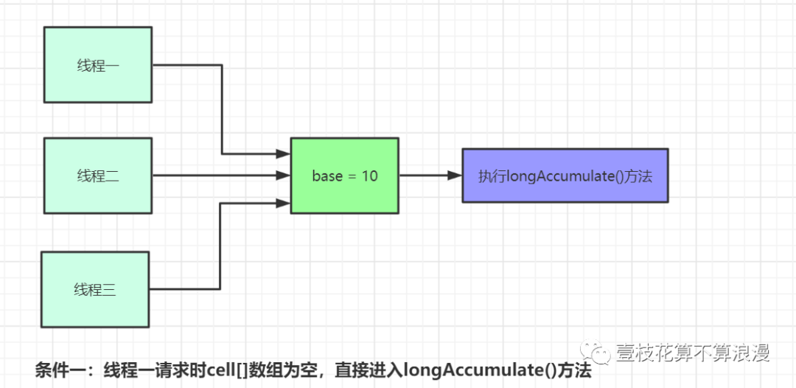条件一.png

**条件二：(a = as[getProbe() & m]) == null**
getProbe()获取当前线程的hash值，m表示cells长度-1，cells长度是2的幂次方数，原因之前也讲到过，与数组长度取模可以转化为按位与运算，提升计算性能。

当条件成立时说明当前线程通过hash计算出来数组位置处的cell为空，进一步去执行longAccumulate()方法。如果不成立则说明对应的cell不为空，下一步将要将x值通过CAS操作添加到cell中。

**条件三：!(uncontended = a.cas(v = a.value, v + x)**
主要看a.cas(v = a.value, v + x)，接着条件二，说明当前线程hash与数组长度取模计算出的位置的cell有值，此时直接尝试一次CAS操作，如果成功则退出if条件，失败则继续往下执行longAccumulate()方法。

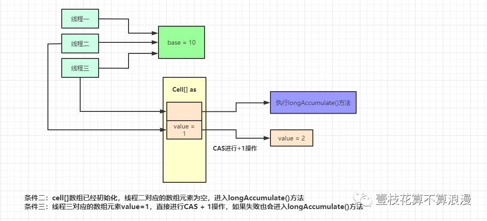条件二/条件三.png

接着往下看核心的`longAccumulate()`方法，代码很长，后面会一步步分析，先上代码：

`java.util.concurrent.atomic.Striped64.`:

```java
 final void longAccumulate(long x, LongBinaryOperator fn, boolean wasUncontended) {
     int h;
     if ((h = getProbe()) == 0) {
         ThreadLocalRandom.current();
         h = getProbe();
         wasUncontended = true;
     }
     boolean collide = false;
     for (;;) {
        Cell[] as; Cell a; int n; long v;
        if ((as = cells) != null && (n = as.length) > 0) {
            if ((a = as[(n - 1) & h]) == null) {
                if (cellsBusy == 0) {
                    Cell r = new Cell(x);
                    if (cellsBusy == 0 && casCellsBusy()) {
                        boolean created = false;
                        try {
                            Cell[] rs; int m, j;
                            if ((rs = cells) != null && (m = rs.length) > 0 && rs[j = (m - 1) & h] == null) {
                                rs[j] = r;
                                created = true;
                            }
                        } finally {
                            cellsBusy = 0;
                        }
                        if (created)
                            break;
                        continue;
                    }
                }
                collide = false;
            }
            else if (!wasUncontended)
                wasUncontended = true;
            else if (a.cas(v = a.value, ((fn == null) ? v + x : fn.applyAsLong(v, x))))
                break;
            else if (n >= NCPU || cells != as)
                collide = false;
            else if (!collide)
                collide = true;
            else if (cellsBusy == 0 && casCellsBusy()) {
                try {
                    if (cells == as) {
                        Cell[] rs = new Cell[n << 1];
                        for (int i = 0; i < n; ++i)
                            rs[i] = as[i];
                        cells = rs;
                    }
                } finally {
                    cellsBusy = 0;
                }
                collide = false;
                continue;
            }
            h = advanceProbe(h);
        }
        else if (cellsBusy == 0 && cells == as && casCellsBusy()) {
            boolean init = false;
            try {
                if (cells == as) {
                    Cell[] rs = new Cell[2];
                    rs[h & 1] = new Cell(x);
                    cells = rs;
                    init = true;
                }
            } finally {
                cellsBusy = 0;
            }
            if (init)
                break;
        }
        else if (casBase(v = base, ((fn == null) ? v + x : fn.applyAsLong(v, x))))
            break;                          
    }
}
```

代码很长，`if else`分支很多，除此看肯定会很头疼。这里一点点分析，然后结合画图一步步了解其中实现原理。

**我们首先要清楚执行这个方法的前置条件，它们是或的关系，如上面条件一、二、三**

1. cells数组没有初始化
2. cells数组已经初始化，但是当前线程对应的cell数据为空
3. cells数组已经初始化， 当前线程对应的cell数据为空，且CAS操作+1失败

**longAccumulate()方法的入参：**

- long x 需要增加的值，一般默认都是1
- LongBinaryOperator fn 默认传递的是null
- wasUncontended竞争标识，如果是false则代表有竞争。只有cells初始化之后，并且当前线程CAS竞争修改失败，才会是false

**然后再看下Striped64中一些变量或者方法的定义：**

- base: 类似于AtomicLong中全局的value值。在没有竞争情况下数据直接累加到base上，或者cells扩容时，也需要将数据写入到base上
- collide：表示扩容意向，false 一定不会扩容，true可能会扩容。
- cellsBusy：初始化cells或者扩容cells需要获取锁, 0:表示无锁状态 1:表示其他线程已经持有了锁
- casCellsBusy(): 通过CAS操作修改cellsBusy的值，CAS成功代表获取锁，返回true
- NCPU：当前计算机CPU数量，Cell数组扩容时会使用到
- getProbe(): 获取当前线程的hash值
- advanceProbe(): 重置当前线程的hash值

**接着开始正式解析longAccumulate()源码：**

```java
 private static final long PROBE;
 
 if ((h = getProbe()) == 0) {
     ThreadLocalRandom.current();
     h = getProbe();
     wasUncontended = true;
 }
 
 static final int getProbe() {
    return UNSAFE.getInt(Thread.currentThread(), PROBE);
}
```

我们上面说过`getProbe()`方法是为了获取当前线程的`hash值`，具体实现是通过`UNSAFE.getInt()`实现的，`PROBE`是在初始化时候获取当前线程`threadLocalRandomProbe`的值。

> 注：Unsafe.getInt()有三个重载方法getInt(Object o, long offset)、getInt(long address) 和getIntVolatile(long address)，都是从指定的位置获取变量的值，只不过第一个的offset是相对于对象o的相对偏移量，第二个address是绝对地址偏移量。如果第一个方法中o为null是，offset也会被作为绝对偏移量。第三个则是带有volatile语义的load读操作。

如果当前线程的**hash值h=getProbe()为0，0与任何数取模都是0，会固定到数组第一个位置**，所以这里做了优化，使用`ThreadLocalRandom`为当前线程重新计算一个`hash`值。最后设置`wasUncontended = true`，这里含义是重新计算了当前线程的`hash`后认为此次不算是一次竞争。`hash`值被重置就好比一个全新的线程一样，所以设置了竞争状态为`true`。

可以画图理解为：

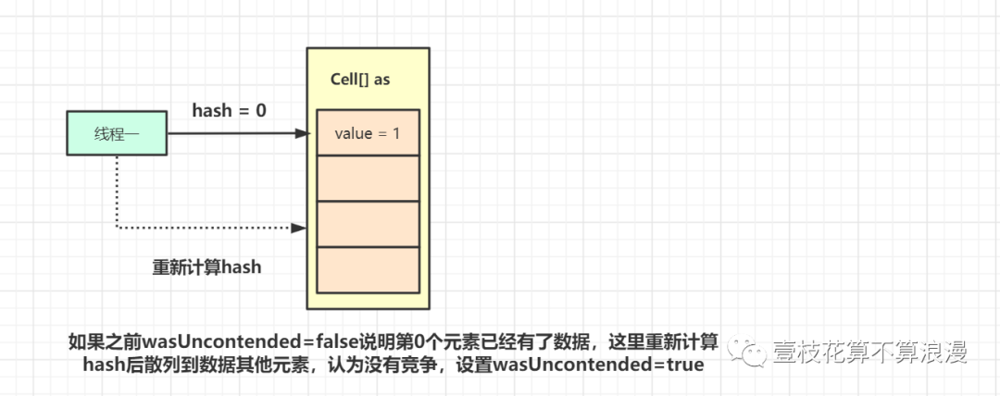wasUncontended设置说明.png

接着执行`for循环`，我们可以把`for循环`代码拆分一下，每个`if条件`算作一个`CASE`来分析：

```java
 final void longAccumulate(long x, LongBinaryOperator fn, boolean wasUncontended) {
 
     for (;;) {
         Cell[] as; Cell a; int n; long v;
         if ((as = cells) != null && (n = as.length) > 0) {
 
         }
         else if (cellsBusy == 0 && cells == as && casCellsBusy()) {
 
        }
        else if (casBase(v = base, ((fn == null) ? v + x : fn.applyAsLong(v, x))))

    }
}
```

如上所示，第一个`if语句代表CASE1`，里面再有`if判断`会以`CASE1.1`这种形式来讲解，下面接着的`else if`为`CASE2`， 最后一个为`CASE3`

##### **CASE1执行条件**：

```java
if ((as = cells) != null && (n = as.length) > 0) {

}
```

`cells数组`不为空，且数组长度大于0的情况会执行`CASE1`，`CASE1`的实现细节代码较多，放到最后面讲解。

##### **CASE2执行条件和实现原理**：

```java
 else if (cellsBusy == 0 && cells == as && casCellsBusy()) {
     boolean init = false;
         try {
             if (cells == as) {
                 Cell[] rs = new Cell[2];
                 rs[h & 1] = new Cell(x);
                 cells = rs;
                 init = true;
             }
        } finally {
            cellsBusy = 0;
        }
        if (init)
            break;
}
```

`CASE2` 标识`cells数组`还未初始化，因为判断`cells == as`，这个代表当前线程到了这里获取的`cells`还是之前的一致。我们可以先看这个`case`，最后再回头看最为麻烦的`CASE1`实现逻辑。

`cellsBusy`上面说了是加锁的状态，初始化`cells数组`和扩容的时候都要获取加锁的状态，这个是通过`CAS`来实现的，为0代表无锁状态，为1代表其他线程已经持有锁了。`cells==as`代表当前线程持有的数组未进行修改过，`casCellsBusy()`通过`CAS操作`去获取锁。但是里面的`if条件`又再次判断了`cell==as`，这一点是不是很奇怪？通过画图来说明下问题：

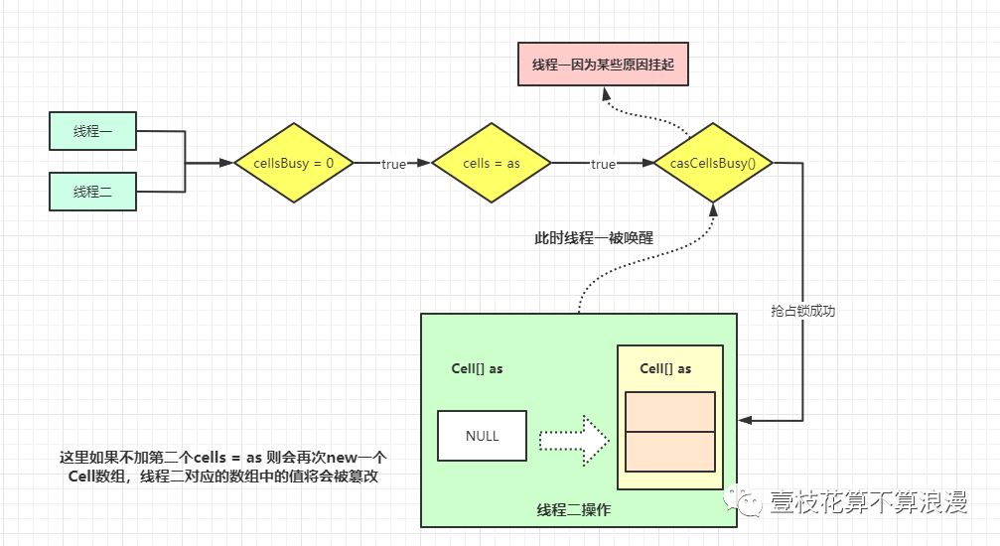cells==as双重判断说明.png

如果上面条件都执行成功就会执行数组的初始化及赋值操作， `Cell[] rs = new Cell[2]`表示数组的长度为2，`rs[h & 1] = new Cell(x)` 表示创建一个新的`Cell元素`，**value是x值，默认为1。**

`h & 1`类似于我们之前`HashMap`或者`ThreadLocal`里面经常用到的计算散列桶`index`的算法，通常都是`hash & (table.len - 1)`，这里就不做过多解释了。执行完成后直接退出`for循环`。

##### **CASE3执行条件和实现原理**：

```java
else if (casBase(v = base, ((fn == null) ? v + x : fn.applyAsLong(v, x))))
    break;
```

进入到这里说明`cells`正在或者已经初始化过了，执行`caseBase()`方法，通过`CAS操作`来修改`base`的值，如果修改成功则跳出循环，这个`CAS`E只有在初始化`Cell数组`的时候，多个线程尝试`CAS`修改`cellsBusy`加锁的时候，失败的线程会走到这个分支，然后直接`CAS`修改`base`数据。

##### **CASE1 实现原理**：

分析完了`CASE2和CASE3`，我们再折头回看一下`CASE1`，进入`CASE1`的前提是：`cells数组`不为空，已经完成了初始化赋值操作。

接着还是一点点往下拆分代码，首先看第一个判断分支`CASE1.1`：

```java
 if ((a = as[(n - 1) & h]) == null) {
     if (cellsBusy == 0) {
         Cell r = new Cell(x);
         if (cellsBusy == 0 && casCellsBusy()) {
             boolean created = false;
             try {
                 Cell[] rs; int m, j;
                 if ((rs = cells) != null && (m = rs.length) > 0 && rs[j = (m - 1) & h] == null) {
                     rs[j] = r;
                    created = true;
                }
            } finally {
                cellsBusy = 0;
            }
            if (created)
                break;
            continue;
        }
    }
    collide = false;
}
```

这个if条件中`(a = as[(n - 1) & h]) == null`代表当前线程对应的数组下标位置的`cell`数据为`null`，代表没有线程在此处创建`Cell`对象。

接着判断`cellsBusy==0`，代表当前锁未被占用。然后新创建`Cell对象`，接着又判断了一遍`cellsBusy == 0`，然后执行`casCellsBusy()`尝试通过CAS操作修改`cellsBusy=1`，加锁成功后修改扩容意向`collide = false;`

```java
 for (;;) {
     if ((rs = cells) != null && (m = rs.length) > 0 && rs[j = (m - 1) & h] == null) {
         rs[j] = r;
         created = true;
     }
 
     if (created)
         break;
     continue;
}
```

上面代码判断当前线程`hash`后指向的数据位置元素是否为空，如果为空则将`cell`数据放入数组中，跳出循环。如果不为空则继续循环。

CASE1.1.png

继续往下看代码，**CASE1.2**：

```java
else if (!wasUncontended)
    wasUncontended = true;

h = advanceProbe(h);
```

`wasUncontended`表示`cells`初始化后，当前线程竞争修改失败`wasUncontended =false`，这里只是重新设置了这个值为`true`，紧接着执行`advanceProbe(h)`重置当前线程的`hash`，重新循环。

接着看**CASE1.3**：

```java
else if (a.cas(v = a.value, ((fn == null) ? v + x : fn.applyAsLong(v, x))))
    break;
```

进入`CASE1.3`说明当前线程对应的数组中有了数据，也重置过`hash值`，这时通过CAS操作尝试对当前数中的`value值`进行累加x操作，x默认为1，如果`CAS`成功则直接跳出循环。

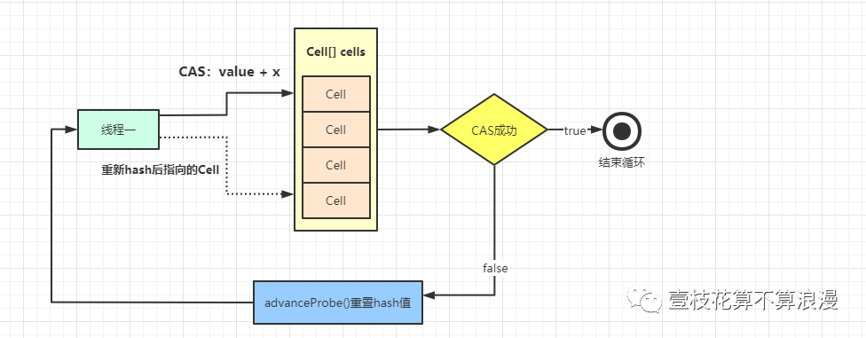CASE1.3.png

接着看**CASE1.4：**

```java
else if (n >= NCPU || cells != as)
    collide = false;    
```

如果`cells数组`的长度达到了`CPU核心数`，或者`cells`扩容了，设置扩容意向`collide为false`并通过下面的`h = advanceProbe(h)`方法修改线程的`probe`再重新尝试

至于这里为什么要提出和`CPU数量`做判断的问题：每个线程会通过线程对`cells[threadHash%cells.length]`位置的`Cell`对象中的`value`做累加，这样相当于将线程绑定到了`cells`中的某个`cell`对象上，如果超过`CPU数量`的时候就不再扩容是因为`CPU`的数量代表了机器处理能力，当超过`CPU`数量时，多出来的`cells`数组元素没有太大作用。

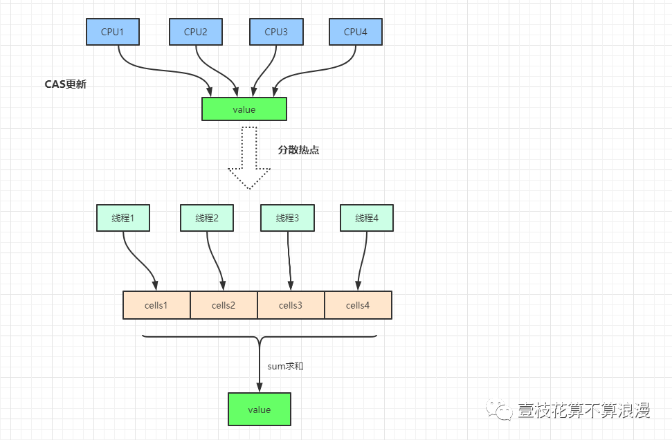多线程更新Cell.png

接着看**CASE1.5**：

```java
 else if (!collide)
   collide = true;
```

如果扩容意向`collide`是`false`则修改它为`true`，然后重新计算当前线程的`hash`值继续循环，在`CASE1.4`中，如果当前数组的长度已经大于了`CPU`的核数，就会再次设置扩容意向`collide=false`，这里的意义是保证扩容意向为`false`后不再继续往后执行`CASE1.6`的扩容操作。

**接着看CASE1.6分支：**

```java
 else if (cellsBusy == 0 && casCellsBusy()) {
     try {
         if (cells == as) {
             Cell[] rs = new Cell[n << 1];
             for (int i = 0; i < n; ++i)
                 rs[i] = as[i];
             cells = rs;
         }
     } finally {
        cellsBusy = 0;
    }
    collide = false;
    continue;
}
```

这里面执行的其实是扩容逻辑，首先是判断通过`CAS`改变`cellsBusy`来尝试加锁，如果`CAS`成功则代表获取锁成功，继续向下执行，判断当前的`cells`数组和最先赋值的`as`是同一个，代表没有被其他线程扩容过，然后进行扩容，扩容大小为之前的容量的两倍，这里用的按位左移1位来操作的。

```java
Cell[] rs = new Cell[n << 1];
```

扩容后再将之前数组的元素拷贝到新数组中，释放锁设置`cellsBusy = 0`，设置扩容状态，然后继续循环执行。

到了这里，我们已经分析完了`longAccumulate()`所有的逻辑，逻辑分支挺多，仔细分析看看其实还是挺清晰的，流程图如下：

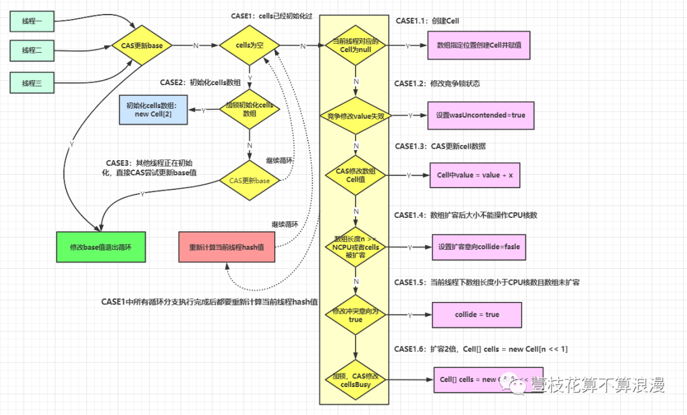流程图.png

我们再举一些线程执行的例子里面场景覆盖不全，大家可以按照这种模式自己模拟场景分析代码流程：

多线程执行示例.png

如有问题也请及时指出，我会第一时间更正，不胜感激！

#### LongAdder的sum方法

当我们最终获取计数器值时，我们可以使用`LongAdder.longValue()`方法，其内部就是使用`sum`方法来汇总数据的。

`java.util.concurrent.atomic.LongAdder.sum()`:

```java
 public long sum() {
     Cell[] as = cells; Cell a;
     long sum = base;
     if (as != null) {
         for (int i = 0; i < as.length; ++i) {
             if ((a = as[i]) != null)
                 sum += a.value;
         }
     }
    return sum;
}
```

实现很简单，base + ，遍历`cells`数组中的值，然后累加。

#### AtomicLong可以弃用了吗？

看上去`LongAdder`的性能全面超越了`AtomicLong`，而且阿里巴巴开发手册也提及到 **推荐使用 LongAdder 对象，比 AtomicLong 性能更好（减少乐观 锁的重试次数）**，但是我们真的就可以舍弃掉`LongAdder`了吗？

当然不是，我们需要看场景来使用，如果是并发不太高的系统，使用`AtomicLong`可能会更好一些，而且内存需求也会小一些。

我们看过`sum()`方法后可以知道`LongAdder`在统计的时候如果有并发更新，可能导致统计的数据有误差。

而在高并发统计计数的场景下，才更适合使用`LongAdder`。

### 总结

`LongAdder`中最核心的思想就是利用空间来换时间，将热点`value`分散成一个**Cell列表来承接并发的CAS**，以此来提升性能。

`LongAdder`的原理及实现都很简单，但其设计的思想值得我们品味和学习。

### 来源

https://mp.weixin.qq.com/s/khvWYnPV5z6ruVkaUETdgg