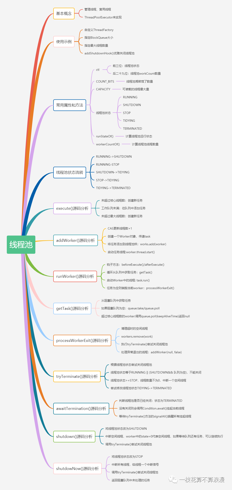
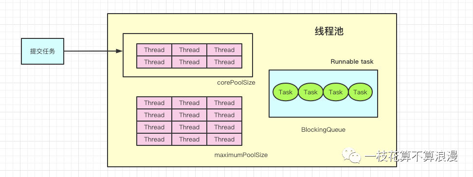

<h1 align="center">万字图文 | 学会Java中的线程池，这一篇也许就够了！</h1>

[toc]



### 碎碎念

关于JDK源码相关的文章这已经是第四篇了，原创不易，粉丝从几十人到昨天的`666`人，真的很感谢之前帮我转发文章的一些朋友们。

关注人数.png

从16年开始写技术文章，到现在博客园已经发表了`222`篇文章，大多数都是原创，共有800多粉丝，基本上每个月都会有文章的产出。

博客园信息.png


博客园文章月份记录.png

回顾这几年以来写作的心路历程，一直都是偷偷的写，偷偷的发，害怕被人知道，怕被人骂文章写的太水（之前心理太脆弱了，哈哈）。后面和cxuan聊过后，他建议我给他投稿试试，于是就有了那一篇的万字的`AQS`文章。

最近也有好多读者加到我的微信，问一些文章中的问题，我也都会认真解答，看到有人阅读我的文章并有所收获，我真的挺欣慰，这就是写作的动力吧。

### 前言

Java中的线程池已经不是什么神秘的技术了，相信在看的读者在项目中也都有使用过。关于线程池的文章也是数不胜数，我们站在巨人的肩膀上来再次梳理一下。

本文还是保持原有的风格，图文解析，尽量做到多画图！全文共20000+字，建议收藏后细细品读，阅读期间搭配源码食用效果更佳！

**读完此文你将学到：**

1. `ThreadPoolExecutor`中常用参数有哪些？
2. `ThreadPoolExecutor`中线程池状态和线程数量如何存储的？
3. `ThreadPoolExecutor`有哪些状态，状态之间流转是什么样子的？
4. `ThreadPoolExecutor`任务处理策略？
5. `ThreadPoolExecutor`常用的拒绝策略有哪些？
6. `Executors`工具类提供的线程池有哪些？有哪些缺陷？
7. `ThreadPoolExecutor`核心线程池中线程预热功能？
8. `ThreadPoolExecutor`中创建的线程如何被复用的？
9. `ThreadPoolExecutor`中关闭线程池的方法`shutdown`与`shutdownNow`的区别？
10. `ThreadPoolExecutor`中存在的一些扩展点？
11. `ThreadPoolExecutor`支持动态调整核心线程数、最大线程数、队列长度等一些列参数吗？怎么操作？

**本文源码基于JDK1.8**

### 线程池基本概念

线程池是一种池化思想的产物，如同我们数据库有连接池、Java中的常量池。线程池可以帮助我们管理线程、复用线程，减少线程频繁新建、销毁等带来的开销。

在Java中是通过`ThreadPoolExecutor`类来创建一个线程池的，一般我们建议项目中自己去定义线程池，不推荐使用`JDK`提供的工具类`Executors`去构建线程池。

查看**阿里巴巴开发手册**中也有对线程池的一些建议：

**`【强制】`创建线程或线程池时请指定有意义的线程名称，方便出错时回溯。**
`正例：`自定义线程工厂，并且根据外部特征进行分组，比如，来自同一机房的调用，把机房编号赋值给`whatFeaturOfGroup`

```java
public class UserThreadFactory implements ThreadFactory {

    private final String namePrefix;
    private final AtomicInteger nextId = new AtomicInteger(1);

    UserThreadFactory(String whatFeaturOfGroup) {
        namePrefix = "From UserThreadFactory's " + whatFeaturOfGroup + "-Worker-";
    }

    @Override
    public Thread newThread(Runnable task) {
        String name = namePrefix + nextId.getAndIncrement();
        Thread thread = new Thread(null, task, name, 0, false);
        System.out.println(thread.getName());
        return thread;
    }
}
```

**`【强制】`线程资源必须通过线程池提供，不允许在应用中自行显式创建线程。**

> 说明：线程池的好处是减少在创建和销毁线程上所消耗的时间以及系统资源的开销，解决资源不足的问题。
> 如果不使用线程池，有可能造成系统创建大量同类线程而导致消耗完内存或者“过度切换”的问题。

**`【强制】`线程池不允许使用Executors 去创建，而是通过 ThreadPoolExecutor 的方式，这 样的处理方式让写的同学更加明确线程池的运行规则，规避资源耗尽的风险。**

> 说明：Executors 返回的线程池对象的弊端如下：
> 1） FixedThreadPool 和 SingleThreadPool：
> 允许的请求队列长度为 Integer.MAX_VALUE，可能会堆积大量的请求，从而导致 OOM。
> 2） CachedThreadPool：
> 允许的创建线程数量为 Integer.MAX_VALUE，可能会创建大量的线程，从而导致 OOM。

### 线程池使用示例

下面是一个自定义的线程池，这是之前公司在用的一个线程池，修改其中部分属性和备注做脱敏处理：

```java
public class MyThreadPool {
    static final Logger LOGGER = LoggerFactory.getLogger(MyThreadPool.class);

    private static final int DEFAULT_MAX_CONCURRENT = Runtime.getRuntime().availableProcessors() * 2;

    private static final String THREAD_POOL_NAME = "MyThreadPool-%d";

    private static final ThreadFactory FACTORY = new BasicThreadFactory.Builder().namingPattern(THREAD_POOL_NAME)
            .daemon(true).build();

    private static final int DEFAULT_SIZE = 500;

    private static final long DEFAULT_KEEP_ALIVE = 60L;

    private static ExecutorService executor;

    private static BlockingQueue<Runnable> executeQueue = new ArrayBlockingQueue<>(DEFAULT_SIZE);

    static {
        try {
            executor = new ThreadPoolExecutor(DEFAULT_MAX_CONCURRENT, DEFAULT_MAX_CONCURRENT + 2, DEFAULT_KEEP_ALIVE,
                    TimeUnit.SECONDS, executeQueue, FACTORY);

            Runtime.getRuntime().addShutdownHook(new Thread(new Runnable() {
                @Override
                public void run() {
                    LOGGER.info("MyThreadPool shutting down.");
                    executor.shutdown();

                    try {
                        if (!executor.awaitTermination(1, TimeUnit.SECONDS)) {
                            LOGGER.error("MyThreadPool shutdown immediately due to wait timeout.");
                            executor.shutdownNow();
                        }
                    } catch (InterruptedException e) {
                        LOGGER.error("MyThreadPool shutdown interrupted.");
                        executor.shutdownNow();
                    }

                    LOGGER.info("MyThreadPool shutdown complete.");
                }
            }));
        } catch (Exception e) {
            LOGGER.error("MyThreadPool init error.", e);
            throw new ExceptionInInitializerError(e);
        }
    }

    private MyThreadPool() {
    }

    public static boolean execute(Runnable task) {

        try {
            executor.execute(task);
        } catch (RejectedExecutionException e) {
            LOGGER.error("Task executing was rejected.", e);
            return false;
        }

        return true;
    }

    public static <T> Future<T> submitTask(Callable<T> task) {

        try {
            return executor.submit(task);
        } catch (RejectedExecutionException e) {
            LOGGER.error("Task executing was rejected.", e);
            throw new UnsupportedOperationException("Unable to submit the task, rejected.", e);
        }
    }
}
```

这里主要就是使用调用`ThreadPoolExecutor`构造函数来构造一个线程池，指定自定义的`ThreadFactory`，里面包含我们自己线程池的`poolName`等信息。重写里面的`execute()`和`submitTask()`方法。添加了系统关闭时的钩子函数`shutDownHook()`，在里面调用线程池的`shutdown()`方法，使得系统在退出(**使用ctrl c或者kill -15 pid**)时能够优雅的关闭线程池。

如果有看不懂的小伙伴也没有关系，后面会详细分析`ThreadPoolExecutor`中的源码，相信看完后面的代码再回头来看这个用例 就完全是小菜一碟了。

### 线程池实现原理

通过上面的示例代码，我们需要知道创建线程池时几个重要的属性：

```
ThreadPoolExecutor(int corePoolSize, int maximumPoolSize, long keepAliveTime, TimeUnit unit, BlockingQueue<Runnable> workQueue, ThreadFactory threadFactory, RejectedExecutionHandler handler);
```

`corePoolSize`: 线程池核心线程数量

`maximumPoolSize`: 线程池最大线程数量

`workQueue`: 线程池中阻塞队列，一般指定队列大小

线程池中数据模型可以简化成下图所示，其中`Thread`应该是添加的一个个`Worker`，这里标注的`Thread`是为了方便理解：



<center>线程池中数据模型.png</center>

线程池中提交一个任务具体执行流程如下图：


<center>执行流程.png</center>

提交任务时，比较当前线程池中线程数量和核心线程数的大小，根据比较结果走不同的任务处理策略，这个下面会有详细说明。

线程池中核心方法调用链路：


<center>方法调用链路.png</center>

### TheadPoolExecutor源码初探

`TheadPoolExecutor`中常用属性和方法较多，我们可以先分析下这些，然后一步步往下深入，常用属性和方法如下：


<center>线程池常见属性和方法.png</center>

具体代码如下：

```java
public class ThreadPoolExecutor extends AbstractExecutorService {

    private final AtomicInteger ctl = new AtomicInteger(ctlOf(RUNNING, 0));
    private static final int COUNT_BITS = Integer.SIZE - 3;
    private static final int CAPACITY   = (1 << COUNT_BITS) - 1;

    private static final int RUNNING    = -1 << COUNT_BITS;
    private static final int SHUTDOWN   =  0 << COUNT_BITS;
    private static final int STOP       =  1 << COUNT_BITS;
    private static final int TIDYING    =  2 << COUNT_BITS;
    private static final int TERMINATED =  3 << COUNT_BITS;

    private static int runStateOf(int c)     { return c & ~CAPACITY; }
    private static int workerCountOf(int c)  { return c & CAPACITY; }
    private static int ctlOf(int rs, int wc) { return rs | wc; }

    private static boolean runStateLessThan(int c, int s) {
        return c < s;
    }

    private static boolean runStateAtLeast(int c, int s) {
        return c >= s;
    }

    private static boolean isRunning(int c) {
        return c < SHUTDOWN;
    }

    private boolean compareAndIncrementWorkerCount(int expect) {
        return ctl.compareAndSet(expect, expect + 1);
    }

    private boolean compareAndDecrementWorkerCount(int expect) {
        return ctl.compareAndSet(expect, expect - 1);
    }

     private void decrementWorkerCount() {
        do {} while (! compareAndDecrementWorkerCount(ctl.get()));
    }

    public ThreadPoolExecutor(int corePoolSize,
                              int maximumPoolSize,
                              long keepAliveTime,
                              TimeUnit unit,
                              BlockingQueue<Runnable> workQueue) {
        this(corePoolSize, maximumPoolSize, keepAliveTime, unit, workQueue,
                Executors.defaultThreadFactory(), defaultHandler);
    }
}
```

1. ctl

> `ctl`代表当前线程池状态和线程池线程数量的结合体，高3位标识当前线程池运行状态，后29位标识线程数量。ctlOf方法就是rs(线程池运行状态)和wc(线程数量)按位或操作

1. COUNT_BITS

> COUNT_BITS = Integer.SIZE - 3 = 29，在ctl中，低29位用于存放当前线程池中线程的数量

1. CAPACITY

> CAPACITY  = (1 << COUNT_BITS) - 1
> 我们来计算一下：
> 1 << 29    = 0010 0000 0000 0000 0000 0000 0000 0000
> (1 << 29) - 1 = 0001 1111 1111 1111 1111 1111 1111 1111
> 这个属性是用来线程池能装载线程的最大数量，也可以用来做一些位运算操作。

1. 线程池几种状态

**RUNNING：**

> (1) 状态说明：线程池处在RUNNING状态时，能够接收新任务，以及对已添加的任务进行处理。
> (2) 状态切换：线程池的初始化状态是RUNNING。换句话说，线程池被一旦被创建，就处于RUNNING状态，并且线程池中的任务数为0

**SHUTDOWN:**

> (1) 状态说明：线程池处在SHUTDOWN状态时，不接收新任务，但能处理已添加的任务。
> (2) 状态切换：调用线程池的shutdown()接口时，线程池由RUNNING -> SHUTDOWN

**STOP：**

> (1) 状态说明：线程池处在STOP状态时，不接收新任务，不处理已添加的任务，并且会中断正在处理的任务。
> (2) 状态切换：调用线程池的shutdownNow()接口时，线程池由(RUNNING or SHUTDOWN ) -> STOP

**TIDYING：**

> (1) 状态说明：当所有的任务已终止，ctl记录的"任务数量"为0，线程池会变为TIDYING状态。当线程池变为TIDYING状态时，会执行钩子函数terminated()。terminated()在ThreadPoolExecutor类中是空的，若用户想在线程池变为TIDYING时，进行相应的处理；可以通过重载terminated()函数来实现。
> (2) 状态切换：当线程池在SHUTDOWN状态下，阻塞队列为空并且线程池中执行的任务也为空时，就会由 SHUTDOWN -> TIDYING。
> 当线程池在STOP状态下，线程池中执行的任务为空时，就会由STOP -> TIDYING

**TERMINATED：**

> (1) 状态说明：线程池彻底终止，就变成TERMINATED状态。
> (2) 状态切换：线程池处在TIDYING状态时，执行完terminated()之后，就会由 TIDYING -> TERMINATED

**状态的变化流转：**


<center>线程池的状态流转.png</center>

1. runStateOf()

> 计算线程池运行状态的，就是计算ctl前三位的数值。`unStateOf() = c & ~CAPACITY，CAPACITY = 0001 1111 1111 1111 1111 1111 1111 1111，那么~CAPACITY = 1110 0000 0000 0000 0000 0000 0000 0000，它与任何数按位与的话都是只看这个数前三位

1. workerCountOf()

> 计算线程池的线程数量，就是看ctl的后29位，workerCountOf() = c & CAPACITY， CAPACITY = 0001 1111 1111 1111 1111 1111 1111 1111与任何数按位与，就是看这个数的后29位

1. ctlOf(int rs, int wt)

> 在获取当前线程池ctl的时候会用到，在后面源码中会有很多地方调用, 传递的参数rs代表线程池状态，wt代表当前线程次线程(worker)的数量

1. runStateLessThan(int c, int s)

> return c < s，c一般传递的是当前线程池的ctl值。比较当前线程池ctl所表示的状态是否小于某个状态s

1. runStateAtLeast(int c, int s)

> return c >= s，c一般传递的是当前线程池的ctl值。比较当前线程池ctl所表示的状态，是否大于等于某个状态s

1. isRunning(int c)

> c < SHUTDOWN， 判断当前线程池是否是RUNNING状态，因为只有RUNNING的值小于SHUTDOWN

1. compareAndIncrementWorkerCount()/compareAndDecrementWorkerCount()

> 使用CAS方式 让ctl值分别加一减一 ，成功返回true, 失败返回false

1. decrementWorkerCount()

> 将ctl值减一，这个方法用了do…while循环，直到成功为止

1. completedTaskCount

> 记录线程池所完成任务总数 ，当worker退出时会将 worker完成的任务累积到completedTaskCount

1. Worker

> 线程池内部类，继承自AQS且实现Runnable接口。Worker内部有一个Thread thread是worker内部封装的工作线程。Runnable firstTask用来接收用户提交的任务数据。在初始化Worker时候会设置state为-1(初始化状态)，通过threadFactory创建一个线程。

1. ThreadPoolExecutor初始化参数

> corePoolSize: 核心线程数限制
> maximumPoolSize: 最大线程限制
> keepAliveTime: 非核心的空闲线程等待新任务的时间 unit: 时间单位。配合allowCoreThreadTimeOut也会清理核心线程池中的线程。
> workQueue: 任务队列，最好选用有界队列，指定队列长度
> threadFactory: 线程工厂，最好自定义线程工厂，可以自定义每个线程的名称
> handler: 拒绝策略，默认是AbortPolicy

### execute()源码分析

当有任务提交到线程池时，就会直接调用`ThreadPoolExecutor.execute()`方法，执行流程如下：


<center>执行流程.png</center>

从流程图可看，添加任务会有三个分支判断，源码如下：

`java.util.concurrent.ThreadPoolExecutor.execute()`：

```java
public void execute(Runnable command) {
    if (command == null)
        throw new NullPointerException();

    int c = ctl.get();
    if (workerCountOf(c) < corePoolSize) {
        if (addWorker(command, true))
            return;
        c = ctl.get();
    }
    if (isRunning(c) && workQueue.offer(command)) {
        int recheck = ctl.get();
        if (! isRunning(recheck) && remove(command))
            reject(command);
        else if (workerCountOf(recheck) == 0)
            addWorker(null, false);
    }
    else if (!addWorker(command, false))
        reject(command);
}
```

`c`在这里代表线程池`ctl`的值，包含工作任务数量以及线程池的状态，上面有解释过。

**接着看下面几个分支代码：**

**分支一：** `if (workerCountOf(c) < corePoolSize)` ，条件成立表示当前线程数量小于核心线程数，此次提交任务，直接创建一个新的`worker`。

```java
if (workerCountOf(c) < corePoolSize) {
    if (addWorker(command, true))
        return;
    c = ctl.get();
}
```

如果线程数小于核心线程数，执行`addWorker`操作，这个后面会讲这个方法的细节，如果添加成功则直接返回，失败后会重新计算`ctl`的值，然后执行分支二。

针对`addWorker()`执行失败的情况，有以下几种可能：

1. 存在并发情况，`execute()`方法是可能有多个线程同时调用的，当多个线程同时**workerCountOf(c) < corePoolSize**成立后，就会向线程池中创建`worker`，这个时候线程池的核心线程数可能已经达到，在`addWorker`中还会再次判断，所以会有任务添加失败。

addWorker()失败场景一.png

1. 当前线程池状态发生改变，例如线程A执行`addWorker()`方法时，线程B修改线程池状态，导致线程池不是`RUNNING`状态，此时线程A执行`addWorker()`就有可能失败。

addWorker()失败场景二.png

**分支二：** `if (isRunning(c) && workQueue.offer(command)) {}`

通过分支一流程的分析，我们可以知道执行到这个分支说明**当前线程数量已经达到`corePoolSize`或者`addWorker()`执行失败，我们先看看分支二执行流程：

超过核心线程数往队列中添加任务流程图.png

首先判断当前线程池是否处于`RUNNING`状态，如果是则尝试将`task`放入到`workQueue`中，`workQueue`是我们在初始化`ThreadPoolExecutor`时传入进来的阻塞队列。

如果当前任务成功添加到阻塞队列中，再次获取`ctl`赋值给`recheck`变量，然后执行：

```java
if (!isRunning(recheck) && remove(command))
    reject(command);
```

再次判断当前线程池是否为`RUNNINT`状态，如果不是则说明提交任务到队列之后，线程池状态被其他线程给修改了，比如调用`shutdown()/shutdownNow()`等。这种情况就需要把刚刚提交到队列中的的任务删除掉。

再看下remove()方法：

```java
public boolean remove(Runnable task) {
    boolean removed = workQueue.remove(task);
    tryTerminate();
    return removed;
}
```

如果任务提交到队列之后，线程池中的线程还未将这个任务消费，那么就可以`remove`成功，调用`reject()`方法来执行拒绝策略。
如果在改变线程池状态之前，队列中的数据已经被消费了，此时`remove()`就会失败。

移除队列中Task任务.png

接着走`else if`中的逻辑:

```java
else if (workerCountOf(recheck) == 0)
    addWorker(null, false);
```

走这个`else if`逻辑有两种可能，线程池是`RUNNING`状态或者线程池状态被改变且`workQueue`中添加的任务已经被消费导致`remove()`失败。
如果是`RUNNING`状态，线程池中的线程数量是0，此时`workQueue`中还有待执行的任务，就需要新增一个`worker`(`addWorker`里面会有创建线程的操作)，继续消费`workqueue`中的任务。


<center>添加新任务.png</center>

这里要注意一下`addWorker(null, false)`，也就是创建一个线程，但并没有传入任务，因为任务已经被添加到`workQueue`中了，所以`worker`在执行的时候，会直接从`workQueue`中获取任务。在`workerCountOf(recheck) == 0`时执行`addWorker(null, false)`也是为了保证线程池在`RUNNING`状态下必须要有一个线程来执行任务，可以理解为一种担保兜底机制。

至于线程池中线程为何可以为0？这个如果我们设置了`allowCoreThreadTimeOut=true`，那么核心线程也是允许被回收的，后面`getTask()`中代码有提及。

**分支三：** `else if (!addWorker(command, false)) {}`

通过分支一和分之二的分析，进入这个分支的前置条件：线程数超过核心线程数且`workQueue`中数据已满。

`else if (!addWorker(command, false))`，执行添加`worker`操作，如果执行失败就直接走`reject()`拒绝策略。这里添加失败可能是线程数已经超过了`maximumPoolSize`。


<center>分支三执行流程.png</center>

### addWorker()源码分析

上面分析提交任务的方法`execute()`时多次用到`addWorker`方法，接收任务后将任务添加到`Worker`中。

`Worker`是`ThreadPoolExecutor`中的内部类，继承自`AQS`且实现了`Runnable`接口。类中包含`Thread thread`，它是`worker`内部封装的工作线程，还有`firstTask`属性，它是一个可执行的`Runnable`对象。在`Worker`的构造函数中，使用线程工厂创建了一个线程，当`thread`启动的时候，会以`worker.run()`为入口启动线程，这里会直接调用到`runWorker()`中。

```java
private final class Worker extends AbstractQueuedSynchronizer implements Runnable{

    private static final long serialVersionUID = 6138294804551838833L;

    final Thread thread;
    Runnable firstTask;
    volatile long completedTasks;

    Worker(Runnable firstTask) {
        setState(-1);
        this.firstTask = firstTask;
        this.thread = getThreadFactory().newThread(this);
    }

    public void run() {
        runWorker(this);
    }
}
```

流程如下图：


<center>添加Worker.png</center>

这里再回头看下**addWorker(Runnable firstTask, boolean core)** 方法，这个方法主要是添加一个`Worker`到线程池中并执行，`firstTask`参数用于指定新增的线程执行的第一个任务，`core`参数为true表示在新增线程时会判断当前活动线程数是否少于`corePoolSize`，`false`表示在新增线程时会判断当前活动线程数是否少于`maximumPoolSize`

**addWorker方法整体执行流程图如下：**


<center>addWorker流程图.png</center>

接着看下源码：

`java.util.concurrent.ThreadPoolExecutor.addWorker()`：

```java
private boolean addWorker(Runnable firstTask, boolean core) {
    retry:
    for (;;) {
        int c = ctl.get();
        int rs = runStateOf(c);

        if (rs >= SHUTDOWN && !(rs == SHUTDOWN && firstTask == null && !workQueue.isEmpty()))
            return false;

        for (;;) {
            int wc = workerCountOf(c);
            if (wc >= CAPACITY || wc >= (core ? corePoolSize : maximumPoolSize))
                return false;
            if (compareAndIncrementWorkerCount(c))
                break retry;
            c = ctl.get();
            if (runStateOf(c) != rs)
                continue retry;
        }
    }

    boolean workerStarted = false;
    boolean workerAdded = false;
    Worker w = null;
    try {
        w = new Worker(firstTask);
        final Thread t = w.thread;
        if (t != null) {
            final ReentrantLock mainLock = this.mainLock;
            mainLock.lock();
            try {
                int rs = runStateOf(ctl.get());

                if (rs < SHUTDOWN ||
                    (rs == SHUTDOWN && firstTask == null)) {
                    if (t.isAlive())
                        throw new IllegalThreadStateException();
                    workers.add(w);
                    int s = workers.size();
                    if (s > largestPoolSize)
                        largestPoolSize = s;
                    workerAdded = true;
                }
            } finally {
                mainLock.unlock();
            }
            if (workerAdded) {
                t.start();
                workerStarted = true;
            }
        }
    } finally {
        if (!workerStarted)
            addWorkerFailed(w);
    }
    return workerStarted;
}
```

这里是有两层`for`循环，外层循环主要是判断线程池的状态，如果状态不合法就直接返回`false`.

只有两种情况属于合法状态：

1. `RUNNING`状态
2. `SHUTDOWN`状态时，队列中还有未处理的任务，且提交的任务为空。`SHUTDOWN`含义就是不再接收新任务，可以继续处理阻塞队列的任务。

第二层循环是通过`CAS`操作更新`workCount`数量，如果更新成功则往线程池中中添加线程，这个所谓的线程池就是一个`HashSet`数组。添加失败时判断失败原因，`CAS`失败有两种原因：线程池状态被改变或者并发情况修改线程池中`workCount`数量，这两种情况都会导致`ctl`值被修改。如果是第二种原因导致的失败，继续自旋更新`workCount`数量。

接着继续分析循环内部的实现，先看看第一层循环：`c`代表线程池`ctl`值，`rs`代表线程池运行状态。

```java
if (rs >= SHUTDOWN && !(rs == SHUTDOWN && firstTask == null && !workQueue.isEmpty()))
    return false;
```

**条件一：**`rs >= SHUTDOWN` 成立, 说明当前线程池状态不是`RUNNING`状态

**条件二：** `!(rs == SHUTDOWN && firstTask == null && ! workQueue.isEmpty())`

我们之前提到过，创建任务有两种情况：
1）`RUNNING`状态可以提交任务，
2）`SHUTDOWN`状态下如果传递的任务是空且阻塞队列中还有任务未处理的情况才是允许创建任务继续处理的，因为阻塞队列中的任务仍然需要继续处理。

上面的条件一和条件二就是处理`SHUTDOWN`状态下任务创建操作的判断。

接着分析第二层循环，先是判断线程池`workCount`数量是否大于可创建的最大值，或者是否超过了核心线程数/最大线程数，如果是则直接返回，`addWorker()`操作失败。

接着使用`compareAndIncrementWorkerCount(c)`将线程池中`workCount+1`，这里使用的是`CAS`操作，如果成功则直接跳出最外层循环。

```java
for (;;) {
    int wc = workerCountOf(c);
    if (wc >= CAPACITY || wc >= (core ? corePoolSize : maximumPoolSize))
        return false;
    if (compareAndIncrementWorkerCount(c))
        break retry;
    c = ctl.get();
    if (runStateOf(c) != rs)
        continue retry;
}
```

如果`CAS`失败，说明此时有竞争，会重新获取`ctl`的值，判断竞争失败的原因是添加`workCount`数量还是修改线程池状态导致的，如果线程池状态未发生改变，就继续循环尝试`CAS`增加`workCount`数量，接着看循环结束后逻辑：

```java
boolean workerStarted = false;
boolean workerAdded = false;
Worker w = null;
try {
    w = new Worker(firstTask);
    final Thread t = w.thread;
    if (t != null) {
        final ReentrantLock mainLock = this.mainLock;
        mainLock.lock();
        try {
            int rs = runStateOf(ctl.get());

            if (rs < SHUTDOWN ||
                (rs == SHUTDOWN && firstTask == null)) {
                if (t.isAlive())
                    throw new IllegalThreadStateException();
                workers.add(w);
                int s = workers.size();
                if (s > largestPoolSize)
                    largestPoolSize = s;
                workerAdded = true;
            }
        } finally {
            mainLock.unlock();
        }
        if (workerAdded) {
            t.start();
            workerStarted = true;
        }
    }
} finally {
    if (!workerStarted)
        addWorkerFailed(w);
}
```

这里`workerStarted`代表`worker`是否已经启动，`workerAdded`代表创建的`worker`是否添加到池子中，这里所谓的池子就是全局定义的一个`HashSet`结构的`workers`变量。

接着根据传递的`firstTask`来构建一个`Worker`，在`Worker`的构造方法中也会通过`ThreadFactory`创建一个线程，这里判断`t != null`是因为用户可以自定义`ThreadFactory`，如果这里用户不是创建线程而是直接返回`null`则会出现一些问题，所以需要判断一下。

```java
w = new Worker(firstTask);
final Thread t = w.thread;

if (t != null) {

}
```

在往池子中添加`Worker`的时候，是需要先加锁的，因为针对全局的`workers`操作并不是线程安全的。

```java
final ReentrantLock mainLock = this.mainLock;
mainLock.lock();
```

继续看下面代码，`rs`代表当前线程池的状态，这里还是判断线程池的状态，如果`rs < SHUTDOWN`代表线程池状态是`RUNNING`状态，此时可以直接操作。
如果是`SHUTDOWN`状态，需要满足`firstTask == null`才可以继续操作。因为在`SHUTDOWN`状态时不会再添加新的任务，但还是可以继续处理`workQueue`中的任务。

`t.isAlive()` 当线程`start`后，线程`isAlive`会返回`true`，这里还是防止自定义的`ThreadFactory`创建线程返回给外部之前，将线程`start`了，由此可见`Doug lea`考虑问题真的很全面。

```java
int rs = runStateOf(ctl.get());
if (rs < SHUTDOWN ||
    (rs == SHUTDOWN && firstTask == null)) {
    if (t.isAlive())
        throw new IllegalThreadStateException();
    workers.add(w);
}
```

接着将创建的`Worker`添加到`workers`集合中，设置`largestPoolSize`，这个属性是线程池生命周期内线程数最大值，一般是做统计数据用的。最后修改`workerAdded = true`，代表当前提交的任务所创建的`Worker`已经添加到池子中了。

添加`worker`成功后，调用线程的`start()`方法启动线程，因为`Worker`中重写了`run()`方法，最后会执行`Worker.run()`。最后设置`workerStarted = true`后释放全局锁。

```java
int rs = runStateOf(ctl.get());
if (rs < SHUTDOWN || (rs == SHUTDOWN && firstTask == null)) {

    workers.add(w);
    int s = workers.size();
    if (s > largestPoolSize)
        largestPoolSize = s;

    orkerAdded = true;
}
```

这里再回头看看`workerAdded = false`的情形，如果线程池在`lock`之前，状态发生了变化，导致添加失败。此时`workerAdded`也会为`false`，最后执行`addWorkerFailed(work)`操作，这个方法是将`Work`从`workers`中移除掉，然后将`workCount`数量减一，最后执行`tryTerminate(`)来尝试关闭线程池，这个方法后面会细说。

### runWorker()源码分析

在`Worker`类中的`run`方法调用了`runWorker`来执行任务。上面`addWorker()`方法正常的执行逻辑会创建一个`Worker`，然后启动`Worker`中的线程，这里其实就会执行到`runWorker`方法。


<center>方法调用关系.png</center>

`runWorker`的执行逻辑很简单，启动一个线程，执行当前传递的`task`任务，执行完后又不断的从`workQueue`中获取任务继续执行，如果当前`workCount`数量小于核心线程数且队列中没有了任务，当前线程会被阻塞，这个就是`getTask()`的逻辑，一会会讲到。

如果当前线程数大于核心线程数且队列中没有任务，就会返回`null`，在`runWorker`这边退出循环，回收多余的`worker`数据。


<center>runWorker流程.png</center>

源码如下：

```java
final void runWorker(Worker w) {
    Thread wt = Thread.currentThread();
    Runnable task = w.firstTask;
    w.firstTask = null;
    w.unlock();
    boolean completedAbruptly = true;
    try {
        while (task != null || (task = getTask()) != null) {
            w.lock();
            if ((runStateAtLeast(ctl.get(), STOP) || (Thread.interrupted() && runStateAtLeast(ctl.get(), STOP))) &&
                !wt.isInterrupted())
                wt.interrupt();
            try {
                beforeExecute(wt, task);
                Throwable thrown = null;
                try {
                    task.run();
                } catch (RuntimeException x) {
                    thrown = x; throw x;
                } catch (Error x) {
                    thrown = x; throw x;
                } catch (Throwable x) {
                    thrown = x; throw new Error(x);
                } finally {
                    afterExecute(task, thrown);
                }
            } finally {
                task = null;
                w.completedTasks++;
                w.unlock();
            }
        }
        completedAbruptly = false;
    } finally {
        processWorkerExit(w, completedAbruptly);
    }
}
```

这里`w.unlock()`是为了初始化当前`Work`中`state==0`，然后设置独占线程为`null`，因为在`shutDown()`方法中会尝试获取`Worker`中的锁，如果获取成功代表当前线程没有被加锁处于空闲状态，给当前线程一个中断信号。所以这里在执行线程任务的时候需要加锁，防止调用`shutDown()`的时候给当前`worker`线程一个中断信号。

判断`task`是否为空，如果是一个空任务，那么就去`workQueue`中获取任务，如果两者都为空就会退出循环。

```java
while (task != null || (task = getTask()) != null) {}
```

最核心的就是调用`task.run()`启动当前任务，这里面还有两个可扩展的方法，分别是**beforeExecute()/afterExecute()**，我们可以在任务执行前和执行后分别自定义一些操作，其中`afterExecute()`可以接收到任务抛出的异常信息，方便我们做后续处理。

```java
while (task != null || (task = getTask()) != null) {
    try {
        beforeExecute(wt, task);
        Throwable thrown = null;
        try {
            task.run();
        } catch (RuntimeException x) {
            thrown = x; throw x;
        } catch (Error x) {
            thrown = x; throw x;
        } catch (Throwable x) {
            thrown = x; throw new Error(x);
        } finally {
            afterExecute(task, thrown);
        }
    } finally {
        task = null;
        w.completedTasks++;
        w.unlock();
    }
}
```

如果退出循环，说明`getTask()`方法返回`null`。会执行到`finally`中的`processWorkerExit(w, completedAbruptly)`方法，此方法是用来清理线程池中添加的`work`数据，`completedAbruptly=true`代表是异常情况下退出。

```java
try {
    while (task != null || (task = getTask()) != null) {

    }
    completedAbruptly = false;
} finally {
    processWorkerExit(w, completedAbruptly);
}
```

`runWorker()`中只是启动了当前线程工作，还需要源源不断通过`getTask()`方法从`workQueue`来获取任务执行。在`workQueue`没有任务的时候，根据线程池`workCount`和核心线程数的对比结果来使用`processWorkerExit()`执行清理工作。

### getTask()源码分析

`getTask`方法用于从阻塞队列中获取任务，如果当前线程小于核心线程，那么当阻塞队列中没有任务时就会阻塞，反之会等待`keepAliveTime`后返回。

这个就是`keepAliveTime`的使用含义：非核心的空闲线程等待新任务的时间，当然如果这里设置了`allowCoreThreadTimeOut=true`也会回收核心线程。

具体代码如下：

```java
private Runnable getTask() {
    boolean timedOut = false;

    for (;;) {
        int c = ctl.get();
        int rs = runStateOf(c);

        if (rs >= SHUTDOWN && (rs >= STOP || workQueue.isEmpty())) {
            decrementWorkerCount();
            return null;
        }

        int wc = workerCountOf(c);

        boolean timed = allowCoreThreadTimeOut || wc > corePoolSize;

        if ((wc > maximumPoolSize || (timed && timedOut))
            && (wc > 1 || workQueue.isEmpty())) {
            if (compareAndDecrementWorkerCount(c))
                return null;
            continue;
        }

        try {
            Runnable r = timed ?
                workQueue.poll(keepAliveTime, TimeUnit.NANOSECONDS) :
                workQueue.take();
            if (r != null)
                return r;
            timedOut = true;
        } catch (InterruptedException retry) {
            timedOut = false;
        }
    }
}
```

这里核心代码就是从`workQueue`中取任务，采用`poll`还是`take`取决于`allowCoreThreadTimeOut`和线程数量，`allowCoreThreadTimeOut`在构造`ThreadLocalExecutor`后设置的，默认为false。如果设置为`true`则代表核心线程数下的线程也是可以被回收的。如果使用`take`则表明`workQueue`中没有任务当前线程就会被阻塞挂起，直到有了新的任务才会被唤醒。

workQueue数据取出流程.png

在这里扩展下阻塞队列的部分方法的含义，这里主要是看`poll()`和`take()`的使用区别：
**阻塞队列插入方法：**

> **boolean add**(E e)：队列没有满，则插入数据并返回true；队列满时，抛出异常 java.lang.IllegalStateException: Queue full。
> **boolean offer**(E e)：队列没有满，则插入数据并返回true；队列满时，返回false。
> **void put**(E e)：队列没有满，则插入数据；队列满时，阻塞调用此方法线程，直到队列有空闲空间时此线程进入就绪状态。
> **boolean offer**(E e, long timeout, TimeUnit unit)：队列没有满，插入数据并返回true；队列满时，阻塞调用此方法线程，若指定等待的时间内还不能往队列中插入数据，返回false。

**阻塞队列移除(获取)方法：**

> **E remove()**：队列非空，则以FIFO原则移除数据，并返回该数据的值；队列为空，抛出异常 java.util.NoSuchElementException。
>
> **E poll()：** 队列非空，移除数据，并返回该数据的值；队列为空，返回null。
>
> **E take()：** 队列非空，移除数据，并返回该数据的值；队列为空，阻塞调用此方法线程，直到队列为非空时此线程进入就绪状态。
>
> **E poll**(long timeout, TimeUnit unit)：队列非空，移除数据，并返回该数据的值；队列为空，阻塞调用此方法线程，若指定等待的时间内队列都没有数据可取，返回null。

**阻塞队列检查方法：**

> **E element()：** 队列非空，则返回队首元素；队列为空，抛出异常 java.util.NoSuchElementException。
> **E peek()：** 队列非空，则返回队首元素；队列为空，返回null。

### processWorkerExit()源码分析

此方法的含义是清理当前线程，从线程池中移除掉刚刚添加的`worker`对象。


<center>processWorkerExit执行前置条件.png</center>

执行`processWorkerExit()`代表在`runWorker()`线程跳出了当前循环，一般有两种情况：

1. `task.run()`内部抛出异常，直接结束循环，然后执行`processWorkerExit()`
2. `getTask()`返回为空，代表线程数量大于核心数量且`workQueue`中没有任务，此时需要执行`processWorkerExit()`来清理多余的`Worker`对象

```java
private void processWorkerExit(Worker w, boolean completedAbruptly) {
    if (completedAbruptly)、
        decrementWorkerCount();

    final ReentrantLock mainLock = this.mainLock;
    mainLock.lock();
    try {
        completedTaskCount += w.completedTasks;
        workers.remove(w);
    } finally {
        mainLock.unlock();
    }

    tryTerminate();

    int c = ctl.get();
    if (runStateLessThan(c, STOP)) {
        if (!completedAbruptly) {
            int min = allowCoreThreadTimeOut ? 0 : corePoolSize;
            if (min == 0 && ! workQueue.isEmpty())
                min = 1;
            if (workerCountOf(c) >= min)
                return;
        }
        addWorker(null, false);
    }
}
```

针对于线程池`workers`的操作都会进行加锁处理，然后将当前`Worker`从池子中移除，累加当前线程池完成的任务总数`completedTaskCount`。

接着调用`tryTerminate()`尝试关闭线程池，这个方法后面有详细说明。

接着判断`if (runStateLessThan(c, STOP)) {}`，含义是当前线程池状态小于`STOP`，即当前线程池状态当前线程池状态为 `RUNNING` 或 `SHUTDOWN`，判断当前线程是否是正常退出。如果当前线程是正常退出，那么`completedAbruptly=false`，接着判断线程池中是否还拥有足够多的的线程，因为异常退出可能导致线程池中线程数量不足，此时就要执行`addWorker()`为线程池添加新的`worker`数据，看下面的详细分析：

**执行最后的addWorke()有三种可能：**
1）当前线程在执行`task`时 发生异常，这里一定要创建一个新`worker`顶上去。
2）如果`!workQueue.isEmpty()`说明任务队列中还有任务，这种情况下最起码要留一个线程，因为当前状态为 **RUNNING || SHUTDOWN**这是前提条件。
3）**当前线程数量 < corePoolSize**值，此时会创建线程，维护线程池数量在`corePoolSize`个水平。

### tryTerminate()源码分析

上面移除`Worker`的方法中有一个`tryTerminate()`方法的调用，这个方法是根据线程池状态尝试关闭线程池。

执行流程如下：


<center>tryTerminate()流程.png</center>

实现源码如下：

```java
final void tryTerminate() {
    for (;;) {
        int c = ctl.get();
        if (isRunning(c) || runStateAtLeast(c, TIDYING) || (runStateOf(c) == SHUTDOWN && ! workQueue.isEmpty()))
            return;
        if (workerCountOf(c) != 0) {
            interruptIdleWorkers(ONLY_ONE);
            return;
        }

        final ReentrantLock mainLock = this.mainLock;
        mainLock.lock();
        try {
            if (ctl.compareAndSet(c, ctlOf(TIDYING, 0))) {
                try {
                    terminated();
                } finally {
                    ctl.set(ctlOf(TERMINATED, 0));
                    termination.signalAll();
                }
                return;
            }
        } finally {
            mainLock.unlock();
        }
    }
}
```

首先是判断线程池状态：
条件一：isRunning(c)  成立，直接返回就行，线程池很正常！
条件二：runStateAtLeast(c, TIDYING) 说明 已经有其它线程 在执行 TIDYING -> TERMINATED状态了,当前线程直接回去。
条件三：(runStateOf(c) == SHUTDOWN && ! workQueue.isEmpty())
SHUTDOWN特殊情况，如果是这种情况，直接回去。得等队列中的任务处理完毕后，再转化状态。

接着执行：

```java
if (workerCountOf(c) != 0) {
    interruptIdleWorkers(ONLY_ONE);
    return;
}
```

走到这个逻辑，说明**线程池状态 >= STOP或者线程池状态为`SHUTDOWN`且队列已经空了**

当前线程池中的线程数量 > 0，调用`interruptIdleWorkers()`中断一个空闲线程，然后返回。我们来分析下，在`getTask()`返回为空时会执行退出逻辑`processWorkerExit()`，这里就会调用`tryTerminate()`方法尝试关闭线程池。

如果此时线程池状态满足**线程池状态 >= STOP或者线程池状态为`SHUTDOWN`且队列已经空了**，如果此时线程池中线程数不为0，就会中断一个空闲线程。
为什么这里只中断一个线程呢？这里的设计思想是，如果线程数量特别多的话，只有一个线程去做唤醒空闲`worker`的任务可能会比较吃力，所以，就给了每个 被唤醒的`worker`线程 ，在真正退出之前协助 唤醒一个空闲线程的任务，提供吞吐量的一种常用手段。

我们顺便看下`interruptIdleWorkers()`源码：

```java
private void interruptIdleWorkers(boolean onlyOne) {
    final ReentrantLock mainLock = this.mainLock;
    mainLock.lock();
    try {
        for (Worker w : workers) {
            Thread t = w.thread;
            if (!t.isInterrupted() && w.tryLock()) {
                try {
                    t.interrupt();
                } catch (SecurityException ignore) {
                } finally {
                    w.unlock();
                }
            }
            if (onlyOne)
                break;
        }
    } finally {
        mainLock.unlock();
    }
}
```

遍历`workers`，如果线程是空闲状态**(空闲状态：queue.take()和queue.poll()返回空)**，则给其一个中断信号，如果是处于`workQueue`阻塞的线程，会被唤醒，唤醒后，进入下一次自旋时，可能会`return null`执行退出相关的逻辑，接着又会调用`processWorkerExit()->tryTerminate()`，回到上面场景，当前线程退出的时候还是会继续唤醒下一个空现线程。

接着往下看`tryTerminate`的剩余逻辑：

```java
final ReentrantLock mainLock = this.mainLock;
mainLock.lock();
try {
    if (ctl.compareAndSet(c, ctlOf(TIDYING, 0))) {
        try {
            terminated();
        } finally {
            ctl.set(ctlOf(TERMINATED, 0));
            termination.signalAll();
        }
        return;
    }
} finally {
    mainLock.unlock();
}
```

执行到这里的线程是谁？
`workerCountOf(c) == 0` 时，会来到这里。
最后一个退出的线程。在 （线程池状态 >= STOP || 线程池状态为 SHUTDOWN 且 队列已经空了）
线程唤醒后，都会执行退出逻辑，退出过程中 会 先将 workerCount计数 -1 => ctl -1。
调用`tryTerminate` 方法之前，已经减过了，所以0时，表示这是最后一个退出的线程了。

获取全局锁，进行加锁操作，通过`CAS`设置线程池状态为`TIDYING`状态，设置成功则执行`terminated()`方法，这也是一个自定义扩展的方法，当线程池中止的时候会调用此方法。

最后设置线程池状态为`TERMINATED`状态，唤醒调用`awaitTermination()`方法的线程。

### awaitTermination()源码分析

该方法是判断线程池状态是否达到`TERMINATED`，如果达到了则直接返回`true`，没有达到则会`await`挂起当前线程指定的时间。

```java
public boolean awaitTermination(long timeout, TimeUnit unit) throws InterruptedException {
    long nanos = unit.toNanos(timeout);
    final ReentrantLock mainLock = this.mainLock;
    mainLock.lock();
    try {
        for (;;) {
            if (runStateAtLeast(ctl.get(), TERMINATED))
                return true;
            if (nanos <= 0)
                return false;
            nanos = termination.awaitNanos(nanos);
        }
    } finally {
        mainLock.unlock();
    }
}
```

在每次执行`tryTerminate()`后会唤醒所有被`await`的线程，继续判断线程池状态。

### shutDown()/shutDownNow()源码分析

`shutDown`和`shutDown()`方法都是直接改变线程池状态的方法，一般我们在系统关闭之前会调用此方法优雅的关闭线程池。

```java
public void shutdown() {
    final ReentrantLock mainLock = this.mainLock;
    mainLock.lock();
    try {
        checkShutdownAccess();
        advanceRunState(SHUTDOWN);
        interruptIdleWorkers();
        onShutdown();
    } finally {
        mainLock.unlock();
    }
    tryTerminate();
}

public List<Runnable> shutdownNow() {
    List<Runnable> tasks;
    final ReentrantLock mainLock = this.mainLock;
    mainLock.lock();
    try {
        checkShutdownAccess();
        advanceRunState(STOP);
        interruptWorkers();
        tasks = drainQueue();
    } finally {
        mainLock.unlock();
    }
    tryTerminate();
    return tasks;
}
```

`shutdown`和`shutdownNow`方法调用差不多，只是`shutdown`是将线程池状态设置为`SHUTDOWN`，`shutdownNow`是将线程池状态设置为`STOP`。
`shutdownNow`会返回所有未处理的`task`集合。

来看看它们共同调用的一些方法：

```java
private void advanceRunState(int targetState) {
    for (;;) {
        int c = ctl.get();
        if (runStateAtLeast(c, targetState) || ctl.compareAndSet(c, ctlOf(targetState, workerCountOf(c))))
            break;
    }
}
```

这个方法是设置线程池状态为指定状态，`runStateAtLeast(c, targetState)`，判断当前线程池`ctl`值，如果小于`targetState`则会往后执行。
**ctl.compareAndSet(c, ctlOf(targetState, workerCountOf(c)))**，通过`CAS`指令，修改`ctl`中线程池状态为传入的`targetState`。

```java
private void interruptIdleWorkers() {
    interruptIdleWorkers(false);
}

private void interruptIdleWorkers(boolean onlyOne) {
    final ReentrantLock mainLock = this.mainLock;
    mainLock.lock();
    try {
        for (Worker w : workers) {
            Thread t = w.thread;
            if (!t.isInterrupted() && w.tryLock()) {
                try {
                    t.interrupt();
                } catch (SecurityException ignore) {
                } finally {
                    w.unlock();
                }
            }
            if (onlyOne)
                break;
        }
    } finally {
        mainLock.unlock();
    }
}
```

`interruptIdleWorkers`含义是为空闲的线程设置中断标识，这里要清楚`worker`什么时候空闲？我们在上面讲解`runWorker()`方法时，执行`task.run()`之前，要针对`Worker`对象加锁，设置`Worker`中的`state`值为1，防止运行的`worker`被添加中断标识。接着执行`getTask()`方法，获取阻塞队列中的任务，如果是`queue.take()`则会阻塞挂起当前线程，释放锁，此时线程处于空闲状态。如果是`queue.pool()`返回为空，`runWorker()`会释放锁，此时线程也是空闲状态。

执行`interrupt()`后处于`queue`阻塞的线程，会被唤醒，唤醒后，进入下一次自旋判断线程池状态是否改变，如果改变可能直接返回空，这里具体参看`runWorker()`和`getTask()`方法。

`onShutdown()`也是一个扩展方法，需要子类去重写，这里代表当线程池关闭后需要做的事情。`drainQueue()`方法是获取`workQueue`中现有的的任务列表。

### 问题回顾

1. `ThreadPoolExecutor`中常用参数有哪些？
   上面介绍过了，参见的参数是指ThreadPoolExecutor的构造参数，一般面试的时候都会先问这个，要解释每个参数的含义及作用。

2. `ThreadPoolExecutor`中线程池状态和线程数量如何存储的？
   通过AtomicInteger类型的变量ctl来存储，前3位代表线程池状态，后29位代表线程池中线程数量。

3. `ThreadPoolExecutor`有哪些状态，状态之间流转是什么样子的？
   RUNNING、SHUTDOWN、STOP、TIDYING、TERMINATED

   

   <center>线程池的状态流转.png</center>
   
4. `ThreadPoolExecutor`任务处理策略？
   这个问题就是考察`execute()`的执行过程，只要看过源码就不会有问题。

   

   <center>执行流程.png</center>
   
5. `ThreadPoolExecutor`常用的拒绝策略有哪些？
   策略处理该任务，线程池提供了4种策略：
   1）AbortPolicy：直接抛出异常，默认策略
   2）CallerRunsPolicy：用调用者所在的线程来执行任务
   3）DiscardOldestPolicy：丢弃阻塞队列中靠最前的任务，并执行当前任务
   4）DiscardPolicy：直接丢弃任务
   当然线程池是支持自定义拒绝策略的，需要实现RejectedExecutionHandler接口中rejectedExecution()方法即可。

6. `Executors`工具类提供的线程池有哪些？有哪些缺陷？
   1） FixedThreadPool 和 SingleThreadPool：允许的请求队列长度为 Integer.MAX_VALUE，可能会堆积大量的请求，从而导致 OOM。
   2） CachedThreadPool：允许的创建线程数量为 Integer.MAX_VALUE，可能会创建大量的线程，从而导致 OOM。
   所以阿里巴巴也建议我们要自定义线程池核心线程数以及阻塞队列的长度。

7. `ThreadPoolExecutor`核心线程池中线程预热功能？
   在创建线程池后，可以使用prestartAllCoreThreads()来预热核心线程池。

   ```java
   public int prestartAllCoreThreads() {
       int n = 0;
       while (addWorker(null, true))
           ++n;
       return n;
   }
   ```

8. `ThreadPoolExecutor`中创建的线程如何被复用的？
   这个主要是看runWorker()和getTask()两个方法的执行流程，当执行任务时调用runWorker()方法，执行完成后会继续从workQueue中获取任务继续执行，已达到线程复用的效果，当然这里还有一些细节，可以回头看看上面的源码解析。

9. `ThreadPoolExecutor`中关闭线程池的方法`shutdown`与`shutdownNow`的区别？
   最大的区别就是shutdown()会将线程池状态变为SHUTDOWN，此时新任务不能被提交，workQueue中还存有的任务可以继续执行，同时会像线程池中空闲的状态发出中断信号。
   shutdownNow()方法是将线程池的状态设置为STOP，此时新任务不能被提交，线程池中所有线程都会收到中断的信号。如果线程处于wait状态，那么中断状态会被清除，同时抛出InterruptedException。

10. `ThreadPoolExecutor`中存在的一些扩展点？
    钩子方法：
    1）beforeExecute()/afterExecute()：runWorker()中线程执行前和执行后会调用的钩子方法
    2）terminated：线程池的状态从TIDYING状态流转为TERMINATED状态时terminated方法会被调用的钩子方法。
    3）onShutdown：当我们执行shutdown()方法时预留的钩子方法。

11. `ThreadPoolExecutor`支持动态调整核心线程数、最大线程数、队列长度等一些列参数吗？怎么操作？
    运行期间可动态调整参数的方法：
    1）setCorePoolSize()：动态调整线程池核心线程数
    2）setMaximumPoolSize()：动态调整线程池最大线程数
    3）setKeepAliveTime(): 空闲线程存活时间，如果设置了allowsCoreThreadTimeOut=true，核心线程也会被回收，默认只回收非核心线程
    4）allowsCoreThreadTimeOut()：是否允许回收核心线程，如果是true，在getTask()方法中，获取workQueue就采用workQueue.poll(keepAliveTime)，如果超过等待时间就会被回收。

### 总结

这篇线程池源码覆盖到了`ThreadPoolExecutor`中大部分代码，我相信认真阅读完后肯定会对线程池有更深刻的理解。如有疑问或者建议可关注公众号给我私信，我都会一一为大家解答。

另外推荐一个我的up主朋友，他自己录制了好多学习视频并分享在B站上了，大家有时间可以看一下(PS:非恰饭非利益相关,良心推荐)：小刘讲源码-B站UP主：https://space.bilibili.com/457326371

### 来源

https://mp.weixin.qq.com/s/ETDV3jkMjuAvZ5y74nNmCA