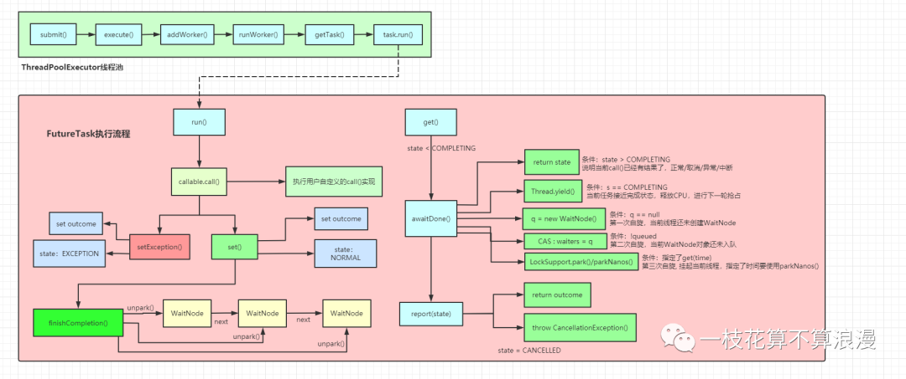
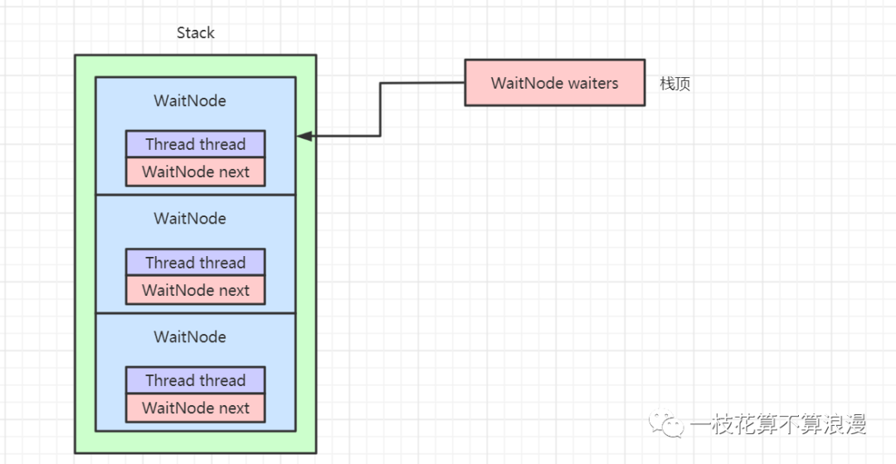
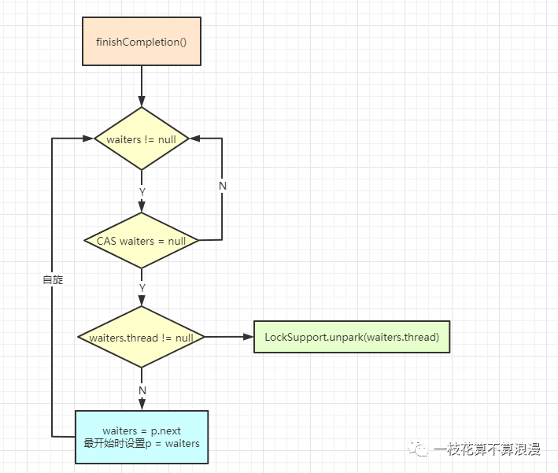
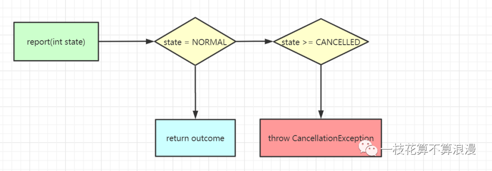

<h1 align="center">你必须要知道的线程池submit()实现原理之FutureTask！</h1>

[toc]


### 前言

上一篇内容写了`Java`中线程池的实现原理及源码分析，说好的是实实在在的大满足，想通过一篇文章让大家对线程池有个透彻的了解，但是文章写完总觉得还缺点什么?

上篇文章只提到线程提交的`execute()`方法，并没有讲解线程提交的`submit()`方法，`submit()`有一个返回值，可以获取线程执行的结果`Future<T>`，这一讲就那深入学习下`submit()`和`FutureTask`实现原理。

### 使用场景&示例

#### 使用场景

我能想到的使用场景就是在并行计算的时候，例如一个方法中调用`methodA()、methodB()`，我们可以通过线程池异步去提交方法A、B，然后在主线程中获取组装方法A、B计算后的结果，能够大大提升方法的吞吐量。


FutureTask使用场景.png


#### 使用示例

```java
/**
 * @author wangmeng
 * @date 2020/5/28 15:30
 */
public class FutureTaskTest {
    public static void main(String[] args) throws InterruptedException, ExecutionException {
        ExecutorService threadPool = Executors.newCachedThreadPool();

        System.out.println("====执行FutureTask线程任务====");
        Future<String> futureTask = threadPool.submit(new Callable<String>() {
            @Override
            public String call() throws Exception {
                System.out.println("FutureTask执行业务逻辑");
                Thread.sleep(2000);
                System.out.println("FutureTask业务逻辑执行完毕！");
                return "欢迎关注: 一枝花算不算浪漫！";
            }
        });

        System.out.println("====执行主线程任务====");
        Thread.sleep(1000);
        boolean flag = true;
        while(flag){
            if(futureTask.isDone() && !futureTask.isCancelled()){
                System.out.println("FutureTask异步任务执行结果：" + futureTask.get());
                flag = false;
            }
        }

        threadPool.shutdown();
    }
}
```

上面的使用很简单，`submit()`内部传递的实际上是个`Callable`接口，我们自己实现其中的`call()`方法，我们通过`futureTask`既可以获取到具体的返回值。

### submit()实现原理

`submit()` 是也是提交任务到线程池，只是它可以获取任务返回结果，返回结果是通过`FutureTask`来实现的，先看下`ThreadPoolExecutor`中代码实现：

```java
public class ThreadPoolExecutor extends AbstractExecutorService {
    public <T> Future<T> submit(Callable<T> task) {
        if (task == null) throw new NullPointerException();
        RunnableFuture<T> ftask = newTaskFor(task);
        execute(ftask);
        return ftask;
    }
}

public abstract class AbstractExecutorService implements ExecutorService {
    protected <T> RunnableFuture<T> newTaskFor(Callable<T> callable) {
        return new FutureTask<T>(callable);
    }
}
```

提交任务还是执行`execute()`方法，只是`task`被包装成了`FutureTask` ，也就是在`excute()`中启动线程后会执行`FutureTask.run()`方法。

再来具体看下它执行的完整链路图：

submit()全链路图.png

上图可以看到，执行任务并返回执行结果的核心逻辑是在`FutureTask`中，我们以`FutureTask.run/get` 两个方法为突破口，一点点剖析`FutureTask`的实现原理。

### FutureTask源码初探

先看下`FutureTask`中部分属性：

FutureTask属性.png

```java
public class FutureTask<V> implements RunnableFuture<V> {
    private volatile int state;
    private static final int NEW          = 0;
    private static final int COMPLETING   = 1;
    private static final int NORMAL       = 2;
    private static final int EXCEPTIONAL  = 3;
    private static final int CANCELLED    = 4;
    private static final int INTERRUPTING = 5;
    private static final int INTERRUPTED  = 6;

    private Callable<V> callable;
    private Object outcome;
    private volatile Thread runner;
    private volatile WaitNode waiters;
}
```

1. state

> 当前task状态，共有7种类型。
>
> **NEW：** 当前任务尚未执行
>
> **COMPLETING:** 当前任务正在结束，尚未完全结束，一种临界状态
>
> **NORMAL**：当前任务正常结束
>
> **EXCEPTIONAL:** 当前任务执行过程中发生了异常。
>
> **CANCELLED:** 当前任务被取消
>
> **INTERRUPTING:** 当前任务中断中..
>
> **INTERRUPTED:** 当前任务已中断

1. callble

> 用户提交任务传递的Callable，自定义call方法，实现业务逻辑

1. outcome

> 任务结束时，outcome保存执行结果或者异常信息。

1. runner

> 当前任务被线程执行期间，保存当前任务的线程对象引用

1. waiters

> 因为会有很多线程去get当前任务的结果，所以这里使用了一种stack数据结构来保存

### FutureTask.run()实现原理

我们已经知道在线程池`runWorker()`中最终会调用到`FutureTask.run()`方法中，我们就来看下它的执行原理吧：

run()执行逻辑.png

具体代码如下：

```java
public class FutureTask<V> implements RunnableFuture<V> {
    public void run() {
        if (state != NEW ||
            !UNSAFE.compareAndSwapObject(this, runnerOffset, null, Thread.currentThread()))
            return;
        try {
            Callable<V> c = callable;
            if (c != null && state == NEW) {
                V result;
                boolean ran;
                try {
                    result = c.call();
                    ran = true;
                } catch (Throwable ex) {
                    result = null;
                    ran = false;
                    setException(ex);
                }
                if (ran)
                    set(result);
            }
        } finally {
            runner = null;
            int s = state;
            if (s >= INTERRUPTING)
                handlePossibleCancellationInterrupt(s);
        }
    }
}
```

首先是判断`FutureTask`中`state`状态，必须是`NEW`才可以继续执行。

然后通过`CAS`修改`runner`引用为当前线程。

接着执行用户自定义的`call()`方法，将返回结果设置到result中，result可能为正常返回也可能为异常信息。这里主要是调用`set()/setException()`

### FutureTask.set()实现原理

`set()`方法的实现很简单，直接看下代码：

```java
public class FutureTask<V> implements RunnableFuture<V> {
    protected void set(V v) {
        if (UNSAFE.compareAndSwapInt(this, stateOffset, NEW, COMPLETING)) {
            outcome = v;
            UNSAFE.putOrderedInt(this, stateOffset, NORMAL);
            finishCompletion();
        }
    }
}
```

将`call()`返回的数据赋值给全局变量`outcome`上，然后修改`state`状态为`NORMAL`，最后调用`finishCompletion()`来做挂起线程的唤醒操作，这个方法等到`get()`后面再来讲解。

### FutureTask.get()实现原理

get().png

接着看下代码：

```java
public class FutureTask<V> implements RunnableFuture<V> {
    public V get() throws InterruptedException, ExecutionException {
        int s = state;
        if (s <= COMPLETING)
            s = awaitDone(false, 0L);
        return report(s);
    }
}
```

如果`FutureTask`中`state`为`NORMAL`或者`COMPLETING`，说明当前任务并没有执行完成，调用`get()`方法会被阻塞，具体的阻塞逻辑在`awaitDone()`方法：

```java
private int awaitDone(boolean timed, long nanos) throws InterruptedException {

        final long deadline = timed ? System.nanoTime() + nanos : 0L;
        WaitNode q = null;
        boolean queued = false;
        for (;;) {
            if (Thread.interrupted()) {
                removeWaiter(q);
                throw new InterruptedException();
            }

            int s = state;
            if (s > COMPLETING) {
                if (q != null)
                    q.thread = null;
                return s;
            }
            else if (s == COMPLETING)
                Thread.yield();
            else if (q == null)
                q = new WaitNode();
            else if (!queued)
                queued = UNSAFE.compareAndSwapObject(this, waitersOffset, q.next = waiters, q);
            else if (timed) {
                nanos = deadline - System.nanoTime();
                if (nanos <= 0L) {
                    removeWaiter(q);
                    return state;
                }
                LockSupport.parkNanos(this, nanos);
            }
            else
                LockSupport.park(this);
        }
    }
```

这个方法可以说是`FutureTask`中最核心的方法了，一步步来分析：

如果`timed`不为空，这说明指定`nanos`时间还未返回结果，线程就会退出。

`q`是一个`WaitNode`对象，是将当前引用线程封装在一个`stack`数据结构中，`WaitNode`对象属性如下：

```java
 static final class WaitNode {
    volatile Thread thread;
    volatile WaitNode next;
    WaitNode() { thread = Thread.currentThread(); }
}
```

接着判断当前线程是否中断，如果中断则抛出中断异常。

下面就进入一轮轮的`if... else if...`判断逻辑，我们还是采用分支的方式去分析。

**分支一：if (s > COMPLETING) {**

此时`get()`方法已经有结果了，无论是正常返回的结果，还是异常、中断、取消等，此时直接返回`state`状态，然后执行`report()`方法。

**分支二：else if (s == COMPLETING)**

条件成立，说明当前任务接近完成状态，这里让当前线程再释放`cpu`，进行下一轮抢占`cpu`。

**分支三：else if (q == null)**

第一次自旋执行，`WaitNode`还没有初始化，初始化`q=new WaitNode();`

**分支四：else if (!queued){**

`queued`代表当前线程是否入栈，如果没有入栈则进行入栈操作，顺便将全局变量`waiters`指向栈顶元素。

**分支五/六：LockSupport.park**

如果设置了超时时间，则使用`parkNanos`来挂起当前线程，否则使用`park()`

经过这么一轮自旋循环后，如果执行`call()`还没有返回结果，那么调用`get()`方法的线程都会被挂起。

被挂起的线程会等待`run()`返回结果后依次唤醒，具体的执行逻辑在`finishCompletion()`中。

最终`stack`结构中数据如下：

WaitNode.png

### FutureTask.finishCompletion()实现原理

finishCompletion().png

具体实现代码如下：

```java
private void finishCompletion() {
    for (WaitNode q; (q = waiters) != null;) {
        if (UNSAFE.compareAndSwapObject(this, waitersOffset, q, null)) {
            for (;;) {
                Thread t = q.thread;
                if (t != null) {
                    q.thread = null;
                    LockSupport.unpark(t);
                }
                WaitNode next = q.next;
                if (next == null)
                    break;
                q.next = null;
                q = next;
            }
            break;
        }
    }

    done();

    callable = null;
}
```

代码实现很简单，看过`get()`方法后，我们知道所有调用`get()`方法的线程，在`run()`还没有返回结果前，都会保存到一个有`WaitNode`构成的`statck`数据结构中，而且每个线程都会被挂起。

这里是遍历`waiters`栈顶元素，然后依次查询起`next`节点进行唤醒，唤醒后的节点接着会往后调用`report()`方法。

### FutureTask.report()实现原理

report().png

具体代码如下：

```java
private V report(int s) throws ExecutionException {
    Object x = outcome;
    if (s == NORMAL)
        return (V)x;
    if (s >= CANCELLED)
        throw new CancellationException();
    throw new ExecutionException((Throwable)x);
}
```

这个方法很简单，因为执行到了这里，说明当前`state`状态肯定大于`COMPLETING`，判断如果是正常返回，那么返回`outcome`数据。

如果`state`是取消状态，抛出`CancellationException`异常。

如果状态都不满足，则说明执行中出现了差错，直接抛出`ExecutionException`

### FutureTask.cancel()实现原理

cancel().png

```java
public boolean cancel(boolean mayInterruptIfRunning) {
    if (!(state == NEW && UNSAFE.compareAndSwapInt(this, stateOffset, NEW, mayInterruptIfRunning ? INTERRUPTING : CANCELLED)))
        return false;
    try {
        if (mayInterruptIfRunning) {
            try {
                Thread t = runner;
                if (t != null)
                    t.interrupt();
            } finally {
                UNSAFE.putOrderedInt(this, stateOffset, INTERRUPTED);
            }
        }
    } finally {
        finishCompletion();
    }
    return true;
}
```

`cancel()`方法的逻辑很简单，就是修改`state`状态为`CANCELLED`，然后调用`finishCompletion()`来唤醒等待的线程。

这里如果`mayInterruptIfRunning`，就会先中断当前线程，然后再去唤醒等待的线程。

### 总结

`FutureTask`的实现原理其实很简单，每个方法基本上都画了一个简单的流程图来方便理解。

后面还打算分享一个`BlockingQueue`相关的源码解读，这样线程池也可以算是完结了。

在这之前可能会先分享一个`SpringCloud`常见配置代码分析、最佳实践等手册，方便工作中使用，也是对之前看过的源码一种总结。敬请期待！

### 来源

https://mp.weixin.qq.com/s/eZVZ0u50P4GwuRuRG4Sz3g