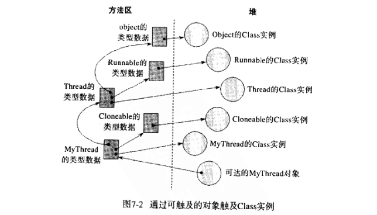

<h1 align="center">Object</h1>

[toc]

## getClass

返回该对象运行时的 `class` 对象，返回的 `Class` 对象是由所表示的类的静态同步方法锁定的对象。

## hashCode

返回该对象的 `hashcode`，该方法对hash表提供支持，例如 `HashMap`。
对于该方法有几点需要注意：
  - 在运行中的Java应用，如果用在 `equals` 中进行比较的信息没有改变，那么不论何时调用都需要返回一致的int值。这个hash值在应用的两次执行中不需要保持一致。
  - 如果两个对象根据 `equals` 方法认为是相等的，那么这两个对象也应该返回相等的 `hashcode`。
  - 不要求两个不相等的对象，在调用 `hashCode` 方法返回的结果是必须是不同的。然而，程序员应该了解不同的对象产生不同的 `hashcode` 能够提升哈希表的效率。
Object的`hashcode`对不同的对象，尽可能返回不同的 `hashcode` 。这通常通过将对象的内部地址转换为整数来实现，但Java编程语言不需要此实现技术。

### Arrays.hashCode

Arrays.hashCode 是一个数组的浅哈希码实现，深哈希可以使用 `deepHashCode`。并且当数组长度为1时，`Arrays.hashCode(object) = object.hashCode` 不一定成立

### 31

不论是String、Arrays在计算多个元素的哈希值的时候，都会有31这个数字。主要有以下两个原因：
  - 31是一个不大不小的质数，是作为 hashCode 乘子的优选质数之一。
    
> 另外一些相近的质数，比如37、41、43等等，也都是不错的选择。那么为啥偏偏选中了31呢？请看第二个原因。

  - 31可以被 JVM 优化，$$31 * i = (i << 5) - i$$。

上面两个原因中，第一个需要解释一下，第二个比较简单，就不说了。一般在设计哈希算法时，会选择一个特殊的质数。至于为啥选择质数，我想应该是可以降低哈希算法的冲突率。

在 Effective Java 中有一段相关的解释：

>选择数字31是因为它是一个奇质数，如果选择一个偶数会在乘法运算中产生溢出，导致数值信息丢失，因为乘二相当于移位运算。选择质数的优势并不是特别的明显，但这是一个传统。同时，数字31有一个很好的特性，即乘法运算可以被移位和减法运算取代，来获取更好的性能：$$31 * i == (i << 5) - i$$，现代的 Java 虚拟机可以自动的完成这个优化。

## equals

判定两个对象是否相等。`equals`和`hashCode`需要同时被`overwrite`

## clone

创建一个该对象的副本，并且对于对象 x 应当满足以下表达式：

```
x.clone() != x
x.clone().getClass() == x.getClass()
x.clone().equals(x)
```

## toString


## wait

当前线程等待知道其他线程调用该对象的 `notify` 或者 `notifyAll`方法。当前线程必须拥有该对象的 `monitor`。线程释放该对象`monitor`的拥有权，并且等待到别的线程通知等待在该对象`monitor`上的线程苏醒。然后线程重新拥有`monitor`并继续执行。在某些jdk版本中，中断和虚假唤醒是存在的，所以`wait`方法需要放在循环中。

```
synchronized (obj) {
    while (<condition does not hold>)
        obj.wait();
    ... // Perform action appropriate to condition
}
```

该方法只能被拥有该对象`monitor`的线程调用。

### 虚假唤醒（spurious wakeup）

虚假唤醒就是一些`obj.wait()`会在除了`obj.notify()`和`obj.notifyAll()`的其他情况被唤醒，而此时是不应该唤醒的。

> 注意 Lock 的 Conditon.await 也有虚假唤醒的问题

解决的办法是基于while来反复判断进入正常操作的临界条件是否满足

> 同时也可以使用同步数据结构：BlokingQueue

#### 解释

虚假唤醒（`spurious wakeup`）是一个表象，即在多处理器的系统下发出 wait 的程序有可能在没有 notify 唤醒的情形下苏醒继续执行。

以运行在 Linux 的 hotspot 虚拟机上的 java 程序为例， `wait` 方法在 jvm 执行时实质是调用了底层 `pthread_cond_wait/pthread_cond_timedwait` 函数，挂起等待条件变量来达到线程间同步通信的效果，而底层 `wait` 函数在设计之初为了不减慢条件变量操作的效率并没有去保证每次唤醒都是由 `notify` 触发，而是把这个任务交由上层应用去实现，即使用者需要定义一个循环去判断是否条件真能满足程序继续运行的需求，当然这样的实现也可以避免因为设计缺陷导致程序异常唤醒的问题。

## notify

唤醒一个等待在该对象`monitor`上的线程。如果有多个线程等待，则会随机选择一个线程唤醒。线程等待是通过调用`wait`方法。

唤醒的线程不会立即执行，直到当前线程放弃对象上的锁。唤醒的线程也会以通常的方式和竞争该对象锁的线程进行竞争。也就是说，唤醒的线程在对该对象的加锁中没有任何优先级。

该方法只能被拥有该对象`monitor`的线程调用。线程拥有`monitor`有下面三种方式：
  - 执行该对象的 `synchronized` 方法
  - 执行以该对象作为同步语句的`synchronized`方法体
  - 对于class对象，可以执行该对象的`static synchronized`方法

在同一时间只能有一个线程能够拥有该对象`monitor`

## finalize

当 GC 认为该对象已经没有任何引用的时候，该方法被GC收集器调用。子类可以 `overwrite` 该方法来关闭系统资源或者其他清理任务。

`finalize` 的一般契约是，如果 Java 虚拟机确定不再有任何方法可以通过任何尚未死亡的线程访问此对象，除非由于某个操作，它将被调用通过最终确定准备完成的其他一些对象或类来完成。 `finalize` 方法可以采取任何操作，包括使该对象再次可用于其他线程；但是，`finalize` 的通常目的是在对象被不可撤销地丢弃之前执行清理操作。例如，表示输入/输出连接的对象的 `finalize` 方法可能会执行显式 `I/O` 事务，以在永久丢弃对象之前断开连接。

类 Object 的 finalize 方法不执行任何特殊操作;它只是正常返回。 Object 的子类可以覆盖此定义。

Java 编程语言不保证哪个线程将为任何给定对象调用 `finalize` 方法。但是，可以保证，调用 finalize 时，调用 finalize 的线程不会持有任何用户可见的同步锁。如果 `finalize` 方法抛出未捕获的异常，则忽略该异常并终止该对象的终止。在为对象调用 `finalize` 方法之后，在 Java 虚拟机再次确定不再有任何方法可以通过任何尚未死亡的线程访问此对象之前，不会采取进一步操作，包括可能的操作通过准备完成的其他对象或类，此时可以丢弃该对象。

对于任何给定对象，Java 虚拟机永远不会多次调用 `finalize` 方法。 `finalize` 方法抛出的任何异常都会导致暂停此对象的终结，但会被忽略。

### 缺陷

  - 一些与 `finalize` 相关的方法，由于一些致命的缺陷，已经被废弃了，如 `System.runFinalizersOnExit()` 方法、`Runtime.runFinalizersOnExit()`方法。
  - `System.gc()` 与 `System.runFinalization()` 方法增加了finalize方法执行的机会，但不可盲目依赖它们。
  - Java 语言规范并不保证 `finalize` 方法会被及时地执行、而且根本不会保证它们会被执行。
  - `finalize` 方法可能会带来性能问题。因为JVM通常在单独的低优先级线程中完成finalize的执行。
  - 对象再生问题： `finalize` 方法中，可将待回收对象赋值给GC Roots可达的对象引用，从而达到对象再生的目的。
  - `finalize` 方法至多由GC执行一次(用户当然可以手动调用对象的 `finalize` 方法，但并不影响GC对 `finalize` 的行为)。

## OOP


面向对象三要素：封装、继承、多态

- `封装`：封装的意义，在于明确标识出允许外部使用的所有成员函数和数据项，或者叫接口。
- `继承`：
  - 继承基类的方法，并做出自己的扩展；
  - 声明某个子类兼容于某基类（或者说，接口上完全兼容于基类），外部调用者可无需关注其差别（内部机制会自动把请求派发`dispatch`到合适的逻辑）。
- `多态`：基于对象所属类的不同，外部对同一个方法的调用，实际执行的逻辑不同。**很显然，多态实际上是依附于继承的第二种含义的**。

## 多态

方法签名：`方法名 + 参数列表(参数类型、个数、顺序)`

### 重写

子类重写父类方法，**只有实例方法可以被重写**，重写后的方法必须仍为实例方法。**成员变量和静态方法都不能被重写，只能被隐藏**。

重写实例方法：超类Parent中有实例方法A，子类child定义了与A **相同签名和子集返回类型** 的实例方法B，子类对象ChildObj只能调用自己的实例方法B。

  >方法的重写（override）两同两小一大原则：
  >
  >* 方法名相同，参数类型相同
  >* 子类返回类型小于等于父类方法返回类型
  >* 子类抛出异常小于等于父类方法抛出异常
  >* 子类访问权限大于等于父类方法访问权限

注意：

  - 不能重写static静态方法。(形式上可以写，但本质上不是重写，属于下面要讲的隐藏)

  - 重写方法可以改变其它的方法修饰符，如`final`,`synchronized`,`native`。不管被重写方法中有无final修饰的参数，重写方法都可以增加、保留、去掉这个参数的 final 修饰符(**参数修饰符不属于方法签名**)。

### 重载

在同一个类中，有多个方法名相同，参数列表不同（参数个数不同，参数类型不同），与方法的返回值无关，与权限修饰符无关。**编译器通过对方法签名的识别即可静态编译出不同的方法。这也是java中重载与重写的区别之一**。

  > 重载只是一种语言特性，与多态无关，与面向对象也无关。**多态是为了实现接口重用**。

Java中方法是可以和类名同名的，和构造方法唯一的区别就是，**构造方法没有返回值**。

### 隐藏

隐藏与覆盖在形式上极其类似(语法规则)，但有着本质的区别：只有成员变量(不管是不是静态)和静态方法可以被隐藏。

#### 成员变量

超类 Parent 中有成员变量 A ，子类 Child 定义了与 A 同名的成员变量 B ，子类对象 ChildObj 调用的是自己的成员变量 B。如果把子类对象 ChildObj 转换为超类对象 ParentObj ，ParentObj 调用的是超类的成员变量 A ！

    1. 隐藏成员变量时，只要同名即可，可以更改变量类型(无论基本类型还是隐藏类型)

    2. 不能隐藏超类中的 private 成员变量，换句话说，只能隐藏可以访问的成员变量。

    3. 隐藏超类成员变量 A 时，可以降低或提高子类成员变量B的访问权限，只要A不是 private。

    4. 隐藏成员变量与是否静态无关！静态变量可以隐藏实例变量，实例变量也可以隐藏静态变量。

    5. 可以隐藏超类中的final成员变量。

#### 静态方法

超类 Parent 有静态方法 A ，子类 Child 定义了与 A *相同签名和子集返回类型* 的静态方法 B ，子类对象 ChildObj 调用的是自己的静态方法 B 。如果把子类对象 ChildObj 转换为超类对象 ParentObj ，ParentObj 调用的是超类的静态方法 A ！

> 隐藏后的方法必须仍为静态方法

## 对象的生命周期

一旦一个类被装载、连接和初始化，它就随时可以被使用。程序可以访问它的静态字段，调用它的静态方法，或者创建它的实例。作为Java程序员有必要了解Java对象的生命周期。

### 类实例化

在Java程序中，类可以被明确或隐含地实例化。明确的实例化类有四种途径：

  - 明确调用`new`。
  - 调用`Class`或者`java.lang.reflect.Constructor`对象的`newInstance`方法。
  - 调用任何现有对象的`clone`。
  - 通过`java.io.ObjectInputStream.getObject()`反序列化。

隐含的实例化：

  - 可能是保存命令行参数的`String`对象。
  - 对于Java虚拟机装载的每个类，都会暗中实例化一个Class对象来代表这个类型
  - 当Java虚拟机装载了在常量池中包含`CONSTANT_String_info`入口的类的时候，它会创建新的`String`对象来表示这些常量字符串。
  - 执行包含字符串连接操作符的表达式会产生新的对象。

Java编译器为它编译的每个类至少生成一个实例初始化方法。在Java class文件中，这个方法被称为`<init>`。针对源代码中每个类的构造方法，Java编译器都会产生一个`<init>()`方法。如果类没有明确的声明任何构造方法，编译器会默认产生一个无参数的构造方法，它仅仅调用父类的无参构造方法。

一个`<init>()`中可能包含三种代码：调用另一个`<init>()`、实现对任何实例变量的初始化、构造方法体的代码。

如果构造方法明确的调用了同一个类中的另一个构造方法(`this()`)，那么它对应的`<init>()`由两部分组成：

  - 一个同类的`<init>()`的调用。
  - 实现了对应构造方法的方法体的字节码。

  > 在它对应的`<init>()`方法中不会有父类的`<init>()`，但不代表不会调用父类的`<init>()`，因为`this()`中也会调用父类`<init>()`

如果构造方法不是通过一个`this()`调用开始的，而且这个对象不是`Object`，`<init>()`则有三部分组成：

  - 一个父类的`<init>()`调用。*如果这个类是`Object`,则没有这个部分*
  - 任意实例变量初始化方法的字节码。
  - 实现了对应构造方法的方法体的字节码。

如果构造方法明确的调用父类的构造方法`super()`开始，它的`<init>()`会调用对应父类的`<init>()`。比如，如果一个构造方法明确的调用`super(int,String)`开始，对应的`<init>()`会从调用父类的`<init>(int,String)`方法开始。**如果构造方法没有明确地从`this()`或`super()`开始，对应的`<init>()`默认会调用父类的无参`<init>()`。**

### 垃圾收集和对象的终结

程序可以明确或隐含的为对象分配内存，但不能明确的释放内存。一个对象不再为程序引用，虚拟机必须回事那部分内存。

### 卸载类

在很多方面，Java虚拟机中类的生命周期和对象的生命周期很相似。当程序不再使用某个类的时候，可以选择卸载它们。

>类的垃圾收集和卸载值所以在Java虚拟机中很重要，是因为Java程序可以在运行时通过用户自定义的类装载器装载类型来动态的扩展程序。所有被装载的类型都在方法区占据内存空间。

Java虚拟机通过判断类是否在被引用来进行垃圾收集。判断动态装载的类的`Class`实例在正常的垃圾收集过程中是否可触及有两种方式：

  - 如果程序保持非`Class`实例的明确引用。
  - 如果在堆中还存在一个可触及的对象，在方法区中它的类型数据指向一个`Class`实例。

